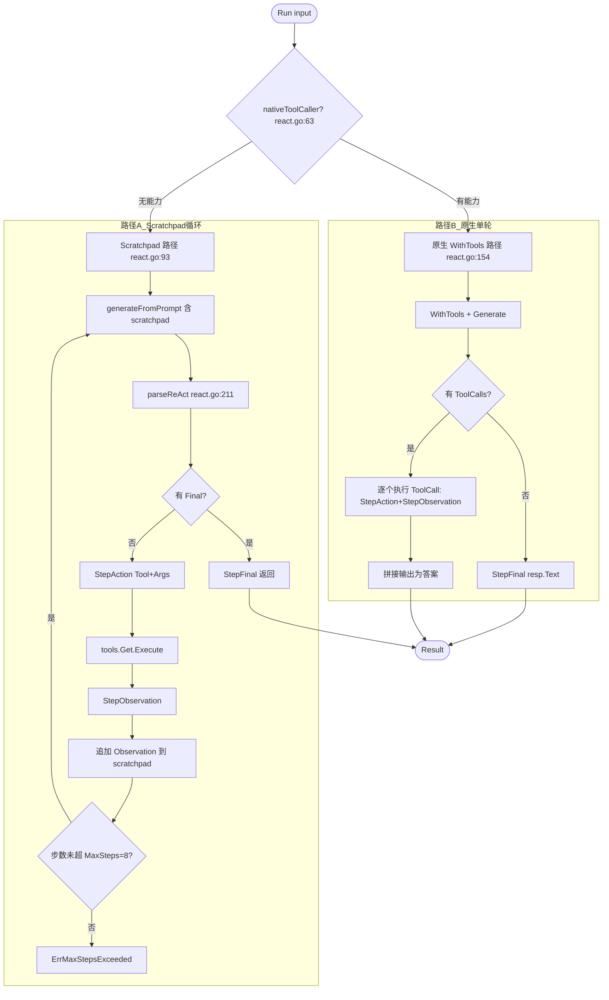
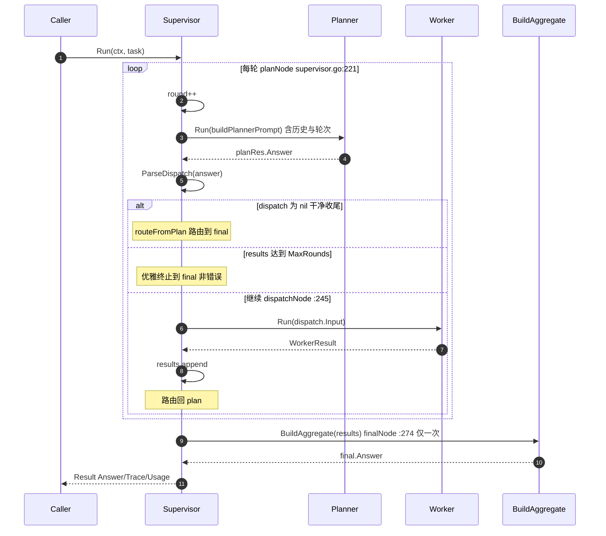
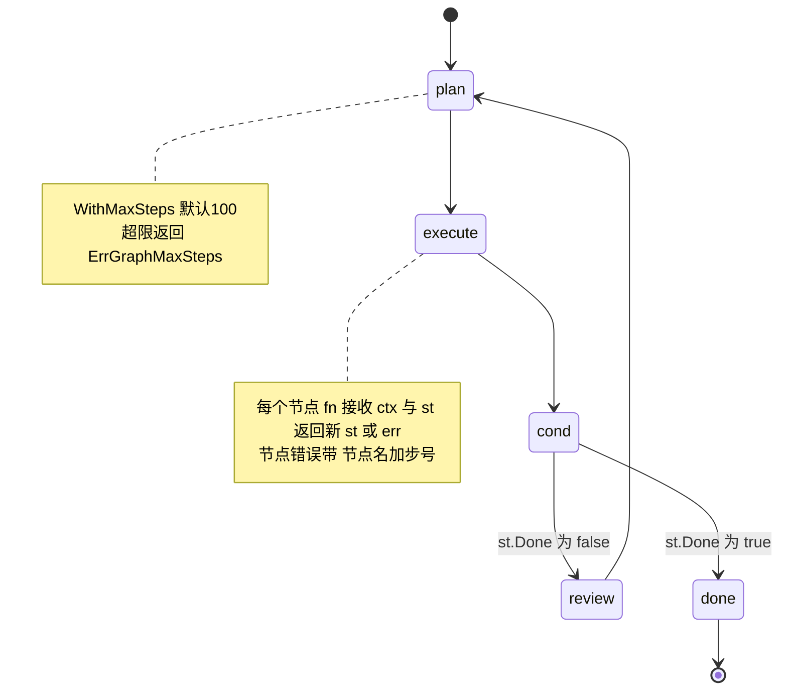
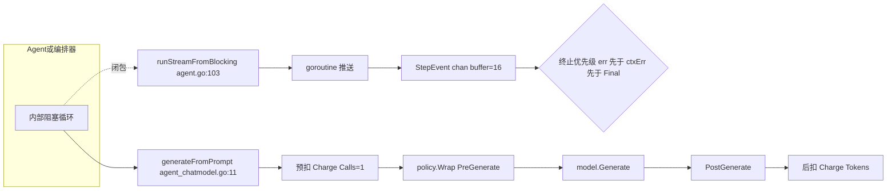
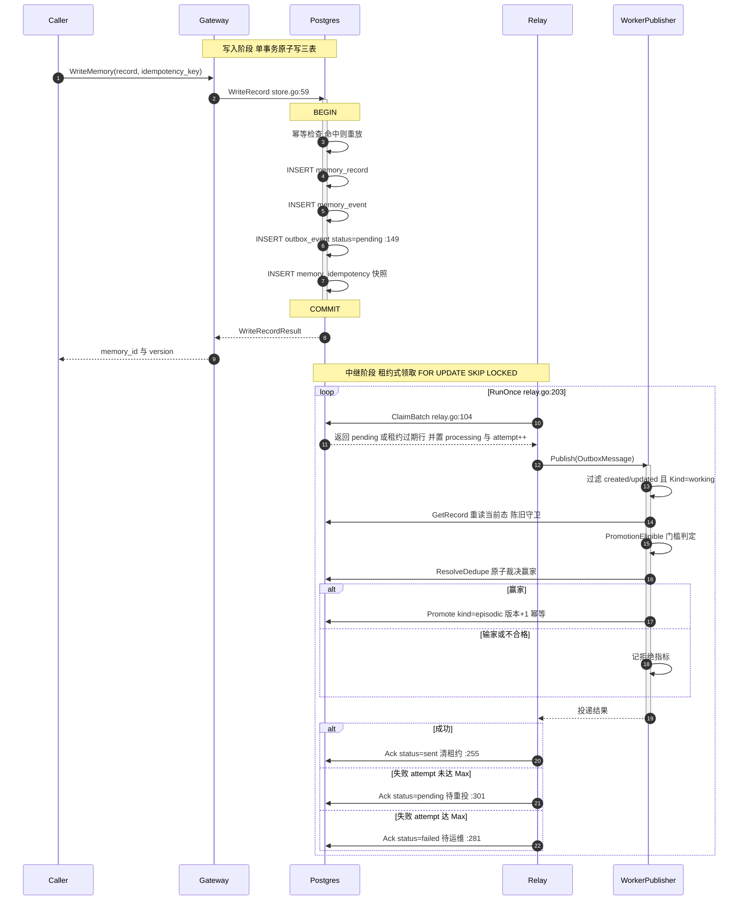

# Agent 编排与记忆 Outbox 时序图

本文档用 Mermaid 图描绘 `llm-agent` 核心 Agent 范式、多 Agent 编排，以及持久化记忆 Outbox 子系统的运行机制，附实现位置（file:line）。

> 渲染说明：为兼容 VS Code 等较旧的 Mermaid 引擎，统一采用保守语法——子图用纯标题（不带引号标签）、节点标签用双引号、标签内不含 `<`/`>`、时序消息不含 ` `。

## 一、ReAct 循环（双路径）

`react.go:82-199` — 构造时探测原生 tool-calling 能力，分两条路径。

每次 `generateFromPrompt` 都经预算/策略收口（`agent_chatmodel.go:11-54`）。

## 二、Supervisor 调度循环（时序图）

`supervisor.go` — 本质是 `StateGraph[supervisorState]` 的 3 节点封装。

**关键语义**：路由契约 `routeFromPlan`（`supervisor.go:289`）—— `dispatch==nil` 或 `len(results)>=MaxRounds` 都走 final 且**优雅**；内层 `WithMaxSteps(MaxRounds*3+4)` 保证 StateGraph 硬上限永不先触发。

## 三、StateGraph 状态流转（规划-执行-审查示例）

`graph.go:160-204` — 条件边优先于无条件边，允许成环。

> 说明：`cond` 对应 `AddConditionalEdge`（条件边，优先于无条件边）；`done` 对应 `orchestrate.NodeEnd`。

## 四、流式与治理的统一收口（贯穿全部范式）

## 五、记忆 Outbox 端到端时序图

事务性 Outbox 跨 4 个仓库：contract（契约）/ postgres（后端）/ gateway（写入触发）/ worker（消费晋升）。

**容错保证**：

| 机制 | 实现 | 作用 |
|---|---|---|
| 原子性 | record 与 outbox 同事务 `store.go:59-188` | 杜绝孤儿事件 |
| 并发安全 | `FOR UPDATE SKIP LOCKED` + 租约 `relay.go:104` | 多 worker 无锁竞争 |
| 崩溃恢复 | `lease_expires_at < NOW()` 回收 | 租约到期自动重投 |
| 幂等 | 确定性键 sha256(tenant、memory、eventid、promote) | 重投不重复晋升 |
| 运维兜底 | `RequeueFailed` `store.go:433` | failed 行重置 pending |
| 晋升一致 | 共享 `PromotionEligible` `promotion.go:22` | gateway/worker 判定相同 |

晋升门槛：`Source="user_saved"` 永远合格；`Source="agent_inferred"` 仅当 `Importance >= 0.7`。

## 编排模式选择速查

| 场景 | 模式 | 文件 |
|---|---|---|
| 线性 A→B→C 无分支 | Pipeline | `pipeline.go:25` |
| 规划→并行专家→汇总 | FanOutFanIn | `fanout.go:50` |
| 规划→派发循环（显式轮次） | Supervisor | `supervisor.go:48` |
| 多 Agent 涌现式协作 | RoundRobinChat | `roundrobin.go:28` |
| 任务分解+显式完成信号 | RolePlay | `roleplay.go:28` |
| 显式分支/循环/可观测状态 | StateGraph[S] | `graph.go:29` |
