# 架构图与关键时序图

> 本文档版本：2026-05-21
> 阅读目标：在 10 分钟内对整个 `llm-agent-ecosystem` 形成清晰心智模型。
> 阅读方式：以图为主、文字为辅；每张图后跟随 50–200 字解读 + `file:line` 锚点便于跳转。
> 内容范围：6 个 sibling 仓库 + umbrella root + CI 闸子。源数据来自同目录的 7 篇 `source-design-*.zh-CN.md`。

---

## 目录

### 第一部分：架构图（10 张）

1. [生态依赖关系图](#1-生态依赖关系图)
2. [核心抽象分层图](#2-核心抽象分层图llm-agent-内部)
3. [Agent 五种范式横向对比](#3-agent-五种范式横向对比)
4. [Decorator 装饰链拓扑](#4-decorator-装饰链拓扑policy--otel--budget)
5. [RAG 三条答题路径](#5-rag-三条答题路径ask--askglobal--askdrift)
6. [Flow DAG 执行模型](#6-flow-dag-执行模型ir--engine--event-store--flowd)
7. [Customer-support 端到端调用栈](#7-customer-support-端到端调用栈)
8. [OTel span 树](#8-otel-span-树一次-agentrun-的完整-span-父子关系)
9. [StreamEvent 状态机](#9-streamevent-状态机kind-合法转移)
10. [CI 闸子流水](#10-ci-闸子流水b2--b3--b4--snapshot--currency)

### 第二部分：关键时序图（7 张）

1. [ChatModel.Generate（非流，provider 层）](#11-时序chatmodelgenerate-非流provider-层)
2. [ChatModel.Stream + Tool Call + Cancel](#12-时序chatmodelstream--tool-call--partial-usage--cancel)
3. [Agent.Run with Tools（budget + policy + observation 回写）](#13-时序agentrun-with-toolsbudget--policy--observation)
4. [RAG.Ask（含 InjectionScanner）](#14-时序ragask含-injectionscanner)
5. [RAG.AskGlobal（community report 路径）](#15-时序ragaskglobalcommunity-report-路径)
6. [Flow.SubmitRun（Engine 分层并行 + Event 流 + SQLite per-event 写）](#16-时序flowsubmitrunengine-分层并行--event-流--sqlite-per-event-写)
7. [Customer-support 完整 turn（session→guardrails→tool→trace）](#17-时序customer-support-完整-turn含-session-加载guardrailstooltrace)

---

## 第一部分：架构图

### 1. 生态依赖关系图

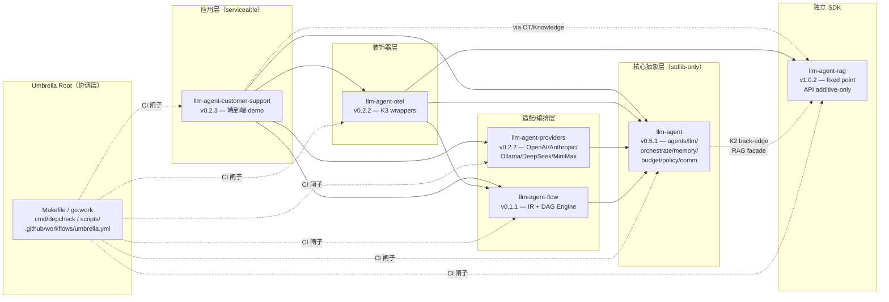

**解读**。整张图体现 6 条硬约束（umbrella `README.md:67-89`）：(1) `llm-agent` 是 stdlib-only 内核，仅允许 *一条* 反向边 → `llm-agent-rag` 用于未来 RAG facade（K2 keystone）；(2) `llm-agent-rag` 是 fixed point，v1.x API additive-only，所有兄弟仓库都向它对齐；(3) `llm-agent-providers` / `llm-agent-flow` 仅依赖核心，互相独立；(4) `llm-agent-otel` 是横向装饰器，依赖 core + rag + flow 三方但不被它们反向依赖（K3 keystone）；(5) `llm-agent-customer-support` 是唯一的 main 入口，把上面所有 5 仓装配成可运行 demo；(6) Umbrella root 只通过 CI 闸子和文档协调，不持有产品代码。

锚点：`README.md:53-62`（依赖方向）/ `README.md:67-89`（项目规则）/ `cmd/depcheck/main.go:32-39`（canonical sibling roster）。

---

### 2. 核心抽象分层图（`llm-agent` 内部）

```mermaid
flowchart TB
    subgraph public["validated 公开类型（v0.4 后不允许编辑）"]
        CM["llm.ChatModel<br/>Generate / Stream / Info"]
        AG["agents.Agent<br/>Run / RunStream"]
        MM["memory.Memory<br/>Add / Search / Get"]
        NF["orchestrate.NodeFunc[S]<br/>用户态状态机节点"]
    end

    subgraph caps["可选能力接口（type-assert + Capabilities）"]
        TC["llm.ToolCaller<br/>WithTools(immutable)"]
        EM["llm.Embedder<br/>Embed / EmbedDimensions"]
        SO["llm.StructuredOutputs<br/>WithSchema"]
    end

    subgraph para["Agent 五种范式（共享 Step/StepEvent trace 原语）"]
        SI["SimpleAgent"]
        RA["ReActAgent"]
        RF["ReflectionAgent"]
        PS["PlanAndSolveAgent"]
        FC["FunctionCallAgent"]
    end

    subgraph orch["编排（multi-agent）"]
        P1["Pipeline / FanOutFanIn"]
        P2["RoundRobinChat / RolePlay"]
        SG["StateGraph[S]"]
        SU["Supervisor (=3-node StateGraph)"]
    end

    subgraph rt["运行时治理（opt-in）"]
        BU["budget<br/>ctx-keyed Tracker<br/>4-dim Cap"]
        PO["policy<br/>8-wrapper 装饰树<br/>5 EventKind / 4 Decision"]
    end

    subgraph mem["上下文与记忆"]
        WM["Working / Episodic / Semantic"]
        MGR["memory.Manager<br/>Consolidate / Forget"]
        GS["context (GSSC)<br/>Gather→Select→Structure→Compress"]
    end

    subgraph aux["基础设施 / 通信"]
        TL["agents.Tool / Registry / Chain<br/>AsyncRunner"]
        FN["pkg/fanout (generic<br/>bounded concurrency)"]
        CO["comm/<br/>Envelope+Transport<br/>mcp / a2a / anp"]
        BI["builtin/<br/>Calculator / Search / Note / Terminal"]
    end

    CM --> TC
    CM --> EM
    CM --> SO

    SI --> CM
    RA --> CM
    RA --> TC
    RF --> CM
    PS --> CM
    FC --> TC

    SI --> AG
    RA --> AG
    RF --> AG
    PS --> AG
    FC --> AG

    P1 --> AG
    P2 --> AG
    SG --> NF
    SU --> SG

    AG -. generateFromPrompt<br/>chokepoint .-> BU
    PO -. Wrap(ChatModel) .-> CM

    GS --> MM
    MGR --> MM

    TL --> AG
    FN --> TL
    CO --> TL
```

**解读**。核心包共 14 个顶层目录，按层职责（`source-design-llm-agent.zh-CN.md` §3.1-3.2）：(a) `llm.ChatModel` 是基线，三个可选能力 `ToolCaller / Embedder / StructuredOutputs` 各自独立（DP-2），避免胖接口；(b) 五种 Agent 范式共享 `Step / StepEvent` trace 原语（DP-1），共用 `generateFromPrompt` chokepoint（`agent_chatmodel.go:11-54`）接 budget；(c) Supervisor 是 3-node `StateGraph[supervisorState]` 的 facade（KC-1，`orchestrate/supervisor.go:48-454`），自己也是 `agents.Agent`，可嵌套；(d) `policy.Wrap` 用 8-wrapper 类型开关（`policy/policy.go:43-67`）保证装饰后 `ToolCaller / Embedder / StructuredOutputs` 能力不丢；(e) `budget` 通过 ctx-keyed Tracker 实现"未开启时零开销"。

锚点：`llm/doc.go:33-43`（能力协商习语）/ `agent_chatmodel.go:11-54`（chokepoint）/ `orchestrate/supervisor.go:454`（compile-time Agent assertion）。

---

### 3. Agent 五种范式横向对比

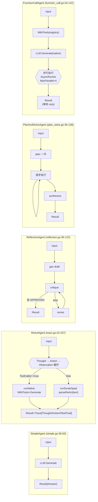

**解读**。五种范式所有 LLM 调用都走 `agent_chatmodel.go:11-54` `generateFromPrompt`（唯一 chokepoint），所以 budget 治理对它们一视同仁。**选型矩阵**：(1) SimpleAgent — benchmark baseline 与 Pipeline 中继；(2) ReActAgent — 需 tool 但只支持文本输出的旧模型，或想看完整 reasoning 链；(3) ReflectionAgent — 自查自改场景（合规审核、写作辅助），critique 命中 `APPROVED` 哨兵字提前停（`reflection.go:103`）；(4) PlanAndSolveAgent — 多步骤但中途不需要调整计划；(5) FunctionCallAgent — 一次多 tool 调用，但**单轮 only**（`llm.Message` 没 `ToolCallID` 字段，无法多轮 native function-calling，是当前已知技术债）。

锚点：`source-design-llm-agent.zh-CN.md` §4.1.4 表 / `function_call.go:18-19` 注释 / `react.go:208-236` `parseReAct`.

---

### 4. Decorator 装饰链拓扑（policy → otel → budget）

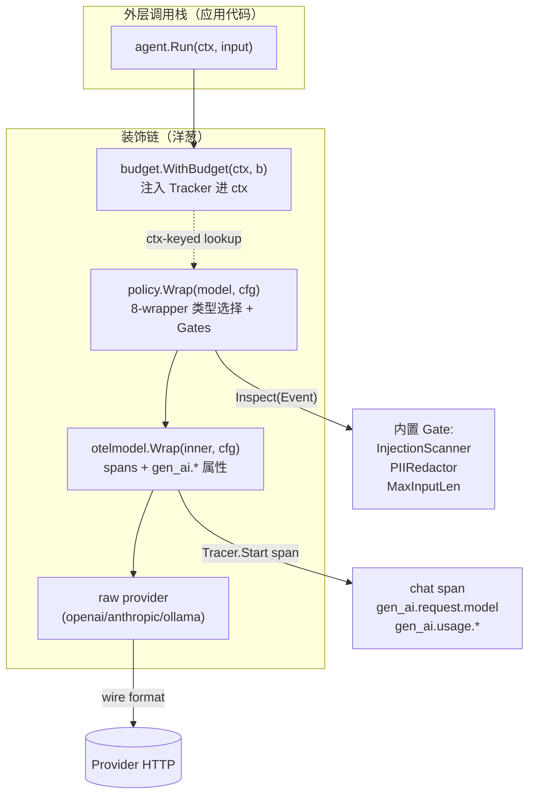

**解读**。装饰链是"洋葱"而非"链表"：每一层 `Wrap` 返回一个仍满足 `llm.ChatModel` 的对象，且**透明保留**底层的可选能力。`policy/policy.go:43-67` 的 8-wrapper 类型开关（裸 / +Tool / +Embed / +Schema / +Tool+Embed / +Tool+Schema / +Embed+Schema / +Tool+Embed+Schema）保证 `WithTools` 重新绑定 tool 后装饰链不丢失（`policy.go:154-162` 内部 `w.wrap(next)` 自动重包）；`otelmodel/otelmodel.go:14-49` 用同样的 8 子结构镜像（K3 keystone，`source-design-llm-agent-otel.zh-CN.md` §3.1）。Budget 与 policy/otel 不同：它通过 ctx-keyed Tracker（`budget/budget.go:117-122, 296-309`）实现"未开启时零开销"，从内层 `generateFromPrompt` 反向 lookup。

锚点：`policy/policy.go:43-67, 154-162, 468-499`（编译期 assertion）/ `otelmodel/otelmodel.go:14-49, 300-321`（capability matrix）/ `budget/budget.go:23-42, 163-194`（4-dim cap + Strict check-before-commit）。

---

### 5. RAG 三条答题路径（Ask / AskGlobal / AskDrift）

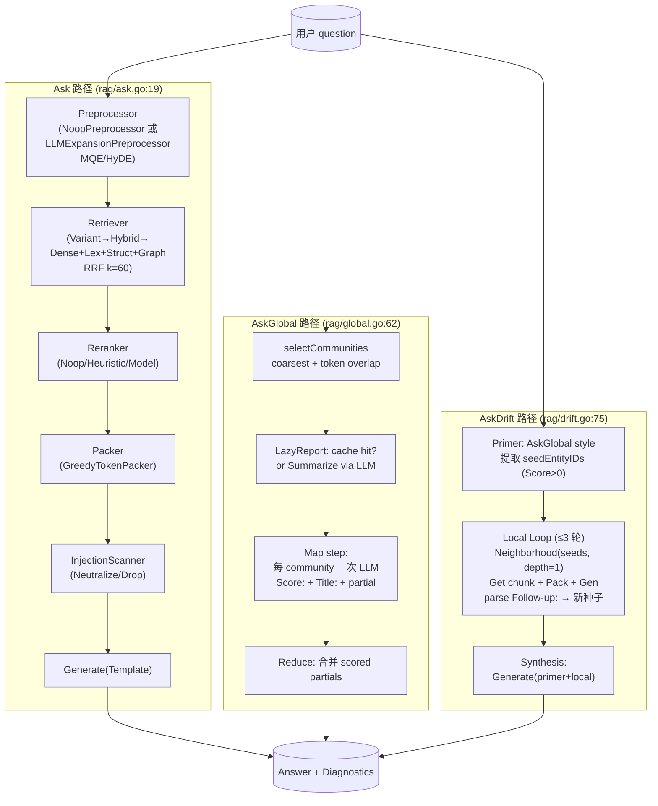

**解读**。三条路径形态对称，**共享**：(a) 同一组 `Trace` / `Diagnostics` 容器；(b) 同一套 `Score: / Title: / Follow-up:` prompt marker idiom；(c) 同一个 `obs.Counter` ctx 注入（`obs/obs.go:48-88`）；(d) 同一组 capability 渐进增强（`CommunityStore` / `GraphStore` 缺失时优雅降级，`global.go:73-79`）。区别：(1) Ask = 本地 retrieve→pack→generate，毫秒级；(2) AskGlobal = 整库 map-reduce，秒到分钟级，依赖预生成 community report；(3) AskDrift = 全局-局部 hybrid，primer 找 seed，local loop bounded ≤3 轮（`drift.go:81-83`）。

锚点：`rag/system.go:138-247`（12+ seam 装配）/ `rag/ask.go:19, 83-87`（injection scanner 钩接点）/ `rag/global.go:62, 73-79, 305`（确定性排序）/ `rag/drift.go:75, 102`。

---

### 6. Flow DAG 执行模型（IR → Engine → Event Store → flowd）

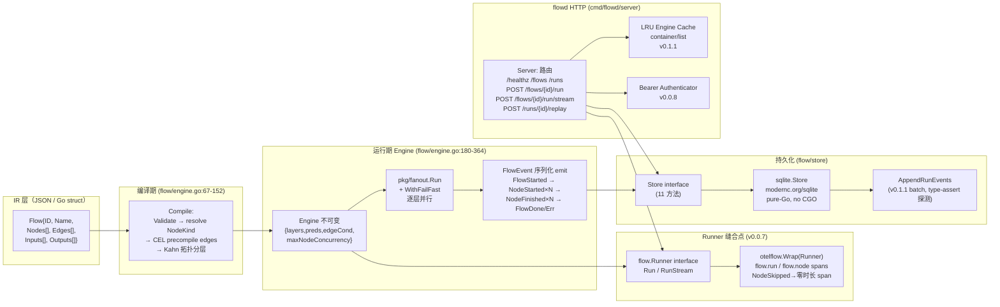

**解读**。Flow 库的 5 条核心信条（`source-design-llm-agent-flow.zh-CN.md` §2）：(1) IR-first — IR 是唯一真相之源，Engine 是它的解释器；(2) Runner 接口分离（`flow/runner.go:11-21`）是整个仓最重要的架构动作，让 otelflow 通过装饰器接入而非 hook；(3) stdlib-only 核心 + 子包按需重依赖（CEL / SQLite / OTel）；(4) CEL 条件边作为边一等属性，未激活节点产生 `NodeSkipped` 事件（`flow/event.go:21`）；(5) 双轨持久化 — sync 路径批量落库（v0.1.1 优化），stream 路径每事件先落库再转发（v0.0.6 耐久性契约）。FlowEvent 与 `llm.StreamEvent` 同形态（K1 typed-union），方便统一 consumer 模式。

锚点：`flow/ir.go:20-28`（IR 类型）/ `flow/engine.go:67-152, 180-364`（编译 + 运行）/ `flow/event.go:21`（NodeSkipped）/ `cmd/flowd/server/server.go:364-495`（runWithStore 统一 sync/stream）/ `cmd/flowd/server/server.go:139-165`（engineFor + LRU）。

---

### 7. Customer-support 端到端调用栈

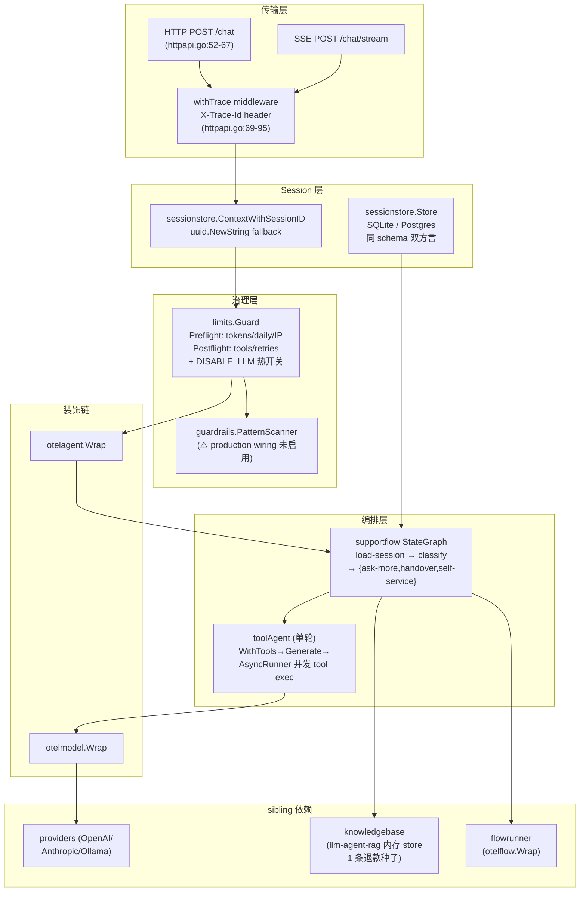

**解读**。`internal/app/app.go:70-148` 的 `New` 函数是整个仓库的"心脏"，按 11 个步骤装配整张对象图。装饰链顺序：`raw model → otelmodel.Wrap → supportflow.New → limits.Guard.WrapAgent → otelagent.Wrap → httpapi.NewMux`，每层只做一件事且不改下层接口。**已知设计缺口**（`source-design-llm-agent-customer-support.zh-CN.md` §3.9）：`internal/guardrails` 在 `supportflow.go` 内部已经接入但 `app.go:106-110` 的 production wiring **从未实例化** `*Guardrails`，意味着"day-one prompt-injection defenses"宣称与代码实情不一致。SessionStore 用同一份 DDL 支持 SQLite/Postgres（占位符 `?` vs `$N` 切换，`sessionstore.go:80-152`）；`modernc.org/sqlite` 是 pure-Go，匹配 `Dockerfile:15` 的 `CGO_ENABLED=0`。

锚点：`internal/app/app.go:70-148`（装配根）/ `internal/supportflow/supportflow.go:127-192`（5 节点 StateGraph）/ `internal/supportflow/toolagent.go:26-133`（单轮 tool agent）/ `internal/limits/limits.go:123-126`（DISABLE_LLM 热开关）/ `internal/guardrails/guardrails.go:9-57`（悬空模块）。

---

### 8. OTel span 树（一次 `agent.Run` 的完整 span 父子关系）

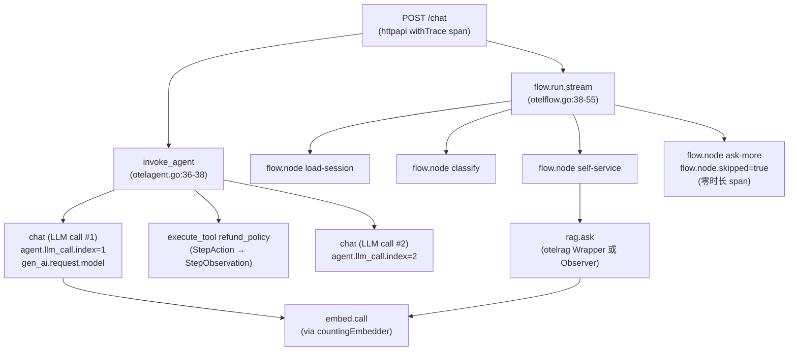

**解读**。整棵树通过 `context.Context` 单向下沉 trace ID — 从 HTTP middleware 注入 `X-Trace-Id` 起，到 agent.Run、再到 ChatModel.Generate、再到 RAG embed/generate、再到 flow.Engine 节点。**几条非显然的设计**：(1) `otelagent.Wrap` 即使 inner 直接实现了同步 `Run`，也**绕道用 `RunStream`** 镜像 span（`otelagent.go:35-71`）——为了 telemetry 而绕路；(2) `NodeSkipped` 不是省略，而是 zero-duration child span + `flow.node.skipped=true` 属性（`otelflow.go:183-192`），让拓扑显式 > 计数省略；(3) `gen_ai.first_token` 用 span event 替代 TTFT histogram（`otelmodel.go:76-147`），省心但牺牲易聚合性；(4) 高基数属性 `user.id / session.id` 通过 `filterMetricAttrs` 白名单（`otelmetrics.go:113-130`）**禁止**进入 metric attribute set，由测试 `TestCardinality_UserIDsDoNotExplodeMetricAttributes` 锁死 ≤50。

锚点：`otelmodel/otelmodel.go:51-74, 76-147`（Generate/Stream span 生命周期）/ `otelagent/otelagent.go:122-143`（StepKind → span 状态机）/ `otelflow/otelflow.go:99-152, 183-192`（RunStream + Skipped 处理）/ `otelroot/semconv_gen_ai.go:9-30, 37-44`（属性键 + opt-in 闸门）。

---

### 9. StreamEvent 状态机（`Kind` 合法转移）

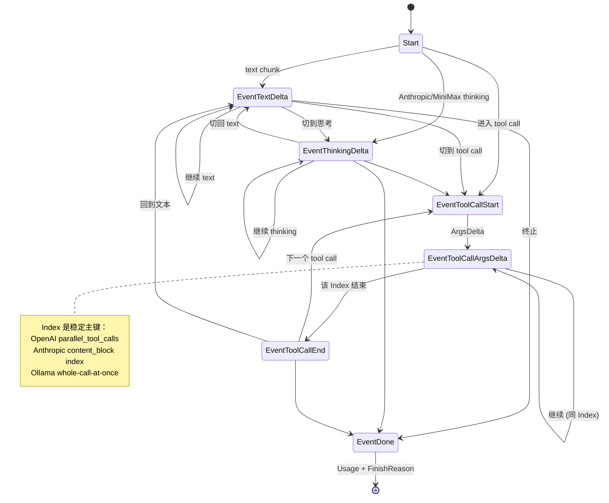

**解读**。`StreamEvent.Kind` 是 K1 keystone 的核心承诺（`llm/stream.go:22-31`）：**不**选最小公分母 chunk 流，**不**让 agent 层重做 reassembly。`ToolCallDelta.Index` 字段（`llm/stream.go:65-70`）是跨 chunks 稳定主键，统一三种 wire format：(a) OpenAI `parallel_tool_calls=true` 时 chunk 是按 index 交错的 — keyed-by-name 会丢 chunk；(b) Anthropic 用 `content_block` index；(c) Ollama v0.x 是 whole-call-at-once。**已知技术债**：`llm/stream.go:130-145` `AccumulateStream` 当前仍按 `ID` 而非 `Index` 拼合，完整 per-Index fan-in 留到 Phase 2 streaming adapter（在 `llm-agent-providers`）。**provider 合规度**：openai/anthropic GREEN，ollama YELLOW（流不发 tool-call 事件），deepseek/minimax YELLOW（脱离主 conformance suite）。

锚点：`llm/stream.go:22-31, 41-47, 65-70, 96-115, 130-145` / `source-design-llm-agent-providers.zh-CN.md` §2.4（typed-union 的代码表达）/ `internal/contract/generate_test.go:281-330`（`TestStream_CancelMidStream_Conformance` cancel ≤100ms）。

---

### 10. CI 闸子流水（B2 / B3 / B4 + snapshot + currency）

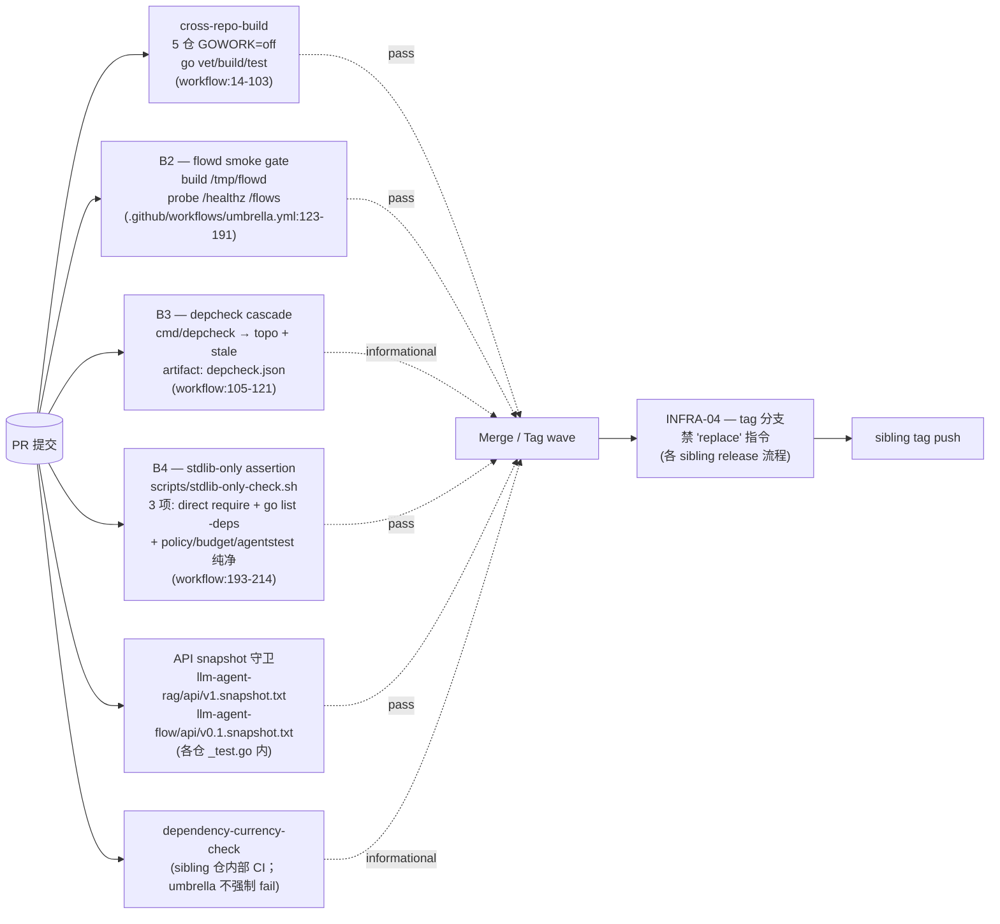

**解读**。Umbrella 层有 4 个 job（`.github/workflows/umbrella.yml`）：**cross-repo-build** checkout 5 sibling 仓库做 `GOWORK=off go vet/build/test`（`workflow:14-103`）；**B2 smoke** 跑 flowd 二进制 + `/healthz`/`/flows` 探活（`workflow:123-191`）；**B3 depcheck** 是 informational（不 fail PR，仅输出 `depcheck.json` artifact，`workflow:105-121`）；**B4 stdlib-only** 是硬门 — 3 项 fail-fast 断言（`scripts/stdlib-only-check.sh:38-167`）：(a) `llm-agent/go.mod` direct require 必须恰好 1 条且是 `llm-agent-rag` 反向边，(b) `go list -deps ./...` 仅允许 stdlib + ecosystem + `golang.org/x/*`，(c) `policy/`、`budget/`、`agentstest/` 子包必须 zero external deps（连 rag back-edge 也不能拉）。Sibling 仓库各自的 API snapshot 守卫（`llm-agent-rag/api/v1.snapshot.txt` 882 行、`llm-agent-flow/api/v0.1.snapshot.txt`）在自己的 `go test` 内执行。

锚点：`.github/workflows/umbrella.yml:14-214` / `scripts/stdlib-only-check.sh:38-167` / `cmd/depcheck/main.go:184-252`（topoSort 处理 back-edge 循环：rag 拿最低 out-degree 先 emit）。

---

## 第二部分：关键时序图

### 11. 时序：ChatModel.Generate（非流，provider 层）

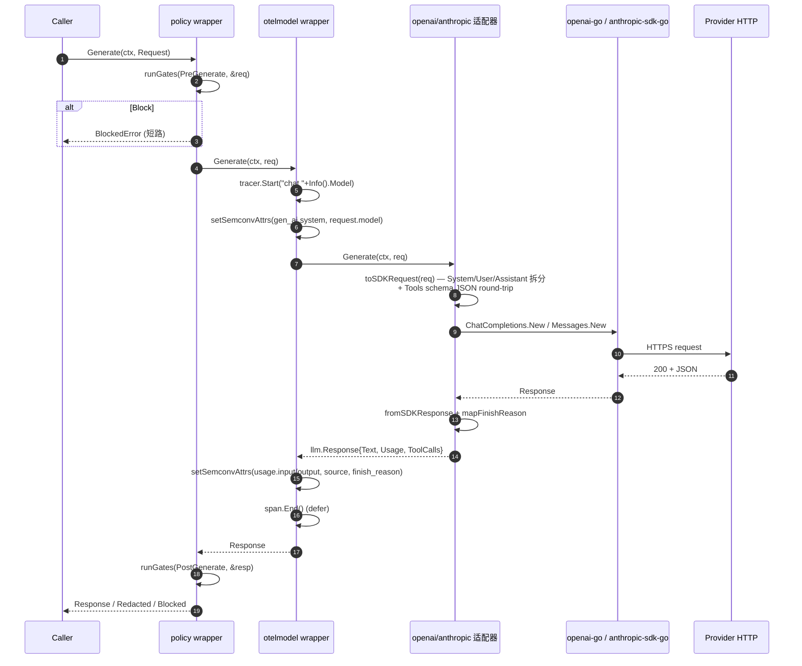

**解读**。Non-stream 路径最简，但已经体现三层装饰链的协作：policy 在 PreGenerate / PostGenerate 两点观察并改写；otelmodel 全程持一个 span（`defer span.End()` 单出口，`otelmodel/otelmodel.go:51-74`）；provider 把 `llm.Request` 翻译成 SDK 类型，所有错误经 `errors.go` 的 `wrapErr` 规整为 5 类 `llm.*` 错误（AuthError / RateLimitError / InvalidRequestError / TransientError / ErrCapabilityNotSupported）。`context.Canceled` 永远透传，不包装（`source-design-llm-agent-providers.zh-CN.md` §2.6）。

锚点：`otelmodel/otelmodel.go:51-74`（Generate 同步路径）/ `openai/openai.go:26-33` + `openai/map.go:12-56`（toSDKRequest）/ `policy/policy.go:398-416`（runGates first Block wins）。

---

### 12. 时序：ChatModel.Stream + Tool Call + Partial Usage + Cancel

```mermaid
sequenceDiagram
    autonumber
    participant App as Caller
    participant W as policy.streamReader
    participant Otm as otelmodel.streamReader
    participant Sr as inner SDK stream
    participant Span

    App->>W: Stream(ctx, req)
    W->>W: runGates(PreStream, &req)
    W->>Otm: Stream(ctx, req)
    Otm->>Span: Start("chat "+Model); setSemconvAttrs
    Otm->>Sr: inner.Stream(ctx, req)
    Sr-->>Otm: inner StreamReader
    Otm-->>W: wrapped streamReader
    W-->>App: streamReader

    loop until io.EOF / EventDone / cancel
        App->>W: Next()
        W->>Otm: inner.Next()
        Otm->>Sr: inner.Next()
        Sr-->>Otm: chunk → 解碎为 N 条 typed event
        alt 首条非 Done
            Otm->>Span: AddEvent("gen_ai.first_token")
        end
        alt EventToolCallStart
            Otm-->>W: {Kind:Start, ToolCall:{Index, ID, Name}}
        else EventToolCallArgsDelta
            Otm-->>W: {Kind:ArgsDelta, ToolCall:{Index, ArgsDelta}}
        else EventTextDelta
            Otm-->>W: {Kind:TextDelta, Text}
        else EventDone (含 Usage)
            Otm->>Span: setSemconvAttrs(usage, finish_reason)
            Otm->>Span: End()
            Otm-->>W: {Kind:Done, Usage, FinishReason}
        end
        W->>W: runGates(StreamDelta, &ev)
        alt Block
            W->>Sr: Close()
            W-->>App: &BlockedError{...}
        else Redact
            W->>W: ev.Text = Replacement
            W-->>App: rewritten ev
        else Allow
            W-->>App: ev
        end
    end

    opt ctx 取消
        App->>App: cancel()
        Note over Sr,Up: provider request ≤100ms 内观察 cancel<br/>(TestStream_CancelMidStream_Conformance)
        Sr-->>Otm: io.EOF + context.Canceled
        Otm->>Span: RecordError; SetStatus(Error); End()
        Otm-->>W: (zero, context.Canceled)
        W-->>App: (zero, context.Canceled)
    end

    App->>W: Close()
    W->>Otm: Close()
    Otm->>Sr: Close()
    Otm->>Span: End() (幂等)
```

**解读**。Stream 路径里有 3 个微妙点：(1) **span 不 defer End** — 由读取者驱动结束（EOF / EventDone / Error / Close 任一触发 `end()` 幂等关闭，`otelmodel/otelmodel.go:76-147`）；(2) **policy Stream Block 时序**（DP-5 的 surface-immediately 设计）：`PreStream` block → 关闭 inner + 第一个 Next 返回 BlockedError；`StreamDelta` block → 当前 Next 立刻返回 BlockedError 且 inner event 丢弃；`PostStream` block → no-op（流已终态）；(3) **cancel ≤ 100ms** 是 conformance 契约（`internal/contract/generate_test.go:281-330`），所有 provider 都必须满足，否则 PR 被拒。**Partial usage on error** 由 `TestStream_PartialUsageOnError_Conformance` 锁定：mock server 第一个 chunk 正常、第二个注入错误，期待先收 `EventTextDelta` 再收 non-nil error（`generate_test.go:332-375`）。

锚点：`llm/stream.go:13-16`（Iterator vs Channel 取舍）/ `otelmodel/otelmodel.go:76-147`（streamReader 状态机）/ `policy/policy.go`（Stream block 时序）/ `internal/contract/generate_test.go:281-375`。

---

### 13. 时序：Agent.Run with Tools（budget + policy + observation）

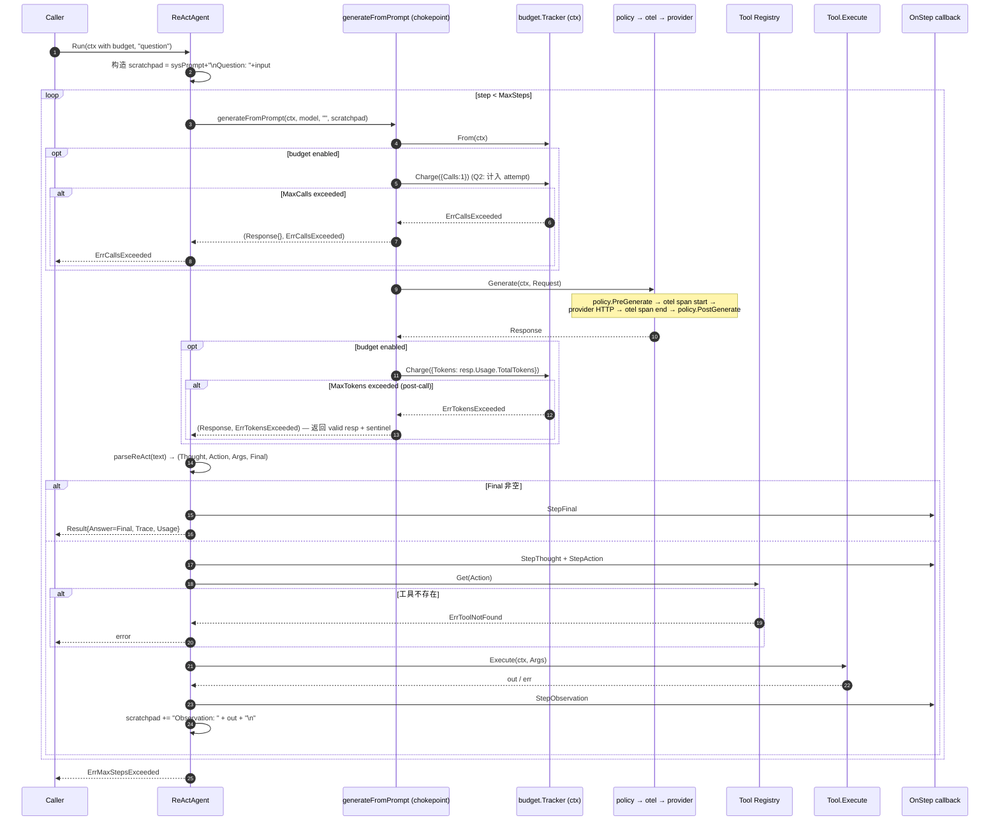

**解读**。这是整套生态最常见的调用形状。**3 个关键设计**：(1) `generateFromPrompt` 是**全局唯一 chokepoint**（`agent_chatmodel.go:11-54`），所有 5 种 agent 范式都走它 — budget 治理在唯一点上 hook；(2) **budget Q2 决策**：denied call 也计入 attempts，避免重试循环绕过限额；(3) **post-call deny 同时返回 valid Response + sentinel**（Decision 3）— provider 已收费、响应已产生，扔掉等于双重浪费，调用方通过 `errors.Is(err, budget.ErrBudgetExceeded)` 决定是否使用。

锚点：`agent_chatmodel.go:11-54`（chokepoint 全文）/ `react.go:23-237`（runScratchpad / runNative 双路径）/ `budget/budget.go:163-194`（check-before-commit）/ `budget/budget.go:23-42`（错误层级 sentinel）。

---

### 14. 时序：RAG.Ask（含 InjectionScanner）

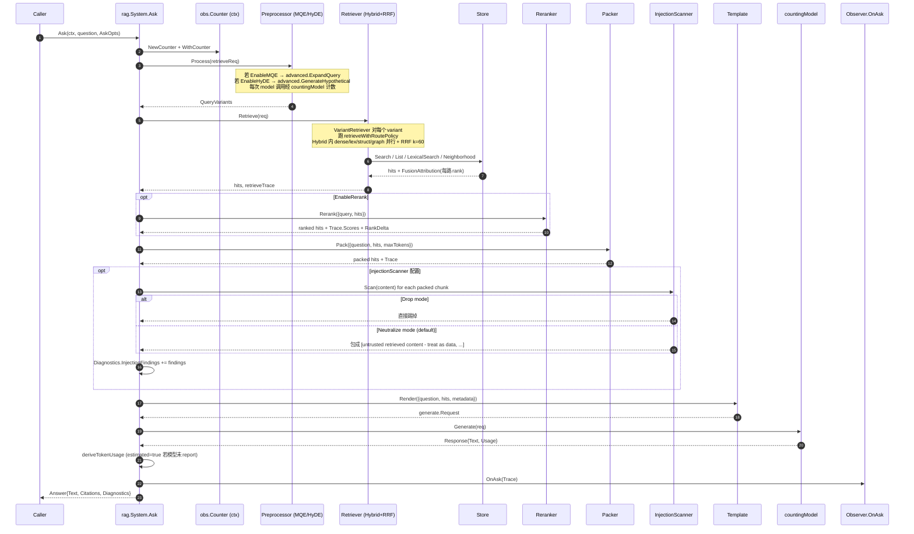

**解读**。Ask 路径的"管道"由 `rag.System` 编排 12+ seam（`rag/system.go:138-247`）：每个 seam 都有 interface + 至少一个 stdlib-only 的 reference 实现 + 一个生产实现的口子。**4 处关键设计**：(1) `obs.Counter` ctx 注入 — counter 透传给 nested embed/generate 调用，nil counter 是 no-op，零开销；(2) Hybrid RRF — Dense/Lexical/Structure/Graph 四路按 `1/(k+rank)` 融合，`FusionAttribution` 每个 chunk 在四路里的 rank 全部留底（可解释为先）；(3) InjectionScanner 在 pack 之后、prompt 之前扫描，把 retrieved content 当不可信源对待；(4) Token usage 三态 — 模型 report 真实 → verbatim；否则 `pack.SimpleCounter` 估算并标 `Estimated=true`（`ask.go:170-193`）。

锚点：`rag/ask.go:19, 83-87`（injection 钩接点）/ `rag/system.go:138-247`（默认装配）/ `retrieve/retrieve.go:1011-1064`（RRF）/ `obs/obs.go:48-88`（Counter 注入）/ `ask.go:170-193`（deriveTokenUsage 三态）。

---

### 15. 时序：RAG.AskGlobal（community report 路径）

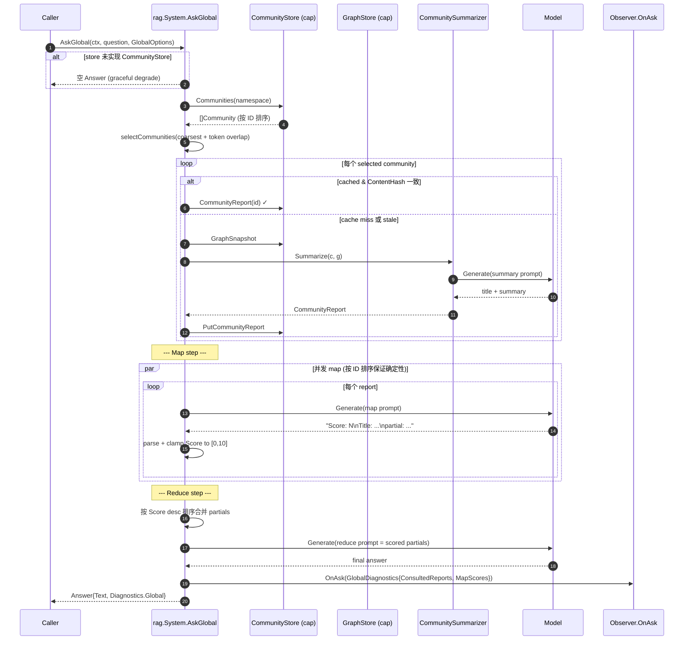

**解读**。AskGlobal 是"map-reduce over community reports"模型：先把整图按 Louvain 等算法社区化（`graph/louvain.go`，「no randomness, no random restarts」），每个 community 由 LLM 生成 `CommunityReport`（带 `ContentHash` 缓存），然后对每个 report 一次 LLM map（"对这段 community summary，与 question 的相关度多大？"），最后 reduce 合并。**确定性 by construction**：(1) communities 按 ID 排序（`global.go:305`）；(2) 缓存命中以 `ContentHash` 判等，避免重算；(3) Score 用 `Score: N` marker 宽松解析 + clamp 到 [0, 10]，与 Ask 路径同 idiom；(4) `eval.GlobalEvaluator`（`eval/global.go:51-104`）的 groundedness 读 `Answer.Diagnostics.Global.ConsultedReports`，因为 global search 没有 gold chunk。

锚点：`rag/global.go:62, 73-79, 194, 305` / `graph/louvain.go:16-19`（确定性 Louvain）/ `graph/summary.go`（LLMCommunitySummarizer）/ `eval/global.go:51-104`。

---

### 16. 时序：Flow.SubmitRun（Engine 分层并行 + Event 流 + SQLite per-event 写）

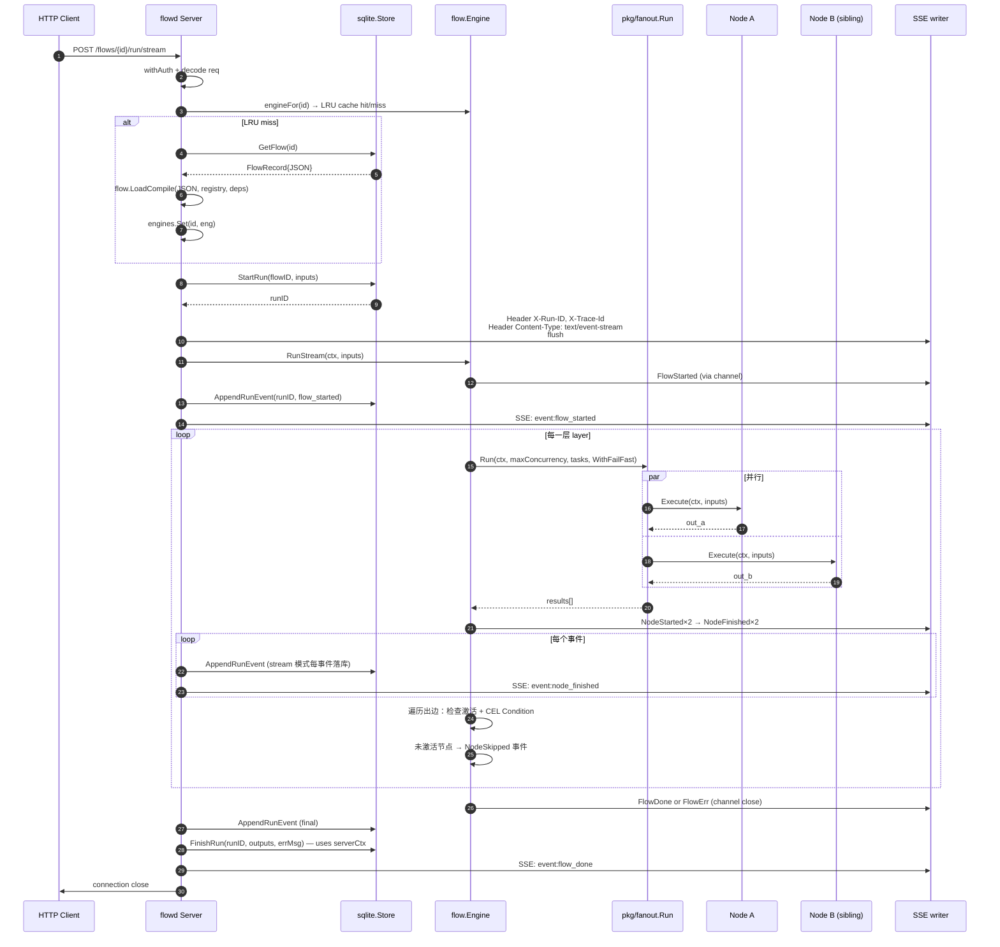

**解读**。这是 flow 库的核心调用形状。**几条非显然设计**：(1) `engineFor` 走 LRU（`server.go:139-165`，v0.1.1），`container/list` + map 实现 O(1)；(2) **stream 路径每事件先落库再转发**（`server.go:438-445`）—— v0.0.6 引入的"客户端中途断开仍有完整审计轨迹"耐久性契约；(3) **sync 路径**通过 type-assert 探测 `AppendRunEvents` 批量接口（`server.go:430-432`）— 不污染 `Store` interface 的前提下提速；(4) **`serverCtxFor(s)` = `context.Background()`**（`helpers.go:17`）— `FinishRun` / `AppendRunEvent` 之类最终化调用不受 request ctx 取消影响，否则客户端断连会导致历史丢失尾巴；(5) **emit 序列化**（`engine.go:184-195`）— 同层兄弟节点并发跑时，channel 发送被 mutex 保护，保证 consumer 看到的事件逐条序列化（per-event atomicity）。

锚点：`cmd/flowd/server/server.go:106-131, 139-165, 364-495`（路由 + engineFor + runWithStore）/ `flow/engine.go:180-364`（run 内核）/ `flow/store/sqlite/events.go:20-54, 65-124`（AppendRunEvent + 批量）/ `cmd/flowd/server/lru.go`（LRU）。

---

### 17. 时序：Customer-support 完整 turn（含 session 加载、guardrails、tool、trace）

```mermaid
sequenceDiagram
    autonumber
    participant U as HTTP Client
    participant HT as httpapi.Handler
    participant LM as limits.Guard (Preflight)
    participant SF as supportflow StateGraph
    participant SS as sessionstore
    participant TA as toolAgent
    participant M as policy→otel→provider
    participant KB as knowledgebase (rag)
    participant RP as refund_policy Tool
    participant LM2 as limits.Guard (Postflight)
    participant ST as OTel Tracer

    U->>HT: POST /chat {session_id?, message}
    HT->>HT: withTrace middleware<br/>tracer.Start "POST /chat"
    HT->>HT: 解析 sessionID; 缺失则 uuid.NewString
    HT->>ST: trace_id 写 X-Trace-Id
    HT->>LM: Preflight(ctx, tokens估算, IP)
    alt DISABLE_LLM=1
        LM-->>HT: 503 service disabled
    else MaxTokensPerRequest 或 DailyTokenBudget 超
        LM-->>HT: 429 rate limited
    end
    HT->>SS: ContextWithSessionID(ctx, sessionID)
    HT->>SF: Run(ctx, message)

    SF->>SS: Get(sessionID) 拉历史
    SS-->>SF: []Messages
    SF->>SF: mergeQuestionWithHistory → prompt
    SF->>SF: classify (纯规则)
    alt chargeback / fraud
        SF-->>HT: handover-human
    else 缺 order_id
        SF-->>HT: request-more-info
    else self-service
        SF->>TA: Run(ctx, merged prompt)
        TA->>M: WithTools(registry.AsLLMTools()).Generate
        M-->>TA: Response{ToolCalls:[refund_policy(...)]}
        alt 无 ToolCalls
            TA-->>SF: text answer
        else 有 ToolCalls
            TA->>TA: AsyncRunner(MaxParallel=4)
            par
                TA->>RP: Execute(ctx, {order_id, user_id (server-injected)})
                RP->>KB: LookupRefundPolicy(orderID)
                KB->>KB: rag.Retrieve "refund policy order {id}" TopK=1
                KB-->>RP: policy text
                RP-->>TA: tool out
            end
            TA-->>SF: "refund_policy: <out>\n..."
        end
    end
    SF-->>HT: agents.Result{Answer, Trace, Usage}

    HT->>LM2: Postflight(ctx, Result)
    alt tool calls > MaxToolCallsPerAgentLoop
        LM2-->>HT: 429
    else retries > RetryMaxAttempts
        LM2-->>HT: 429
    end
    HT->>SS: Save(sessionID, updated history)
    HT->>ST: span.End()
    HT-->>U: 200 JSON {answer, session_id} + X-Trace-Id + X-Session-Id
```

**解读**。`customer-support` 把整条 trace 拉成一根线：HTTP middleware → limits preflight → StateGraph load-session → classify → toolAgent → ChatModel → tool → RAG → session save → postflight。**4 处关键点**：(1) `limits.Guard` 分 preflight / postflight 两阶段（`limits.go:76-106, 128-140`）；(2) **`DISABLE_LLM=1` 是热开关**（`limits.go:123-126`） — 不重启进程，设环境变量即立即熔断，是 demo 给生产部署预留的最小化紧急止血通道；(3) `refund_policy` 工具 schema 强制 `order_id` 必填、`user_id` 必须**服务端注入**（`supportflow.go:253-255` 显式拒绝客户端伪造）；(4) **设计缺口**：`guardrails` 模块虽然在 `supportflow.go` 内接入了，但 `app.go` production wiring **从未实例化** `*Guardrails`，意味着 prompt-injection 防护在 binary 里始终是 nil（`source-design-llm-agent-customer-support.zh-CN.md` §3.9）。

锚点：`internal/httpapi/httpapi.go:52-67, 69-95, 241-260` / `internal/limits/limits.go:76-106, 123-126, 128-140` / `internal/supportflow/supportflow.go:127-192, 240-262` / `internal/supportflow/toolagent.go:26-133` / `internal/knowledgebase/knowledgebase.go:41-69, 75-87`。

---

## 附录：图与文件的快速跳转表

| 图编号 | 主要锚点文件 | 关键起始行 |
|---|---|---|
| 1 | `README.md` / `cmd/depcheck/main.go` | `:53-62` / `:32-39` |
| 2 | `llm-agent/agents/agent.go` / `llm-agent/llm/doc.go` | `:13-21` / `:33-43` |
| 3 | `llm-agent/{simple,react,reflection,plan_solve,function_call}.go` | 各自 New 函数 |
| 4 | `llm-agent/policy/policy.go` / `llm-agent-otel/otelmodel/otelmodel.go` | `:43-67` / `:14-49` |
| 5 | `llm-agent-rag/rag/{ask,global,drift}.go` | `:19` / `:62` / `:75` |
| 6 | `llm-agent-flow/flow/{ir,engine,runner,event}.go` | `:20-28` / `:67-152` |
| 7 | `llm-agent-customer-support/internal/app/app.go` | `:70-148` |
| 8 | `llm-agent-otel/otelmodel/otelmodel.go` 等 | `:51-74, 76-147` |
| 9 | `llm-agent/llm/stream.go` | `:22-31, 65-70` |
| 10 | `.github/workflows/umbrella.yml` / `scripts/stdlib-only-check.sh` | `:14-214` / `:38-167` |
| 11 | `llm-agent-otel/otelmodel/otelmodel.go` + provider `map.go` | — |
| 12 | `llm-agent/llm/stream.go` + `internal/contract/generate_test.go` | `:281-375` |
| 13 | `llm-agent/agents/agent_chatmodel.go` + `react.go` | `:11-54` / `:23-237` |
| 14 | `llm-agent-rag/rag/ask.go` + `system.go` | `:19, 83-87` / `:138-247` |
| 15 | `llm-agent-rag/rag/global.go` + `graph/louvain.go` | `:62, 305` / `:16-19` |
| 16 | `llm-agent-flow/cmd/flowd/server/server.go` + `flow/engine.go` | `:139-165, 364-495` / `:180-364` |
| 17 | `llm-agent-customer-support/internal/*` | `app.go:70-148` 等 |

> **提示**：所有 `file:line` 引用都基于 2026-05-21 的代码快照。如果跨大版本跳跃后行号偏移，可用 `git log -L <start>,<end>:<file>` 追踪。

---

## 延伸阅读

- 进一步看每个仓库的源码级深读：参考同目录 7 篇 `source-design-*.zh-CN.md`
- 看生态级设计评审与已识别 risk：`./ecosystem-design-review.zh-CN.md`
- 看路线图与 v1.3/v1.4 计划：`./refactor-and-optimization-roadmap.zh-CN.md`
- 看 umbrella root 自己的设计：`./source-design-umbrella-root.zh-CN.md`
