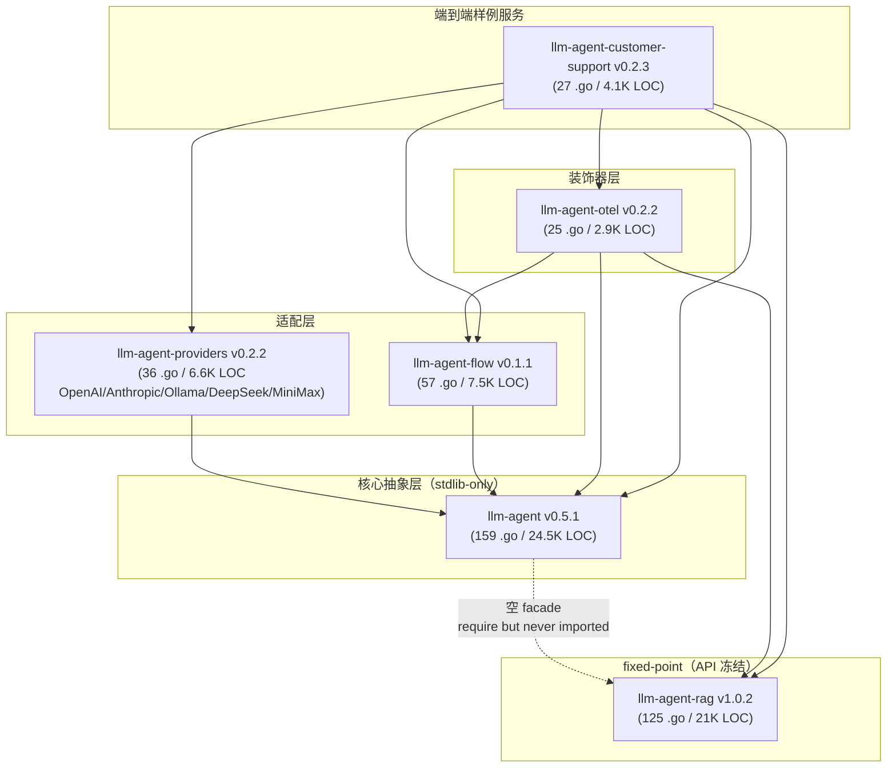

# 生态级设计评审：`llm-agent-ecosystem` v1.1（v1.2 在飞）

> 评审日期：2026-05-21
> 范围：6 个仓库（`llm-agent` / `llm-agent-rag` / `llm-agent-providers` / `llm-agent-otel` / `llm-agent-flow` / `llm-agent-customer-support`）+ umbrella root
> 输入：六份 `docs/source-design-*.zh-CN.md` 深读文档 + 必要的源码回查
> 读者画像：另一位资深工程师，目标是 30 分钟内对该生态做出"用 / 不用 / fork 哪一部分"的判断
> 评审姿态：**只对照代码不对照口号**；所有断言均带 `file:line` 锚点
> 关联路线图：`docs/refactor-and-optimization-roadmap.zh-CN.md`

---

## 0. TL;DR（一页结论）

`llm-agent-ecosystem` 是一个**6 仓 / 单装配方向 / 共 ~66K 行 Go**（含测试）的 LLM 智能体框架家族。它的最大独特卖点是：**核心 `llm-agent` 真的 stdlib-only**（`go.sum` 只有 2 行，全部是 RAG 反向边的校验），所有"重"依赖（OTel SDK、provider SDK、SQLite、pgvector、CEL）都被推到外围装饰器或 carve-out 子包；这让"读完每一行再决定要不要用"在工程上成立。

但在"做到了多少"这个问题上要分档评：

- **真做到、可商用骨架**：`llm-agent-rag` v1.x（fixed-point + api snapshot + 22-subtest store conformance）、`llm-agent-providers`（5 个 provider 共享 fixture + 3 层测试金字塔 + first-byte-retry 一致性）、`llm-agent-otel` 的 8-wrapper capability 矩阵。
- **架构清晰但有真实 bug 待修**：`llm-agent` 核心、`llm-agent-flow`、`llm-agent-customer-support`。其中 `customer-support` 的 prompt-injection 防御在 production binary 里完全失效（§6 P0-1）。
- **名实不副**：`llm-agent` 的 RAG facade 是空目录但 go.mod 仍要求依赖（§4.5）；providers 的 "stdlib-only HTTP" 承诺与 5 个 SDK 依赖的现实冲突（§2.2）；DeepSeek/MiniMax 的 capabilities 硬编码违反 K2 精神（§3.4）。

**判断建议**：
- 想白盒 LLM agent 框架 → 用核心 `llm-agent`，可以 fork。
- 想 RAG SDK → 用 `llm-agent-rag` v1.x，几乎可以直接 production（先补 ivfflat 索引）。
- 想"装饰器风格"的 OTel 接入 → 直接抄 `llm-agent-otel` 的设计。
- 想看 customer-support demo → 当结构骨架学，**guardrails wiring bug 必须先修**。

---

## 1. 生态全景与定位

### 1.1 依赖拓扑



> 边的"虚线"表示 `llm-agent/go.mod` 声明依赖但 `grep -rn 'llm-agent-rag' --include='*.go'` 找不到任何 import 语句（见 §4.5）。

### 1.2 总评

| 维度 | 评价 | 证据 |
|---|---|---|
| **设计连贯性** | 高 | K1（streaming union）/ K2（per-(provider×model) caps）/ K3（OTel decorator）三条 keystone 在所有 6 仓里都能找到对应代码点 |
| **依赖卫生** | 高（核心）/ 中（providers） | core `go.sum` 只 2 行；providers 5 个 SDK 共用 3 套上游（openai-go 服务 openai+deepseek，anthropic-sdk-go 服务 anthropic+minimax） |
| **可测试性** | 高 | `ScriptedLLM` 是 4 capability 一等公民、`storetest` 22 subtest、provider fixture 三层金字塔、apisnapshot CI gate |
| **生产度** | 中 | rag 缺生产向量索引；providers 5 个都缺默认 timeout；customer-support 是显式标注的 demo only |
| **名实一致** | 中 | rag facade 名实不副；providers"stdlib-only HTTP"措辞误导；customer-support README ≠ wiring；otelmodel timeToFirst histogram 已建但 wrapper 没接 |
| **演进策略** | 高 | rag v1 frozen + /v2 路径明示；flow apisnapshot + 加法兼容；core 4 个 validated 类型禁改 |

---

## 2. 设计哲学共识与冲突

逐条评估生态内**贯穿多仓的核心信条**，看哪几仓真做到、哪几仓只是口号。

### 2.1 信条 1：stdlib-only as a feature, not a constraint

**起点**：`llm-agent` `CLAUDE.md` 与 umbrella `README.md:69-72` 把"核心 stdlib-only + 一条 `llm-agent-rag` 反向豁免"作为头号硬规则。

| 仓库 | 落地度 | 证据 |
|---|---|---|
| `llm-agent` | **YELLOW**（口号 vs 现实） | `llm-agent/go.mod:5` 声明 `require github.com/costa92/llm-agent-rag v1.0.1`，但 `llm-agent/rag/` 是空目录（`docs/source-design-llm-agent.zh-CN.md:376-379`），**没有任何 `.go` 文件 import 它** —— 这条豁免目前没在用 |
| `llm-agent-rag` | GREEN（核心子包）+ 受控 island | `llm-agent-rag/go.mod` 列出 `pgx/v5` + `pgvector-go` 但只在 `postgres/` 子包用；`adapter/llmagent/` 用 `//go:build llmagent` 隔离 |
| `llm-agent-providers` | **YELLOW**（措辞误导） | umbrella README 与 `docs/source-design-llm-agent-providers.zh-CN.md:150-160` 都提到"stdlib-only HTTP"，但 `go.mod` 实际依赖 `openai-go/v3`、`anthropic-sdk-go`、`ollama/api` 三套 SDK |
| `llm-agent-otel` | GREEN | OTel SDK 是允许依赖，符合定位 |
| `llm-agent-flow` | GREEN（核心包）+ 子包受控 | `flow/` 仅依赖 `llm-agent` 的 `agents.Tool` + `pkg/fanout`；CEL、SQLite、OTel 各自独立子包，由 umbrella B4 gate 守 |
| `llm-agent-customer-support` | GREEN | sibling SDK 集合体，本身不参与"核心 stdlib-only" |

**结论**：这条信条的**精神**贯彻得很彻底（每个仓都自觉守边界），但**字面**已经在多处松动。core 仓的 phantom RAG 依赖与 providers 的 SDK 重度依赖是两处最大的不一致。**建议**：要么落地 facade、要么删除依赖；providers 的"stdlib-only HTTP"措辞应修订为"thin SDK wrapper, public surface uses net/http types"。

### 2.2 信条 2：Capability per `(provider × model)`（K2）

**起点**：`llm-agent/llm/info.go:8-30` 让 `ProviderInfo` 在构造时绑定 model name，`Capabilities` 反映该 model 的真实能力。

| Provider | K2 落地度 | 证据 |
|---|---|---|
| openai | GREEN | `openai/options.go:67-83` 按 `cfg.model` 字符串切 `embeddings` |
| anthropic | GREEN（"整家无 embedding"是静态事实） | `anthropic/options.go:71-80` |
| ollama | GREEN | `ollama/options.go:74-109` + `tool_strategy.go:20-48` 的 `family/parserKind/supportsTool` 三元组按 model 切 |
| deepseek | **YELLOW** | `deepseek/options.go:93-98` 硬编码 `{Tools:true, Embeddings:false}` 不看 model（`docs/source-design-llm-agent-providers.zh-CN.md:587`） |
| minimax | **YELLOW** | 同上，`minimax/options.go:93-98` |

**结论**：K2 在 5 个 provider 里有 3 个真正按 model 反映能力，2 个伪 K2（硬编码）。**建议**：每个 provider 加 `capabilitiesForModel(model string)` 辅助（即便所有 case 字面量相同也要写明），强制未来加新 reasoning-only model 时显式过一遍。

### 2.3 信条 3：OTel as decorator, never as hook（K3）

**起点**：umbrella `README.md:84-85`。

| 仓库 | 落地度 | 证据 |
|---|---|---|
| `llm-agent` | GREEN | 核心 0 行 OTel 依赖；`policy.Wrap` 的 8-wrapper 树（`policy/policy.go:43-67`）就是 K3 的实现模板 |
| `llm-agent-otel` | GREEN | `otelmodel/otelmodel.go:14-49` 镜像 8-wrapper 矩阵；`otelagent.Wrap` / `otelflow.Wrap` / `otelrag.Wrap` 全部 `Wrap(X) X` 形态 |
| `llm-agent-rag` | GREEN（双形态） | `rag.Observer` + `obs.Counter` 让 otelrag 既能做 wrapper 也能做 observer 注入（`docs/source-design-llm-agent-rag.zh-CN.md:464-477`） |
| `llm-agent-flow` | GREEN | `flow.Runner` 接口（`flow/runner.go:11-21`）专门为 K3 设计 |
| `llm-agent-providers` | GREEN（约束方向） | 5 个 provider 0 行 OTel 依赖 |
| `customer-support` | GREEN | `app.go:99/125/127` 的三重 wrap |

**结论**：K3 是整套生态**贯彻最彻底**的一条。`go list -deps` 能在编译期验证 `llm-agent` / `llm-agent-providers` 完全无 `go.opentelemetry.io/otel` 出现 —— 这是其他大多数 LLM 框架做不到的事情。

### 2.4 信条 4：Typed streaming union（K1）

**起点**：`llm/stream.go:21-70` 的 6 种 `EventKind` + per-tool-call `Index`。

| 落点 | 实现 | K1 评分 |
|---|---|---|
| openai | `openai/openai.go:108-231` 的 `chunkEvents` | GREEN |
| anthropic | `anthropic/anthropic.go:122-197` 内嵌 `blockKinds map`，自然带 content_block index | GREEN |
| ollama | `ollama/ollama.go:197-313` 的 ingest 状态机 | **YELLOW** — 流路径下 tool 信息只在 done 帧到达，buffer-then-parse 没做流式增量；`docs/source-design-llm-agent-providers.zh-CN.md:436-438` |
| deepseek/minimax | 与 openai/anthropic 几乎镜像 | GREEN（代码层），YELLOW（测试覆盖：cancel + partial-usage conformance 没跑） |
| flow | `flow/event.go:14-34` 的 `FlowEvent{Kind, ...}` 与 K1 同形 | GREEN |
| otelmodel.streamReader | first-token event + EventDone | GREEN（trace 端），**但 metric 端没接** —— `docs/source-design-llm-agent-otel.zh-CN.md:706-707`：`timeToFirst` histogram 已 build 但 wrapper 没调用 |

**结论**：K1 接口设计 GREEN，**streaming 工具完备性 + 指标侧接入是这套生态最大的隐藏债**。

### 2.5 信条 5：Capability progressive enhancement（type assertion）

整个生态用得最一致：

- `llm.ToolCaller` / `Embedder` / `StructuredOutputs` 都是 `ChatModel` 之上的 optional capability（`llm/capabilities.go:13-42`）；
- `rag/store.LexicalSearcher` / `GraphStore` / `CommunityStore` 是 `Store` 之上的 sibling capability，store 不实现就 graceful empty（`rag/import.go:159`、`rag/global.go:73-79`）；
- `flow.Store` 接口冻结后 v0.1.1 加 `AppendRunEvents` 不动接口，而是让调用方做 `if batcher, ok := store.(interface{...}); ok`（`docs/source-design-llm-agent-flow.zh-CN.md:368-376`）。

这是整个生态**最优雅**的一条信条 —— 它让"interface 不能加方法"和"能力可以渐进增强"两个看似矛盾的约束同时成立。**评分：GREEN（全生态）**。

### 2.6 信条 6：IR-as-source-of-truth（仅 flow）

`flow/ir.go:20-28` 把 Flow IR 定为唯一真理源 —— Engine 是 IR 的解释器，sqlite 只存 IR JSON 不存编译态（`docs/source-design-llm-agent-flow.zh-CN.md:101-103`）。**评分：GREEN**。但 **IR schema 没有 JSON Schema 文件**（`api/v0.1.flow-schema.json` 不存在），100-node flow 手写 PortRef 容易出错（`docs/source-design-llm-agent-flow.zh-CN.md:935-942`）。

---

## 3. Keystone 决策 K1–K7 执行回顾

来源：umbrella `README.md:69-92`、6 份深读文档的 §9 偏差表。

| Keystone | 决策内容 | 执行评分 | 主要证据（file:line） |
|---|---|---|---|
| **K1** | StreamEvent typed union + per-tool-call Index 稳定 | YELLOW | 接口 GREEN（`llm/stream.go:21-70`），但 `AccumulateStream` 实际按 `ID` 键合（`llm/stream.go:130-145`，注释明示 "NOT the production accumulator"）；ollama 流路径不发流式 tool event |
| **K2** | Capabilities per (provider × model) | YELLOW | 3/5 provider GREEN；deepseek/minimax 硬编码（`deepseek/options.go:93-98`） |
| **K3** | OTel as decorator wrapper, never hooks | GREEN | core 0 行 OTel；8-wrapper 矩阵（`otelmodel/otelmodel.go:14-49`）；rag Observer 二级备选（`otelrag/otelrag.go:184-232`） |
| **K4** | 三态 cost（reported/estimated/unknown）+ retry 状态机 | YELLOW | 三态在 `llm/types.go:78-82` 已定义；retry 状态机**留给 provider 实现**：openai 有 first-byte-retry，但 anthropic/ollama/minimax 都没解析 `Retry-After`（`anthropic/errors.go:31-33`、`ollama/errors.go:38-46`、`minimax/errors.go:28-31`） |
| **K5** | gen_ai semconv 集中常量 + env opt-in | GREEN | `llm-agent-otel/semconv_gen_ai.go:9-30` 唯一真理源；`OTEL_SEMCONV_STABILITY_OPT_IN` + `OTEL_INSTRUMENTATION_GENAI_CAPTURE_MESSAGE_CONTENT` 双闸门（`semconv_gen_ai.go:37-44`） |
| **K6** | multi-repo CI 门禁 | GREEN | umbrella B2 smoke / B3 depcheck / B4 stdlib-only gate 已陆续上线（`git log` 显示 commits bc970bc / 8c4cd8c / d396d5b） |
| **K7** | customer-support 硬 cap + DISABLE_LLM panic switch | YELLOW | DISABLE_LLM 已生效（`limits.go:123-126`），但 guardrails wiring 未启用（**P0 bug**，§6） |
| KC-1 | Supervisor 建立在 StateGraph[S] 之上 | GREEN | `orchestrate/supervisor.go:48-454` 3-node graph facade + `var _ agents.Agent = (*Supervisor)(nil)` 编译期断言可嵌套 |
| KC-2 | memory tiering | 延期到 v1.3 | 文档说明 |
| CC-1 | Budget chokepoint at generateFromPrompt | GREEN | `agent_chatmodel.go:11-54` 覆盖所有 5 个 agent 范式 |
| CC-2 | Policy middleware (8-wrapper tree) | GREEN | `policy/policy.go:43-67` |

**总评分**：12 个 keystone / 主要决策中 8 GREEN、4 YELLOW、0 RED。**YELLOW 的共同模式都是"接口定义齐了，工具完备性留给后续"**。

---

## 4. 跨仓抽象 / 契约一致性（6 个维度）

逐维度对照"是真共契约 / 各仓自行复刻 / 不一致"。

### 4.1 Streaming Event Union

| 仓库 | 类型 | 字段 | 维度数 |
|---|---|---|---|
| `llm/stream.go:22-31` | `StreamEvent{Kind, Text, ToolCall*, Usage, FinishReason}` | 6 kinds | model 端 |
| `flow/event.go:14-34` | `FlowEvent{Kind, FlowID, NodeID, Input, Output, Outputs, Err}` | 6 kinds | flow 端 |
| `agents.StepEvent`（`agent.go:28-33`） | `{Step, Done, Final, Err}` | 1 kind + Step.Kind 6 const | agent 端 |

**判断**：三个流形态**形状相似但字段集合不一致**。这是"独立设计但精神一致"的反映 —— 不是真共契约。比如 `FlowEvent` 不直接复用 `StreamEvent`，因为前者描述 graph node 状态、后者描述 LLM 文本/工具增量。

**风险**：当下游想"统一处理 LLM stream + flow stream + agent stream"时（典型如 customer-support 的 SSE），需要写三套 switch。

**建议（路线图 P2）**：把 K1 的 "typed-union + stable key" 抽象成一个 doc 模式，而不是去强行统一类型。

### 4.2 Capabilities 矩阵

| 仓库 | Capability 接口 | 检测姿态 |
|---|---|---|
| `llm` | `ToolCaller / Embedder / StructuredOutputs` | type-assert + `Info().Capabilities` 双重 |
| `rag/store` | `LexicalSearcher / GraphStore / CommunityStore` | type-assert，失败 graceful empty |
| `flow/store` | `interface{ AppendRunEvents(...) }` | type-assert 嗅探 |
| `otelmodel` | 8-wrapper matrix preserving 上面三个 | 编译期 `var _ Iface = (*wrapper)(nil)` |

**判断**：**这是整个生态最一致的契约**。所有仓都用"小核心接口 + sibling capability + type-assert 检测"模式。**评分：GREEN**。

### 4.3 Agent / Runner 接口

| 仓库 | 接口 |
|---|---|
| `llm-agent` | `agents.Agent{Name() / Run() / RunStream()}`（`agent.go:13-21`） |
| `llm-agent-flow` | `flow.Runner{Run() / RunStream()}`（`flow/runner.go:11-21`） |
| `customer-support` | 复用 `agents.Agent`（没自己造） |

**判断**：两个接口形状几乎相同（缺 Name）。`flow.Runner` 是为 K3 decorator 缝合点专门造的（v0.0.7 引入），与 `agents.Agent` **不互相 implements**。

**讨论**：是否应让 `*flow.Engine` 也实现 `agents.Agent`？这样 flow 可以直接当 agent 嵌入 Supervisor。**否**：flow 的 input/output 是 `map[string]string`，agent 是 `string` —— 强行兼容会引入类型 adapter 噪声。当前各自为政是正确取舍。

### 4.4 Tool 协议

| 仓库 | Tool 接口 |
|---|---|
| `llm-agent` | `agents.Tool{Name() / Description() / Schema() / Execute(ctx, args)}` 返回 string（`tool.go:16-21`） |
| `llm-agent-flow` | `flow.Tool{Name() / Execute(ctx, args)}`（最小接口，`flow/node.go:42-53`） |
| `llm-agent-rag` | 通过 `adapter/llmagent/AsTool` 把 `rag.System` 暴露为 `agents.Tool` |
| `customer-support` | 注册 `refund_policy` 作为 `agents.Tool`，flow 通过 `FromAgentTool` 转 `flow.Tool`（`flow/adapter_llmagent.go:14-39`） |

**判断**：`agents.Tool` 是真共契约；`flow.Tool` 是它的**子集**（去掉 Description/Schema），通过单向 adapter 桥接。这是合理的不对称 —— flow 节点不需要 LLM tool calling schema。**评分：GREEN**。

### 4.5 RAG Facade（critical incoherence）

**契约**：umbrella README 与 `llm-agent/CLAUDE.md` 都把 `llm-agent.rag/` 当作 "RAG facade"，是核心 stdlib-only 规则的**唯一豁免点**。

**现实**：

```bash
$ ls llm-agent/rag/
# 空
$ grep -rn 'llm-agent-rag' llm-agent/ --include='*.go'
# 只有 agentstest/doc.go 注释里的字符串
$ cat llm-agent/go.sum
github.com/costa92/llm-agent-rag v1.0.1 h1:+pR+TJ8betcKnw1IfTooJMA9eRJyUyr4S/OdnMbwpOM=
github.com/costa92/llm-agent-rag v1.0.1/go.mod h1:lAJAZgSU/87p0cVD16cgN7qga/Z5CqwFNc+J6vLrejE=
```

**判断**：核心仓声明了一条"唯一允许的反向边"但**完全没用它**。这等于：
- stdlib-only 规则的字面意义被破坏（即便 facade 计划上是合理的）；
- 下游 `customer-support` 真正用 RAG 时是直接 `import "github.com/costa92/llm-agent-rag/rag"`（`knowledgebase/knowledgebase.go:46`），并未经过 facade；
- B4 stdlib-only assertion gate（umbrella commit bc970bc）需要硬编码一条"允许 llm-agent-rag"豁免，否则一启动就 false-positive 失败。

**评分：RED**（语义不一致）。**建议**：见路线图 P0-2，二选一（落地 facade 或删依赖）。

### 4.6 Trace 模型（gen_ai semconv）

| 信号 | model | agent | flow | rag |
|---|---|---|---|---|
| Trace (span) | ✓ | ✓ | ✓ | ✓（双形态 Wrapper + Observer） |
| Metrics | `otelmetrics.Recorder`（**自助 API，wrapper 不自动调**） | — | — | ✓ RED + tokens |
| Logs | `otelslog`（只追加 trace_id，未走 OTel log SDK） | — | — | — |

**评分**：YELLOW —— Trace GREEN，Metric/Log 不齐。详见 `docs/source-design-llm-agent-otel.zh-CN.md:716-734`。

---

## 5. 依赖卫生体检

### 5.1 go.mod 反向边一览

| 仓 | 反向依赖（pull other ecosystem repos） | 备注 |
|---|---|---|
| `llm-agent` | `llm-agent-rag v1.0.1`（phantom） | 见 §4.5 |
| `llm-agent-rag` | （无） | 真正的 fixed point |
| `llm-agent-otel` | `llm-agent` + `llm-agent-rag` + `llm-agent-flow` | 装饰器层正向 |
| `llm-agent-providers` | `llm-agent v0.5.1` | 正向 |
| `llm-agent-flow` | `llm-agent v0.5.x` | 正向（仅 `agents.Tool` + `pkg/fanout`） |
| `llm-agent-customer-support` | 全部 5 个 sibling | 正向 |

**判断**：依赖图**严格 DAG**（除 phantom 边）。fix point + 正向消费链非常干净。

### 5.2 CI 闸子现状

| Gate | 状态 | 强度 |
|---|---|---|
| **INFRA-04**：release branch 拒绝 `replace` | 已生效 | 强 |
| **GOWORK=off** 强制 | 已生效 | 强 |
| **B2 smoke**（umbrella） | 已生效（commit d396d5b） | 中 |
| **B3 depcheck**（topological cascade） | 已生效（commit 8c4cd8c） | 强 |
| **B4 stdlib-only assertion gate** | 已生效（commit bc970bc） | 强 |
| **dependency-currency** | 已生效（v1.1） | 中 |
| **`apisnapshot`**（rag v1 surface 锁） | 已生效 | 强（rag/flow 各自有） |
| **rag 行为 golden test**（默认值与算法输出） | 缺 | — |
| **provider stream cancel + partial-usage**（deepseek/minimax） | 缺 | — |
| **gen_ai semconv signature drift detection** | 缺 | — |
| **flow IR JSON Schema 锁定**（字段名兼容） | 缺 | — |

**评分**：闸子布局**相当完整**，但有 4 个高价值缺口（见路线图 §7）。

### 5.3 `replace` / `go.work` 处理

- `go.work` 全部 `.gitignore`（`README.md:81`）；
- `scripts/workspace.sh`（providers/otel/cs 三仓均有）提供"本地多仓 dev"helper；
- `customer-support/Dockerfile:7-9` 主动 `go mod edit -dropreplace`，保证容器构建**永远**用公开 tag 版本；
- release 分支 CI 拒绝 `replace`（`INFRA-04`）。

**判断**：处理姿态接近教科书。**评分：GREEN**。

---

## 6. 关键风险与 Bug 集中清单（按严重度）

### 6.1 P0（必须紧急修复）

| 编号 | 仓 | 描述 | 证据（file:line） |
|---|---|---|---|
| **P0-1** | customer-support | **Guardrails wiring bug** — `app.go:106-110` 调用 `supportflow.New` 时不传 `Guardrails`；production binary 上 prompt-injection 过滤与"untrusted-RAG"system prompt 前缀**全部失效**。但 README 第 7 行声称这是 day-one defense。`grep -rn "Guardrails" internal/app/` 返回 0 行。单元测试覆盖了 guardrails 路径（`supportflow_test.go:141-208`），但 production 装配从未触发它。 | `internal/app/app.go:106-110` |
| **P0-2** | llm-agent + umbrella | **RAG facade 名实不副** — `llm-agent/rag/` 空目录但 `go.mod` require `llm-agent-rag v1.0.1`；任何 stdlib-only assertion gate 必须为这条"唯一豁免"加硬编码白名单，否则 false-positive。 | `llm-agent/rag/`（空）+ `llm-agent/go.mod:5` |

### 6.2 P1（下个版本窗口）

| 编号 | 仓 | 描述 | 证据 |
|---|---|---|---|
| **P1-1** | llm-agent-rag | **生产 Postgres 缺向量索引** — `postgres.Migrate` 不创建 ivfflat / hnsw 索引，生产部署遇到 ~100K chunk 就崩 | `postgres/postgres.go:93-161` |
| **P1-2** | llm-agent-rag | **InjectionScanner 覆盖不全** — 只在 `Ask` 路径跑 sanitize；`AskGlobal` / `AskDrift` 完全不跑，攻击者注入 community report 描述可绕过 | `rag/inject.go:21-48` + `rag/global.go` / `rag/drift.go` 无 sanitize 调用 |
| **P1-3** | llm-agent | **`comm/a2a` 后台 goroutine ctx 泄露** — `server.go:128-129` 用 `context.Background()` 起 worker，HTTP 请求返回后无法 cancel；自带 FIXME | `comm/a2a/server.go:128-129` |
| **P1-4** | llm-agent | **`runStreamFromBlocking` ctx-cancel 不发 Done event** — `agent.go:107-122` ctx 取消时 channel 关闭，consumer 通过 `range ch` 看不到 ctx err，无法区分"完成"与"取消" | `llm-agent/agent.go:107-122` |
| **P1-5** | llm-agent | **`context` 包名冲突 stdlib `context`** — 强制下游 `aictx` 别名，新手易错 | `llm-agent/context/builder.go:4-9` |
| **P1-6** | llm-agent-providers | **5 个 provider 缺默认 timeout** — 永挂连接会让 `Generate` 永久 block | `*/options.go` New 函数末尾 |
| **P1-7** | llm-agent-providers | **DeepSeek/MiniMax 缺 cancel + partial-usage conformance** — `TestStream_CancelMidStream_Conformance` / `TestStream_PartialUsageOnError_Conformance` 只对 openai/anthropic/ollama 跑 | `internal/contract/generate_test.go:281-375` |
| **P1-8** | llm-agent-providers | **DeepSeek/MiniMax capabilities 硬编码违反 K2** | `deepseek/options.go:93-98` + `minimax/options.go:93-98` |
| **P1-9** | llm-agent-providers | **anthropic/ollama/minimax 不解析 `Retry-After`** —  K4 retry 信号不完整 | `anthropic/errors.go:31-33`、`ollama/errors.go:38-46`、`minimax/errors.go:28-31` |
| **P1-10** | llm-agent-otel | **`NewTracerProvider` 不暴露 sampler** — 生产爆量风险（默认 `ParentBased(AlwaysOn)`） | `exporters.go:35` |
| **P1-11** | llm-agent-otel | **不接管标准 OTLP env** — `OTEL_EXPORTER_OTLP_ENDPOINT` 等被忽略，写死 default | `exporters.go:22-28` |
| **P1-12** | llm-agent-otel | **`timeToFirst` histogram 已 build 但 wrapper 没接** — `otelmodel.streamReader` 写了 `gen_ai.first_token` span event，但 metric 端 instrument 没被 record | `otelmodel/otelmodel.go:76-147` + `otelmetrics/otelmetrics.go:19-26` |
| **P1-13** | llm-agent-otel | **`otelslog` 仅追加 trace_id，未走 OTel log SDK** — 不能形成 trace/log/metric 三联在同一 backend | `otelslog/otelslog.go:27-36` |
| **P1-14** | llm-agent-otel | **`otelmodel` 与 `otelmetrics.Recorder` 解耦** — wrapper 不自动调 Recorder，token/duration metric 无人发；调用方需手动 | `otelmodel/otelmodel.go` 全文 + `otelmetrics/otelmetrics.go` |
| **P1-15** | llm-agent-rag | **`HybridRetriever` 四路顺序** — Dense → Lexical → Structure → Graph 串行，可并发 3-4x | `retrieve.go:984-1009` |
| **P1-16** | llm-agent-rag | **Embedding 单条串行** — `rag/import.go:76` 真模型吞吐主瓶颈，缺 `BatchEmbedder` optional capability | `rag/import.go:76` |
| **P1-17** | llm-agent-flow | **SQLite 单事件写 ~5ms** — WAL 关闭 + 单语句 INSERT；`run_events` 写放大严重 | `flow/store/sqlite/open.go:51-92` + `events.go:20-54` |
| **P1-18** | llm-agent-flow | **`FlowEvent.Metadata` 缺字段** — Tool 副作用（HTTP status / exec exit code / token 数）无法进事件流 | `flow/event.go` |
| **P1-19** | customer-support | **toolAgent 单趟无 ReAct 第二轮** — 工具结果直接当 final answer，缺客服话术润色 | `toolagent.go:57-133` |
| **P1-20** | customer-support | **session 历史无截断** — 长会话单 prompt 超 `MaxTokensPerRequest` | `supportflow.go:209-226` |
| **P1-21** | customer-support | **flowrunner 是孤岛** — 测试完备但 production 无任何 handler 调用 | `internal/flowrunner/*` + `cmd/server/main.go` 无引用 |
| **P1-22** | customer-support | **readiness 永远 200** — `/readyz` 不 ping db/model | `internal/app/app.go:130` ReadyFunc 直接 return nil |
| **P1-23** | llm-agent-providers | **openai↔deepseek + anthropic↔minimax 代码重复 ~90%** — 缺 `internal/openaicompat` / `anthropiccompat` 抽象，stream reader 改一边手工同步另一边 | 5 个 `*/openai.go`、`*/deepseek.go`、`*/anthropic.go`、`*/minimax.go` 镜像 |

### 6.3 P2（长期）

| 编号 | 仓 | 描述 |
|---|---|---|
| P2-1 | llm-agent | `Message.ToolCallID` 字段缺失，阻塞多轮 FunctionCallAgent native function calling |
| P2-2 | llm-agent | `memory.Consolidate` 不衰减 working 中源项 Importance |
| P2-3 | llm-agent | `policy.BlockedError.Wrapped` 没标准化承接 budget error |
| P2-4 | llm-agent-rag | `ingest.Importer` 与 `rag.System.Import` 命名重叠 |
| P2-5 | llm-agent-rag | `api/v1.snapshot.txt` 只 snapshot 签名，不 snapshot 行为/默认值 |
| P2-6 | llm-agent-flow | Edge multi-target 静默 last-write-wins，Validate 应报错 |
| P2-7 | llm-agent-flow | IR 无 JSON Schema 文件，100-node flow 易错 |
| P2-8 | llm-agent | `bench/` + `rl/` 与 agent 框架耦合弱，受 stdlib-only 约束反受其累 |
| P2-9 | llm-agent-rag | `MarkdownSplitter` 不识别 setext heading 与代码块 fence 边界 |
| P2-10 | customer-support | `estimateTokens = len(Fields)` 严重低估（CJK 几乎没空格） |
| P2-11 | llm-agent | `Termination` 接口名易混淆（只用于 RoundRobin/RolePlay） |
| P2-12 | llm-agent | `memory.AsTool` / `comm/*.AsAgentTool(s)` 命名不统一 |

完整 P0/P1/P2 详细方案与对比见 `docs/refactor-and-optimization-roadmap.zh-CN.md` §2-4。

---

## 7. 复用与教学价值评估

按"能不能直接 fork 用"打分。

| 仓库 | 复用度 | 推荐姿态 |
|---|---|---|
| **`llm-agent-rag`** | A | **可直接 fork production**。fixed-point + api snapshot + 22-subtest store conformance + 双形态 OTel 接缝是工业级设计。先补 ivfflat 索引、Hybrid 并发化、AskGlobal/AskDrift 的 injection sanitize（P1-1/15/2），就达到可生产用。 |
| **`llm-agent` 核心** | A- | **架构可直接 fork**。8-wrapper policy 树、Supervisor-on-StateGraph facade、budget chokepoint 是难得克制的设计。需要修 P0-2（rag facade）+ P1-3/4/5（comm/a2a goroutine 泄露、ctx-cancel Done event、context 包名）。 |
| **`llm-agent-otel`** | A- | **设计可直接抄**。8-wrapper capability 矩阵 + 双闸门 env opt-in + 基数白名单是教科书级。修 P1-10/11/12/13/14（sampler、env 接管、metric 接入）即可生产。 |
| **`llm-agent-providers`** | B+ | **结构可 fork，需补完备性**。5 个 provider 共享 fixture + 3 层金字塔是好基础；但 90% 重复（P1-23）+ 5 个缺 timeout + deepseek/minimax conformance 不全（P1-7/8/9）。需要先做 `internal/openaicompat` 抽取。 |
| **`llm-agent-flow`** | B+ | **IR 设计可直接 fork**。Runner 接口 + apisnapshot + CEL 条件边 + replay 端点是有教学价值的组合。需要补 SQLite WAL（P1-17）、FlowEvent.Metadata（P1-18）、JSON Schema 文件（P2-7）。 |
| **`llm-agent-customer-support`** | B-（demo only） | **当结构骨架学，不能直接生产**。装配链清晰、双阶段 limit guard、session SQLite/PG 双方言可参考；但 P0-1 必须先修；toolAgent 半步 ReAct、readiness 永真等都不可直接上线。 |

---

## 8. 跨仓建议总览

按时间窗口分类。每条对应路线图条目编号。

### 8.1 立即修复（v1.2 收尾窗口）

1. **修 customer-support guardrails wiring**（P0-1）— 一行代码 + 一个集成测试。
2. **落地 RAG facade 或删依赖二选一**（P0-2）— 给"唯一豁免"一个明确归宿。

### 8.2 v1.2 → v1.3 中期重构

3. **providers 抽 internal/openaicompat / anthropiccompat**（P1-23）— 防 90% 重复 drift。
4. **providers 5 个加 default timeout**（P1-6）— 单文件改动，影响巨大。
5. **providers deepseek/minimax 补 K2 capabilitiesForModel + conformance fixture**（P1-7/8）。
6. **rag HybridRetriever 并发化 + BatchEmbedder optional**（P1-15/16）— 3-10x 吞吐。
7. **rag Postgres Migrate 加 vector index 选项**（P1-1）。
8. **rag AskGlobal/AskDrift 补 injection sanitize**（P1-2）。
9. **flow SQLite WAL + multi-VALUES INSERT**（P1-17）— 5-10x 写性能。
10. **otel NewTracerProvider 暴露 sampler + 接管标准 env**（P1-10/11）。
11. **otelmodel 接 timeToFirst histogram + Recorder 自动连接**（P1-12/14）。
12. **llm-agent context 包改名（v1 前 breaking 窗口）**（P1-5）。
13. **llm-agent comm/a2a 后台 goroutine ctx 修复 + RunStream Done on cancel**（P1-3/4）。

### 8.3 v1.3+ 长期演进

14. **flow IR SubFlow 节点**（P2-7 + A1）— 极大提升复用。
15. **bench/rl 拆独立仓**（P2-8）。
16. **llm-agent Message.ToolCallID 字段 + 多轮 FunctionCallAgent**（P2-1）。
17. **otelslog 完整 OTel log SDK 桥**（P1-13）。
18. **rag api/v1 snapshot 加 behavior golden**（P2-5）。
19. **customer-support flowrunner 接入 production handler**（P1-21）。

---

## 9. 本评审的局限与未覆盖项

诚实标注：

1. **未运行 benchmark**：本文所有性能瓶颈都基于代码静态判断 + 注释信息（如 `rag/import.go:76` 是 embed 串行）。真实吞吐瓶颈需要在生产数据集上 pprof + go test -bench 验证。
2. **未审 CI 工作流文件**：B2/B3/B4 闸子从 git log + commit message 推断，未读 `.github/workflows/*.yml`。深读补的可能性见路线图 §7。
3. **未交叉对照 `.planning/`**：六个仓各自的 `.planning/PROJECT.md` / `STATE.md` / `ROADMAP.md` 未参与本审；如有冲突以 6 份深读文档为准。
4. **未跑实测 Ollama live**：`internal/contract/ollama_live_test.go` 的 nightly 行为未验证，K1 YELLOW 评分仅基于源码分析。
5. **未审第三方驱动版本风险**：`modernc.org/sqlite` / `lib/pq` / `pgvector-go` 等版本固化策略本审未深查；只指出"rag 端 fixed-point"原则的存在。
6. **JSON Schema for flow IR 不存在仅基于 grep / ls**：未排除"在另一未读目录"的可能（虽然 `docs/source-design-llm-agent-flow.zh-CN.md:935-942` 也写明缺失）。
7. **`llm-agent` 的 `examples/` 子 module 未独立审**：只在深读文档中看到 8 个 demo 列表，未读源码。
8. **本审优先深度 > 广度**：跨仓抽象（§4）的 6 个维度是被定为"关键纽带"的；如 graph algorithm 内部正确性 / Postgres CTE 性能等子系统级问题，请直接以子项目深读文档为权威。

---

## 附录 A：6 仓代码规模与测试密度速查

| 仓 | .go 文件数 | LOC（含测试） | 非测试 LOC | 测试比例 |
|---|---|---|---|---|
| llm-agent | 159 | 24.5K | ~12K | 51% |
| llm-agent-rag | 125 | 20.9K | ~10K | 52% |
| llm-agent-providers | 36 | 6.6K | ~3.7K | 44% |
| llm-agent-otel | 25 | 2.9K | ~1.6K | 47% |
| llm-agent-flow | 57 | 7.5K | ~3.7K | 51% |
| llm-agent-customer-support | 27 | 4.1K | ~2.1K | 49% |
| **合计** | **429** | **~66K** | **~33K** | **~50%** |

测试密度 50% 是健康水位。

## 附录 B：keystone 决策快查

| 编号 | 决策 | 仓 | 评分 |
|---|---|---|---|
| K1 | StreamEvent typed union + Index | core | YELLOW |
| K2 | Capabilities per (provider × model) | providers / core | YELLOW |
| K3 | OTel as decorator wrapper | otel / 全生态 | GREEN |
| K4 | 三态 cost + retry 状态机 | providers / core | YELLOW |
| K5 | gen_ai semconv + env opt-in | otel | GREEN |
| K6 | multi-repo CI gate | umbrella | GREEN |
| K7 | customer-support 硬 cap + DISABLE_LLM | customer-support | YELLOW（guardrails wiring） |
| KC-1 | Supervisor on StateGraph[S] | core | GREEN |
| CC-1 | Budget chokepoint | core | GREEN |
| CC-2 | Policy 8-wrapper middleware | core | GREEN |

---

*本评审完成于 2026-05-21。所有 P0/P1/P2 条目均可在路线图文档（`docs/refactor-and-optimization-roadmap.zh-CN.md`）找到可执行方案。*
