# 多服务 Memory 组件级架构草图

> 文档版本：2026-05-25
> 对应代码快照：2026-05-25
> 范围：`llm-agent` 记忆子系统在多服务部署下的目标形态
> 关联文档：`memory-roadmap.zh-CN.md`

---

## 1. 背景

当前 `llm-agent` 的记忆实现适合单服务 / 单进程部署：

- 三类记忆 `Working`、`Episodic`、`Semantic` 统一走 `Memory` 接口
  （`llm-agent/memory/memory.go:24-75`）。
- 三类记忆共享进程内 `scoredStore`，底层是 `map[item] + map[vector]`
  （`llm-agent/memory/internal_score.go:14-25`）。
- `Manager` 是单节点 façade，不是分布式协调器
  （`llm-agent/memory/manager.go:12-35`）。
- `ScopedManager` 只在 CRUD / Search / List 路径上按 scope 过滤，生命周期
  操作并不真正形成多租户边界
  （`llm-agent/memory/scoped_manager.go:12-17`
  `llm-agent/memory/scoped_manager.go:128-144`）。

因此，多服务架构不能直接把当前 `memory.Manager` 暴露成一个 RPC 服务就算完。
如果要让多个 agent / API 服务共享同一份用户记忆，必须额外补齐：

1. 共享长期记忆存储。
2. 全局 recall 聚合层。
3. 幂等的 consolidate 流程。
4. 正式的 tenant / user / project / session 边界。

---

## 2. 设计目标

这份草图采用的目标形态是：

- `WorkingMemory` 保留在服务实例本地，做短期会话缓存。
- `Episodic` / `Semantic` 下沉到共享 Memory 平台。
- 所有长期记忆读写经由 `Memory Gateway / API Service`。
- `Consolidation` 改成异步 worker，而不是每个 agent 实例自己执行。
- `Postgres` 作为业务真相源；向量索引只做检索加速，不作为最终真相。

这是一条中间路线：

- 比“全部本地内存 + 快照恢复”更适合多服务。
- 比“一上来就彻底事件溯源 + 多层检索网关”更容易落地。

---

## 3. 总体组件图

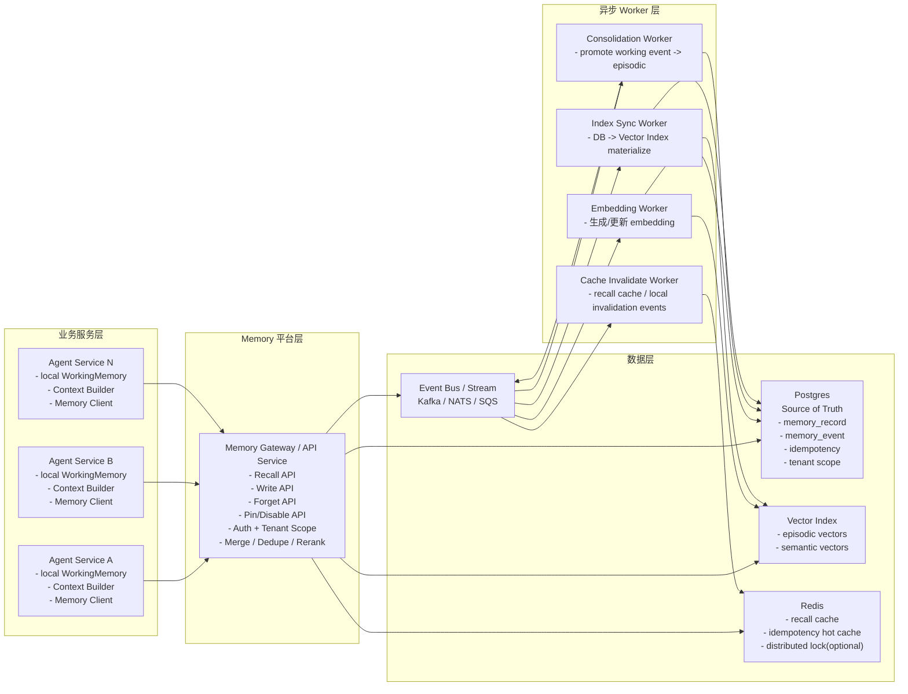

### 3.1 组件职责

#### Agent Service

- 保留本地 `WorkingMemory`。
- 保留 `context.Builder` 作为 prompt 组装器
  （`llm-agent/context/builder.go:11-17`
  `llm-agent/context/builder.go:48-56`）。
- 不直接操作长期记忆底库；共享记忆只能通过 `Memory Client` 调 `Gateway`。

#### Memory Gateway / API Service

- 对外唯一长期记忆入口。
- 统一处理 auth、tenant、scope、幂等、merge、dedupe、rerank。
- 不承担重离线任务；重计算交给 worker。

#### Worker 层

- `Embedding Worker`：异步生成 / 更新 embedding。
- `Consolidation Worker`：幂等地产生 episodic memory。
- `Index Sync Worker`：把业务真相层物化到向量索引。
- `Cache Invalidate Worker`：全局 recall cache 和本地缓存失效传播。

#### 数据层

- `Postgres`：业务真相源。
- `Vector Index`：检索加速层。
- `Event Bus`：解耦在线写请求与后台处理。
- `Redis`：recall cache、热幂等键、可选分布式锁。

---

## 4. API 组件拆分图

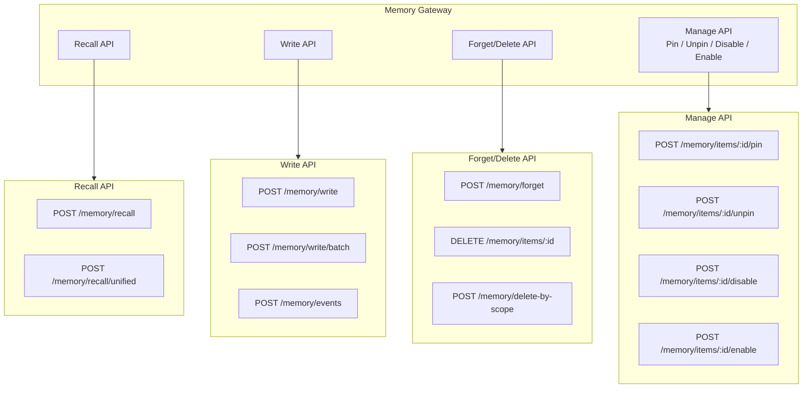

### 4.1 API 语义边界

- `Recall API`：
  - 只负责长期记忆召回。
  - 本地 `working` 仍由 agent 自己查。
- `Write API`：
  - 接收显式保存和 agent inferred 写入。
  - 要求 `idempotency_key`。
- `Forget/Delete API`：
  - 必须全局生效，不能只删某个实例本地缓存。
- `Manage API`：
  - `pin/unpin/disable/enable` 统一改共享层状态。

---

## 5. 在线写入路径

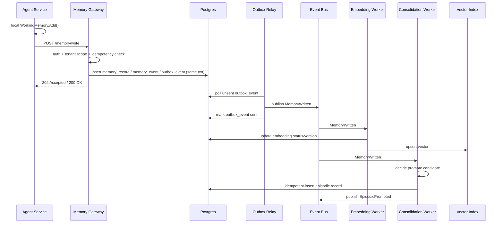

### 5.1 写路径原则

- 本地 `WorkingMemory` 仍然先写，追求单请求低延迟。
- 长期写入必须带 `idempotency_key`。
- `agent_inferred` 写入可以异步 embedding。
- `user_saved` 写入可以同步落业务真相层。
- `Consolidation` 只能由后台 worker 执行，不能让每个实例各跑一份本地
  `Manager.Consolidate`，因为当前实现是 copy promote，且没有全局幂等标记
  （`llm-agent/memory/manager.go:178-208`）。

#### `user_saved` 强约束

`user_saved` 不应沿用“先本地 working、后共享层异步确认”的弱语义。对显式保存
类操作，v1 建议提升为强约束：

1. 必须先成功提交共享真相源
2. 成功后才能向用户返回“已记住”
3. 本地 working 只能作为成功后的辅助缓存，而不是成功凭证

也就是说：

- `agent_inferred`
  - 可先本地、后共享层
- `user_saved`
  - 必须先共享层、后成功确认

### 5.2 写路径失败语义

这是当前多服务设计里最需要提前写死的部分。`Agent Service` 先写本地
`WorkingMemory`，再发起共享层写入，天然存在“本地已见、全局未落”的失败窗
口。

建议把本地 `WorkingMemory` 明确定义为：

- **非权威、短期、会话级缓存**
- 仅保证“当前实例、当前会话、当前请求附近”可见
- 不保证跨实例一致
- 不作为长期记忆的成功凭证

因此必须明确以下规则：

#### 规则 A：共享层写入失败时，本地 working 不得被解释为“全局已记住”

- 如果 `POST /memory/write` 返回失败、超时或未知状态：
  - 当前请求仍可继续使用本地 working 命中；
  - 但这条数据必须带上“未确认持久化”语义；
  - 后续请求不得默认依赖它存在于全局长期记忆。

#### 规则 B：显式保存与推断写入分开处理

- `user_saved`
  - 建议视为“用户承诺型写入”
  - Gateway 成功前，不应向用户宣称“已永久记住”
- `agent_inferred`
  - 允许失败后仅留在本地 working 一段时间
  - 可通过 TTL 自动淘汰

#### 规则 C：本地 working 必须是 session-scoped

- 一个 `WorkingMemory` 实例只服务一个明确的会话边界；
- 或者每条 working item 都必须带正式的
  `tenant_id/user_id/project_id/session_id`；
- 否则多租户并发复用同一实例时，本地 working 会成为第一个越权面。

### 5.3 Working → Episodic 晋升条件

`WorkingMemory` 与 `Episodic` 的边界必须显式定义，否则多服务实现时会出现：

- 重要推断事件永远只留在本地 working
- 后台 worker 过度 promote，导致长期记忆膨胀
- prompt 依赖 working，而长期 recall 里却拿不到同一事件

#### 基本原则

- `WorkingMemory`
  - 服务当前会话、当前实例、短期上下文
- `Episodic`
  - 存储跨请求、跨实例仍值得保留的事件性记忆

#### 决策表

| 条件 | 结果 | 说明 |
|---|---|---|
| 用户显式点击“记住” | 直接持久化并视为可 promote | 最高优先级 |
| 同类事件在短窗口内重复出现 `N` 次 | 候选 promote | 表示模式稳定 |
| 被多个 session 引用 | 候选 promote | 表示跨会话价值 |
| importance >= threshold | 候选 promote | 自动提升入口 |
| 仅单次低置信度 agent inferred | 保留在 working | 不进入长期记忆 |
| 已有相似 episodic 记录 | 不新建，转为 merge/update | 避免膨胀 |

#### 相似 episodic 判重规则

为了避免不同实现各自定义“相似”，v1 建议明确如下优先顺序：

1. **主键级判重**
   - 若存在相同 `memory_id`，直接 update，不新建
2. **语义槽位级判重**
   - 若 `tenant_id + user_id + category + normalized_content_hash` 一致，
     视为同一事件簇
3. **向量近似判重**
   - 仅作为增强项
   - 当 cosine similarity >= threshold 时，可进入 merge 候选

默认要求：

- **v1 必须实现前两层**
- **向量相似判重不是 v1 硬依赖**

#### 推荐 v1 规则

1. `user_saved`
   - 直接落共享层
   - 可同步标记为 episodic candidate
2. `agent_inferred`
   - 先进入 local working
   - 由 `Consolidation Worker` 决定是否 promote
3. `prompt` 组装
   - 当前请求需要的 inferred 事件，仍由 local working 提供给 LLM
   - 不要求等 promote 完成后才能进入 prompt

#### 推荐默认阈值

如果第一版还没有独立的产品策略配置，建议先采用保守默认值：

- `user_saved`
  - 直接持久化
  - 默认视为 `episodic candidate`
- `agent_inferred`
  - `importance >= 0.7` 时进入 promote 候选
  - 或 `24h` 内同 `category + normalized_content_hash` 重复出现 `>= 3` 次
  - 或被 `>= 2` 个不同 `session_id` 引用
- “同类事件”在 v1 默认定义为：
  - `tenant_id + user_id + category + normalized_content_hash`
- 向量近似判重：
  - 不作为 v1 promote 的硬前置条件
  - 仅作为 v2 可选增强

这些阈值应被视为**默认配置**，不是协议常量。上线前仍应支持按 tenant 或环境做调参。

这样可以保证：

- 当前会话不丢上下文
- 长期记忆不被瞬时噪声污染
- 共享 recall 不必依赖每个局部 working

### 5.4 推荐的失败状态机

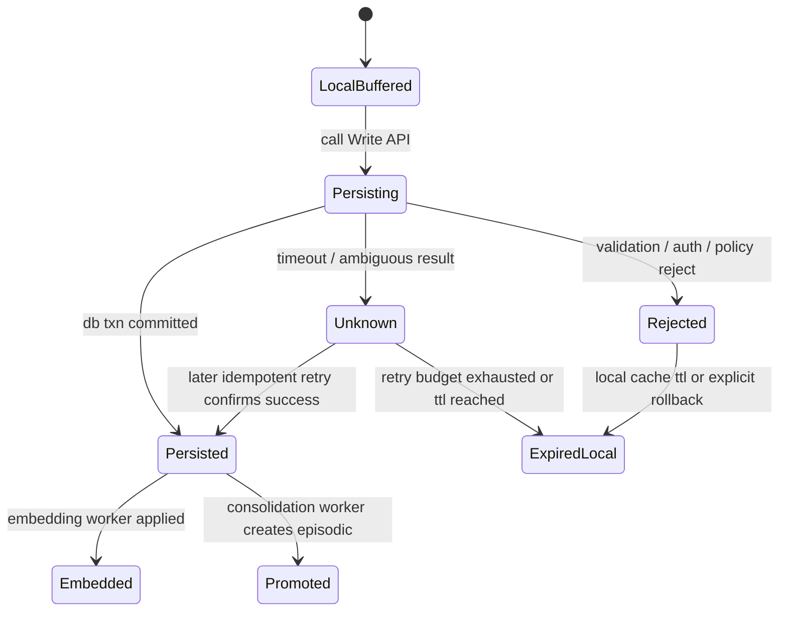

验收要求：

- 文档和 API 都要明确“成功记住”与“本地暂存”不是一个状态。
- 用户可见文案必须区分：
  - `saved`
  - `save_pending`
  - `save_failed`

---

## 6. 在线召回路径

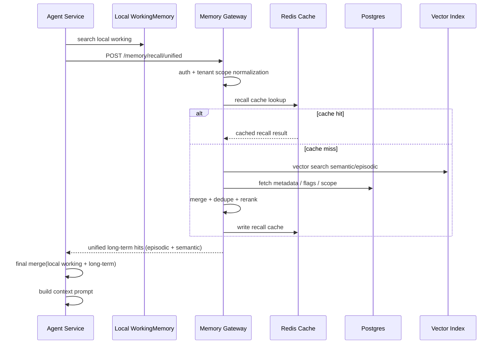

### 6.1 召回原则

- 本地 `working` 由 agent 自己查；这是实例内短期缓存。
- 长期 `episodic/semantic` 召回统一经过 `Gateway`。
- `Gateway` 负责 tenant 约束、去重、排序、metadata 过滤。
- `context.Builder` 继续只消费最终 `MemoryHits`，不需要知道底层查了几个服务
  （`llm-agent/context/builder.go:48-56`
  `llm-agent/context/builder.go:87-113`）。

#### 统一召回的边界

这里必须锁定一个明确边界，避免实现时出现双重 merge：

- `Gateway`
  - **只负责长期层**：`episodic + semantic`
- `Agent Service`
  - 查询本地 `working`
  - 将本地 `working hits` 与 `Gateway` 返回的长期 hits 做最终合并

也就是说：

- `Recall API / SearchUnified`
  - 在多服务架构下默认指 **长期层 unified recall**
- `working`
  - 不进入 Gateway 的统一排序主流程
  - 只在 agent 侧参与最后一步 merge

这样做的原因是：

- working 是实例本地、会话级、非权威缓存
- 把 working 也塞进 Gateway 会强迫 Gateway 理解每个实例的局部状态
- 这会直接破坏多服务边界

### 6.2 统一召回的排序约束

当前单服务源码里三类 memory 的 score 本来就不是同一量纲；在多服务架构里，
这里的统一排序特指 **长期层 unified recall**，即 `episodic + semantic` 的跨层
融合。`working` 只在 agent 侧做最终 merge。

长期层内部的 score 仍然不是同一量纲：

- `Working`：`vec + keyword + time_decay + importance`
- `Episodic`：`vec + recency + importance`
- `Semantic`：`vec + tag_overlap + importance`

对应实现见：

- `llm-agent/memory/working.go:155-164`
- `llm-agent/memory/episodic.go:68-72`
- `llm-agent/memory/semantic.go:67-70`

因此多服务 `Recall API` 不能只说“merge + dedupe + rerank”，还必须明确最小
排序策略。推荐 v1 约束如下：

1. **分源召回**
   - episodic / semantic 先各自取 `topN`
2. **去重**
   - 按 `memory_id` 优先
   - 回退到 `normalized_content + tenant scope`
3. **分层配额**
   - 最终 `topK` 里每层有最大占比，避免 working 或 semantic 单边吞掉结果
4. **归一化**
   - 各层原始 score 不直接跨层比较
   - 至少转成分层 rank 或 percentile 后再融合
5. **最终 tie-break**
   - `pinned > user_saved > semantic/episodic freshness > lexical tie`

随后在 agent 侧再做一轮轻量 merge：

- local working hits
- long-term unified hits

如果不写这些约束，统一召回的行为会漂移，后续很难调参与复现。

#### 排序风险提示

这里要明确：**Recall ranking 不是纯 infra 问题。**

即使已经具备：

- merge
- dedupe
- normalized score
- layer quota
- rerank

也仍然无法自动回答“什么记忆该进 prompt”。

真正困难的部分在于：

- relevance modeling
- memory salience
- temporal reasoning

这部分目前没有行业标准答案，因此 v1 必须采用**保守目标**：

1. 先追求“明显错误少、行为可解释”
2. 不追求一次性做出最优 recall ranking
3. prompt 预算紧张时，优先保证：
   - tenant 安全
   - delete/disable 可见性正确
   - user_saved 与 pinned 的稳定优先级
4. 更复杂的 learned rerank / salience model：
   - 只作为 v2+ 增强项
   - 不作为 v1 上线前置条件

一句话约束：

- **v1 的 recall ranking 目标是“可控、可解释、低事故”，不是“全局最优”。**

### 6.3 Token 预算贯通

当前 `context.Builder` 已经有 token budget，但多服务 recall 侧还没有真正理解：

- 当前请求剩余多少 prompt budget
- 允许 memory 占多少 budget

这会导致一个典型低效：

1. Gateway 返回很多“理论相关”的 memory
2. `context.Builder` 再在本地把它们大批裁掉
3. recall 成本已经花了，但 agent 实际没用上

因此 v1 建议增加最小贯通：

1. `Recall API` 允许携带：
   - `token_budget`
   - `memory_token_budget`
2. Gateway 返回 hits 时，至少带：
   - `token_cost_estimate`
3. 排序与裁剪时，优先保留：
   - 更可能进入 prompt
   - 更短但价值高
   - `user_saved` / `pinned`

一句话约束：

- **recall 不应只对 relevance 排序，还应对“是否放得进 prompt”负责。**

### 6.4 Session 生命周期

现在文档里已有 `session_id` 字段和 working TTL，但要让 agent 场景可控，还需要显
式会话生命周期语义。

建议最小流程：

1. session active
   - working 正常写入与查询
2. session heartbeat
   - 长会话续期 working 生命周期
3. session close
   - 显式结束会话
   - working 尽快过期或进入 promote 评估

第一版至少应支持两种结束模式：

- `expire_working`
  - 直接按 TTL / 过期流程清理
- `promote_and_expire`
  - 先按 promote 规则筛一次，再清理 working

一句话约束：

- **session 不能只有字段，没有结束与清理语义。**

---

## 7. Forget / Delete 路径

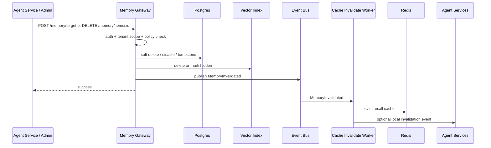

### 7.1 删除原则

- `Forget/Delete` 必须先作用于共享层。
- recall cache 必须全局失效。
- 本地 `WorkingMemory` 可以做最终一致的失效广播。
- “只删当前实例本地缓存”不算全局 forget。

### 7.2 更新操作的失效范围

不仅 `delete/forget` 需要失效，以下操作也必须触发 cache invalidation：

- `pin`
- `unpin`
- `disable`
- `enable`
- `content update`
- `importance update`
- `category/source/tags` 变更
- `embedding` 重建完成
- `consolidation promote`

原因：

- recall 结果不只依赖 content，还依赖 flags、scope、ranking metadata。
- 如果只在 delete 时失效，召回结果会长期返回过期排序或过期可见性。

### 7.3 Recall 缓存一致性保证等级

recall 结果缓存天然比对象缓存更脆弱，因为它绑定了一组结果和排序。必须明确
系统接受的不一致等级。

| 等级 | 语义 | 适用场景 |
|---|---|---|
| `Level 1 最终一致` | 依赖 TTL + event invalidation，可接受秒级延迟 | 普通聊天、非关键 recall |
| `Level 2 准强一致` | cache 记录 version，收到 invalidation 后尽快过期 | 用户资料、项目上下文 |
| `Level 3 强一致` | 关键写操作同步清理相关缓存后再返回 | `delete/forget`、敏感记忆移除 |

#### 默认推荐

- 普通 recall：`Level 1`
- `pin/unpin/disable/enable` 后的最近几秒：`Level 2`
- `delete/forget`：`Level 3`

#### `delete/forget` 的最低要求

如果用户刚删除一条记忆，然后立刻 recall，系统默认应满足：

- 不再返回这条记忆

因此对 `delete/forget` 建议：

1. 先更新 `Postgres`
2. 同步删除 / 标记失效相关 result cache
3. 再返回客户端成功

异步 invalidation worker 仍然保留，用于补偿和广播，但不能是唯一保障。

---

## 8. 数据层拆分图

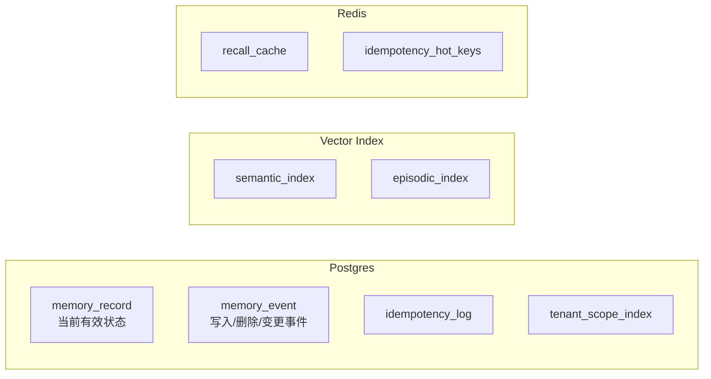

### 8.1 `Postgres` 建议字段

建议最少拥有下列一等字段，而不是继续全部塞进 `Metadata map[string]any`：

- `memory_id`
- `tenant_id`
- `user_id`
- `project_id`
- `session_id`
- `kind`
- `source`
- `category`
- `content`
- `tags`
- `importance`
- `pinned`
- `disabled`
- `created_at`
- `updated_at`
- `version`
- `idempotency_key`
- `consolidated_from_event_id`

原因：

- 当前 `Source/Category/Pinned/Disabled/Scope` 主要依赖 metadata 承载
  （`llm-agent/memory/memory.go:36-44`
  `llm-agent/memory/profile.go:45-54`
  `llm-agent/memory/scope.go:69-114`）。
- 这在单进程里足够灵活，但在多服务里不利于索引、权限、清理和审计。

### 8.2 真相源约束

- `Postgres`：业务真相源。
- `Vector Index`：仅做近邻检索加速。
- 向量索引回放失败时，系统仍可基于 `Postgres` 做补偿或重建。

### 8.2.1 Vector Index 可靠性约束

文档必须假设一个更现实的前提：不是所有向量库都能原生支持严格的版本约束。

#### 最低要求

无论具体选择哪种向量库，至少需要满足：

1. 支持按 `memory_id` 精确删除或覆盖
2. 支持 metadata filter，至少能按：
   - `tenant_id`
   - `user_id`
   - `project_id`
   - `disabled`
3. 支持把查询结果带回 `memory_id`

如果索引层无法稳定支持上述 filter，则必须退化为：

- 索引仅返回候选 `memory_id`
- 权限 / scope / disabled / delete 全部在 `Postgres` 侧强校验

#### 如果向量库支持版本字段

推荐：

- 在索引 entry 上带 `version`
- 查询结果返回 `memory_id + version`
- Gateway 用 version 做二次校验

#### 如果向量库不支持版本字段

备选方案：

1. 向量索引只返回候选 `memory_id`
2. `Gateway` 必须回源 `Postgres`
3. 在 `Postgres` 侧过滤：
   - `disabled`
   - `deleted`
   - `tenant scope`
   - `current version`
4. 对 stale candidate 做剔除

#### 候选集过采样约束

如果索引侧过滤能力不足，不能只查 `topK` 再做 DB side 过滤，否则会因为大量候选
被过滤而导致最终结果不足或漏召回。

因此 v1 建议：

- 对不支持强过滤/版本约束的索引，查询时至少做过采样：
  - `candidate_count = topK * M`
- 其中 `M` 由实现配置，建议初始 `M = 3 ~ 10`

然后：

1. 向量索引返回过采样候选
2. Gateway 在 `Postgres` 侧过滤：
   - tenant scope
   - disabled / deleted
   - current version
3. 再做最终裁剪到 `topK`

一句话约束：

- **DB side 过滤是兜底，不是“只查 topK 就够了”的理由**

#### 删除语义

推荐优先级：

1. `Postgres` 软删 / tombstone 为准
2. 向量索引尽快 hard delete 或 metadata hide
3. 即使索引删慢了，Gateway 仍必须靠 DB side 过滤兜底

一句话约束：

- **向量索引永远不是权限与可见性的最终判定层**

### 8.3 Transactional Outbox 约束

`memory_record` 与 `memory_event` 不能只是“同一请求里顺手都写一下”，必须有更强
约束：

#### 规则 A：业务状态与待发布事件必须同事务提交

推荐写法：

1. 在同一个数据库事务中：
   - 写 `memory_record`
   - 写 `memory_event`
   - 写 `outbox_event`
2. 事务提交后，由独立 relay 读取 `outbox_event`
3. relay 再把消息发布到 `Event Bus`
4. 发布成功后标记 `outbox_event.sent_at`

这样可以避免两类典型错误：

- DB 成功、MQ 失败：worker 永远收不到事件
- MQ 成功、DB 回滚：worker 收到幽灵事件

#### 规则 B：所有 worker 消费都必须可重放

- `Embedding Worker`
- `Consolidation Worker`
- `Index Sync Worker`
- `Cache Invalidate Worker`

都必须基于 event replay 安全重试。

#### 规则 C：消息至少一次投递，消费者幂等处理

这里不要假设 exactly-once。应当默认：

- MQ 至少一次投递
- worker 可能重复消费
- 幂等由 `idempotency_key + version + unique constraint` 保证

### 8.3.1 并发写冲突策略

多个 Agent Service 并发修改同一条 memory 时，必须定义冲突语义。

#### 默认策略

采用 **optimistic concurrency control**：

- 更新请求必须带 `expected_version`
- 只有当 `expected_version == current_version` 时允许更新

否则：

- 返回 `409 Conflict`
- 由调用方决定：
  - 重读后重试
  - 放弃
  - 告知用户状态已变化

#### 不建议的默认策略

- `Last-Write-Wins`

原因：

- 会吞掉用户或 agent 的中间更新
- 在 memory 这种用户态数据上过于隐蔽

#### 例外

可允许 LWW 的字段必须单独列明，例如：

- 统计字段
- hit_count
- last_access_at

而 `content/flags/source/category` 不应默认 LWW

---

## 8.4 版本竞争与旧事件复活

多服务 memory 最容易出现的线上 bug 之一，是“旧事件把新状态复活”。典型场景：

1. `MemoryWritten(v1)` 入队
2. 用户立刻 `disable/delete(v2)`
3. 老的 embedding / consolidation worker 晚到
4. worker 按 `v1` 重写 vector 或重新 promote

因此必须增加版本约束：

#### 规则 A：`memory_record.version` 单调递增

- 每次状态更新都 bump version：
  - content
  - flags
  - delete/disable
  - pin/unpin

#### 规则 B：worker 落库必须比较 version

- 只有当 event.version == current.version 时，才允许：
  - upsert vector
  - promote episodic
  - 刷新 recall cache

否则：

- 事件标记为 stale
- 不得覆盖当前状态

#### 规则 C：向量索引记录也要带版本

- 否则 DB 已删除 / disable，旧 vector 仍可能在索引里命中。

### 8.5 约束图：状态、事件、索引

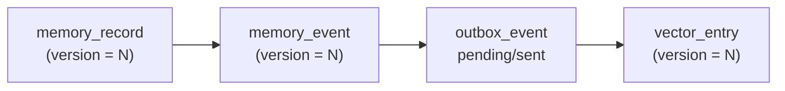

一致性规则：

- `memory_record` 是主状态
- `memory_event` 是变化事实
- `outbox_event` 是可靠投递桥
- `vector_entry` 必须服从 `memory_record.version`

---

## 9. Hot Memory Cache 设计

“召回比较高的记忆是否可以做内存缓存”的答案是：**可以，但缓存对象必须重新定
义**。

不建议直接采用“单次召回 score 高就进缓存”的策略。更合适的缓存对象是：

1. **热记忆对象**
   - 某条 `memory_record` 被频繁命中
2. **热召回结果**
   - 某个 query + scope 组合被频繁重复查询
3. **高构建成本结果**
   - 回源 DB + 向量检索 + merge/rerank 成本高

### 9.1 为什么可行

这个设计符合经典 `cache-aside` 适用条件：

- 读多写少
- 可接受轻微陈旧
- 缓存失效后可回源主存储

对本系统而言：

- `memory_record` 元数据天然适合缓存
- recall 结果在热点 query 场景下也适合缓存
- 但缓存不能成为业务真相源

### 9.1.1 Memory Explosion 风险

memory 系统的长期风险不是“存不进去”，而是“越存越差”。

必须预设以下问题一定会发生：

- semantic duplication
- memory drift
- stale memory
- hallucinated memory

最终表现通常不是可用性故障，而是：

- recall precision 持续下降
- prompt 被低价值旧记忆占满
- 用户开始看到“像是记住了，但其实记错了”的结果

因此 v1 必须坚持：

1. promote 要保守
2. dedupe 要先于扩容
3. `disabled/deleted/stale` 必须可见性收敛
4. hallucinated `agent_inferred` 不得自动获得和 `user_saved` 同等级的长期权重

设计结论：

- **memory explosion 是 precision 风险，不只是容量风险**
- 相关治理应优先于“多加几层 recall ranking”

### 9.1.2 Embedding 成本约束

真正上线后，embedding 往往是 memory 平台最大的持续成本之一。

因为以下动作都可能触发重 embedding：

- create
- update
- merge
- rewrite
- promote

如果不提前约束，系统很容易在功能没问题时先被成本击穿。

因此建议把 embedding 策略分层：

#### v1 最低要求

- `agent_inferred` 默认允许 delayed embedding
- `user_saved` 只在确有 recall 价值时做 embedding
- `merge/update` 不得默认立刻重 embedding 全量内容
- worker 必须避免“每次小改都重做一次完整 embedding”

#### 推荐优化方向

- lazy embedding
- delayed embedding
- tiered embedding
- chunk-level embedding

一句话约束：

- **embedding 是成本面，不是免费副作用；v1 设计必须把“少 embed”当成显式目标。**

### 9.2 不应该缓存什么

以下几类内容不建议直接作为第一版缓存对象：

- **只因为某次 score 高就缓存**
  - 单次高分不等于长期热数据
- **跨租户共享 recall 结果**
  - memory 是强用户态数据，跨 tenant 结果缓存有越权风险
- **未带版本信息的对象**
  - 容易被旧状态污染

### 9.3 两级缓存结构

推荐采用两级缓存：

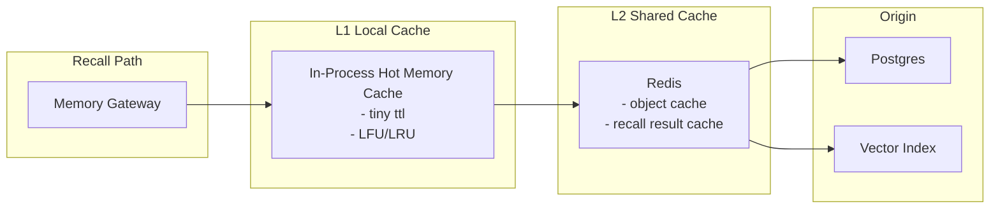

#### L1：本地进程内缓存

适合缓存：

- 热 `memory_record`
- 少量热 recall 结果

特点：

- 延迟最低
- 容量小
- TTL 短
- 实例间不一致可接受

#### L2：共享 Redis 缓存

适合缓存：

- `memory_id -> memory_record`
- `query fingerprint -> recall result ids`

特点：

- 多实例共享
- 适合作为主缓存层
- 仍然不是权威真相源

### 9.4 推荐缓存对象

#### 对象缓存

key 示例：

- `memory:{tenant_id}:{memory_id}`

value 建议至少包含：

- `memory_id`
- `tenant_id`
- `user_id`
- `project_id`
- `kind`
- `content`
- `tags`
- `importance`
- `pinned`
- `disabled`
- `source`
- `category`
- `version`

用途：

- 避免 recall 阶段频繁回源查 metadata
- 加速 pin/disable/source/category 等过滤逻辑

#### 结果缓存

key 示例：

- `recall:{tenant_id}:{user_id}:{project_id}:{query_hash}:{top_k}`

value 建议至少包含：

- `result_ids`
- `result_versions`
- `query_hash`
- `scope_fingerprint`
- `generated_at`

用途：

- 命中高频重复 recall 请求
- 减少 DB + vector index + merge/rerank 成本

### 9.5 准入策略

不建议“命中一次高分即缓存”。推荐准入策略如下。

#### 对象缓存准入

满足任一即可：

- `hit_count >= N`
- `pinned == true`
- `source == user_saved`
- `rebuild_cost high`
- 被多个 query 重复命中

#### 结果缓存准入

建议同时满足：

- query 重复率高
- scope 稳定
- topK 结果稳定
- 可接受秒级到分钟级陈旧

### 9.6 淘汰策略

第一版推荐：

- L1：`LRU` 或 `LFU`
- L2：优先 `LFU`

理由：

- 热记忆对象往往呈明显头部集中
- LFU 比单纯 LRU 更适合保留“长期常用”的 memory

### 9.6.1 WorkingMemory 生命周期策略

本地 working 不能无限增长，也不能因为 TTL 太短把长对话上下文提前清掉。

#### 推荐默认策略

- 默认 TTL：`30m`
- session 结束：立即清理
- 会话活跃期间：访问续期
- 未确认持久化的本地写入：
  - `save_pending` 默认保留 `5m`
  - 超过重试预算仍未确认时转为 `save_failed`
- 已确认 `save_failed` 的本地项：
  - 默认再保留 `1m`，随后淘汰
- 默认最大重试次数：`3`

#### 长 session 场景

如果对话持续数小时：

- working 不应只靠绝对 TTL
- 应结合：
  - 最近访问时间
  - item 数量上限
  - importance

#### 手动延长生命周期

允许以下操作触发长期保留：

- `save`
- `pin to episodic`
- `user_saved`

也就是说：

- working 的职责是短期记忆
- 真正需要长时间保留的内容，应显式 promote 到 episodic

#### 建议的本地状态字段

如果 `Agent Service` 需要把“本地已见但全局未确认”的状态显式暴露给上层，建议
working item 至少携带：

- `persistence_status`
  - `saved`
  - `save_pending`
  - `save_failed`
- `last_persist_attempt_at`
- `retry_count`
- `expires_at`

### 9.7 失效矩阵

缓存失效不能只覆盖 `delete/forget`。下列操作都应导致相关缓存对象或结果失
效：

| 操作 | 对象缓存 | 结果缓存 |
|---|---|---|
| `delete` / `forget` | 必失效 | 必失效 |
| `disable` / `enable` | 必失效 | 必失效 |
| `pin` / `unpin` | 必失效 | 必失效 |
| `content update` | 必失效 | 必失效 |
| `importance update` | 必失效 | 建议失效 |
| `tags/category/source` 更新 | 必失效 | 必失效 |
| `embedding` 重建 | 可保留对象 | 建议失效 |
| `consolidation promote` | 可保留对象 | 建议失效 |

### 9.8 版本校验

缓存内容必须带 `version`。

规则：

1. 回源对象写入缓存时，带上 `memory_record.version`
2. recall 结果缓存至少带上每个 result 的 version 快照
3. 命中结果缓存后，如果系统已知相关 memory 的 version 变化，则直接失效
4. worker 写回 vector 或 promote 结果时，也要比较 version，避免旧状态复活

### 9.9 Memory Gateway 缓存命中 / 回源流程

#### 目标

在 `Recall API` 上，缓存的目标不是替代主存储，而是减少以下成本：

- `Redis miss -> Postgres metadata fetch`
- `Redis miss -> Vector Index query`
- `merge / dedupe / rerank`

同时必须保证：

- cache 失效后可完整回源
- cache 陈旧时不能越权或返回已删除内容
- 热 key 失效时不会击穿主存储

#### 正常命中路径

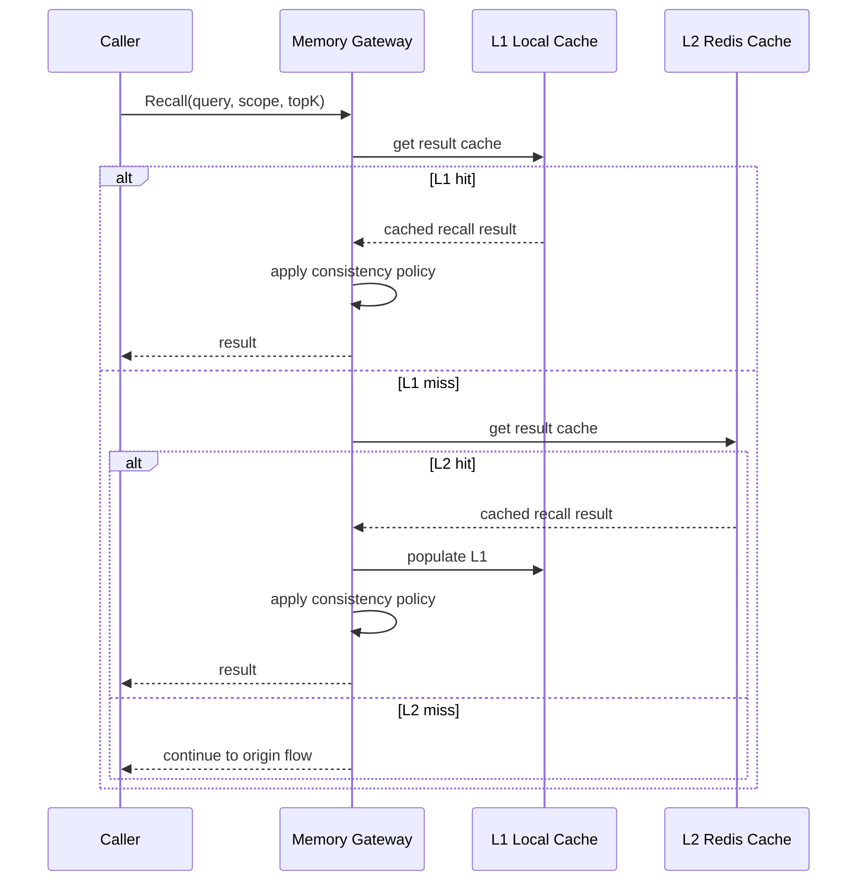

#### 回源路径

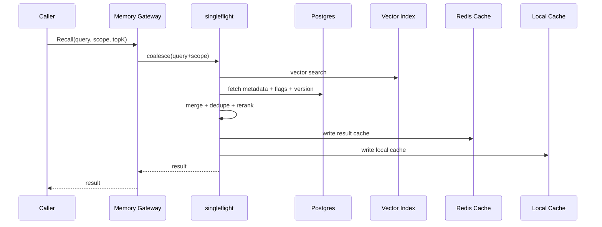

#### Stale fallback 路径

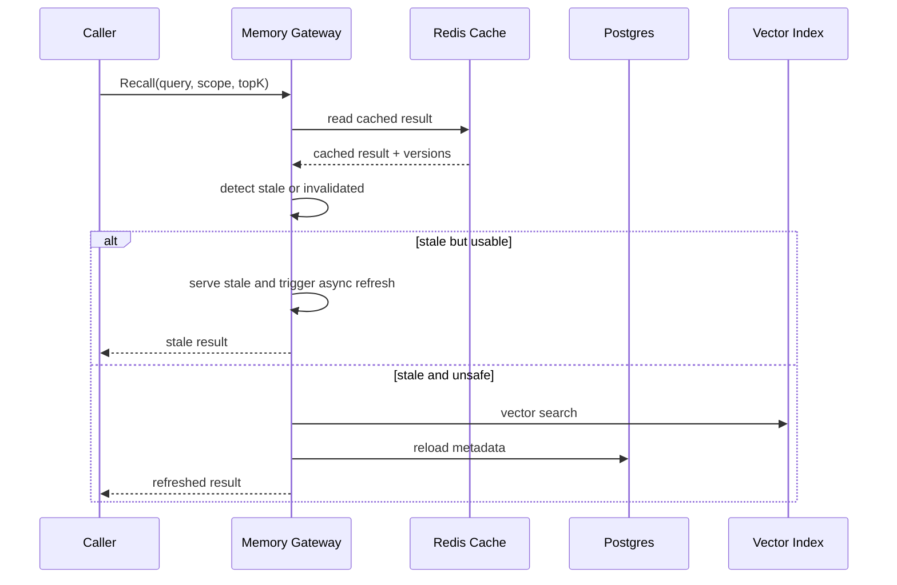

#### 推荐规则

##### 规则 A：先查结果缓存，再查对象缓存

顺序建议：

1. `L1 recall result cache`
2. `L2 recall result cache`
3. `Vector Index + Postgres`
4. 写回 `L2`
5. 回填 `L1`

原因：

- 结果缓存命中收益最大
- 命中对象缓存但 miss 结果缓存时，仍然要做 merge/rerank

##### 规则 B：回源构建必须 singleflight

对同一个 `(tenant, user, project, query_hash, topK)`：

- 同一时刻只允许一个回源构建
- 其他请求等待同一个结果

否则热 key 过期时会直接打爆：

- `Vector Index`
- `Postgres`
- `Gateway CPU`

##### 规则 C：结果缓存命中后仍需做最小安全校验

至少校验：

- tenant / scope fingerprint 一致
- cache entry 未过 TTL
- entry 未命中失效标记

如果是强安全场景，还应校验：

- 结果里的 `version snapshot` 没被新版本覆盖

##### 规则 C-1：一致性等级决定命中后是否直接返回

- `Level 1`
  - 命中后可直接返回
- `Level 2`
  - 命中后需做 version / invalidation 校验
- `Level 3`
  - 关键路径可直接 bypass result cache
  - 或命中后必须做同步强校验

##### 规则 C-2：一致性等级约束 stale fallback

- `Level 1`
  - 允许 stale fallback
- `Level 2`
  - 仅在版本未变化且未命中 invalidation 时允许 stale fallback
- `Level 3`
  - **禁止 stale result cache fallback**
  - 必须回源或同步强校验

##### 规则 D：结果缓存与对象缓存可以分层失效

- `result cache`
  - 更容易失效
  - TTL 更短
- `object cache`
  - TTL 可略长
  - 命中后仍能帮助回源重建 recall

#### 推荐 TTL

第一版建议保守配置：

- `L1 object cache`: `10s - 60s`
- `L2 object cache`: `1m - 5m`
- `L1 result cache`: `5s - 30s`
- `L2 result cache`: `30s - 2m`

说明：

- 以上 TTL 仅是 **示例默认值**
- 不是协议常量，也不是产品承诺
- 真实取值应结合：
  - recall QPS
  - 可接受陈旧窗口
  - invalidation 实时性

不要把 recall result cache TTL 拉太长，否则排序和可见性会明显漂移。

#### 命中 / 回源指标

`Memory Gateway` 至少应暴露：

- `recall_l1_hit_total`
- `recall_l2_hit_total`
- `recall_origin_total`
- `recall_stale_served_total`
- `recall_singleflight_shared_total`
- `recall_build_latency_ms`
- `recall_cache_fill_total`
- `recall_invalidation_total`

这些指标缺一不可，否则你无法判断：

- 缓存是否真的有效
- 是否存在热点击穿
- stale fallback 是否失控

### 9.10 风险与约束

#### 风险 A：热点 key 击穿

- 热 key 过期时，大量请求同时回源

缓解：

- singleflight / request coalescing
- 热 key 提前刷新

#### 风险 B：缓存与主存储不一致

- 本地缓存和共享缓存都可能短暂陈旧

缓解：

- TTL + event invalidation 双保险
- 严格以 `Postgres` 为真相源

#### 风险 B-1：Redis 宕机或部分失效

必须明确缓存故障下的降级行为：

| 故障 | 影响 | 恢复 |
|---|---|---|
| Redis key 过期 | 回源变慢 | TTL + 主动刷新 |
| Redis 单 key 热点失效 | 局部击穿 | singleflight + 提前刷新 |
| Redis 全量宕机 | 所有请求回源 | 自动降级到 DB / Vector Index |
| 缓存与 DB 不一致 | 看到旧数据 | TTL / invalidation / version check |

#### Redis 故障降级原则

1. Redis 不可用时，Gateway 必须仍可回源：
   - `Postgres`
   - `Vector Index`
2. Redis 不可成为 recall 的硬依赖
3. Redis 恢复后可通过自然回填或主动预热恢复热点 key

#### 版本变化感知

recall 阶段若要知道相关 memory 是否发生了 version 变化，至少有三种方案：

1. invalidation event 直接带 `memory_id + new_version`
2. result cache 内带 version snapshot，命中后抽样或按需比对
3. 高频敏感路径直接绕过 result cache

第一版推荐：

- 事件驱动失效为主
- version snapshot 为辅
- 敏感路径允许 bypass cache

#### 风险 C：跨租户数据污染

- key 设计不完整会把别的 tenant 结果命中回来

缓解：

- cache key 必须至少带：
  - `tenant_id`
  - `user_id`
  - `project_id`
  - 视场景加 `session_id`

#### 风险 D：Gateway 过载

文档还必须定义非功能降级策略，否则所有一致性设计在高负载下都可能失效。

推荐最低要求：

- 支持限流
- 支持 read-only 模式
- 支持慢查询超时
- 支持 local working fallback

### 9.10.1 非功能需求与降级策略

建议明确：

- 目标 QPS
- P95 / P99 延迟
- recall 超时预算
- 写请求超时预算

#### 限流策略

推荐：

- Gateway 入口按 tenant / user / endpoint 做令牌桶限流

#### 读写降级

- `write path`
  - 可进入 `read-only mode`
  - 返回明确错误，不接受静默丢写
- `recall path`
  - 长期 recall 超时时，可退化到：
    - local working
    - 最近一次可用 recall cache

#### fallback 语义

当共享 recall 故障时：

- 本地 `WorkingMemory` 可以作为有限 fallback
- 但必须明确告知这是“局部上下文可用”，不是“全局长期记忆可用”

#### 与一致性等级的关系

- `Level 1`
  - 可退化到最近一次可用 recall cache
- `Level 2`
  - 可退化，但必须经过 version / invalidation 约束
- `Level 3`
  - 不得退化到 stale recall result cache
  - 只能：
    - 回源共享真相层
    - 或返回“当前无法安全确认长期记忆状态”

### 9.11 验证优先的实施顺序

这里需要明确降复杂度原则：

- 第一版最重要的不是把 recall cache 和一致性层做满
- 而是先验证：
  - Recall Quality
  - Promote 策略
  - Memory 生命周期
  - Embedding / 存储成本模型

建议顺序改为：

1. 先落最小真相源与最小写入链路：
   - `memory_record`
   - `memory_event`
   - `outbox_event`
2. 先做最小长期 recall：
   - 向量候选
   - DB side 过滤
   - 保守 merge/rerank
3. 先观测 recall 是否“对 prompt 真有帮助”
4. 再观测 promote 是否造成膨胀或漂移
5. 再观测 working / episodic / semantic 的生命周期是否合理
6. 最后才决定是否值得引入更复杂的缓存与一致性优化

一句话总结：

- **先验证记忆是否好用，再优化架构复杂度**

### 9.12 v1 最小闭环与可延期项

为了控制第一版复杂度，建议把多服务 memory 明确拆成“v1 必须实现”和“后续增强”。

#### v1 必须实现

- `Postgres` 真相源表：
  - 至少包含 `tenant_id/user_id/project_id/session_id`
- `Memory Gateway` 基础 API：
  - `write`
  - `recall/unified`
  - `patch`
  - `pin`
  - `disable`
  - `delete`
- `Transactional Outbox`
- `idempotency_key`：
  - Redis 热缓存 + Postgres 冷记录
- 多租户边界强校验：
  - auth 提取的 `tenant/user` 必须覆盖客户端输入
- `singleflight / request coalescing`
- `Consolidation Worker` 幂等处理
- promote 判重的前两层：
  - `memory_id`
  - `tenant_id + user_id + category + normalized_content_hash`
- 最小观测指标：
  - `recall_origin_total`
  - `recall_selected_total`
  - `promote_attempt_total`
  - `promote_accepted_total`
  - `working_expired_total`
  - `embedding_cost_total`

#### v1 验证目标

在决定是否增加更多缓存、更多 rerank 或更多 worker 之前，至少要能回答：

1. Recall Quality
   - 召回结果里，最终真正进入 prompt 的比例是多少
   - 被 agent 或产品逻辑判为“无帮助”的比例是多少
2. Promote 策略
   - promote 命中率是多少
   - promote 后的记忆在后续 recall 中是否真的被使用
3. 生命周期
   - working item 多久过期最合适
   - promote 后是否出现 stale / drift / 重复膨胀
4. 成本模型
   - 每 1000 次写入触发多少次 embedding
   - 单条长期 memory 的平均存储与索引成本是多少

#### v1 验证方法

为了避免“指标很多，但仍然不知道记忆是否有用”，建议只保留最小验证闭环。

##### A. Recall Quality 验证

目标不是评估“召回分数高不高”，而是评估：

- 召回结果是否真的进入 prompt
- 进入 prompt 后是否真的对回答有帮助

建议至少记录：

- `recall_returned_total`
  - Gateway 返回的长期 hits 数量
- `recall_selected_total`
  - 最终被 agent/context 选进 prompt 的数量
- `recall_dropped_total`
  - 被丢弃的数量
- `recall_helpful_total`
  - 被标记为“对回答有帮助”的数量
- `recall_unhelpful_total`
  - 被标记为“无帮助 / 干扰”的数量

建议计算的核心比率：

- `selection_rate = recall_selected_total / recall_returned_total`
- `helpful_rate = recall_helpful_total / recall_selected_total`

若以下情况长期存在，说明 recall quality 有问题：

- 返回很多，但大部分进不了 prompt
- 进了 prompt，但大部分被评为无帮助
- user_saved 与 pinned 的 helpful rate 并不高于普通 inferred memory

##### B. Promote 策略验证

目标是判断 promote 是否真的把“值得长期保留”的内容送进长期层，而不是制造噪声。

建议至少记录：

- `promote_attempt_total`
- `promote_accepted_total`
- `promote_rejected_total`
- `promoted_recalled_total`
  - promote 后在后续 recall 中再次命中的次数
- `promoted_selected_total`
  - promote 后最终再次进入 prompt 的次数

建议关注两个问题：

1. promote 后的记忆，后续是否真的再次被 recall
2. 被 recall 后，是否真的进入 prompt

若大量 promoted memory 从未再次被使用，说明 promote 阈值偏松。

##### C. 生命周期验证

目标是验证 working / episodic / semantic 的保留时间是否合理。

建议至少记录：

- `working_expired_total`
- `working_promoted_total`
- `working_dropped_before_use_total`
- `episodic_disabled_total`
- `episodic_deleted_total`
- `memory_stale_hit_total`

建议重点看：

- working 是否在真正被用到前就过期
- episodic 是否长期堆积但很少再次被使用
- stale memory 是否仍频繁进入 recall

#### P1 保守衰减模型

当前文档已有 TTL / forget / promote，但还没有一个明确的“长期不用就逐步降权”算法。
这会让 memory 很容易只增不减。

v1/P1 不建议直接做复杂 learned decay，先采用保守规则即可：

- 基础衰减因子：
  - recency 越旧，权重越低
- 使用反馈修正：
  - 长期未被 recall / selected 的 memory，importance 逐步下调
- 用户显式保留修正：
  - `pinned`
  - `user_saved`
  - 默认衰减更慢

建议第一版只回答两个问题：

1. 哪些 memory 长期不用，应降低 recall 优先级
2. 哪些 memory 长期不用，应进入 forget / disable 候选

一句话约束：

- **衰减模型先做简单、可解释、可调参，不做黑盒学习模型。**

##### D. 成本模型验证

目标不是做精确财务系统，而是尽快知道 memory 方案是否会被 embedding 和存储成本拖垮。

建议至少记录：

- `embedding_request_total`
- `embedding_applied_total`
- `embedding_tokens_total`
- `embedding_cost_total`
- `memory_storage_bytes_total`
- `vector_storage_bytes_total`

建议先回答四个问题：

1. 每 1000 次 write 会触发多少次 embedding
2. 每次 promote 平均带来多少额外 embedding 成本
3. 每条长期 memory 的平均存储体积是多少
4. inferred memory 的单位成本是否明显高于其长期价值

#### v1 验证结论门槛

第一版不必一开始就写死绝对阈值，但至少应要求团队在灰度阶段给出以下结论：

1. Recall 是否“多数情况下比不带 memory 更有帮助”
2. Promote 是否“多数情况下没有制造长期噪声”
3. 生命周期是否“没有明显过早过期或明显长期膨胀”
4. 成本是否“在预期流量下可接受”

如果这四个问题还无法回答，就不应继续优先扩展：

- 更复杂的 recall cache
- 更复杂的 rerank
- 更复杂的 consistency 层

#### 可延后到 v2 或灰度后增强

- 向量近似判重参与 promote 决策
- 逐项 version snapshot 的强校验优化
- 热 key 提前刷新
- 更复杂的 merge 策略
- 全量 `Level 2 / Level 3` 读路径优化
- recall 结果缓存分层细化

---

## 10. 和当前代码的映射关系

### 10.1 可以复用的部分

- `MemoryItem` 的基础概念与 `Source/Category/Pinned/Disabled` 语义
  （`llm-agent/memory/memory.go:33-44`
  `llm-agent/memory/profile.go:12-54`）。
- 本地 `WorkingMemory`
  （`llm-agent/memory/working.go:18-34`）。
- `context.Builder` 作为最终 prompt 组装层
  （`llm-agent/context/builder.go:11-17`
  `llm-agent/context/builder.go:76-113`）。

### 10.2 不应直接复用的部分

- 本地 `Manager` 作为“全局共享记忆协调器”
  （`llm-agent/memory/manager.go:12-35`）。
- 本地 `Consolidate`
  （`llm-agent/memory/manager.go:178-208`）。
- `ScopedManager` 作为真正多租户边界
  （`llm-agent/memory/scoped_manager.go:12-17`
  `llm-agent/memory/scoped_manager.go:128-144`）。
- `FilesystemStore` 作为在线共享存储
  （`llm-agent/memory/persistence.go:178-247`）。

---

## 11. 实施顺序建议

1. 保留当前本地 `WorkingMemory` 不动。
2. 先落 `Memory Gateway / API Service`。
3. 把长期 `Episodic/Semantic` 写入迁到共享层。
4. 增加 `Recall API`，统一长期召回。
5. 把 `scope` 升级为正式 `tenant/user/project/session` 字段。
6. 先验证 recall / promote / lifecycle / cost 四项指标。
7. 只有当验证表明“记忆本身有效”后，再补：
   - `Consolidation Worker`
   - recall cache
   - 更复杂的 merge / rerank / consistency 优化

---

## 12. 设计约束总结

- `WorkingMemory` 不共享，只做本地短期缓存。
- `Episodic/Semantic` 必须共享。
- `Gateway` 是唯一长期 memory 入口。
- `Consolidation` 只能由 worker 执行。
- `Scope` 必须升级为正式租户字段。
- `Postgres` 是真相源，向量索引只是加速层。
- 业务状态与事件发布之间必须走 Transactional Outbox。
- 所有异步 worker 默认至少一次消费，靠幂等与版本控制兜底。
- 统一召回必须显式定义跨层 merge / dedupe / rerank 约束。
- 本地 working 是非权威缓存，不能被解释为“全局已记住”。

## 13. 当前设计对 Agent 的适配度判断

如果只从“多服务 memory 平台”角度看，当前设计对 AI Agent 的适配度并不低；但若从
“能否稳定提升 agent 推理质量”角度看，仍然只算 **中等可用**。

这里需要避免两个常见误判：

1. 不要把“基础设施已经完整”误判成“agent 体验已经完整”
2. 也不要把“部分能力还没贯通”误判成“完全缺失”

### 13.1 已具备或已有基础的能力

- 向量/语义召回：
  - 多服务文档已完整定义长期 recall 主路径
- 多租户隔离：
  - 方向正确，且已经明确 `DB side enforce`
- 异步处理：
  - `Embedding / Consolidation / Index Sync` 已有清晰职责拆分
- Token 预算基础能力：
  - 当前 `context.Builder` 已有 `MaxTokens`、`ReserveRatio`、`Selected`、
    `UsedTokens`、`DroppedCount`
  - 但这些能力还没有反向约束多服务 recall 的返回策略
- 遗忘基础能力：
  - 当前 SDK 已有 `ForgetByImportance / Age / Capacity`
  - 但多服务长期层还没有形成完整的生命周期治理闭环
- 会话隔离基础能力：
  - 当前模型里已有 `session_id` / `Session` 概念
  - 但多服务侧仍需把它从“字段存在”推进到“生命周期与 recall 语义真正使用”

### 13.2 真正成立的 Agent 缺口

当前更值得关注的不是“有没有 embedding / cache / worker”，而是以下四类 agent
侧缺口：

#### A. Token-aware recall 尚未闭环

现状：

- `context.Builder` 会在 prompt 组装阶段按 token budget 做裁剪
- 但 `Recall API` 还没有显式理解：
  - prompt 剩余预算
  - memory 预算上限
  - 不同 memory hit 的 token 成本

风险：

- recall 返回很多，最终大多在 context 侧被截掉
- 看起来 recall 很努力，实际上对 agent 没帮助

结论：

- 这不是“token 能力完全缺失”
- 而是“**token budget 还没有贯穿 recall → select → prompt 全链路**”

#### B. 生命周期治理还不够 agent-native

现状：

- 已有 working TTL、forget、promote、delete/disable 等机制
- 但还缺少一套明确的：
  - 何时该忘
  - 哪些 inferred memory 应尽快过期
  - 哪些 promoted memory 长期无用应回收

风险：

- 记忆长期膨胀
- stale memory 长期干扰 recall

结论：

- 这不是“完全没有遗忘”
- 而是“**有删除/forget 能力，但缺少真正面向 agent 效果的生命周期治理**”

#### C. 决策可解释性仍然不足

现状：

- 当前 `context.Builder` 已能产出 `Selected` 和 `DroppedCount`
- 文档也已要求验证：
  - returned
  - selected
  - helpful

但仍缺：

- 为什么某条 memory 被 recall
- 为什么它最后没进 prompt
- promote 为什么接受/拒绝

风险：

- 调 recall/prompt 时只能猜
- 用户和开发者都难以信任系统行为

结论：

- 这不是“完全没有 trace”
- 而是“**缺少可用于调参与解释的 memory decision trace**”

#### D. 对话学习闭环仍然偏弱

现状：

- 当前设计能写入 `user_saved` 与 `agent_inferred`
- 也能定义 promote 规则

但还没有把以下闭环做实：

- 哪些 recalled memory 真正帮助了回答
- 哪些 promoted memory 后续完全没价值
- 哪些 inferred memory 经常被用户否定

结论：

- 当前系统更像“可存储的 memory 平台”
- 还不是“会根据对话效果持续校正的 learning memory system”

### 13.3 收敛后的 v1 改造重点

如果目标是让系统更符合 AI Agent，而又不继续堆架构复杂度，v1 最值得补的是：

1. token-aware recall 输入
   - recall 请求可显式携带剩余 token budget 或 memory budget
2. memory decision trace
   - 至少记录：
     - recalled
     - selected
     - dropped
     - promote accepted/rejected
3. 生命周期验证闭环
   - stale / expired / recalled-again / dropped-before-use
4. 成本闭环
   - embedding request / applied / cost / storage bytes

一句话总结：

- **当前最缺的不是更多基础设施，而是把已有 memory 能力真正接到 agent 决策闭环里。**

### 13.4 `memory decision trace` 最小模型

这里不建议一开始做复杂审计平台。v1 只需要一套最小、可落库、可用于调参与解释
的 decision trace。

#### 最小对象模型

每次 recall / select / promote 相关决策，建议至少产出以下字段：

| 字段 | 说明 |
|---|---|
| `trace_id` | 一次 memory 决策链路的唯一标识 |
| `request_id` | 对应上层请求 ID |
| `tenant_id` | 租户边界 |
| `user_id` | 用户边界 |
| `project_id` | 项目边界，可空 |
| `session_id` | 会话边界，可空 |
| `memory_id` | 被评估的 memory |
| `stage` | `recalled` / `selected` / `dropped` / `promote_decided` |
| `reason` | 本次决策原因 |
| `score` | recall 或 select 阶段的分数，可空 |
| `token_cost` | 该 memory 进入 prompt 的 token 成本，可空 |
| `version` | 对应 memory 版本 |
| `created_at` | 决策时间 |

#### 最小 reason 枚举

v1 不要做开放式自由文本，先约束成有限枚举，便于统计。

##### recall / select 阶段

- `selected_relevance_high`
- `selected_pinned`
- `selected_user_saved`
- `dropped_low_relevance`
- `dropped_token_budget`
- `dropped_duplicate`
- `dropped_disabled`
- `dropped_deleted`
- `dropped_scope_filtered`

##### promote 阶段

- `promote_user_saved`
- `promote_importance_threshold`
- `promote_repeated_event`
- `promote_cross_session`
- `reject_low_importance`
- `reject_single_low_confidence`
- `reject_duplicate_cluster`

#### reason 对照表

| reason | 触发条件 | 用途 |
|---|---|---|
| `selected_relevance_high` | relevance / rank 足够高，且预算允许 | 说明该 memory 因相关性被保留 |
| `selected_pinned` | `pinned == true` 且未被可见性规则过滤 | 说明该 memory 因显式保留被优先选中 |
| `selected_user_saved` | `source == user_saved` 且满足最小选择条件 | 说明该 memory 因用户显式记住被优先选中 |
| `dropped_low_relevance` | relevance 低于当前最小阈值 | 说明 recall 命中但价值不足 |
| `dropped_token_budget` | 在当前 token / memory budget 下放不进 prompt | 说明是预算约束而非语义无关 |
| `dropped_duplicate` | 与已选 memory 重复或高度重叠 | 说明被 dedupe 裁掉 |
| `dropped_disabled` | memory 已被 disable | 说明被可见性规则裁掉 |
| `dropped_deleted` | memory 已被 delete / tombstone | 说明被删除语义裁掉 |
| `dropped_scope_filtered` | 不满足 tenant / user / project / session 边界 | 说明被作用域规则裁掉 |
| `promote_user_saved` | 用户显式保存或显式要求记住 | 说明 promote 由用户意图直接触发 |
| `promote_importance_threshold` | `importance >= threshold` | 说明 promote 由重要性阈值触发 |
| `promote_repeated_event` | 同类事件在窗口内重复达到阈值 | 说明 promote 由模式稳定性触发 |
| `promote_cross_session` | 被多个 session 反复引用 | 说明 promote 由跨会话价值触发 |
| `reject_low_importance` | importance 明显低于阈值 | 说明不值得长期保留 |
| `reject_single_low_confidence` | 单次低置信 inferred 事件 | 说明噪声事件不进入长期层 |
| `reject_duplicate_cluster` | 已存在相同或足够相似的长期记忆簇 | 说明为避免膨胀而拒绝 promote |

#### reason 到指标的映射建议

为了避免 trace 只停留在日志层，第一版建议直接把核心 `reason` 映射成扁平 counter。

| 指标名 | 对应 reason / 事件 | 用途 |
|---|---|---|
| `memory_selected_relevance_high_total` | `selected_relevance_high` | 看 recall 是否主要靠相关性命中 |
| `memory_selected_pinned_total` | `selected_pinned` | 看 pinned 对 prompt 的实际影响 |
| `memory_selected_user_saved_total` | `selected_user_saved` | 看 user_saved 是否真正进入 prompt |
| `memory_dropped_low_relevance_total` | `dropped_low_relevance` | 看 recall 噪声是否过高 |
| `memory_dropped_token_budget_total` | `dropped_token_budget` | 看 token 预算是否成为主要瓶颈 |
| `memory_dropped_duplicate_total` | `dropped_duplicate` | 看 dedupe 是否频繁触发 |
| `memory_dropped_disabled_total` | `dropped_disabled` | 看 disabled 项是否仍频繁流入 recall |
| `memory_dropped_deleted_total` | `dropped_deleted` | 看删除后的旧结果是否仍在回流 |
| `memory_dropped_scope_filtered_total` | `dropped_scope_filtered` | 看 scope/tenant 过滤是否常态兜底 |
| `memory_promote_user_saved_total` | `promote_user_saved` | 看用户显式保存导致的 promote 量 |
| `memory_promote_importance_threshold_total` | `promote_importance_threshold` | 看 importance 阈值驱动的 promote 量 |
| `memory_promote_repeated_event_total` | `promote_repeated_event` | 看重复事件模式是否常触发 |
| `memory_promote_cross_session_total` | `promote_cross_session` | 看跨 session 价值是否常出现 |
| `memory_reject_low_importance_total` | `reject_low_importance` | 看阈值是否过严或噪声是否过高 |
| `memory_reject_single_low_confidence_total` | `reject_single_low_confidence` | 看 inferred 噪声比例 |
| `memory_reject_duplicate_cluster_total` | `reject_duplicate_cluster` | 看去重合并是否在有效抑制膨胀 |

第一版不要求所有指标都拆 label；优先建议：

- 按 `tenant_id` 或环境聚合
- 不按自由文本 query 打高基数 label
- `memory_id` 不进入 metrics label，只保留在 trace/log 中

#### 最小事件视图

如果不想一开始建新表，也可以先把 trace 当作结构化日志或事件流输出，但至少要能
恢复出下面 4 类事件：

1. `memory_recalled`
2. `memory_selected_for_prompt`
3. `memory_dropped_from_prompt`
4. `memory_promote_decided`

#### 最小验收要求

v1 至少应做到：

1. 对任意进入 prompt 的 memory，能回答：
   - 它为什么被留下
   - 它大概占了多少 token
2. 对任意被丢弃的 memory，能回答：
   - 是 relevance 不够
   - 还是 token budget 不够
   - 还是被 dedupe / scope / visibility 规则过滤
3. 对任意 promote 决策，能回答：
   - 为什么接受
   - 为什么拒绝

如果这三类问题还回答不了，就不应继续优先优化：

- 复杂 rerank
- 复杂 cache
- learned salience model

#### JSON 示例

示例 1：某条 memory 最终进入 prompt

```json
{
  "trace_id": "trace_001",
  "request_id": "req_123",
  "tenant_id": "tenant_a",
  "user_id": "user_1",
  "project_id": "proj_x",
  "session_id": "sess_9",
  "memory_id": "mem_101",
  "stage": "selected",
  "reason": "selected_user_saved",
  "score": 0.93,
  "token_cost": 18,
  "version": 4,
  "created_at": "2026-05-25T10:01:00Z"
}
```

示例 2：某条 memory 因 token 预算被丢弃

```json
{
  "trace_id": "trace_001",
  "request_id": "req_123",
  "tenant_id": "tenant_a",
  "user_id": "user_1",
  "project_id": "proj_x",
  "session_id": "sess_9",
  "memory_id": "mem_305",
  "stage": "dropped",
  "reason": "dropped_token_budget",
  "score": 0.81,
  "token_cost": 96,
  "version": 3,
  "created_at": "2026-05-25T10:01:00Z"
}
```

示例 3：某条 memory 被接受 promote

```json
{
  "trace_id": "trace_002",
  "request_id": "req_124",
  "tenant_id": "tenant_a",
  "user_id": "user_1",
  "project_id": "proj_x",
  "session_id": "sess_9",
  "memory_id": "mem_205",
  "stage": "promote_decided",
  "reason": "promote_repeated_event",
  "score": 0.77,
  "token_cost": null,
  "version": 2,
  "created_at": "2026-05-25T10:03:00Z"
}
```

示例 4：某条 memory 被拒绝 promote

```json
{
  "trace_id": "trace_003",
  "request_id": "req_125",
  "tenant_id": "tenant_a",
  "user_id": "user_1",
  "project_id": "proj_x",
  "session_id": "sess_9",
  "memory_id": "mem_402",
  "stage": "promote_decided",
  "reason": "reject_single_low_confidence",
  "score": 0.31,
  "token_cost": null,
  "version": 1,
  "created_at": "2026-05-25T10:05:00Z"
}
```

这四个样例的目的不是固定最终存储格式，而是固定最小解释能力：

- 为什么留下
- 为什么丢弃
- 丢弃是否和 token budget 有关
- 为什么 promote
- 为什么 reject promote

---

## 延伸阅读

- [`memory-roadmap.zh-CN.md`](./memory-roadmap.zh-CN.md)
- [`source-design-llm-agent.zh-CN.md`](./source-design-llm-agent.zh-CN.md)
- [`current-project-analysis.zh-CN.md`](./current-project-analysis.zh-CN.md)
