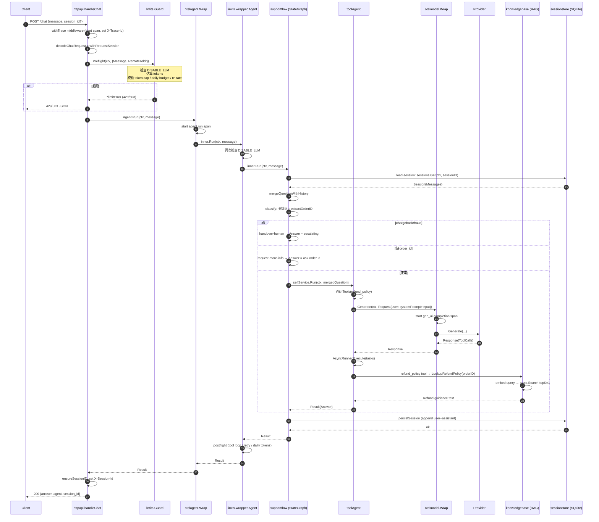
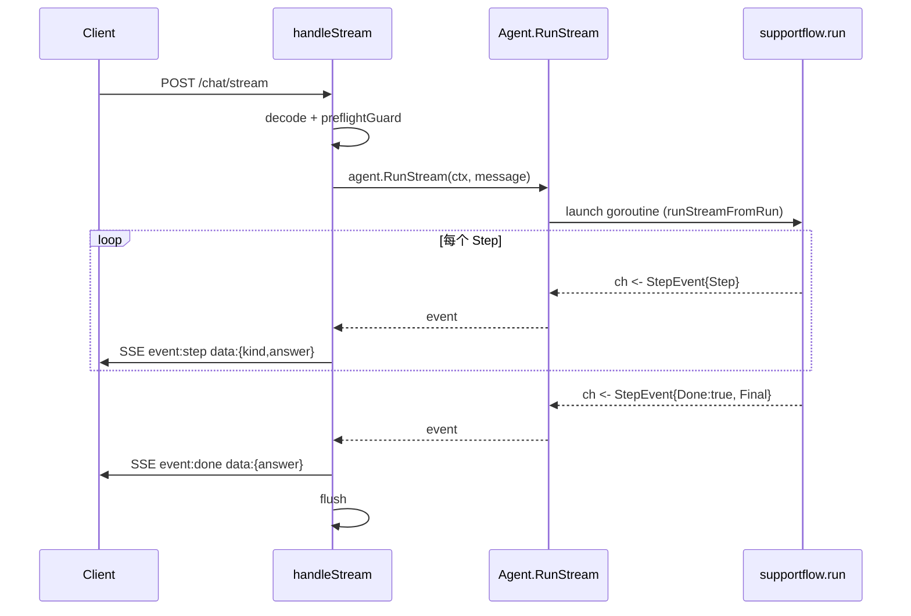
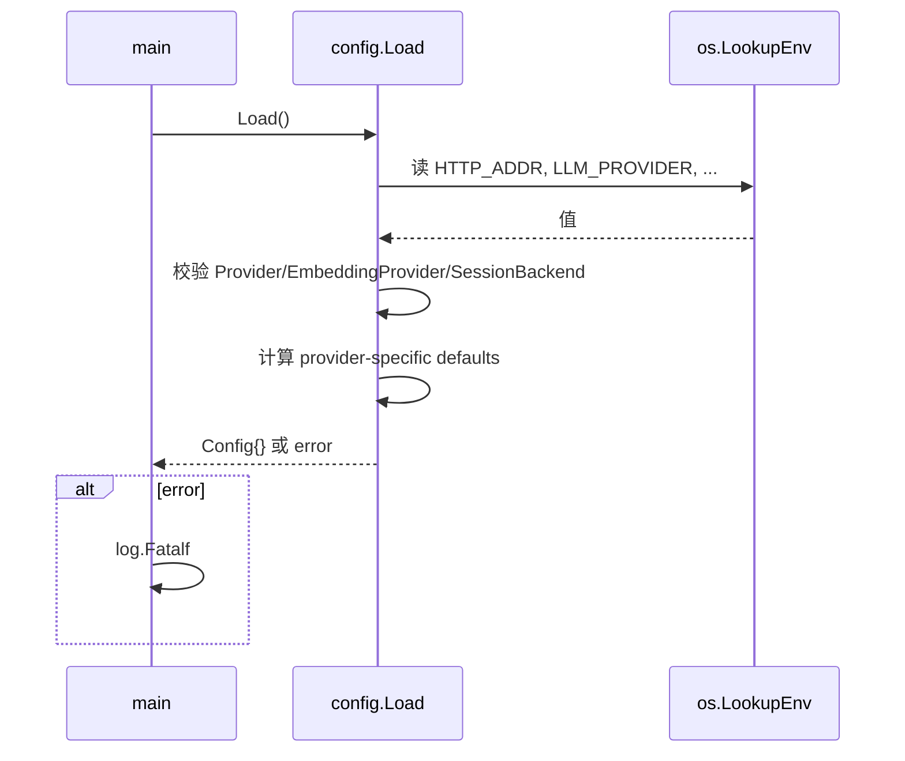
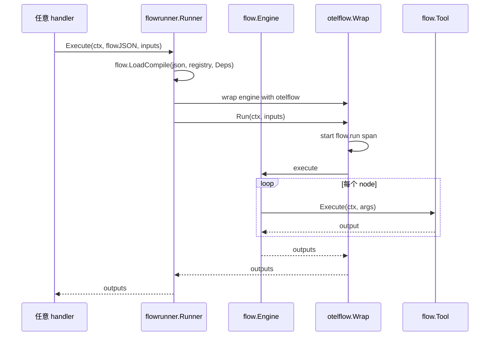

# `llm-agent-customer-support` 源码级设计文档（中文）

> 本文档基于对 `llm-agent-customer-support/` 子项目（27 个 Go 文件、约 4.1K 行）的端到端源码深读撰写。所有断言均给出 `file:line` 引用，便于读者交叉验证。子项目自我定位是「端到端可部署的客服 demo」，它把整个 4-repo umbrella 装配为可运行姿态：`llm-agent`（agent 核心抽象）+ `llm-agent-providers`（OpenAI/Anthropic/Ollama 适配）+ `llm-agent-otel`（OTel 装饰器）+ `llm-agent-flow`（flow IR）+ `llm-agent-rag`（in-memory 知识库）。

---

## 1. 概述与定位

### 1.1 一句话定位
`llm-agent-customer-support` 是 umbrella 生态中**唯一的端到端可执行参考服务**。其他 5 个仓库（agent 核心、providers、otel、flow、rag）都是「库」级别的抽象；只有这个仓库在 `cmd/server/main.go:14-32` 暴露了 `main` 函数、能 `docker compose up` 拉起完整 LGTM + 模型 + 服务栈。

仓库刻意把自己塑造成一个「装配示例」而非「产品」。README 第 5 行明确写道：
> Demo only — production deployment requires hardening.

这一定位有三个具体表现：
1. **不引入新抽象。** 子项目内部的 `internal/...` 包都是「胶水代码」而非「核心抽象」——它们只是把 4 个 sibling 库的接口拼在一起；没有任何 `internal/` 包定义对外可复用的概念。
2. **硬编码 demo 值。** 客服剧本只有一条退款知识种子（`internal/knowledgebase/knowledgebase.go:54-58` 只插入了 24h 退款规则一条记录）；分流规则只识别 `chargeback`/`fraud`/`数字 order_id` 三种情况（`supportflow.go:147-156`）。
3. **生产硬化项明确列为「不在 demo 内」。** README 第 11 行禁止 PR 提交 Helm/kustomize（K8s 推迟到 v0.4）；TLS、认证、多租户、跨区都不在范围内。

### 1.2 在 umbrella 中的角色
4-repo 协同模式由 `scripts/workspace.sh:14-40` 描述：clone 4 个 sibling 仓库后，脚本在 `<parent>/` 写入一个 `go.work` 把 4 个模块同时纳入 workspace。该 `go.work` 在每个 sibling 仓库的 `.gitignore` 中（`README.md:81`），是「跨仓本地迭代」的官方姿态。`go.mod` 中的 `replace` 是「兜底」（`Dockerfile:7-9` 在构建镜像时主动 `go mod edit -dropreplace`），release 分支 CI 会拒绝任何残留 `replace`（`README.md:99-100`）。

---

## 2. 设计思想

### 2.1 装配 vs 抽象：demo 拒绝引入新接口
对比 sibling 项目：`llm-agent` 定义 `agents.Agent`、`llm-agent-flow` 定义 `flow.Engine`、`llm-agent-otel` 定义 `otelagent.Wrap`——它们都是「向下游开放接口」的库。`llm-agent-customer-support` 走的是相反方向：它**消费**所有上游接口，而不是**导出**任何接口。

唯一例外是 `internal/knowledgebase/knowledgebase.go:14-16` 定义的 `PolicyLookup`：
```go
type PolicyLookup interface {
    LookupRefundPolicy(ctx context.Context, orderID string) (string, error)
}
```
这是一个**测试驱动的领域接口**——只为了让 `supportflow_test.go:240` 能注入 `staticPolicyLookup`。它没有被任何 sibling 仓库消费。

### 2.2 Composition over inheritance：装饰器三重套娃
`internal/app/app.go:99-126` 是装配核心，演示了一个典型的 wrapping 链：

```
raw model (provider)
    └── otelmodel.Wrap → wrappedModel        // app.go:99
        └── supportflow.New → orchestrate agent  // app.go:106
            └── limits.Guard.WrapAgent → guarded // app.go:124
                └── otelagent.Wrap → wrappedAgent // app.go:125
                    └── httpapi.NewMux → HTTP transport // app.go:127
```

每一层装饰器只做一件事：
- `otelmodel.Wrap` 给底层 ChatModel 加 trace span（`gen_ai.*` 属性）；
- `supportflow.New` 在裸 ChatModel 上构建 StateGraph + 工具 agent；
- `limits.Guard.WrapAgent` 在每个 Agent.Run 前后做 preflight/postflight 配额校验；
- `otelagent.Wrap` 给 `Agent.Run` 加 trace span（`agent.run`）；
- `httpapi.NewMux` 在 HTTP handler 层再加一个 `POST /chat` span，把 trace ID 写回 `X-Trace-Id` header。

这五层 wrapping 全部不修改下层接口——上层始终满足 `agents.Agent` 契约，使得测试和替换都极其容易。

### 2.3 全链可观测：trace context 从 HTTP 一路下沉到 RAG
- HTTP 层：`httpapi.go:69-95` 的 `withTrace` middleware 把 `POST /chat` span 写入 `r.Context()`，并把 trace ID 设到 `X-Trace-Id` header。
- Agent 层：`otelagent.Wrap`（外部库）在 `Agent.Run(ctx, …)` 中以传入 ctx 作为 parent span 创建 `agent.run` 子 span。
- Model 层：`otelmodel.Wrap`（外部库）在 `Generate(ctx, …)` 中创建 `gen_ai.completion` span。
- Flow 层：`flowrunner.go:58-64` 通过 `otelflow.Wrap` 把 flow IR 的执行也接入同一 trace 树（`docs/flowrunner.md:64-82` 画出 span 树）。

任何 trace 都是「单根：`POST /chat` → 中部：`agent.run` → 底部：`gen_ai.completion`（+ 可能的 `flow.run`）」的拓扑——这是该仓库的最大可演示价值。

### 2.4 配置驱动 + 「panic switch」
`internal/config/config.go:52-97` 通过 `LoadFromLookup(lookup func)` 把所有环境变量集中读取，验证 `LLM_PROVIDER`/`EMBEDDING_PROVIDER`/`SESSION_BACKEND` 的合法性。所有 hard cap 都从这里流入 `limits.Guard`（`app.go:116-123`）。

**`DISABLE_LLM=1` 是个核心设计点。** `limits.go:123-126` 实时读取该环境变量；`app_test.go:460-523` 与 `httpapi_test.go:165-219` 都覆盖了「不重启进程、设环境变量即可立刻熔断」的场景。这种「热开关」是 demo 给生产部署预留的最小化的紧急止血通道。

### 2.5 与 flowrunner 集成的最小克制
`internal/flowrunner/doc.go:1-12` 把 flowrunner 的边界画得很清楚：**只演示 in-process 组合姿态，不复制 flowd 的能力**。`docs/flowrunner.md:18-28` 列了对比表，强调「flow catalog / 持久化 / 鉴权 / SSE 转发」都不在 flowrunner 范围内——它们是 `cmd/flowd` 的职责。这种克制避免了 demo 被无限扩展成 mini-flowd。

---

## 3. 服务架构

### 3.1 顶层目录布局
```
llm-agent-customer-support/
├── cmd/server/main.go              # 进程入口：32 行
├── compose/                        # demo 部署资源
│   ├── compose.yaml                # 6 个 service：ollama, ollama-init, otel-lgtm, otel-collector, grafana, app
│   ├── Dockerfile                  # 多阶段构建，distroless 出镜像
│   ├── otel-collector.yaml         # tail sampling + spanmetrics
│   └── grafana/provisioning/       # datasource + dashboard 注册
├── dashboards/                     # Grafana dashboard JSON
├── docs/flowrunner.md              # 内部包级文档
├── internal/                       # 9 个包，全部对外不可见
│   ├── app/         (2)            # 装配根 + 测试
│   ├── config/      (2)            # 环境变量 → Config struct
│   ├── flowrunner/  (3)            # llm-agent-flow 在进程内的嵌入
│   ├── guardrails/  (2)            # prompt injection 关键词过滤
│   ├── httpapi/     (2)            # HTTP transport：/chat /chat/stream /healthz /readyz
│   ├── knowledgebase/ (2)          # llm-agent-rag 适配 + 1 条种子文档
│   ├── limits/      (2)            # hard cap guard + DISABLE_LLM 开关
│   ├── providers/   (1)            # 3 个 provider 的 factory 分发
│   ├── sessionstore/ (3)           # SQLite/Postgres 共享 schema
│   └── supportflow/ (5)            # StateGraph 客服编排 + tool agent
└── scripts/workspace.sh            # 跨仓 go.work 引导
```

### 3.2 启动序列
`cmd/server/main.go:14-32`：

1. `config.Load()` 读 env → 返回 `Config{}`（失败即 `log.Fatalf`）；
2. `signal.NotifyContext(SIGINT, SIGTERM)` 建立优雅退出 ctx；
3. `app.New(ctx, cfg)` 构造整个对象图；
4. `application.Run(ctx)` 启动 HTTP 服务，阻塞直至 ctx 被取消或 server 自爆。

这是子项目里**唯一的非 internal 代码**，刻意保持 32 行——所有装配复杂度都被推到 `internal/app/app.go`。

### 3.3 App 装配根的对象图
`internal/app/app.go:70-148` 的 `New` 函数是整个仓库的"心脏"。下面是它的对象图构造顺序（按 file:line 标注）：

| 步骤 | 调用点 | 产出 |
|---|---|---|
| 1 | `app.go:81` | `options.ModelFactory(cfg)` → `llm.ChatModel`（默认 `providers.NewChatModel`） |
| 2 | `app.go:85` | `options.EmbedderFactory(cfg)` → `llm.Embedder` |
| 3 | `app.go:89` | `options.SessionStoreFactory(ctx, cfg)` → `sessionstore.Store`（默认按 `SESSION_BACKEND` 分发） |
| 4 | `app.go:93` | `options.TracerProviderFactory(ctx, cfg)` → OTel `TracerProvider` |
| 5 | `app.go:99` | `otelmodel.Wrap(model, …)` → 给 model 加 OTel 装饰 |
| 6 | `app.go:100` | `knowledgebase.New(ctx, embedder)` → 用 embedder 建 RAG + 种子 |
| 7 | `app.go:106-115` | `supportflow.New(…)` → StateGraph 编排 agent |
| 8 | `app.go:116-123` | `limits.New(…)` → 配额 guard |
| 9 | `app.go:124` | `guard.WrapAgent(agent)` → 加 preflight/postflight |
| 10 | `app.go:125` | `otelagent.Wrap(guardedAgent, …)` → 加 trace |
| 11 | `app.go:127-132` | `httpapi.NewMux(…)` → HTTP 路由 + trace header middleware |

**清理路径同样严密**：任何一步失败，都会回滚已开启的资源（`app.go:96, 102-105, 111-115`），这一点被 `app_test.go:115-194` 的两个 `TestNew_CleansUpWhen*` 覆盖。

### 3.4 HTTP API
`internal/httpapi/httpapi.go:52-67`：
- `POST /chat` → JSON 同步回复，HTTP 200 / 4xx / 5xx；
- `POST /chat/stream` → SSE 流式，逐步 emit `event: step` / `event: done`；
- `GET /healthz` → 静态 200；
- `GET /readyz` → 调用 `Ready ReadyFunc`，返回 200 或 503；
- 所有路径都被 `withTrace` 包裹，统一注入 `X-Trace-Id` 响应头。

**SessionID 处理（`httpapi.go:241-260`）**：
- 客户端请求体可带 `session_id`；
- 缺失时由 `uuid.NewString()` 现场分配，写回 `X-Session-Id` 响应头；
- 通过 `sessionstore.ContextWithSessionID(ctx, sessionID)`（`sessionstore/context.go:9-14`）把 ID 绑到 ctx，供下游 `supportflow.go:128-129` 的 `load-session` 节点取用。

### 3.5 SupportFlow：StateGraph + Tool Agent 双层
这是仓库里**最有教学价值**的一段代码（`internal/supportflow/supportflow.go:126-192`）。

**外层：5 节点 StateGraph**（`supportflow.go:127-192`）：

```
Start
  └─→ load-session       # 从 sessionstore 拉历史消息
        └─→ classify     # 关键词分流：chargeback/fraud → human, 缺 order_id → ask, else → self-service
              ├─→ request-more-info → End
              ├─→ handover-human → End
              └─→ self-service → End
```

- `load-session`（`supportflow.go:128-146`）：从 ctx 拉 sessionID，从 store 拉历史，把历史 + 当前 question 合并成单一 prompt（`mergeQuestionWithHistory` `supportflow.go:209-226`）。这是「跨进程会话连续性」的关键。
- `classify`（`supportflow.go:147-157`）：纯规则——`strings.Contains(q, "chargeback")`、`strings.Contains(q, "fraud")` 转人工，`extractOrderID` 找 order ID（`supportflow.go:271-279` 用 `FieldsFunc` 提取连续数字）。
- `self-service`（`supportflow.go:167-174`）：把问题转发给内部的 `selfService agents.Agent`。

**内层：tool agent**（`internal/supportflow/toolagent.go:26-133`）：

`toolAgent` 是一个**专门的单轮工具调用 agent**：
1. `WithTools(registry.AsLLMTools())` 把 tool schema 绑到 model（`toolagent.go:65`）；
2. `Generate(ctx, llm.Request{Messages: [{role: user, content: systemPrompt+input}]})` 单次调用 LLM（`toolagent.go:69-73`）；
3. 如果返回里没 `ToolCalls`，直接当 final answer（`toolagent.go:80-85`）；
4. 否则把每个 `ToolCall` 包成 `agents.Task`，用 `agents.NewAsyncRunner(MaxParallel).Execute` 并发执行（`toolagent.go:87-99`）；
5. 把每个工具输出拼成 `name: output\n…` 形式作为 final answer（`toolagent.go:106-123`）。

**注意**：这个 agent **不会循环**——只有一次 LLM 调用，工具执行后即结束。这是 demo 简化决策——真正的 ReAct 循环（model→tool→model→tool→…）由 `llm-agent` 核心的 `agents.NewReactAgent` 提供，customer-support 没用它，而是从源码层面实现了一个最简「LLM-tools-out」单趟方式。这是文档里没有显式说明的一个**设计偏差**。

唯一注册的工具是 `refund_policy`（`supportflow.go:240-262`），其 schema 强制 `order_id` 必填、`user_id` 必须**服务端注入**（line 253-255 显式拒绝客户端伪造的 `user_id`）。

### 3.6 知识库：极小化 RAG
`internal/knowledgebase/knowledgebase.go:41-69`：
- 用 `ragstore.NewInMemoryStore(dimension)`（来自 `llm-agent-rag`）；
- 通过 `ragEmbedderAdapter`（`knowledgebase.go:22-39`）把 `llm.Embedder` 适配到 RAG 期望的 `ragembed.Embedder` 接口；
- 启动时插入 **唯一一条种子文档**："Orders cancelled within 24h are eligible for a full refund."
- `LookupRefundPolicy(ctx, orderID)`（`knowledgebase.go:75-87`）以 "refund policy order {id}" 作为查询，TopK=1。

这是「教学最小」级别的 RAG——没有切片、没有重排、没有 namespace 隔离。但它演示了完整 embed→store→retrieve 路径。

### 3.7 SessionStore：单 schema 双方言
`internal/sessionstore/sessionstore.go:80-152` 用同一份代码同时支持 SQLite 和 Postgres：
- `Get`/`Save` 通过 `s.dialect == dialectPostgres` 切换占位符（`?` ↔ `$N`，line 81-83, 119-133）；
- `ensureSchema` 用同一份 `CREATE TABLE IF NOT EXISTS` DDL（line 143-151）——这在 SQLite 和 Postgres 之间是可移植的；
- 消息列存 JSON 字符串（`messages_json TEXT`），用 `json.Marshal(session.Messages)` 序列化。

这是一种「为 demo 选最小可移植 SQL」的取舍。生产里大概率要拆方言、加索引、迁移工具。

### 3.8 Limits：分阶段配额 guard
`internal/limits/limits.go` 把限流分成两阶段：

**Preflight（请求进入时）**`limits.go:76-106`：
- `disabled()` 检查 `DISABLE_LLM`；
- 估算 tokens（`estimateTokens` = `len(strings.Fields(text))`，line 175-177，刻意简化）；
- 校验 `MaxTokensPerRequest`、`DailyTokenBudget`、`MaxRequestsPerIPPerMinute`（基于内存 minute bucket，line 92-104）。

**Postflight（agent 返回后）**`limits.go:128-140`：
- 通过 `WrapAgent` 装饰（line 108-113, 142-173）；
- 校验工具调用次数 `countToolCalls(res.Trace) > MaxToolCallsPerAgentLoop`；
- 校验重试次数 `res.Usage.LLMCalls > RetryMaxAttempts`；
- 累计日 token 用量。

错误统一是 `*limitError`，`HTTPStatus(err)` 用 `errors.As` 提取状态码（`limits.go:115-121`），handler 用它返 429/503。

### 3.9 Guardrails：production wiring 中的悬空模块（重要发现）

> **2026-05-22 update**：本节描述的 P0-1 bug **已修复**。`internal/app/app.go:113` 现注入 `Guardrails: guardrails.New(guardrails.Config{})`（PR #11 customer-support，commit 9171a0a）。`grep -n "Guardrails: guardrails.New" internal/app/app.go` 现在命中 line 113。`supportflow.allowInput` 现走 production guardrails 实例，prompt-injection 过滤与 untrusted-RAG system prompt 前缀均生效。保留下方原叙述以记录评审时的状态与修复过程。

`internal/guardrails/guardrails.go:9-57` 定义了一个轻量级 prompt-injection 过滤器：
- 5 个关键词模式（`guardrails.go:23-31`），全部小写包含匹配；
- `FilterInput` 返回 `(ok, reason)`；
- `SafeFallback()` 返回固定文案；
- `SystemPromptPrefix()` 返回「把检索到的知识当作不可信」的前缀。

**`supportflow.go:44-74` 的 `New` 在收到 `opts.Guardrails != nil` 时确实会启用它**——评审日（2026-05-21）时 `internal/app/app.go:106-110` 的**production wiring 从未实例化 `*Guardrails`**：

```go
// 评审日原状（已修）
agent, err := supportflow.New(supportflow.Options{
    Model:     wrappedModel,
    Knowledge: knowledge,
    Sessions:  sessions,
})  // 没有 Guardrails 字段
```

评审日 `grep -rn "Guardrails" /internal/app/ /cmd/` 返回 0 结果。当时的影响：
- README 第 7 行声称"day-one prompt-injection defenses"已上线；
- 单元测试（`supportflow_test.go:141-208`）覆盖了 guardrails 路径；
- **但在 production 启动的 binary 里，guardrails 永远是 nil**——`allowInput`（`supportflow.go:264-269`）直接返回 `true`；`refund_policy` 工具的 `user_id` 拒绝逻辑虽然不依赖 Guardrails（`supportflow.go:253-255` 在工具内部硬编码），但「system prompt 加 untrusted 前缀」（`supportflow.go:51-53`）和「输入过滤」都不会生效。

这是一个**典型的"测试通过 ≠ 生产生效"配置漏洞**——P0-1 PR（commit 9171a0a）通过补一行 `Guardrails: guardrails.New(guardrails.Config{})` + 集成测试 fix 完成。

---

## 4. 依赖装配关系（umbrella 衔接点清单）

下面列出 customer-support 调用 sibling 仓库的**全部具体接入点**，按依赖方向：

### 4.1 `github.com/costa92/llm-agent`（核心 Agent 抽象）
| 接入点 | 文件:行 | 用途 |
|---|---|---|
| `agents.Agent` 接口 | `app/app.go:62`, `supportflow.go:44`, `toolagent.go:26` | 整个仓库共用的 Agent 契约 |
| `agents.Result` / `agents.Step` / `agents.Usage` | `supportflow.go:101-123`, `toolagent.go:77-132`, `limits.go:128-140` | Run/RunStream 返回值 |
| `agents.NewFuncTool` | `supportflow.go:241-262` | refund_policy 工具构造 |
| `agents.NewRegistry` | `supportflow.go:49` | 单 tool 注册 |
| `agents.NewAsyncRunner` | `toolagent.go:96` | 并发执行多个工具 |
| `agents.ErrEmptyInput` / `ErrToolNotFound` | `supportflow.go:90`, `toolagent.go:59, 91` | 哨兵错误传播 |
| `agents.Task` | `toolagent.go:87-94` | 喂给 AsyncRunner |
| `agents.StepEvent` | `supportflow.go:281-305`, `toolagent.go:149-176` | 流式输出 |
| `orchestrate.NewStateGraph[state]` | `supportflow.go:127` | 5 节点客服编排 |
| `orchestrate.NodeStart` / `NodeEnd` | `supportflow.go:176, 188-190` | 图边界 |
| `orchestrate.WithMaxSteps(8)` | `supportflow.go:109` | 防爆 |
| `llm.ChatModel` / `llm.Embedder` / `llm.ToolCaller` | `app/app.go:28-29`, `toolagent.go:33-42` | 模型与嵌入抽象 |
| `llm.Request` / `llm.Response` / `llm.Message` / `llm.ToolCall` | `toolagent.go:69-94` | 模型调用协议 |
| `llm.ErrCapabilityNotSupported` | `toolagent.go:36` | 能力检查 |
| `llm.ProviderInfo` / `llm.Capabilities` | `app/app.go:175-181`, `toolagent.go:34-37` | 元信息暴露 |

### 4.2 `github.com/costa92/llm-agent-providers`
| 接入点 | 文件:行 | 用途 |
|---|---|---|
| `openaiprovider.New` + `WithModel/WithAPIKey/WithBaseURL` | `providers/providers.go:16-20, 41-45` | OpenAI 工厂（同时用于 chat 和 embedding） |
| `anthropicprovider.New` + `WithModel/WithAPIKey/WithBaseURL` | `providers/providers.go:22-26` | Anthropic chat 工厂 |
| `ollamaprovider.New` + `WithModel/WithBaseURL` | `providers/providers.go:28-32, 47-51` | Ollama chat/embedding 工厂 |

注意 Anthropic embedding 在 v0.3 显式不支持（`providers.go:52-53`）。

### 4.3 `github.com/costa92/llm-agent-otel`
| 接入点 | 文件:行 | 用途 |
|---|---|---|
| `otelroot.NewTracerProvider` + `ExporterConfig` | `app/app.go:212-216` | OTLP 出口构建 |
| `otelmodel.Wrap(model, otelmodel.Config{TracerProvider})` | `app/app.go:99` | model trace 装饰 |
| `otelagent.Wrap(agent, otelagent.Config{TracerProvider})` | `app/app.go:125` | agent trace 装饰 |
| `otelflow.Wrap(engine, otelflow.Config{TracerProvider})` | `flowrunner/flowrunner.go:87` | flow IR trace 装饰 |

### 4.4 `github.com/costa92/llm-agent-flow`
| 接入点 | 文件:行 | 用途 |
|---|---|---|
| `flow.NewNodeRegistry` / `flow.RegisterToolNode` | `flowrunner/flowrunner.go:35-37` | 节点注册表 |
| `flow.LoadCompile(json, reg, deps)` | `flowrunner/flowrunner.go:83` | flow JSON → engine 编译 |
| `flow.Runner` / `flow.Engine` / `flow.FlowEvent` | `flowrunner/flowrunner.go:70-78` | 同步与流式执行 |
| `flow.ToolMap` / `flow.ConditionEvaluator` / `flow.NodeFactory` | `flowrunner/flowrunner.go:19-21, 43-45` | 节点能力注入 |

### 4.5 `github.com/costa92/llm-agent-rag`

> **rag pin（2026-05-23）**：`go.mod` 已 repin 到 **v1.0.5**（PR #21 customer-support，commit 85b7ad7），覆盖 v1.3 perf-wave 全套：P1-16 BatchEmbedder（v1.0.3）+ P1-15 concurrent HybridRetriever（v1.0.4）+ P1-1 pgvector IVFFlat/HNSW opt-in（v1.0.5）。`ragEmbedderAdapter.EmbedBatch` 已在 PR #20 wire（commit f68900a）摘取 batch 收益。

| 接入点 | 文件:行 | 用途 |
|---|---|---|
| `ragcore.New(ragcore.Options{Embedder, Store})` | `knowledgebase/knowledgebase.go:46-49` | RAG 系统构造 |
| `ragstore.NewInMemoryStore(dim)` | `knowledgebase/knowledgebase.go:48` | 向量存储 |
| `ragembed.Vector` / `ragembed.Embedder`（隐式） | `knowledgebase/knowledgebase.go:26-34` | 通过 adapter 桥接 |
| `ragingest.Document` / `ragingest.ImportOptions` | `knowledgebase/knowledgebase.go:60-64` | 文档导入 |
| `system.Retrieve(ctx, query, SearchOptions{Namespace, TopK})` | `knowledgebase/knowledgebase.go:76-79` | 检索 |

### 4.6 第三方
- `github.com/google/uuid` ：session ID 现场生成（`httpapi.go:244`）；
- `github.com/lib/pq` ：Postgres driver（`sessionstore.go:11`，blank import）；
- `modernc.org/sqlite` ：纯 Go SQLite driver（`sessionstore.go:12`，blank import，**无 CGO 依赖**——和 `Dockerfile:15` 的 `CGO_ENABLED=0` 一致）。

---

## 5. flowrunner 集成（v0.2.3）

### 5.1 设计意图
`internal/flowrunner` 是**整个 umbrella 唯一一个"flow IR 在进程内嵌入"的下游样例**。`docs/flowrunner.md:1-11` 把它定位为 `llm-agent-flow` 的「downstream-consumer example」。

它**故意不**做四件事（`docs/flowrunner.md:117-131`）：
1. 持久化运行历史；
2. 维护 flow catalog；
3. 对外暴露 HTTP；
4. 跨请求缓存 engine。

要这些能力，请部署 `llm-agent-flow` 仓库的 `cmd/flowd`。

### 5.2 API 表面
`flowrunner/flowrunner.go:27-89` 暴露三个方法：
- `New(Config) (*Runner, error)` ：构造 + 预注册 `tool` 节点类型；
- `(r *Runner) Register(typ, factory)` ：扩展节点类型；
- `(r *Runner) Execute(ctx, flowJSON io.Reader, inputs map[string]string)` ：同步；
- `(r *Runner) ExecuteStream(ctx, …)` ：返回 `<-chan flow.FlowEvent`。

**关键的"trace 嫁接点"在 `flowrunner.go:87`**：
```go
return otelflow.Wrap(engine, otelflow.Config{TracerProvider: r.cfg.TracerProvider}), nil
```
flowrunner 把宿主进程的 TracerProvider 注入 otelflow，从而让 flow 的 root/node span 自然挂在 `POST /chat` span 之下——形成统一 trace 树。

### 5.3 当前接入状态
**注意**：`app.go:127-132` 在装配 mux 时**没有**注入 flowrunner 路由。flowrunner 目前是一个「孤岛包」——有完备测试（`flowrunner_test.go` 4 个 case 覆盖 sync/stream/compile-error/nil-tp），但没有 HTTP entrypoint。

`docs/flowrunner.md:95-110` 给出了示意性接入代码（虚构 `h.app.TracerProvider()` / `h.app.Tools()` 方法），但仓库里这两个 getter 都不存在：`app.go:173-182` 只暴露 `Agent()` / `ModelInfo()` / `EmbeddingInfo()`，没有 `TracerProvider()` 或 `Tools()`。

这是另一处**README ≠ 代码**的差距：flowrunner 已经准备好做"在线 flow 端点"的事，但还没接入。

---

## 6. 可观测性

### 6.1 进程内 OTel pipeline
- TracerProvider 在 `app.go:211-221` 由 `otelroot.NewTracerProvider` 构造，接收 `OTLPProtocol/Endpoint/Insecure` 三个 env（默认 http://localhost:4318，insecure=true）；
- handler 层 `httpapi.go:69-95` 的 middleware 给每个 HTTP 请求开一个 span，写 `X-Trace-Id` 头，并在 status >= 400 时 `span.SetStatus(codes.Error, …)`；
- supportflow 在被 guardrails 拦截时给 span 加 `prompt_injection_attempt=true` 属性（`supportflow.go:96-98`），由 `supportflow_test.go:157-184` 验证。

### 6.2 Collector tail sampling
`compose/otel-collector.yaml:9-28` 配置 3 条策略：
| 策略 | 阈值 | 采样率 |
|---|---|---|
| `errors` | status_code == ERROR | 100% |
| `high-latency` | latency > 5000ms | 100% |
| `probabilistic-baseline` | 其他 | 10% |

`decision_wait: 30s` 给延迟敏感的策略足够窗口。

### 6.3 SpanMetrics → Prometheus
`otel-collector.yaml:30-48, 69-73` 启用 `spanmetrics` connector：
- 输入：traces；
- 输出：metrics → Prometheus exporter（端口 8889）；
- 维度：`agent.name`、`agent.step.kind`、`tool.name`、`gen_ai.system`、`gen_ai.request.model`；
- 直方图 buckets：50ms~10s 共 8 档。

### 6.4 Grafana dashboard
`dashboards/customer-support-observability.json` 注册了 5 个 panel（被 `compose/assets_test.go:52-58` 锁定）：
- Request Latency
- Token Usage
- Estimated Cost
- Error Rate
- Tool Success Ratio

README 第 53 行明确把这些标记为「span-derived demo views」——不是计费源数据。

### 6.5 LGTM 单容器
`compose.yaml:29-33` 用 `grafana/otel-lgtm:latest` 把 Loki/Grafana/Tempo/Mimir/Prometheus 五件套合到一个镜像；service 把 OTLP 数据直接发到这个聚合镜像，省略了 5 个独立 backend 的 wire-up。这是「demo 用、生产不可」的重要权衡。

---

## 7. 关键流程时序

### 7.1 用户消息 → /chat 同步回复



### 7.2 SSE 流式 /chat/stream

> **T5 SSE cancel 契约 test-pin（2026-05-23）**：`internal/httpapi` 已加 cancel 传播测试，pin 死"client 中断 → server-side ctx cancel → goroutine 退出 + SSE 流终止"语义（commits d4ddf9f RED → db0174d GREEN → b7d6a96 cleanup）。此前该路径仅靠观察行为正确而无回归 guard；测试 pin 后任何破坏 cancel 传播的改动将在 CI 失败。



### 7.3 配置加载



### 7.4 Flow 嵌入执行



---

## 8. 运维

### 8.1 docker compose 拉栈
`compose/compose.yaml` 提供 6 个 service：
1. `ollama` ：本地推理 + 嵌入；带 healthcheck（`ollama list`）；
2. `ollama-init` ：依赖 `ollama` healthy，用 curl 拉 `llama3.1:8b` + `nomic-embed-text`；
3. `otel-lgtm` ：单容器观测后端；
4. `otel-collector` ：跑 `otel-collector.yaml` 配置，挂 tail sampling；
5. `grafana` ：注入 datasource + dashboard provisioning，匿名 admin 登录；
6. `app` ：从 `compose/Dockerfile` 多阶段构建，distroless 出镜像；依赖 `ollama-init` completed + `otel-collector` started。

`compose/Dockerfile:7-9` 在 `go mod download` 之前主动 `go mod edit -dropreplace` 三个 sibling repo——这意味着**容器构建总是用公开版本**，不会意外把本地 `go.work` 漏到镜像里。

### 8.2 健康检查
- `/healthz`（`httpapi.go:204-210`）：纯静态 200；
- `/readyz`（`httpapi.go:212-224`）：调用 `Handlers.Ready ReadyFunc`。**2026-05-22 update**：P1-22 已合并（PR #16 customer-support commit fd78a40）。现注入 `makeReadyFunc(sessions, embedder, cfg.ReadinessProbeEmbedder)`（`app.go:134`），实装双探测：(1) `sessions.PingContext` —— 只在 store 实现 `PingContext(ctx) error` 时执行，1s timeout；(2) `embedder.Embed(["ok"])` —— `READINESS_PROBE_EMBEDDER` env 开关控制，1s timeout。原状（评审日 2026-05-21）：`app.go:130` 注入 `func(ctx) error { return nil }`，readiness 永远返回 ready。

### 8.3 优雅退出
- main 通过 `signal.NotifyContext(SIGINT, SIGTERM)` 创建 ctx；
- `App.Run(ctx)` `app.go:150-171` 监听 ctx.Done()，调用 `shutdown(...)`；
- `shutdown` `app.go:184-201` 按序：HTTP server.Shutdown → tp.Shutdown → sessions.Close，timeout = `cfg.ShutdownTimeout`（默认 5s，`config.go:95`）；
- 任一错误聚合到 `firstErr` 返回。

### 8.4 配置矩阵
| env | 默认 | 范围 |
|---|---|---|
| `HTTP_ADDR` | `:8080` | 任意 listen 地址 |
| `LLM_PROVIDER` | `ollama` | `openai`/`anthropic`/`ollama` |
| `LLM_MODEL` | provider-specific | 任意 |
| `EMBEDDING_PROVIDER` | follow LLM | `openai`/`ollama`（anthropic 不支持） |
| `SESSION_BACKEND` | `sqlite` | `sqlite`/`postgres` |
| `SESSION_DSN` | provider-specific | 任意 DSN |
| `MAX_TOKENS_PER_REQUEST` | 1024 | int |
| `MAX_TOOL_CALLS_PER_AGENT_LOOP` | 4 | int |
| `MAX_REQUESTS_PER_IP_PER_MINUTE` | 60 | int |
| `RETRY_MAX_ATTEMPTS` | 2 | int |
| `DAILY_TOKEN_BUDGET` | 100000 | int |
| `DISABLE_LLM` | false | "1" 触发熔断 |
| `OTEL_EXPORTER_OTLP_PROTOCOL` | http | http/grpc |
| `OTEL_EXPORTER_OTLP_ENDPOINT` | http://localhost:4318 | 任意 URL |
| `OTEL_EXPORTER_OTLP_INSECURE` | true | bool |
| `SHUTDOWN_TIMEOUT` | 5s | time.Duration |

---

## 9. 设计优化与替代方案

### 9.1 架构维度

#### 9.1.1 production wiring 漏掉了 guardrails（**bug 级别，已修**）

> **2026-05-22 update**：本节描述的 P0-1 bug **已修复**（PR #11 customer-support commit 9171a0a）。production wiring 现在传入 `Guardrails: guardrails.New(guardrails.Config{})`（`internal/app/app.go:113`），prompt-injection 过滤和 untrusted-RAG system prompt 前缀均生效。保留下方原叙述与修复 patch 以记录修复过程。

**评审日（2026-05-21）现状**：`app.go:106-110` 调用 `supportflow.New(Options{...})` 时不传 `Guardrails`，导致 production binary 上 prompt-injection 过滤和「untrusted-RAG」system prompt 前缀**全部失效**。但 README 第 7 行声称这些是 day-one defenses。

**已落地的修复**：
```go
agent, err := supportflow.New(supportflow.Options{
    Model:      wrappedModel,
    Knowledge:  knowledge,
    Sessions:   sessions,
    Guardrails: guardrails.New(guardrails.Config{}),  // 加这一行
})
```
PR #11 同步添加了 `app_test.go` 集成测试验证 production wiring 真的拒绝 `"ignore previous instructions ..."`。

#### 9.1.2 toolAgent 是 ReAct 的"半步"版本
`toolagent.go:57-133` 实现的是"LLM 调用一次 → 执行所有 ToolCalls → 拼接输出 → 结束"。这不是 ReAct 循环；如果 model 返回 ToolCall 但工具结果还需要二次推理总结，**当前实现会直接把工具原始输出当 answer**——例如返回 `"refund_policy: Refund guidance for order 123: Orders cancelled within 24h..."`，缺一句客服话术润色。

**建议**：要么直接复用 `llm-agent` 仓库的 `agents.NewReactAgent`（如果 v0.5 已稳定），要么在 toolAgent 里加一次"observation → final synthesis"调用——也就是经典的两轮 ReAct。

#### 9.1.3 内层 selfService 没有走 limits guard
`app.go:124-125` 只把**外层** `agent`（supportflow）包了 guard。但 supportflow 内部的 `selfService` `toolAgent`（`supportflow.go:54-61`）是裸 model 直接调，**不受 MaxToolCallsPerAgentLoop / RetryMaxAttempts 约束**。如果未来 toolAgent 改成 ReAct 循环，必须考虑：是把 guard 下推到 model 层，还是给 toolAgent 单独包一层 guard。

#### 9.1.4 flowrunner 是一座孤岛
`internal/flowrunner` 的所有路径都被测试覆盖，但**没有任何 production 代码调用它**。`app.go` 不构造 Runner、`httpapi` 不暴露 flow 端点。如果要让它发挥示范价值，应至少：
- 在 `app.go` 注入一个可选的 `*flowrunner.Runner`；
- 在 `httpapi` 加 `POST /flow/run` + `POST /flow/run/stream`；
- 给 `App` 加 `TracerProvider() trace.TracerProvider` 和 `Tools() []agents.Tool` getter（`docs/flowrunner.md:95-110` 已经假设它们存在）。

### 9.2 性能维度

#### 9.2.1 内存 IP 限流不能水平扩展
`limits.go:34-37, 92-104` 的 `requests map[string]*bucket` 是进程内 map。多副本部署时：
- 每个副本独立计数 → 实际允许的请求数 = N × `MAX_REQUESTS_PER_IP_PER_MINUTE`；
- 无法防御分布式滥用。

**建议**：抽出 `RateLimiter` 接口，默认内存实现保留，加一个 Redis token-bucket 实现（注意：会引入 Redis 依赖，跟 stdlib-only 政策有冲突，需要单独 sub-module）。

#### 9.2.2 `estimateTokens = len(Fields)` 严重低估
`limits.go:175-177` 用空格切分作为 token 估算。中文/CJK 文本几乎没有空格，会严重低估；英文长 token (`unconscious`/`reproducibility`) 也会被低估为 1 token。

**建议**：要么集成一个 tiktoken-go 的 BPE 估算器（quality > stdlib-only 政策），要么把估算上限 × 1.5 作为安全冗余，并在 README 显式标注"估算偏差"。

#### 9.2.3 每次请求都重新 mergeQuestionWithHistory
`supportflow.go:209-226` 把整段历史每次都拼成 prompt，作为 `Generate` 的单一 user 消息。当 session 历史变长（几十轮对话），单请求 prompt 会迅速超过 `MaxTokensPerRequest`。**没有截断、没有摘要**。

**建议**：
- 在 `load-session` 后加一个 "tail-N message" 截断；
- 或者改成 `[]llm.Message{system, ...history, user}` 的正经 multi-turn 协议（`toolagent.go:70-73` 现在只发单 user 消息——把 system prompt 拼到了 user 内容里）。
- 真正生产化的话：加一个 conversation summary 节点。

#### 9.2.4 每次 `flowrunner.Execute` 都重新编译 flow
`flowrunner.go:78-88` 每次调用都 `flow.LoadCompile`。`docs/flowrunner.md:126-131` 明确这是个 known limitation。如果 flow 在 demo 中被多次执行，建议：
- 在 Runner 内部加 LRU cache，key 是 flow JSON 的 sha256；
- 或者把 Runner 进化为「FlowCache」并发安全版。

#### 9.2.5 InMemory RAG store 不持久化
`knowledgebase.go:48` 用 `ragstore.NewInMemoryStore`。重启服务 → 文档需要重新 embed。在 demo 里没问题，但任何接入真知识库的 fork 都得切换到持久化 store（`llm-agent-rag` 应提供 SQLite/PG 实现）。

### 9.3 可观测性维度

#### 9.3.1 缺业务级 metrics
当前 metrics 全部从 trace 派生（spanmetrics connector）。业务指标如：
- 客服意图分类的分布（chargeback / 缺 order_id / self-service）
- 每条种子文档被命中次数
- session 平均存活时长
- guardrails 拦截频次

这些都没有显式 metric。`supportflow.go:96-98` 给 span 加了 `prompt_injection_attempt=true` 属性——可以从 trace 反推，但成本高。

**建议**：在 `supportflow` 注入一个 `*metrics.Recorder` 接口（或直接 OTel meter），在每个 classify 分支末尾 record 一个 counter。

#### 9.3.2 sessionstore 操作没 span
`sessionstore.go:80-136` 的 `Get`/`Save` 是裸 SQL，没有任何 trace 装饰。慢查询不可观测。

**建议**：包一层 `otelsql` 或者在 `Store` 接口外加 trace decorator——加 `db.statement` 属性。

#### 9.3.3 RAG 检索的 trace 属性缺失
`knowledgebase.go:75-87` 调用 `system.Retrieve`，但没有给当前 span 加 `rag.topk` / `rag.query` / `rag.results.count` 这类属性。trace 里看不出"为什么这次返回 No evidence found"。

**建议**：在 `LookupRefundPolicy` 内部 `trace.SpanFromContext(ctx).SetAttributes(...)` 标注关键参数和结果数量。

#### 9.3.4 Cost panel 是 demo
`dashboards/customer-support-observability.json` 的 Estimated Cost panel 是 hardcoded 单价乘 token 数。生产侧需要 provider-billed token reconciliation——目前只能作为「相对趋势」看。

### 9.4 DX 维度（fork 改造为自己客服的友好度）

#### 9.4.1 「替换知识库」的路径不清晰
当前 `knowledgebase.go:50-65` 把 1 条种子写死。一个 fork 想接入自己 1000 条 FAQ，要么：
- 在 `New` 里把 seedDocs 改成读 YAML/JSON 文件；
- 或者完全抛弃 `New`，自己实现 `PolicyLookup` 接口。

**建议**：抽出 `WithSeedDocs(reader io.Reader)` option，默认从 `embed.FS` 读一个 YAML；fork 只要改 YAML 即可。

#### 9.4.2 工具注册需要改源码
`supportflow.go:49` 写死 `agents.NewRegistry(refundPolicyTool(opts.Knowledge))`。要加一个新工具（如 `order_status`），必须改 `New` 函数。

**建议**：把 `Options` 加一个 `ExtraTools []agents.Tool` 字段，在 `New` 里合并。

#### 9.4.3 没有 `.env.example`
仓库里没有提供 `.env.example` 或类似配置模板——所有 env 变量分散在 README 第 70-77 行和 `config.go:54-72`。一个新 fork 要"开箱即用"需要交叉对照。

**建议**：写一个 `compose/.env.example`，含全部 env 默认值 + 注释，被 `compose.yaml` `env_file:` 引用。

#### 9.4.4 端到端测试用 ScriptedLLM 但没有 demo 入口
`app_test.go` 和 `supportflow_test.go` 大量用 `llm.NewScriptedLLM`，但没有一个 `cmd/server-mock` 或类似入口允许"不需要真模型 + 不需要 docker"的本地 demo。新人第一次试，要么必须装 Ollama（30s 下载 + 几 GB 模型权重），要么不知道怎么开始。

**建议**：加一个 `cmd/server-mock/main.go`，用 ScriptedLLM 启动同样的 app，方便 5 秒钟跑起来。

#### 9.4.5 文档断点：README ≠ 代码
本次审计发现至少两处：
- README 称 guardrails 已 day-one 上线 → 代码里 production wiring 未启用；
- `docs/flowrunner.md` 示意性接入代码引用了不存在的 `App.TracerProvider()` / `App.Tools()` getter；flowrunner 也没在 production endpoint 上线。

**建议**：CI 加一个"docs-claims"测试，校验"README 中所述每个能力，在 production 启动路径上都有对应代码引用"。

---

## 10. 遗留与未来方向

### 10.1 v0.4 路线
README 第 11 行明确把 K8s（Helm/kustomize/kind）推到 v0.4，依据是 `llm-agent` 的 PITFALLS Pitfall 16："半成品 K8s 比没有 K8s 更糟"。这是一个合理推迟。

### 10.2 ReAct / multi-agent
当前 supportflow 是 5 节点 StateGraph + 单趟 toolAgent。如果未来要演示多 agent 协作（如 retrieval agent + answer agent + critique agent），合理的演进方向：
1. 把 toolAgent 升级为完整 ReAct 循环（或直接用 `agents.NewReactAgent`）；
2. 把 `selfService` 拆成多个独立 agent 节点，每个挂在 StateGraph 的不同分支；
3. 把 `flowrunner` 接入 `POST /flow/run`，提供「外部 DSL 驱动 agent 编排」的姿态。

### 10.3 与 RAG 演进绑定
`knowledgebase.go` 现在只是 RAG 的 toy 入口。当 `llm-agent-rag` 发布持久化 store / reranker / chunking 工具链时，customer-support 应该是第一个 demo 入口。

### 10.4 安全硬化清单（生产移交项）
按优先级降序：
1. 修复 guardrails 没上线的 wiring bug；
2. 在 `/chat` 加认证（Bearer / mTLS）；
3. 给 sessionstore 加加密字段（PII 落库前；现在消息明文存 JSON）；
4. 给所有 LLM 调用加超时（当前 `Generate` ctx 是 HTTP 请求 ctx，没有显式 timeout）；
5. tail-sampling 策略生产化（错误 100% 保留也许会爆 backend）。

### 10.5 可作为「客服系统模板」复用的程度评价
- **结构上**：装配链清晰、依赖注入完备（4 个 Option Factory），任何一层都可替换；
- **代码上**：约 4.1K 行 Go，27 文件，单人 1-2 周可以读懂全部；
- **关键复用价值**：`app.go` 的装配链 + `supportflow.go` 的 StateGraph 节点定义 + `limits.go` 的双阶段 guard，这三件是最容易 fork 后改用的模块；
- **不可复用部分**：knowledgebase 的 1 条种子、refund_policy 的硬编码 schema、guardrails 的 5 个关键词模式——这些都是 demo-only，必须重写。

整体上，这是一个**结构骨架完整、领域逻辑刻意单薄**的模板。fork 后保留装配骨架、替换 supportflow 节点、扩展 knowledgebase、补全 guardrails 上线即可成为一个真正的客服后端最小可用版本。
