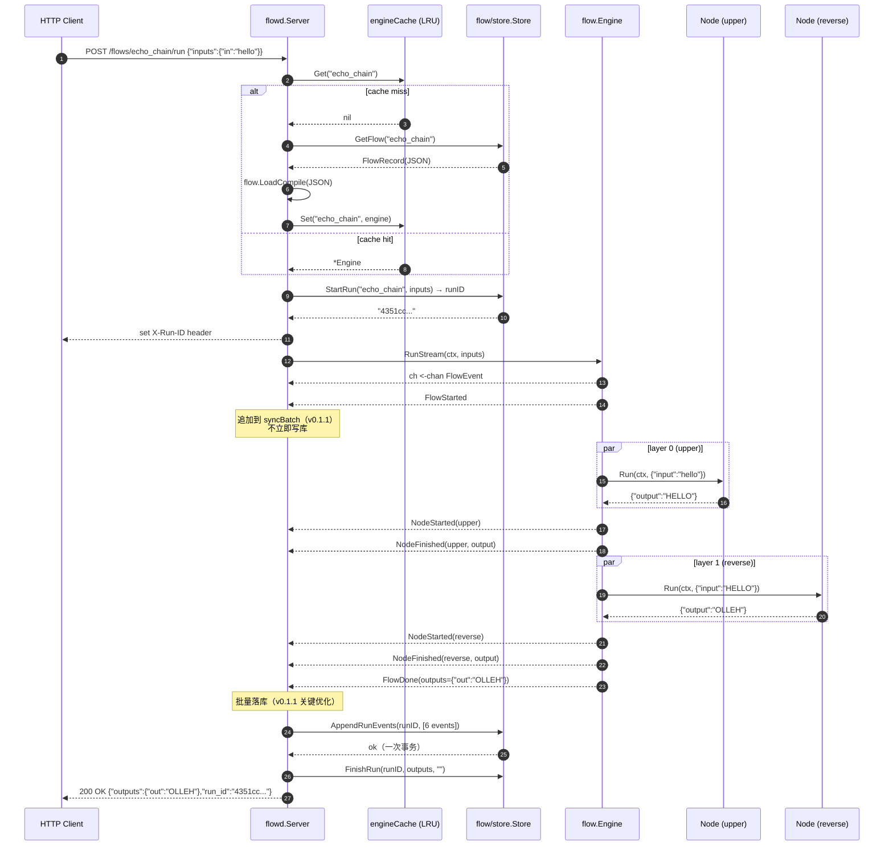
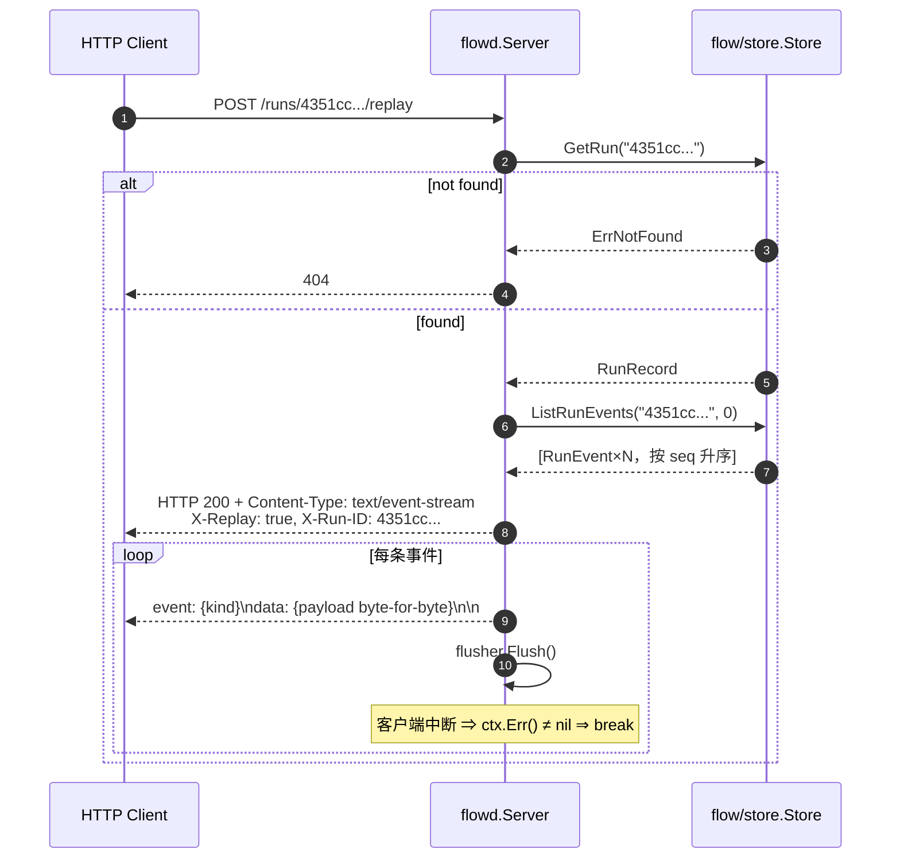
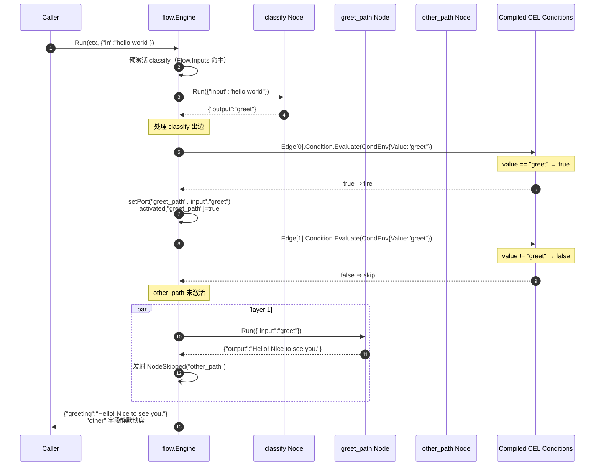

# llm-agent-flow 子项目源码级设计文档

> 仓库路径：`llm-agent-flow/`
> 版本范围：v0.0.1（walking skeleton，Phase 1）→ v0.0.9（Phase 9 replay）→ v0.1.0（Phase 10 SemVer 冻结）→ v0.1.1（Phase 11 LRU + 批量持久化）
> 代码量：57 个 .go 文件 ≈ 7468 行（含测试），核心 `flow` 包仅 ≈ 1700 行
> 依赖姿态：核心 `flow` 包 stdlib-only（仅经由 back-edge 引用 `github.com/costa92/llm-agent` 的 `Tool`/`pkg/fanout`），CEL、SQLite、cel-go、modernc.org/sqlite 都是子包按需引入

本文档分 11 节，目的：把 `llm-agent-flow` 当前形态完全展开到源码级别，建立一份后续重构与跨模块联动可以直接引用的"设计原点"档案。

---

## 1. 概述与定位

### 1.1 一句话定位

`llm-agent-flow` 是 llm-agent 生态里"**可序列化的 flow IR + 拓扑 DAG 执行器**"——它把 `llm-agent` 已经存在的 `agents.Tool` / `agents.Agent` 这两类原子组件，包装为**文件可表达、可校验、可执行、可回放**的有向无环图（DAG）。它不发明新的组件模型，而是给已有的组件一种"**像 JSON 一样可以版本管理、像 Lambda 一样可以远程调用**"的组合形态。

```
llm-agent-flow ──depends on──▶  llm-agent
```

它是 `llm-agent-rag` / `llm-agent-providers` / `llm-agent-otel` / `llm-agent-customer-support` 的**并列兄弟仓库**——既不吸收它们的表面，也不被它们吸收。它和 `llm-agent` 内的 `orchestrate.StateGraph[S]` / `orchestrate.Supervisor` 是**组合关系**：

- `StateGraph` 是进程内状态机（in-process state machine）；
- `flow` 是**文件格式 + DAG 引擎**（file format + DAG engine）；
- 二者可互嵌：一个 flow 节点可以跑 Supervisor；一个 Supervisor Worker 可以执行某个 flow。

### 1.2 包结构鸟瞰

```
llm-agent-flow/
├── api/v0.1.snapshot.txt             ← 导出符号基线（v0.1 冻结）
├── cmd/
│   ├── flow/main.go                  ← CLI：flow run <file.json>
│   └── flowd/
│       ├── main.go                   ← 长驻 HTTP 服务进程
│       ├── helpers.go
│       └── server/
│           ├── server.go             ← 路由 + handler（814 行，全文最大单元）
│           ├── lru.go                ← container/list 实现的引擎 LRU 缓存（v0.1.1）
│           ├── auth.go               ← Bearer-token + pluggable Authenticator（v0.0.8）
│           └── helpers.go
├── flow/                              ← 库核心（stdlib-only 边界）
│   ├── ir.go                         ← Flow/Node/Edge/Port/PortRef/NamedPortRef
│   ├── node.go                       ← NodeKind/NodeFactory/NodeRegistry/Deps/Tool/ToolLookup
│   ├── tool_node.go                  ← "tool" 内建 Node 类型（适配 agents.Tool）
│   ├── adapter_llmagent.go           ← agents.Tool ↔ flow.Tool 桥（唯一 back-edge）
│   ├── event.go                      ← FlowEvent 类型化联合（K1 streaming idiom）
│   ├── condition.go                  ← ConditionEvaluator / Condition / CondEnv
│   ├── engine.go                     ← Compile + Run + RunStream（385 行）
│   ├── runner.go                     ← Runner 接口（v0.0.7 引入的装饰器缝合点）
│   ├── validate.go                   ← IR 静态校验（含循环检测）
│   ├── cond/cel/cel.go               ← Google CEL 实现的 ConditionEvaluator（cel-go）
│   ├── store/store.go                ← 持久化接口（FlowMeta/RunMeta/RunEvent）
│   ├── store/sqlite/                 ← modernc.org/sqlite 实现（pure-Go）
│   │   ├── open.go / flows.go / runs.go / events.go
│   └── tools/                        ← Tool manifest 与 http/exec 两种内建 kind
├── internal/apisnapshot/             ← v0.1 API 快照守卫（pure-stdlib）
└── examples/
    ├── echo_chain/                   ← 线性 upper→reverse 示例
    ├── router/                       ← CEL 条件分支示例
    └── http_tool/                    ← --tools http kind 端到端示例
```

### 1.3 子项目时间线（Phase 1 → Phase 11）

| 标签   | Phase | 核心交付                                                   |
| ------ | ----- | ---------------------------------------------------------- |
| v0.0.1 | 1     | walking skeleton：Flow/Node/Edge 类型 + Load + Validate + 顺序执行                  |
| v0.0.2 | 2     | 每层并行执行（`pkg/fanout`），`/healthz`、`/run`、`/run/stream` HTTP |
| v0.0.3 | 3     | `flow/tools` manifest：http/exec 两种内建 kind + `--tools` 标志 |
| v0.0.4 | 4     | CEL 条件边 + 节点激活语义 + `NodeSkipped` 事件                     |
| v0.0.5 | 5     | SQLite 持久化 + Flow CRUD + Run 历史 + 引擎缓存             |
| v0.0.6 | 6     | per-event 历史落库 + `GET /runs/{id}/events`               |
| v0.0.7 | 7     | `Runner` 接口（otelflow 装饰器缝合点）+ `FlowID()/FlowName()` getter |
| v0.0.8 | 8     | Bearer-token 鉴权 + `Authenticator` 可插拔接口                |
| v0.0.9 | 9     | `POST /runs/{id}/replay`（重放持久化事件）                    |
| v0.1.0 | 10    | **SemVer 冻结** + `internal/apisnapshot` 守卫 + `api/v0.1.snapshot.txt` 基线 |
| v0.1.1 | 11    | 性能优化：引擎 LRU 缓存 + 同步 Run 事件批量持久化            |

### 1.4 当前导出符号边界

`api/v0.1.snapshot.txt`（v0.1.1 基线）共 **9 个包**、约 90+ 个导出符号。关键边界：

- `flow` 包（v0.1 主表面）：`Flow / Node / Edge / Port / PortRef / NamedPortRef / FlowEvent / FlowEventKind`、`Engine / Compile / LoadCompile / WithMaxNodeConcurrency / WithConditionEvaluator`、`Runner / NodeKind / NodeFactory / NodeRegistry`、`Tool / ToolLookup / ToolMap`、`Condition / ConditionEvaluator / CondEnv`、`Validate / ValidateError / ErrEmptyFlow`、`RegisterToolNode / TypeTool`、`FromAgentTool / FromAgentTools`。
- `flow/store`：`Store` 接口（11 个方法）+ `FlowMeta / FlowRecord / RunMeta / RunRecord / RunEvent / RunEventBatchItem`（v0.1.1 新增）+ `ErrNotFound / ErrAlreadyExists`。
- `flow/store/sqlite`：`Store` 结构 + `Open(dsn)` + 13 个方法（含 v0.1.1 `AppendRunEvents`，按 type-assert 暴露为可选能力，不污染接口）。
- `flow/cond/cel`：`Evaluator + NewEvaluator + MustNewEvaluator + Compile`。
- `flow/tools`：`Manifest / Spec / KindRegistry / NewKindRegistry / LoadManifest / LoadAndBuild`。
- `cmd/flowd/server`：`Server / Config / New / NewMux / Handler`、`Authenticator / BearerTokenAuthenticator / ErrUnauthorized`。

---

## 2. 设计思想（5 条核心原则）

### 2.1 IR 优先（IR-first）

整套库的"骨干"是一份完全可序列化为 JSON 的 IR：`Flow{ID, Name, Description, Nodes[], Edges[], Inputs[], Outputs[]}`，定义见 `flow/ir.go:20-28`。这意味着：

1. **同一份 IR 可以离线检视、可以版本管理、可以被任何语言重新实现执行器**——`flow/ir.go:88-101` 的 `Load`/`Marshal` 配对保证 JSON ⇄ Go 结构无损往返；
2. **Engine 是 IR 上的一种解释器**——`flow/engine.go:67-152` 的 `Compile` 把 IR 编译成内部可执行结构（`map[string]NodeKind`、`[][]string` 拓扑层、`[]Condition` 预编译边表），但 IR 本身永远是真相之源；
3. **持久化只存 IR，不存编译态**——`flow/store/sqlite/flows.go:13-53` 的 `PutFlow` 直接把 JSON 字节存 SQLite TEXT 列，需要时由 `cmd/flowd/server/server.go:145-163` 的 `engineFor` 重新 `LoadCompile`。

> **设计取舍**：v0.0.x 中曾经讨论过把 IR 升级到典型工作流引擎（Conductor / Temporal）的级别——增加 retry policy / sub-flow / 循环。当前选择把 IR 控制在"DAG + 可选条件边"这个最小子集，让 IR 表达力与执行器复杂度同时收敛。复杂场景通过外部（cron / Supervisor）编排多次 flow 调用解决。

### 2.2 Runner 接口分离（v0.0.7 引入的核心缝合点）

`flow/runner.go:11-21` 定义了仅 2 个方法的 `Runner` 接口（`Run` + `RunStream`），并通过 `var _ Runner = (*Engine)(nil)`（`flow/runner.go:25`）锁死编译期断言。这是**整个库最重要的一处架构动作**——它让：

1. **OTel 通过装饰器进入而不是 hook 进入**——`llm-agent-otel/otelflow` 实现 `Wrap(Runner) Runner`，从此 OTel 永远不会与 `Engine` 的内部状态机耦合；
2. **测试 / Mock / 中间件**有了稳定靶点——任何想要给 flow 加缓存、限流、加签的库都可以挂这个接口；
3. **生态 K3 Keystone 在 flow 层落地**——可观测性永远是可加可减的装饰，而不是内建。

`Engine.FlowID()`、`Engine.FlowName()`（`flow/runner.go:29-33`）是配套的只读 getter，专门给装饰器作 span 属性/日志字段——但底层字段保持私有，避免装饰器与 Engine 内部布局耦合。

### 2.3 stdlib-only 核心 + 子包按需引入重依赖

`flow` 核心包**只允许**从 `github.com/costa92/llm-agent`（拉 `agents.Tool` 与 `pkg/fanout`）拉东西，其余全部用 stdlib——CEL、SQLite、OTel 各自单独的子包：

| 子包                       | 引入的非 stdlib 依赖     | 引入时机                |
| -------------------------- | ------------------------ | ----------------------- |
| `flow/cond/cel`            | `github.com/google/cel-go` | 仅当用户 import 该子包时 |
| `flow/store/sqlite`        | `modernc.org/sqlite`     | 仅当导入 sqlite 子包时   |
| `llm-agent-otel/otelflow`  | `go.opentelemetry.io/otel` | 在 sister repo 中独立    |

这一约束的硬保障是 umbrella 仓库的 B4 CI gate（`assert_flow_core_stdlib`），它检查 `flow/`（不含 `cond/` / `store/` / `tools/` 子包）的 import 表是否只包含 stdlib + `github.com/costa92/llm-agent/*`。

### 2.4 CEL 条件边 + 节点激活语义

v0.0.4 的关键创新：**条件边不是节点的内部分支，而是边的 first-class 属性**。`Edge.Condition string`（`flow/ir.go:57`）持有一个表达式字符串，由 `WithConditionEvaluator(e)` 注入的求值器（默认提供 cel-go 实现，见 `flow/cond/cel/cel.go:73-86`）在 `Compile` 时预编译，运行时按 `CondEnv{Value: 上游端口输出字符串}` 求值。

匹配的节点激活语义（`flow/engine.go:226-336`）：

- 节点激活 ⟺ (没有入边) ∨ (出现在 `Flow.Inputs`) ∨ (至少一条入边 fire)；
- 边 fire ⟺ 上游节点激活 ∧ 上游端口产生了输出 ∧ Condition 为空或求值为 true；
- 未激活节点产生 `NodeSkipped` 事件（`flow/event.go:21`），其声明的 outputs 在最终结果里**静默缺席**（不是 error）——使得路由器风格的 flow 可以同时声明所有分支的 outputs，只有 fire 分支的 output 出现在结果 map 里（`flow/engine.go:343-360`）。

> **替代方案对比**：把"分支"放到节点内部（switch node）也是常见思路（Airflow / n8n），但这种做法会让 IR 增加一层"节点类型 = 控制流" vs "节点类型 = 业务" 的混淆；flow 把控制流移到边，让节点保持纯函数式的 (in)→(out) 语义，IR 更整洁。

### 2.5 双轨持久化 + 每事件落库

v0.0.5 引入 `flow/store.Store` 接口（`flow/store/store.go:107-146`），v0.0.6 在其上叠加 `RunEvent`（`flow/store/store.go:67-76`）的 per-event 历史。设计上极度克制：

- **flow CRUD 与 run lifecycle 是同一个接口的两块职责**——`PutFlow / GetFlow / ListFlows / DeleteFlow` + `StartRun / FinishRun / GetRun / ListRuns / AppendRunEvent / ListRunEvents`；
- **`Store` 接口 v0.1 之后只准加，不准动现有签名**——v0.1.1 的批量写 `AppendRunEvents` 没有加进接口，而是仅在 `*sqlite.Store` 上实现，调用方用 type-assert 嗅探（`cmd/flowd/server/server.go:430-432`）；
- **flowd 把 sync 与 stream 两个路径都收敛到 `engine.RunStream`**——`cmd/flowd/server/server.go:364-495` 的 `runWithStore`：sync 模式把事件 batch 起来在 run 结束时一次 `AppendRunEvents`（v0.1.1 优化），stream 模式则**每事件先落库再向 SSE 客户端转发**（`server.go:438-445`）——保证"客户端中途断开仍有完整审计轨迹"（v0.0.6 引入的耐久性契约）。

---

## 3. IR 设计与 schema

### 3.1 完整 IR 类型表（来自 `flow/ir.go`）

```go
type Flow struct {
    ID, Name, Description string
    Nodes   []Node          // 必须非空
    Edges   []Edge
    Inputs  []NamedPortRef  // 调用方按 Name 提供
    Outputs []NamedPortRef  // 调用方按 Name 收回
}

type Node struct {
    ID, Type string
    Config   json.RawMessage  // 由对应 NodeFactory 解码
}

type Edge struct {
    Source, Target PortRef
    Condition      string    // CEL 表达式；空串=无条件
}

type PortRef      struct { Node, Port string }
type NamedPortRef struct { Name string; PortRef }
type Port         struct { Name, Type string }  // Type 当前固定为 "string"/"json"
```

### 3.2 序列化格式（JSON）

`Load` 使用 `json.Decoder.DisallowUnknownFields()`（`flow/ir.go:91`），意味着 IR 是**封闭式**的——拼错字段名（如把 `nodes` 写成 `node`）会直接报错而不是被忽略。

`Marshal`（`flow/ir.go:99-101`）使用 `MarshalIndent` 输出标准两空格缩进——`TestMarshalRoundTrip`（`flow/ir_test.go:47-62`）保证 IR ↔ JSON 双向无损。

实际样例（`examples/echo_chain/flow.json`）：

```json
{
  "id": "echo_chain",
  "name": "echo chain",
  "description": "Pipes a single string through two trivial Tools (upper then reverse).",
  "nodes": [
    { "id": "upper",   "type": "tool", "config": { "tool": "upper" } },
    { "id": "reverse", "type": "tool", "config": { "tool": "reverse" } }
  ],
  "edges": [
    { "source": { "node": "upper",   "port": "output" },
      "target": { "node": "reverse", "port": "input"  } }
  ],
  "inputs":  [{ "name": "in",  "node": "upper",   "port": "input"  }],
  "outputs": [{ "name": "out", "node": "reverse", "port": "output" }]
}
```

### 3.3 版本与兼容策略（v0.1 冻结）

- **JSON 字段加法是兼容的**——比如 v0.0.4 给 `Edge` 加了 `Condition` 字段，旧 IR 文件无需修改即可加载（`Condition == ""` 时引擎按无条件边处理，`flow/ir.go:48-49`）；
- **删字段 / 改类型 / 改语义 = 破坏性 = 要 /v2 路径**——这是 `docs/compatibility.md` 列出的硬规则；
- **`internal/apisnapshot`**（`internal/apisnapshot/apisnapshot.go:60-137`）每次 `go test` 时把当前模块导出表面渲染成确定性文本，与 `api/v0.1.snapshot.txt` 基线比对。基线漂移 ⇒ 测试失败。`-update` 标志可主动刷新基线，让"故意的加法"通过显式提交体现。

### 3.4 API snapshot 守卫机制（v0.1.0 关键交付）

`internal/apisnapshot/apisnapshot.go` 是一个**纯 stdlib**（`go/parser`/`go/ast`/`go/printer`/`go/token`）的生成器：

1. 从模块根 walk 所有 `.go` 文件，跳过 `_test.go` 与 `internal/` 路径段；
2. 对每个文件用 `parser.ParseFile(..., parser.SkipObjectResolution)` 解析；
3. `collectFunc`（`apisnapshot.go:162-186`）收集导出函数与导出类型上的导出方法；
4. `collectGen`/`collectType`（`apisnapshot.go:205-301`）收集 const/var/type，struct 字段与 interface 方法按字母序排序；
5. 输出一行一条的确定性文本（`api/v0.1.snapshot.txt`，208 行）。

测试 `apisnapshot_test.go` 在每次 CI 跑时调用 `Generate` 与基线 byte-equality 比对——这就是 v0.1 SemVer 承诺的"可执行"形态。

---

## 4. DAG Executor（`flow/engine.go`）

### 4.1 Compile 阶段（一次性、`flow/engine.go:67-152`）

```go
func Compile(f Flow, reg *NodeRegistry, deps Deps, opts ...EngineOption) (*Engine, error)
```

执行步骤：

1. `Validate(f)`（`flow/validate.go:35`）——非空 / ID 唯一 / 边端点存在 / 无 self-loop / 无 cycle；
2. 应用 `EngineOption`：`WithMaxNodeConcurrency` 与 `WithConditionEvaluator`；
3. `reg.Build(n, deps)` 把每个 IR Node 解析为 `NodeKind`（`flow/engine.go:79-86`）；
4. **CEL 边预编译**：对每条 `Edge.Condition != ""` 的边调 `cfg.condEval.Compile(expr)`；如果有条件但没注入求值器，立刻报错（`flow/engine.go:88-101`）；
5. **拓扑分层**：Kahn 算法的层版本——把入度为 0 的节点作为第 0 层，每完成一层就把它的后继中入度变 0 的并入下一层（`flow/engine.go:103-137`）；
6. 出口最后保险：`visited != len(f.Nodes)` ⇒ 残留环报错（`flow/engine.go:138-142`）。

返回的 `*Engine` 是**不可变**的（除了运行时内部的 portValues map），并发安全。`Engine` 内部字段（`flow/engine.go:21-37`）：

```go
type Engine struct {
    flow   Flow
    deps   Deps
    nodes  map[string]NodeKind       // 已解析的节点实例
    layers [][]string                // 按拓扑分好的层
    preds  map[string][]Edge         // 反向：节点 → 入边
    edgeCond []Condition             // 与 flow.Edges 同长度，nil = 无条件
    maxNodeConcurrency int
}
```

### 4.2 Run / RunStream 共享内核（`flow/engine.go:180-364`）

`Run` 与 `RunStream` 都调用私有 `run(ctx, inputs, ch)`，ch 为 nil 时跳过事件发射。核心循环（**已浓缩**）：

```go
emit(FlowStarted)

// portValues[nodeID][portName] = value，受 pvMu 保护
// activated[nodeID] = bool，预激活：入度=0 的节点 + Flow.Inputs 命中的节点

for _, layer := range e.layers {
    // 1) 为本层每个激活节点构造 fanout.Task
    tasks := []fanout.Task[map[string]string]{...}

    // 2) 未激活节点立即发 NodeSkipped 事件

    // 3) fanout.Run(ctx, maxNodeConcurrency, tasks, fanout.WithFailFast())
    //    - 任意 task 错误 ⇒ 取消其余 in-flight 兄弟

    // 4) 层完成后，遍历本层激活节点的所有出边：
    //    src 未激活 ⇒ 跳；
    //    端口未输出值 ⇒ 跳（不发射"无值边"）；
    //    edgeCond 非 nil ⇒ Evaluate(CondEnv{Value: 上游端口值})；为 false ⇒ 跳；
    //    fire ⇒ setPort(target.Node, target.Port, value); activated[target.Node] = true
}

// 收集 Flow.Outputs；未激活节点的 output 静默缺失
emit(FlowDone or FlowErr)
```

关键细节：

- **emit 序列化**：`flow/engine.go:184-195` 的 `emit` 用 `sync.Mutex` 保护通道发送——兄弟节点并发跑时仍保证消费者看到的事件是逐条序列化的（per-event atomicity，而非 cross-node ordering）；
- **portValues 锁粒度**：`pvMu` 也是单个 Mutex 锁住整张 map，不是按节点细分。理由：并发写入的窗口只发生在层级切换边界，竞争不激烈，简单锁优于复杂分桶（设计妥协，详见 §10）；
- **错误传播**：node 自身错误被 `fmt.Errorf("flow: run: node %q: %w", ...)` 包裹后通过 `NodeFinished{Err}` 与 `FlowErr` 双重发射；
- **CEL 求值错误**：`flow/engine.go:322-329` 把边条件求值错误也归并到 `FlowErr`，让客户端看到统一终止事件。

### 4.3 FlowEvent 类型化联合（`flow/event.go`）

```go
type FlowEventKind uint8
const (
    FlowStarted   // FlowID != ""
    NodeStarted   // NodeID != "" ; Input != nil
    NodeFinished  // NodeID != "" ; Output != nil 或 Err != nil
    NodeSkipped   // NodeID != ""
    FlowDone      // Outputs != nil
    FlowErr       // Err != nil
)
type FlowEvent struct { Kind FlowEventKind; FlowID, NodeID string; Input, Output, Outputs map[string]string; Err error }
```

事件序约束（在 `engine_parallel_test.go:175-233` 的 `TestEngineStreamEventsKeyedByNode` 中显式断言）：

- **全局**：FlowStarted 第一条；FlowDone 或 FlowErr 末尾且仅一条；
- **per-node**：NodeStarted 在 NodeFinished 之前出现，每个 nodeID 都只有一条 NodeStarted + 一条 NodeFinished；
- **跨层**：先完成上一层所有节点的 NodeFinished，再开始下一层的 NodeStarted；
- **同层**：兄弟节点的 NodeStarted / NodeFinished 可以交错。

这套契约与 umbrella K1 streaming union（llm.StreamEvent 风格）严格对齐——任何 LLM 上游事件流的消费者用同一套模式可处理 flow 事件流。

### 4.4 与 `pkg/fanout` 的协作

`flow/engine.go:287` 的 `fanout.Run(ctx, e.maxNodeConcurrency, tasks, fanout.WithFailFast())` 是 v0.0.2 的关键改造。`pkg/fanout`（在 `github.com/costa92/llm-agent` 仓库）提供：

- 泛型 `Task[T] = func(ctx) (T, error)` + `Run(ctx, parallelism, tasks, opts...)`；
- `WithFailFast()`：任一任务返回 error ⇒ 取消其余 in-flight 任务的 ctx；
- `parallelism <= 0` ⇒ 无界并发（每任务一 goroutine）；`= 1` ⇒ 退化成顺序执行。

测试 `engine_parallel_test.go`：

- `TestEngineRunsLayerSiblingsInParallel`（80ms 兄弟节点 wallclock < 120ms）证明并行；
- `TestEngineSerialModeWhenMaxConcurrencyOne` 证明 `WithMaxNodeConcurrency(1)` 退化为顺序（peak=1）；
- `TestEngineFailFastCancelsPeers` 证明慢兄弟在 200ms 内观察到 ctx 取消。

---

## 5. 持久化（`flow/store` + `flow/store/sqlite`）

### 5.1 `flow/store.Store` 接口（11 个方法）

定义在 `flow/store/store.go:107-146`：

```go
type Store interface {
    // Flow CRUD
    PutFlow(ctx, id, name string, json []byte, create bool) (FlowRecord, error)
    GetFlow(ctx, id string) (FlowRecord, error)
    ListFlows(ctx, limit int) ([]FlowMeta, error)
    DeleteFlow(ctx, id string) error

    // Run lifecycle
    StartRun(ctx, flowID string, inputs map[string]string) (string, error)
    FinishRun(ctx, runID string, outputs map[string]string, errMsg string) error
    GetRun(ctx, runID string) (RunRecord, error)
    ListRuns(ctx, flowID string, limit int) ([]RunMeta, error)

    // Run events（v0.0.6）
    AppendRunEvent(ctx, runID string, kind RunEventKind, nodeID string, payload []byte) error
    ListRunEvents(ctx, runID string, limit int) ([]RunEvent, error)

    Close() error
}
```

设计细节：

- `PutFlow` 的 `create bool` 让 POST（create=true，冲突 → `ErrAlreadyExists`）与 PUT（create=false，UPSERT 语义）共用同一接口；
- `FinishRun` 是**幂等**的——已终止行的二次调用是 no-op（`flow/store/sqlite/runs.go:52-62`）；
- `AppendRunEvent` 对 **已 finished 的 run** 也允许调用（重放 / 迟到事件），但对未知 runID 必须返回 `ErrNotFound`；
- `ListRunEvents` 对未知 runID 返回**空切片**而非错误——让 replay-style 客户端可以无脑轮询。

### 5.2 RunEventBatchItem（v0.1.1 可选能力）

`flow/store/store.go:78-91` 加了 `RunEventBatchItem` 类型，但**故意没把 `AppendRunEvents` 加入 Store 接口**——这是 v0.1 冻结的硬约束（在接口上加方法会破坏第三方实现）。`*sqlite.Store` 私下实现了它（`flow/store/sqlite/events.go:65-124`），调用方用：

```go
if batcher, ok := store.(interface {
    AppendRunEvents(ctx, runID string, items []RunEventBatchItem) error
}); ok { _ = batcher.AppendRunEvents(...) }
```

这种 type-assert 嗅探在 `cmd/flowd/server/server.go:430-432` 与 `server.go:468-483` 体现，是 v0.1.x 在不破 SemVer 前提下提速的范式。

### 5.3 SQLite 实现（pure-Go）

`flow/store/sqlite/open.go:32-92` 的 `Open(dsn)`：

- 用 `modernc.org/sqlite` driver（pure-Go，**无 CGO 依赖**）；
- DSN 直传 driver；`":memory:"` 在 `db.SetMaxOpenConns(1)` 因为内存库不共享连接；
- 自动 `ensureSchema`，DDL 全部 `CREATE TABLE IF NOT EXISTS`，多次 `Open` 同库幂等；
- 旧 v0.0.5 数据库下次 `Open` 时自动获得 `run_events` 表（v0.0.6 平滑升级）。

#### Schema（`flow/store/sqlite/open.go:52-87`）

```sql
CREATE TABLE flows (
  id TEXT PRIMARY KEY, name TEXT NOT NULL DEFAULT '',
  json TEXT NOT NULL, created_at INTEGER NOT NULL, updated_at INTEGER NOT NULL
);
CREATE TABLE runs (
  id TEXT PRIMARY KEY, flow_id TEXT NOT NULL, status TEXT NOT NULL,
  started_at INTEGER NOT NULL, finished_at INTEGER,
  inputs_json TEXT, outputs_json TEXT, error_msg TEXT
);
CREATE INDEX idx_runs_flow_id_started_at ON runs(flow_id, started_at DESC);
CREATE TABLE run_events (
  id INTEGER PRIMARY KEY AUTOINCREMENT, run_id TEXT NOT NULL,
  seq INTEGER NOT NULL, kind TEXT NOT NULL, node_id TEXT,
  payload_json TEXT, ts INTEGER NOT NULL
);
CREATE INDEX idx_run_events_run_id_seq ON run_events(run_id, seq);
```

注意：

- **时间戳全部用 `INTEGER`（微秒 Unix）**——`nowUnix()` = `time.Now().UnixMicro()`（`open.go:104`）；
- **不存编译后的 engine**——只存 IR JSON；
- **run_events 没有外键到 runs**——这是有意的，删除 flow 不级联删 run，保留审计轨迹（`docs/architecture.md:144`）。

#### `AppendRunEvent` 的 seq 分配（`events.go:20-54`）

```sql
INSERT INTO run_events (run_id, seq, kind, node_id, payload_json, ts)
VALUES (
  ?,
  COALESCE((SELECT MAX(seq) FROM run_events WHERE run_id = ?), 0) + 1,
  ?, ?, ?, ?
);
```

单语句完成"读取最大 seq + 写入下一条"，依赖 SQLite 的 row-level 锁实现无竞争的单调递增。`AppendRunEvents` 批量版本（`events.go:65-124`）走显式 `BeginTx + Prepare + 循环 ExecContext + Commit`，整批共享同一 `ts`，比 N 次单语句插入快 5–10×（取决于事务边界开销）。

#### Run ID 生成（`runs.go:144-150`）

```go
var b [8]byte
rand.Read(b[:])
return hex.EncodeToString(b[:]), nil
```

16-char hex（8 字节 crypto/rand），1e6 次运行碰撞概率 ~3e-11。注释明确说 demo 级别，未来会迁 UUIDv7。

---

## 6. flowd HTTP 服务（`cmd/flowd/server/server.go`）

### 6.1 路由表（v0.1.1 完整版）

`Server.Handler()`（`server.go:106-131`）注册以下路由：

```
GET    /healthz                      → 健康检查（auth bypass）

POST   /flows                        → 创建（409 on conflict + compile-probe）
GET    /flows                        → 列表
GET    /flows/{id}                   → 详情
PUT    /flows/{id}                   → 替换（compile-probe + 驱逐引擎缓存）
DELETE /flows/{id}                   → 删除（驱逐引擎缓存；run_events 保留）

POST   /flows/{id}/run               → 同步 JSON 执行
POST   /flows/{id}/run/stream        → SSE 流式执行
GET    /flows/{id}/runs              → 该 flow 的 run 历史

GET    /runs/{id}                    → 单次 run 完整记录
GET    /runs/{id}/events             → run 的事件历史（全 payload）
POST   /runs/{id}/replay             → 从持久化事件重放为 SSE（v0.0.9）

# 仅当 --flow 提供 seed 时：
POST   /run                          → 路由到 LegacyFlowID（v0.0.4 兼容）
POST   /run/stream                   → 同上 stream 版
```

整条链路被 `withAuth(s.cfg.Authenticator, mux)` 包裹（`server.go:130`），`/healthz` 通过 `authBypass` 短路（`auth.go:73-75`）。

### 6.2 sync vs stream 的统一抽象（`runWithStore`）

`server.go:364-495` 是整个 flowd 的核心方法。它**用 stream 走 sync**——意思是：无论客户端要 JSON 响应还是 SSE，引擎都通过 `RunStream` 驱动，事件落库始终发生在转发到客户端**之前**。

伪代码视图：

```go
func runWithStore(w, r, flowID, stream) {
    decode req
    eng, _, err := engineFor(flowID)              // 走 engine cache
    runID, _ := store.StartRun(ctx, flowID, req.Inputs)
    w.Header().Set("X-Run-ID", runID)             // 即使后面失败也带上

    if stream {
        // 设置 text/event-stream 头并立即 flush
    }

    ch, err := eng.RunStream(ctx, req.Inputs)
    if err != nil {
        // 配置级错误（compile 阶段或 Inputs 缺失），先写一条 flow_err 事件再 FinishRun
        return
    }

    var syncBatch []RunEventBatchItem
    canBatch := store.(interface{ AppendRunEvents(...) error })  // type-assert
    for ev := range ch {
        if stream {
            store.AppendRunEvent(...)   // 立即落库
            writeSSE(w, ...)            // 然后转发
        } else {
            syncBatch = append(syncBatch, ...)  // 批量延迟（v0.1.1）
        }
        if ev.Kind == FlowDone   { finalOutputs = ev.Outputs }
        if ev.Kind == FlowErr    { finalErr     = ev.Err     }
    }

    if !stream && len(syncBatch) > 0 {
        if canBatch { batcher.AppendRunEvents(ctx, runID, syncBatch) }
        else        { for _, item := range syncBatch { store.AppendRunEvent(...) } }
    }

    store.FinishRun(serverCtx, runID, finalOutputs, errMsg)
    if !stream { writeJSON(w, runResponse{Outputs, RunID}) }
}
```

关键设计：

- **stream 路径每事件落库**（`server.go:438-445`）——v0.0.6 的"事件长于客户端"耐久性契约；
- **sync 路径批量落库**（v0.1.1 优化，`server.go:446-455` + `468-483`）——sync 客户端反正要等终态，没有"在线观察"诉求，批量插入降低事务开销；
- **`serverCtxFor(s)` = `context.Background()`**（`helpers.go:17`）——FinishRun / AppendRunEvent 之类的最终化调用必须**不受 request ctx 取消影响**，否则客户端断连会导致历史丢失尾巴。

### 6.3 Authenticator（v0.0.8）

`cmd/flowd/server/auth.go`：

- `Authenticator` 接口仅一个方法 `Authenticate(r *http.Request) error`；
- `BearerTokenAuthenticator{Token: ...}`：constant-time 比较（`auth.go:54-66`，自实现而非用 `crypto/subtle`——注释承认是 v0.0.x 妥协）；
- 返回 `ErrUnauthorized` → 401 + `WWW-Authenticate: Bearer realm="flowd"`；返回其他 error → 403；
- `/healthz` 始终 bypass（`auth.go:73-75`），让 k8s liveness / LB 健康检查不需要 token。

CLI 配置：`flowd --token <secret>` 或环境变量 `FLOWD_TOKEN`（`cmd/flowd/main.go:50, 53-56`），flag 优先。`Authenticator` 接口是开放的：测试 `TestCustomAuthenticatorWorks`（`auth_test.go:109-133`）演示了用自定义 header 实现。

### 6.4 Engine LRU 缓存（v0.1.1）

`cmd/flowd/server/lru.go` 用 `container/list` + `map` 实现 O(1) LRU：

- `Get` 命中 → `MoveToFront`（touch）；
- `Set` 新 key + 满 → `evictLRU` 删队尾；
- `Set` 既有 key → 更新 value + `MoveToFront`；
- `cap <= 0` → 关闭驱逐（保持 v0.1.0 的 `sync.Map` 行为）。

替换路径（`server.go:139-165`）：

```go
func (s *Server) engineFor(id string) (*flow.Engine, *FlowRecord, error) {
    if v, ok := s.engines.Get(id); ok { return v.(*Engine), nil, nil }
    rec, _ := s.cfg.Store.GetFlow(ctx, id)
    eng, _ := flow.LoadCompile(bytesReader(rec.JSON), s.cfg.Registry, deps, opts...)
    s.engines.Set(id, eng)
    return eng, &rec, nil
}
```

PUT/DELETE handler 调 `s.engineEvict(id)`（`server.go:165, 296, 336`）确保下次 run 用新 IR。

> **替代方案讨论**：基于内存压力（runtime.MemStats）而非固定容量的驱逐策略 — flow 引擎大小高度依赖 IR 节点数，对**1KB IR vs 1MB IR** 同等对待显然不精确。但 v0.1.x 选择最简单的固定容量 LRU，理由是：在多租户 flowd 场景下，运维更愿意按"slot 数"而非"内存上限"做容量规划；真要按内存做，加一层 `Sizer` 接口即可。

### 6.5 Replay 端点（v0.0.9）

`handleReplayRun`（`server.go:543-580`）的实现极简：

1. `Store.GetRun(runID)` 检查存在性（404）；
2. `Store.ListRunEvents(runID, 0)` 拉所有事件；
3. 写 SSE 头 + `X-Replay: true` + `X-Run-ID`；
4. 对每条 `ev` 调 `writeSSERaw(w, string(ev.Kind), ev.Payload)`（注意是 **Raw** —— 已存的 payload JSON byte-for-byte 转发，不再 marshal）；
5. 每帧后 `flusher.Flush()` + 检查 `r.Context().Err()` 让客户端可中断。

测试 `server_replay_test.go:86-114` 的 `TestReplayPayloadsByteForByteMatchOriginal` 锁死了这一行为：`flow_done` 帧的 `data:` 行必须仍包含 `"outputs":{"out":"OLLEH"}`。

> **设计取舍**：Replay 不重新跑引擎，所以重放结果与原始 run 同步——这正是审计场景的核心需求（"我要看那次运行真实发生了什么"）。如果未来要做 deterministic re-execution（同输入同确定输出），那需要把工具调用的所有外部副作用也作为事件持久化，是显著更大的工程。

---

## 7. 可观测性接缝（与 otelflow 协作）

`flow` 本身**不引入 OTel 依赖**（这是 K3 的硬规则），但通过两个机制让 OTel 自然嵌入：

1. **`flow.Runner` 接口（v0.0.7）**——`llm-agent-otel/otelflow` 实现一个 `func Wrap(r Runner, cfg Config) Runner` 装饰器，用法：

    ```go
    eng, _ := flow.LoadCompile(r, reg, deps, flow.WithConditionEvaluator(...))
    runner := otelflow.Wrap(eng, otelflow.Config{TracerProvider: tp})
    out, _ := runner.Run(ctx, inputs)
    ```

2. **FlowEvent 事件流**——otelflow 把每个 `NodeStarted/NodeFinished` 对映射为一个 `flow.node <id>` 子 span，`FlowStarted/FlowDone` 对映射为根 span `flow.run <id>` 或 `flow.run.stream <id>`，`NodeSkipped` 映射为零时长 span + `flow.node.skipped=true` 属性。

`Engine.FlowID() / FlowName()`（`flow/runner.go:29-33`）正是给装饰器作 span 属性用的。装饰器是**幂等可组合**的——`otelflow.Wrap(otelflow.Wrap(r))` 不会产生重复 span（otelflow 内部用 ctx 标记防递归）。

---

## 8. 关键时序图

### 8.1 SubmitRun → 层级执行 → Event 持久化（sync 路径，v0.1.1）



### 8.2 Replay 流程（v0.0.9）



### 8.3 CEL 条件边路由（同步路径，`examples/router/flow.json`）



---

## 9. 代码实现要点（file:line 引用）

下表把"行为 ↔ 源码位置"建立索引，按照阅读 / 重构最常用的 30 个锚点。

| 行为                              | 源码位置                                                |
| --------------------------------- | ------------------------------------------------------- |
| Flow IR 顶层类型                  | `flow/ir.go:20-28`                                      |
| Edge.Condition 字段语义           | `flow/ir.go:54-58`                                      |
| JSON 加载（DisallowUnknownFields）| `flow/ir.go:88-96`                                      |
| 静态校验入口                      | `flow/validate.go:35-94`                                |
| 环检测（iterative DFS + parent）  | `flow/validate.go:99-152`                               |
| NodeKind / NodeFactory 契约       | `flow/node.go:22-30`                                    |
| NodeRegistry 并发安全注册         | `flow/node.go:57-83`                                    |
| Tool / ToolLookup 本地最小接口    | `flow/node.go:42-53`                                    |
| `tool` 内建节点工厂               | `flow/tool_node.go:31-49`                               |
| toolNode.Run 的 args 合并         | `flow/tool_node.go:59-81`                               |
| agents.Tool ↔ flow.Tool 桥        | `flow/adapter_llmagent.go:14-39`                        |
| FlowEvent 类型化联合              | `flow/event.go:14-34`                                   |
| Runner 接口与编译断言             | `flow/runner.go:11-25`                                  |
| Engine.Compile（含拓扑分层）      | `flow/engine.go:67-152`                                 |
| Engine.run 共享内核               | `flow/engine.go:180-364`                                |
| emit + portValues 锁              | `flow/engine.go:184-224`                                |
| 节点激活预填                      | `flow/engine.go:228-248`                                |
| 每层 fanout.Run + WithFailFast    | `flow/engine.go:259-291`                                |
| 出边 fire 决策                    | `flow/engine.go:303-337`                                |
| Skipped 节点 outputs 静默缺席     | `flow/engine.go:343-360`                                |
| CEL 求值器（cel-go env + Compile）| `flow/cond/cel/cel.go:49-86`                            |
| WithConditionEvaluator 选项       | `flow/engine.go:59-61`                                  |
| Tool manifest 双解析（DisallowUnknown + Raw 保留）| `flow/tools/manifest.go:117-143`            |
| http kind 工厂                    | `flow/tools/http.go:42-61`                              |
| exec kind 工厂 + limitWriter      | `flow/tools/exec.go:36-104`                             |
| Store 接口完整签名                | `flow/store/store.go:107-146`                           |
| RunEventBatchItem（v0.1.1 加法）  | `flow/store/store.go:78-91`                             |
| sqlite Open + Schema              | `flow/store/sqlite/open.go:32-92`                       |
| seq 单语句分配                    | `flow/store/sqlite/events.go:41-49`                     |
| AppendRunEvents 批量事务           | `flow/store/sqlite/events.go:65-124`                    |
| flowd 路由表                      | `cmd/flowd/server/server.go:106-131`                    |
| runWithStore 同步 + 批量          | `cmd/flowd/server/server.go:364-495`                    |
| Engine LRU 缓存                   | `cmd/flowd/server/lru.go:33-101`                        |
| BearerTokenAuthenticator          | `cmd/flowd/server/auth.go:36-67`                        |
| withAuth 中间件 + /healthz bypass | `cmd/flowd/server/auth.go:80-100`                       |
| Replay handler                    | `cmd/flowd/server/server.go:543-580`                    |
| API snapshot 生成器               | `internal/apisnapshot/apisnapshot.go:60-137`            |

### 9.1 关键导出符号速查

**flow 包顶层入口**：

```go
func Load(r io.Reader) (Flow, error)
func Marshal(f Flow) ([]byte, error)
func Validate(f Flow) error
func Compile(f Flow, reg *NodeRegistry, deps Deps, opts ...EngineOption) (*Engine, error)
func LoadCompile(r io.Reader, reg *NodeRegistry, deps Deps, opts ...EngineOption) (*Engine, error)

func WithMaxNodeConcurrency(n int) EngineOption
func WithConditionEvaluator(e ConditionEvaluator) EngineOption

func NewNodeRegistry() *NodeRegistry
func RegisterToolNode(r *NodeRegistry) error
const TypeTool = "tool"

func FromAgentTool(t agents.Tool) Tool
func FromAgentTools(ts []agents.Tool) ToolMap
```

**flow/store/sqlite**：

```go
func Open(dsn string) (*Store, error)
// + Store 实现 flow/store.Store + 额外 AppendRunEvents
```

**cmd/flowd/server**：

```go
func NewMux(engine *flow.Engine, logger *log.Logger) http.Handler  // 旧的单引擎入口
func New(cfg Config) (*Server, error)                              // v0.0.5+ 完整入口
// type Server struct { ... } 含 Close + Handler
// type Config struct { Store, Registry, Tools, Cond, MaxNodeConcurrency,
//                      Logger, LegacyFlowID, Authenticator, EngineCacheSize }
```

---

## 10. 设计优化与替代方案（4 维度评估）

按"架构 / 性能 / 可观测性 / DX"四象限拉出具体可执行的优化点与决策权衡。每条都标记**优先级**（H = 高，M = 中，L = 低）和**预期影响**。

### 10.1 架构维度

#### A1【H】IR 表达力扩展：循环（`Loop`）与子流程（`SubFlow`）

**现状**：IR 只支持 DAG，循环要在节点内部用 Tool 自实现，或外层调度多次 flow。子流程也只能内联展开。

**替代方案**：
- 方案 A：**Loop 节点**——`Node.Type == "loop"`，config 含 `body: <sub-flow-IR>` + `until: <CEL expr>`。Engine 在 layer 内特殊处理：每次循环把上一轮的 outputs feed 给下一轮的 inputs，直到 `until` 为 true。
- 方案 B：**SubFlow 节点**——`Node.Type == "subflow"`，config 含 `flow_id`，运行时通过 Deps 注入的 `FlowLookup` 解析并递归 Compile + Run。结果 outputs 投射到当前节点的 outputs。

**取舍**：
- 优点：把"流程组合"留在 IR 层，避免在 Tool 里写复杂的"再调用 flow"逻辑；可序列化重放;
- 缺点：拓扑分层算法要扩展到"动态层"——Loop 的迭代轮次只能运行时决定，可能破坏现有 `[][]string layers` 数据结构；引擎复杂度从 O(N) 退化到 O(N×K) (K=循环次数)，但可控；
- 风险：SubFlow 引入"flow 间的循环依赖"问题——必须在 Compile 时建立 transitive 引用图检测循环；
- **建议**：先做 SubFlow（影响小、单元清晰），Loop 留到 v0.2.x 再讨论。预计需要修改 `flow/ir.go` 加新 Node Type + `flow/engine.go` 加 layer-internal expansion + 新增 `FlowLookup` 接口。

#### A2【M】是否需要 LLM 节点 vs Tool 节点？

**现状**：所有节点统一是 "Type=tool"，复杂 LLM 调用要么先封装成一个调 LLM 的 Tool，要么在节点配置里塞 prompt 模板。

**替代方案**：
- 方案 A：新增 `Type=llm`，config 含 `model`、`prompt_template`、`tools[]`，运行时通过 Deps 注入的 LLM client 执行 ReAct loop——这把 `llm-agent.Agent` 的能力第一类化进 IR；
- 方案 B：保持 Tool 至上，新增"工具组合宏"——manifest 里描述如何用 `llm-agent` 的 Agent 包成一个 Tool。

**取舍**：方案 A 把 flow 推向"prompt 工程平台"方向，与 langflow / Flowise 等工具更竞品化；方案 B 守住"flow 是组合器，agent 是组件"的清晰边界。**建议**：守 B，避免重复 Supervisor 的领地。

#### A3【M】节点的 multi-input merge 语义

**现状**：一个目标节点的同名 input 端口被多条入边写入时，**后写覆盖前写**（`flow/engine.go:334` 直接 `setPort`）。这在 fan-in（多上游汇聚同一节点）时是隐藏 bug 风险。

**替代方案**：
- 方案 A：把 multi-write 视为错误，Validate 时检查"每个 (target.Node, target.Port) 只能被 ≤1 条边作为目标"——这与 v0.0.4 校验 `seenEdge` 的精神一致（`flow/validate.go:57-72` 已禁止完全相同的边，但允许不同 source 写同一 target.Port）；
- 方案 B：把 multi-write 视为合法，引入 `Port.Multi bool` 字段，运行时把多个写入聚合成 `[]string`——破坏现有 `map[string]string` 的扁平类型；
- 方案 C：保持现状，但加 `merge_strategy` 配置（`first` / `last` / `concat` / `error`）。

**建议**：方案 A 最小改动且明确（v0.1 加法），方案 C 作为 v0.2.x 升级。

#### A4【L】Port.Type 利用度不足

**现状**：`Port.Type string`（`flow/ir.go:83`）只有 `"string"` / `"json"` 两个常量，且 Validate 完全不检查类型兼容（`flow/validate.go:57-72` 注释提到"currently rejects only mismatched non-empty Type pairs"——但实际看代码并没有这个分支）。

**建议**：要么把它落实成真正的类型系统（用 JSON Schema 串联端口），要么把它从 v0.2 IR 中删掉。v0.1 阶段保留以维持兼容。

### 10.2 性能维度

#### P1【H】Per-event 持久化的写放大

**现状**：`/run/stream` 路径每条 FlowEvent 都执行一次独立 `INSERT INTO run_events`（`server.go:441`）。每事件一次 `seq = MAX(seq)+1` 子查询 + 一次 INSERT，对于 100-node flow 是 ~200 次 query。

**已落地优化**（v0.1.1）：`/run` 同步路径走批量 `AppendRunEvents`（一次事务），实测降低 5–10× 写延迟。

**进一步可做**：
- 方案 A：把 stream 路径也改成"小批量"——攒 N 条或 T 毫秒一次 flush，但需要确保 flush 在客户端断连前完成（与现有的"per-event 落库 in front of SSE 转发"耐久性契约冲突，需要细粒度妥协）；
- 方案 B：引入 WAL 模式 + `PRAGMA synchronous=NORMAL`（默认是 FULL）——单独 INSERT 也能从 ~5ms 降到 ~0.5ms；
- 方案 C：换用 `INSERT INTO ... VALUES (?), (?), ...` 多值版本，避免 Prepare/Exec 循环开销。

**建议**：组合 B + C。需要修改 `flow/store/sqlite/open.go:51-92` 加 `PRAGMA journal_mode=WAL; PRAGMA synchronous=NORMAL;` 并把 `AppendRunEvents` 改成单条多 VALUES 的 INSERT。

#### P2【M】Engine cache 命中率与失效策略

**现状**：v0.1.1 引入了固定容量 LRU。当 EngineCacheSize > 0 时驱逐，<= 0 时无界（v0.1.0 行为）。

**问题**：
- 无界模式下，长时间运行的 flowd 会让冷 flow 一直占内存；
- 有界模式下，固定 N 个 slot 对"1 个 1KB flow vs 10 个 1MB flow"同等对待，不精确；
- 没有 metric 暴露 hit ratio（只有日志），运维难以调参。

**建议**：
- 加暴露 `engine_cache_hits_total / engine_cache_misses_total` 指标（在 `engineFor` 加埋点，通过 otelflow 上报）；
- 提供 `Sizer interface { Size(*Engine) int64 }` 让用户决定按节点数 / IR JSON 字节数 / 估算字节数计权；
- 默认值改为 `runtime.GOMAXPROCS(0) * 16` 而不是 0（行为变化是破坏性，需要 v0.2）。

#### P3【M】节点并行度的全局上限 vs 每层上限

**现状**：`WithMaxNodeConcurrency(n)` 是**每层**上限（`flow/engine.go:287` 的 `fanout.Run(ctx, e.maxNodeConcurrency, tasks)`），不是全局。100-node 一层全部并发会让 goroutine 数瞬间爆。

**替代方案**：
- 方案 A：把它语义改为全局上限——需要在 Engine 内引入 semaphore，跨层共享；
- 方案 B：保留每层语义，但新加 `WithGlobalConcurrency(n)` 并发限制选项；
- 方案 C：内置默认值 `runtime.GOMAXPROCS(0)*4`，让 `WithMaxNodeConcurrency(0)` 真正变成"sensible default"而不是"unbounded"。

**建议**：方案 B + C（加法兼容）。

#### P4【L】SQLite 单连接瓶颈

**现状**：`:memory:` DSN 强制 `SetMaxOpenConns(1)`（`open.go:39-41`）。On-disk DSN 不限制，但默认 modernc.org/sqlite 在 WAL 关闭下也是单写者。

**建议**：on-disk 时强制 `PRAGMA journal_mode=WAL` + 合理 `SetMaxOpenConns`（读多写少时给读线程更多连接）。

### 10.3 可观测性维度

#### O1【H】FlowEvent payload 与 OTel span attribute 的双向映射

**现状**：otelflow 在 sister repo 中，它把 FlowEvent 转 span，但 `streamPayload`（`server.go:764-785`）生成的 SSE payload 与 OTel attribute 命名规则不完全一致——`server.go` 用 `"node"`, `"input"`, `"output"`；otelflow span attribute 大概用 `flow.node.id`, `flow.node.input` 这种 namespaced 命名。

**建议**：在 `flow/event.go` 增加 helper `(FlowEvent).AttributesForSpan() map[string]string` 让两边规则一致；同时给 SSE payload 也走同一份 helper，避免文档/客户端的双重维护。

#### O2【M】Replay 完备性：缺少"配置时事件"

**现状**：Replay 重放的是 run_events 表里的事件，覆盖 FlowStarted → ... → FlowDone/FlowErr。但**Compile 失败**只生成一条 `flow_err` 事件（`server.go:408-409`），不携带 IR snapshot——意味着"我执行那次 run 时用的是哪版 flow IR" 在 PUT/replace 后无法精确重现。

**建议**：
- 在 `StartRun` 时把当下的 IR JSON 复制到 `runs.flow_json` 列（schema 加法兼容）；
- Replay 时 SSE 第一帧前可以新增 `event: flow_meta\ndata: {"flow_json":...}` 让客户端拿到那次的 IR。

#### O3【M】没有"节点级 metric"

**现状**：otelflow 给 span 级数据，但聚合指标（每节点 P50 / P95 延迟、成功率）需要从 trace 后端聚合。

**建议**：暴露 Prometheus-style metric registry（或直接 OTel meter）：
```
flow_node_duration_seconds{flow_id, node_id, status}    Histogram
flow_node_runs_total{flow_id, node_id, status}          Counter
flow_runs_total{flow_id, status}                        Counter
flow_engine_cache_hits_total                            Counter
```
按 K3 原则，meter 也通过装饰器引入，不污染核心 Engine。

#### O4【L】Audit log 完备性

**现状**：每次 run 的事件历史完整，但**外部 Tool 副作用**（HTTP 调用的 status code、exec 命令的 exit code、写入的 LLM token 数）不在事件里。

**建议**：Tool 接口加可选 `Metadata() map[string]string`——`tool.Execute` 可填充，Engine 在 `NodeFinished` 事件 payload 里附带。需要扩 `FlowEvent.Output` 类型（破坏性 → v0.2）或新增 `FlowEvent.Metadata`（v0.1 加法兼容）。

### 10.4 DX 维度

#### D1【H】编写 flow 的体验偏差：纯 JSON 难写

**现状**：JSON 没注释、没 schema 提示、节点引用全靠字符串。100-node flow 容易写错 PortRef。

**建议**：
- 提供 JSON Schema 文件（`flow/v0.1.schema.json`），允许 IDE/编辑器做即时校验；
- 提供 YAML 加载器（`flow.LoadYAML(r) (Flow, error)`，stdlib 没 YAML，要 yaml.v3 依赖——放在 `flow/format/yaml` 子包，按需引入）；
- 长远做 Go DSL：`flow.New("echo_chain").Node("upper", ...).Node("reverse", ...).Edge("upper.output", "reverse.input").Inputs(...).Outputs(...).Build()`。生成 IR 后仍可序列化。

#### D2【M】错误诊断的 IR 行号

**现状**：`Load` 失败的错误是 stdlib decoder 风格："flow: load: json: unknown field 'XXX'"——没有 IR 行号。`Validate` 错误带"node[2]"或"edge[3]"索引但不带 JSON 行号。

**建议**：用 `encoding/json` 的 `Decoder.InputOffset()` + 自实现的 byte→line/col 映射，让所有错误附带 `at line X, column Y`。需要在 `flow/ir.go:88-96` 包裹 decode 路径。

#### D3【M】API 稳定性的 stress test

**现状**：v0.1.0 引入 apisnapshot 守卫，技术上严密。但**JSON IR 的稳定性**没有同等守卫——`Flow` 结构字段重命名会破坏 IR 兼容，apisnapshot 只检查 Go 符号。

**建议**：加一份 `api/v0.1.flow-schema.json` 文件 + 测试，对 IR 字段名锁死。

#### D4【M】CLI / flowd 可观察性：默认输出过少

**现状**：`cmd/flow` 的 `run --stream` 输出 raw JSON per event，对人类不友好。`flowd` 启动只 log 一行 `listening on :7861`。

**建议**：
- `cmd/flow run --stream --pretty` 用 ANSI 色 + 树形展示节点状态；
- `flowd --verbose` 输出请求级 access log；
- `flowd /metrics` 暴露最小 metrics endpoint。

---

## 11. 遗留与未来方向

### 11.1 短期（v0.1.x 加法兼容窗口）

- **A1 SubFlow 节点**：能极大提升 flow 复用率。
- **A3 multi-input merge error**：把潜在 bug 转为编译期错误。
- **P1 WAL + multi-values INSERT**：写性能优化。
- **O2 flow_json 持久化到 runs 表**：让 replay 真正完整。
- **D1 JSON Schema + YAML 加载**：DX 显著改善。

### 11.2 中期（需要新版本号，v0.2.x）

- **A1 Loop 节点**：要破坏现有 `[][]string layers` 数据结构。
- **A3 multi-input merge strategy**：要扩 Port 类型。
- **O4 FlowEvent.Metadata**：要扩 FlowEvent 类型（如果是加字段则 v0.1 兼容；如果改 Output → 字符串|map 则破坏）。
- **嵌套 Supervisor**：让 `flow.Node` 第一类化"启动一个 Supervisor 跑 N 个 Worker，每个 Worker 是另一个 flow"——这是 K2 与 K3 在 flow 层的最大化协同。

### 11.3 长期（v0.x → v1，需要分布式视角）

- **分布式 Engine**：当前 Engine 是 in-process，所有节点必须跑在同一进程。生产规模下需要：
  - 节点级调度（Kubernetes job / temporal-worker / nomad）；
  - 状态持久化升级（portValues 现在仅内存，迁移到 Redis / etcd）；
  - 事件总线替代 channel（NATS / Kafka）。
  - **这是与 `orchestrate.Supervisor` 的最大边界**——Supervisor 是同步在线 LLM agent 协作（一个 supervisor 进程内）；flow 的分布式版可以驱动多机异步工作流。

- **WASM/QuickJS sandbox 节点**：让 `Node.Type == "wasm"` 直接跑用户脚本，不依赖 exec 工具（沙箱、跨平台一致）。

- **可视化设计器与 flow registry**：用 React Flow 这类前端 + flowd 后端拼一个低代码工作流编辑器，能直接 PUT 到 `/flows/{id}` 并跑。这正是与 langflow / dify 的差异化对接面：**flow 的 IR 是干净的 JSON，前端可以独立演化**。

---

## 附录 A：实际命令速查

```bash
# CLI 一次性运行
go run ./cmd/flow run examples/echo_chain/flow.json --input in=hello
go run ./cmd/flow run examples/echo_chain/flow.json --input in=hello --stream
go run ./cmd/flow run examples/router/flow.json --input in="hello world"

# 长驻 HTTP 服务（内存）
go run ./cmd/flowd --addr :7861 --flow examples/echo_chain/flow.json

# 长驻 HTTP 服务（持久化 + token）
go run ./cmd/flowd --addr :7861 --db /var/lib/flowd/flow.db --token sekret

# Flow CRUD + run
curl -X POST http://localhost:7861/flows -d "{\"flow\":$(cat examples/echo_chain/flow.json)}"
curl -X POST http://localhost:7861/flows/echo_chain/run -d '{"inputs":{"in":"hello"}}'
curl http://localhost:7861/runs/<run_id>/events
curl -X POST http://localhost:7861/runs/<run_id>/replay
```

## 附录 B：与 umbrella 关键 keystone 的对齐

| Keystone           | 在 flow 中的体现                                                                   |
| ------------------ | ---------------------------------------------------------------------------------- |
| K1 streaming union | `FlowEvent{Kind, NodeID, ...}` 与 `llm.StreamEvent` 同形（type union + stable ID）  |
| K2 actor protocol  | flow 节点之间通过 portValues 通信类似 actor 消息；NodeKind.Run 是纯 unit-of-work    |
| K3 OTel decorator  | `Runner` 接口 + `otelflow.Wrap(Runner) Runner`，OTel 永远不进 Engine                |
| K4 stdlib-only core| `flow` 核心包外只引用 `agents.Tool` 与 `pkg/fanout`；CEL/SQLite/OTel 在子包         |
| API freeze         | `internal/apisnapshot` + `api/v0.1.snapshot.txt` 锁死 v0.1 表面                     |
