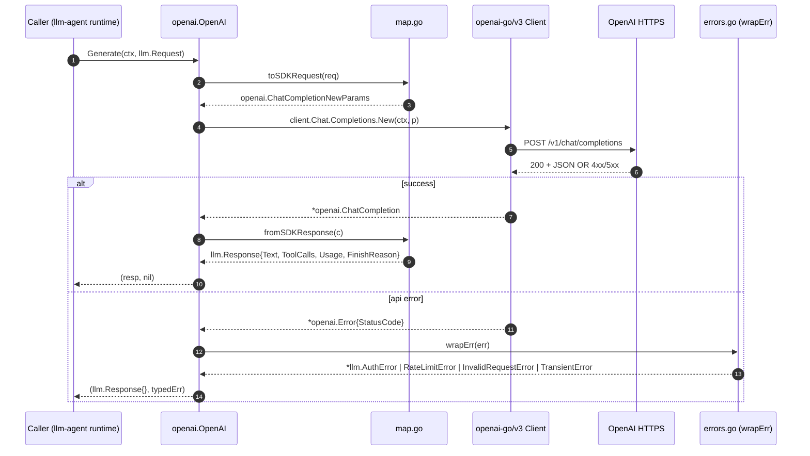
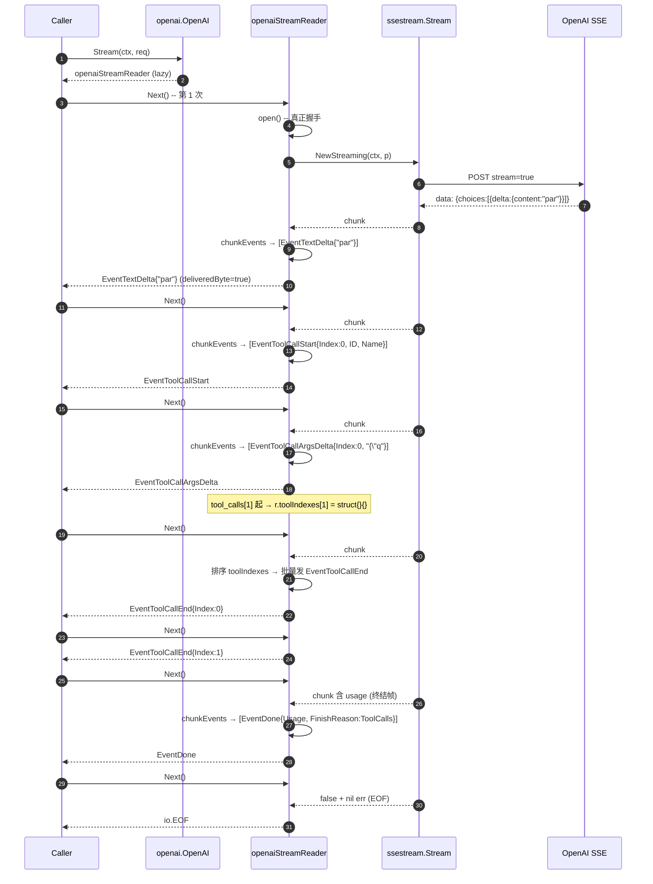
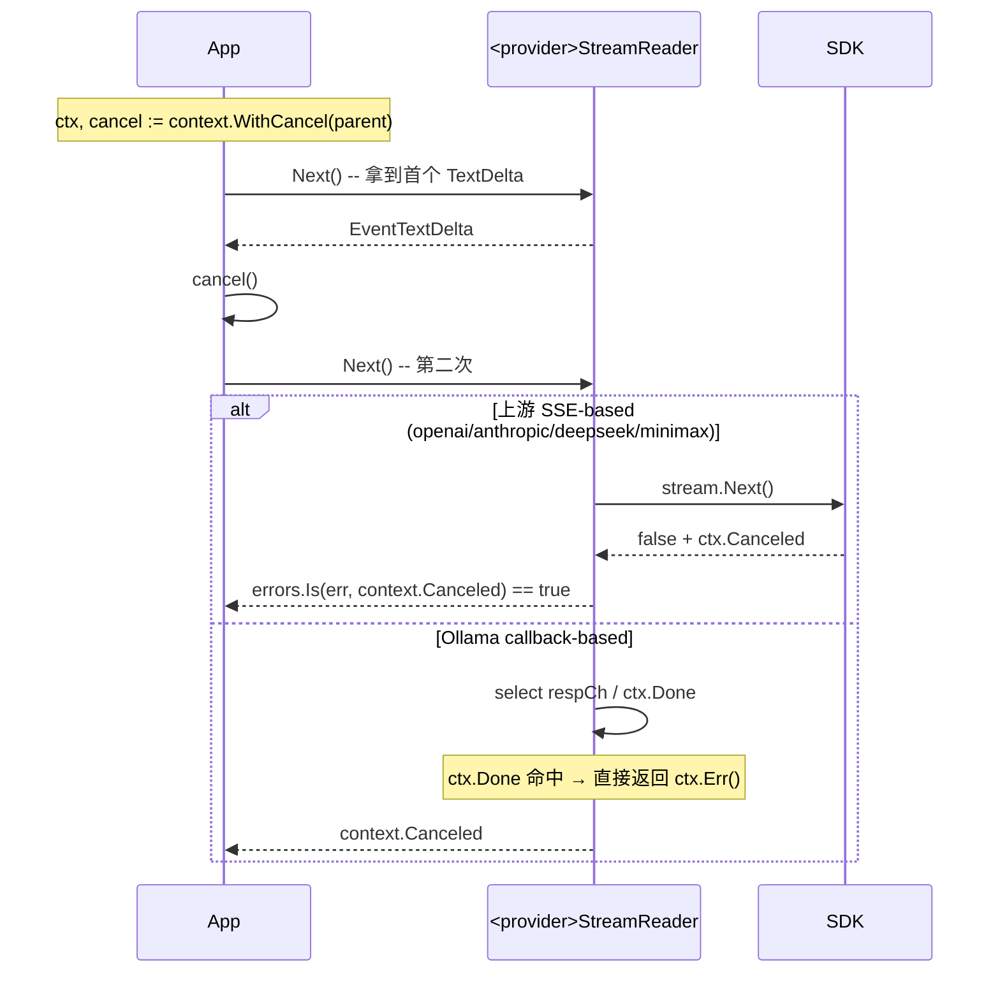

# `llm-agent-providers` 源码级设计说明

> 仓库根：`/home/hellotalk/code/go/src/github.com/costa92/llm-agent-ecosystem/llm-agent-providers/`
> 子项目规模：36 个 `.go` 文件、约 6.6K 行代码（其中测试 ~2 890 行）
> 核心包：`anthropic/`、`openai/`、`ollama/`、`deepseek/`、`minimax/`、`internal/contract/`、`internal/compat/`（v0.2.4 新增）、`scripts/`
> Go 版本：`go 1.26.0`（`llm-agent-providers/go.mod:3`），核心依赖 `github.com/costa92/llm-agent v0.5.1`（`llm-agent-providers/go.mod:7`）
> 当前 tag：**v0.2.4**（2026-05-23 v1.3 milestone 闭合 — 落地 `internal/compat` 共享 timeout + error 映射，P1-23 + P1-6 同步闭合）。
> 本文档基于源码逐文件深读后撰写；所有断言均带 `file:line` 引用。

---

## 1. 概述与定位

### 1.1 子项目使命

`llm-agent-providers` 是 4-repo 伞形生态（`llm-agent` 内核 + `llm-agent-providers` 适配 + `llm-agent-otel` 观测 + `llm-agent-customer-support` 业务样例）中的 **"适配层"**。

它对内承接 `llm-agent/llm` 的四个能力接口：

- `llm.ChatModel` —— `Generate` / `Stream` / `Info`
- `llm.ToolCaller` —— `WithTools(tools) (ToolCaller, error)`
- `llm.Embedder` —— `Embed(ctx, texts)` / `EmbedDimensions()`
- `llm.StructuredOutputs` —— 目前仅在 `Capabilities.StructuredOutputs` 字段上预留位置，尚无任何 provider 翻转其为 `true`

对外承接 5 家厂商的 wire-format：

| 适配器 | SDK 依赖 | 协议形态 |
|---|---|---|
| `openai/` | `github.com/openai/openai-go/v3 v3.35.0` | Chat Completions + Embeddings + SSE |
| `anthropic/` | `github.com/anthropics/anthropic-sdk-go v1.41.0` | Messages API + SSE |
| `ollama/` | `github.com/ollama/ollama v0.23.2`（`api` 子包） | `/api/chat` + `/api/embed`，ndjson 回调式流 |
| `deepseek/` | 同 openai-go/v3 | OpenAI-兼容 Chat Completions + SSE |
| `minimax/` | 同 anthropic-sdk-go | Anthropic-兼容 Messages + SSE |

依赖矩阵的关键含义见 `llm-agent-providers/.planning/codebase/CONCERNS.md:59-70`：5 个适配器只共用了 3 套上游 SDK，其中 openai-go 同时服务 openai+deepseek，anthropic-sdk-go 同时服务 anthropic+minimax。**这是 K1 流模型差异的物理根源——任何 SDK 大版本跳变都需要同时改动两个适配器。**

### 1.2 在伞形项目中的位置

```text
                            ┌──────────────────────────┐
                            │     llm-agent (内核)      │
                            │  llm.ChatModel etc.       │
                            └──────────┬───────────────┘
                                       │ 依赖
                            ┌──────────▼───────────────┐
                            │  llm-agent-providers      │  ← 本仓
                            │  适配 5 家厂商             │
                            └──────────┬───────────────┘
                                       │ 被引用
        ┌──────────────────────────────┼──────────────────────────────┐
        ▼                              ▼                              ▼
┌──────────────┐             ┌──────────────────┐         ┌──────────────────────┐
│ llm-agent-   │             │ llm-agent-otel   │         │ llm-agent-customer-  │
│ rag          │             │ (OTel wrappers)  │         │ support (业务样例)    │
└──────────────┘             └──────────────────┘         └──────────────────────┘
```

`scripts/workspace.sh` 提供 `go.work` 一键 sibling 链接（`llm-agent-providers/scripts/workspace.sh:1-40`），用于跨仓本地联调；同时 `release/**` 分支的 `release-precheck` 工作流会拒绝 `replace` 指令（README `llm-agent-providers/README.md:96-103`），从而保护 tag 不被 sibling replace 污染。

### 1.3 K1 与 K2 两条硬约束

伞形 README 把整套生态的硬约束总结为 **Keystone K1/K2**，5 个适配器都必须服从：

- **K1**：流模型必须用 `llm.StreamEvent` typed-union 把 `Kind` (`EventTextDelta` / `EventToolCallStart` / `EventToolCallArgsDelta` / `EventToolCallEnd` / `EventThinkingDelta` / `EventDone`) 暴露给调用方，并且同一次 tool call 在 Start → ArgsDelta → End 三阶段共享同一个稳定的 `Index`。
- **K2**：能力声明（`llm.Capabilities`）是 **per (provider × model)** 的事实——即 "我是 ollama 的 nomic-embed-text" 与 "我是 ollama 的 llama3.1:8b" 必须报出不同的 `Capabilities`。`Info()` 永远只反映构造时绑定的那一个 model。

K1/K2 在源码中的合规分数（参考 `llm-agent-providers/.planning/codebase/CONCERNS.md:7-20`）：

| Provider | K1 | K2 | 备注 |
|---|---|---|---|
| openai | GREEN | GREEN | 参考实现 |
| anthropic | GREEN | GREEN | content-block index 直通 |
| ollama | YELLOW | GREEN | **流不发 tool-call 事件**（见 §5） |
| deepseek | GREEN | GREEN | 状态截至 2026-05-22：P1-7 conformance 已合（PR #17）+ P1-8 capabilitiesForModel 已合（PR #18 commit 5f619dd）|
| minimax | GREEN | GREEN | 同 deepseek（commit 4484ac0）|

---

## 2. 设计思想（核心 6 条）

### 2.1 Bound-model adapter（K2 的运行时表现）

每个 provider 的 `New(opts ...Option)` 都把 model name 烫进 `ProviderInfo.Model` 并立即用它推导 `Capabilities`：

- `openai/options.go:67-83`：`embeddings := false; switch cfg.model { case "text-embedding-3-small", ...: embeddings = true }`
- `ollama/options.go:74-109`：`strategy := strategyForModel(cfg.model); embedDim := embeddingDimensionForModel(cfg.model)`，把 `Tools` 与 `Embeddings` 都做成 model-dependent
- `anthropic/options.go:71-80`：`Tools=true, Embeddings=false` 静态（Anthropic 整家都没 embeddings）
- `deepseek/options.go:93` / `minimax/options.go:93`：~~硬编码 `{Tools:true, Embeddings:false, ...}`，与 cfg.model 无关~~ → **已修，状态截至 2026-05-22**：P1-8 已合（PR #18 commit 5f619dd + 4484ac0），现 `Capabilities: capabilitiesForModel(cfg.model)`，由 `deepseek/capabilities.go` / `minimax/capabilities.go` 显式 switch model name 决定。K2 精神已对齐。

整个数据流后续读 model 都走 `o.info.Model`（`openai/map.go:29`、`anthropic/map.go:30`、`ollama/map.go:24`、`deepseek/map.go:29`、`minimax/map.go:30`），因此 model 自构造起即不可变；`llm.Request` 也不携带 model 字段，从协议层堵死 per-request override 的 anti-pattern。

### 2.2 每 provider 独立小包（无统一注册中心）

5 个 provider 各自是平铺 Go package，**没有顶层 `providers` 聚合包**、**没有按名字派发的工厂**。消费者按需 import 子包：

```go
m, _ := openai.New(openai.WithModel("gpt-4o-mini"), openai.WithAPIKey(key))
```

这一选择带来两个直接结果：

- 消费方只承担自己用到的 SDK 依赖（如 customer-support 只 import ollama 时不会拖入 openai-go/anthropic-sdk-go）
- 加新 provider 是 **零核心改动**——只需新建一个目录，没有注册回路要维护

每个 provider 目录结构刻意保持一致（参考 `llm-agent-providers/.planning/codebase/ARCHITECTURE.md:60-70`）：

```
<provider>/
  doc.go         // 包级别 godoc
  options.go     // New + WithX functional options
  <provider>.go  // 类型、Generate/Stream、StreamReader 实现
  map.go         // toSDKRequest / fromSDKResponse / mapFinishReason
  errors.go      // wrapErr：SDK 错误 → llm.* 哨兵错误
  README.md      // 单页用法
  <provider>_test.go
```

### 2.3 `internal/contract` 作为跨 provider 一致性的唯一抽象

`internal/contract` 是仓内唯一的 internal 包，提供：

- `Fixture` JSON schema（`internal/contract/contract.go:17-50`）—— 请求断言 + 上游响应 + 期待的 typed 结果三段式
- `LoadFixture` / `NewMockServer` —— 把 JSON 变成 `httptest.Server`
- `AssertGenerate` / `AssertStream` / `AssertToolCalling` / `AssertEmbed` —— 把 LMSE 结果对照 fixture 期望
- `AdapterFactories` —— 把 5 个 provider 的 `New` 包装成 baseURL 注入的工厂（`internal/contract/generate_test.go:22-57`）

注意：`contract.go` 不是 `_test.go`，因此暴露在生产 `go build` 路径上；但所有签名都依赖 `*testing.T`，事实上只能被 `_test.go` 调用（详细讨论见 `llm-agent-providers/.planning/codebase/CONCERNS.md:180-186`）。这是有意为之，让 fixture 抽象可以跨包复用。

### 2.4 Streaming typed-union（K1 的代码表达）

K1 把"上游 wire-format 各种花花绿绿"压平到 6 种 `llm.StreamEvent.Kind`：

| Kind | 含义 |
|---|---|
| `EventTextDelta` | 文本增量 |
| `EventThinkingDelta` | 思考链增量（仅 Anthropic/MiniMax） |
| `EventToolCallStart` | 工具调用开始（含 `Index`, `ID`, `Name`） |
| `EventToolCallArgsDelta` | 工具调用参数 JSON 增量（同 `Index`） |
| `EventToolCallEnd` | 工具调用结束（同 `Index`） |
| `EventDone` | 终结事件（携带 `Usage` 与 `FinishReason`） |

实现层面，每个 SSE-based reader 都内嵌一个 `queue []llm.StreamEvent`，单 chunk → N 个 typed 事件的解碎逻辑封装在 `chunkEvents` / `eventToStreamEvents`：

- `openai/openai.go:158-231`
- `anthropic/anthropic.go:122-197`
- `deepseek/deepseek.go:113-186`
- `minimax/minimax.go:122-197`
- `ollama/ollama.go:197-313`（最复杂的一个，因为有内容内嵌 tool 的 fallback）

### 2.5 "Stdlib-only HTTP" 的实际边界

伞形 README 提及 "stdlib-only HTTP"。在 providers 仓的事实是：**每个适配器都在官方 SDK 之上薄薄包一层**，并不直接拼 `net/http` 请求。具体看 `go.mod` 第 6-9 行：

```
github.com/anthropics/anthropic-sdk-go v1.41.0
github.com/costa92/llm-agent v0.5.1
github.com/ollama/ollama v0.23.2
github.com/openai/openai-go/v3 v3.35.0
```

"stdlib-only" 的精确解读应理解为：**对外暴露的公共类型与 mock 测试链路都基于 `net/http` 与 `net/http/httptest`**（参见 `internal/contract/contract.go:6-9`），但实际 wire-format encode/decode 借助官方 SDK。这种"借力 SDK，包薄 wrapper"的策略带来的代价见 §7.1 的耦合分析。

### 2.6 错误归一化：4 个哨兵 + 1 个 capability sentinel

每个 provider 的 `errors.go` 都把 SDK/HTTP 错误映射到 `llm-agent/llm` 暴露的 5 类错误：

| 类型 | 来源 HTTP | 来源 Go |
|---|---|---|
| `*llm.AuthError` | 401, 403 | — |
| `*llm.RateLimitError` | 429, 529 (Anthropic) | — |
| `*llm.InvalidRequestError` | 400/404 等其它 4xx | — |
| `*llm.TransientError` | 5xx | `context.DeadlineExceeded`, `net.Error` |
| `llm.ErrCapabilityNotSupported` | — | 能力缺失，sentinel + `%w` |

`context.Canceled` 永远透传，不包装；这是后文 §5 cancel 时序图的基础。

---

## 3. 共享契约（`internal/contract/`）

### 3.1 文件清单与职责

| 文件 | 行数 | 角色 |
|---|---|---|
| `internal/contract/contract.go` | 283 | Fixture schema、mock server、Assert* 辅助 |
| `internal/contract/generate_test.go` | 494 | 跨 provider conformance suite（注册 factories + 跑所有 fixture） |
| `internal/contract/main_test.go` | 11 | 接入 `goleak.VerifyTestMain`，全包测试都防 goroutine 泄漏 |
| `internal/contract/ollama_live_test.go` | 62 | `//go:build ollama_live` testcontainer 实测 |
| `internal/contract/testdata/<provider>/*.json` | — | fixture corpus（见 §3.4） |

### 3.2 `Fixture` 数据结构（`internal/contract/contract.go:17-50`）

```go
type Fixture struct {
    Scenario string   // 描述字段，仅用于报错
    Tools    []{Name, Description, Parameters}   // 注入到 WithTools()
    Request  {Method, Path, BodyAssertions[]}    // mock server 用以校验
    Response {Status, Headers, Body}             // mock server 直接 write
    Expect   {ErrorType, ResponseText, FinishReason,
              UsageInputTokens, UsageOutputTokens, UsageSource,
              Provider, EmbeddingCount, EmbeddingDims[],
              ToolCalls[{ID, Name, Arguments}]}  // 对 Assert* 做强断言
}
```

`BodyAssertions` 支持两种轻量语法（`internal/contract/contract.go:89-95`）：
- `"key=value"` → 检测 `body` 是否含 `value` 子串
- 否则整体作为子串匹配

这是一个有意保持的"足够弱"语法，避免把整个 JSON schema 校验拉进 fixture——但代价是 fixture 写错时不会报错，只是漏校验。

### 3.3 Assert* 辅助（`internal/contract/contract.go:99-282`）

- `AssertGenerate(t, model, f)`：调 `Generate` 一次，`assertResponse` 对 `Text`/`Provider`/`FinishReason`/`Usage`/`ToolCalls` 多字段比对（`:199-268`）
- `AssertStream(t, model, f)`：调 `Stream`，再用 `llm.AccumulateStream(sr)` 把所有事件累加成一份等价 `Response`，再走 `assertResponse`——这里巧妙利用了 K1 typed-union 的可压缩性（`:108-126`）
- `AssertToolCalling(t, model, f)`：先 type-assert `llm.ToolCaller`，再 `WithTools(tools)`，再 `Generate`。`Expect.ErrorType == "CapabilityNotSupported"` 走 `errors.Is(err, llm.ErrCapabilityNotSupported)` 分支，这是 K2 capability gap 的官方校验路径（`:128-160`）
- `AssertEmbed`：用 `model.(llm.Embedder)` 反向检测；对 Anthropic 这种"结构上不实现 Embedder"的 provider 期待 `ok=false`（`:162-197`）

### 3.4 fixture 矩阵

`testdata/` 目录现状（`find internal/contract/testdata -name '*.json'`）：

| Provider | generate happy | generate 错误 | stream | tool | embed |
|---|---|---|---|---|---|
| openai | ✓ | 401 / 429×2 / 500 | ✓ | happy + parallel | ✓ |
| anthropic | ✓ | 400 / 401 / 429 / 529 | ✓ | happy + multiblock | not_supported |
| ollama | ✓ | 404 / 500 | ✓ | ✓ | ✓ |
| deepseek | ✓ | — | ✓ | ✓ | — |
| minimax | ✓ | — | ✓ | ✓ | — |

`internal/contract/generate_test.go:82-148` 通过参数化 `t.Run` 把 fixture 喂给对应工厂。值得注意的是 deepseek/minimax 已经接入 `AdapterFactories`（`:43-56`），但还没有错误码 fixture（CONCERNS.md `.planning/codebase/CONCERNS.md:23-29` 的 HIGH 项已部分关闭，剩余的是错误路径覆盖度）。

### 3.5 mock server 行为（`internal/contract/contract.go:66-86`）

只是一个 `http.HandlerFunc`：拿到请求做 method/path/body 断言，按 fixture 的 status/headers/body 写回去。**故意没有路由**——同一个 mock server 服务任意 path，因为 fixture 已经在 `Request.Path` 校验里限制了前缀。这种"扁平 mock"是 fixture-driven test 的关键简化点。

### 3.6 高阶 conformance test（`internal/contract/generate_test.go:281-402`）

除了 fixture-replay，还有几个手写的 conformance test 验证更微妙的运行时不变量：

- `TestStream_CancelMidStream_Conformance`（`:281-330`）：mock server 写 1 个 chunk 后 hang，调用方 `cancel()`，期待 `errors.Is(err, context.Canceled)` 且 cancel latency ≤ 100ms
- `TestStream_PartialUsageOnError_Conformance`（`:332-375`）：mock server 第一个 chunk 正常、第二个 chunk 注入错误，期待先收到 `EventTextDelta` 再收到 non-nil error
- `TestToolCalling_DedupeKey`（`:235-264`）：基于 `messageID + ":" + ToolCall.ID` 的去重——这是消费侧的合同，文档化"Index 稳定 + ID 全局唯一"
- `TestToolCalling_UnsupportedErrorSentinel`（`:266-279`）：Ollama llama2 模型 → `errors.Is(err, llm.ErrCapabilityNotSupported)`
- `TestErrorString_NoSecretLeak`（`:377-402`）：构造一个 wrapped error 含 fake `Authorization: Bearer sk-FAKE-...`，断言 4 类哨兵错误都保持 `errors.Is` 链。**注意：这个测试目前只 Log 不 Fatal**（`:393-396` `t.Logf`），并未硬性禁止 secret 出现在 `Error()` 中（详见 §7.3）

### 3.7 Live 测试（`ollama_live_test.go`）

`//go:build ollama_live` 隔离的 testcontainer 实测路径：

- 拉镜像 `ollama/ollama:0.5.7`（可被 `OLLAMA_TC_IMAGE` 覆盖）
- 容器内 `ollama pull llama3.1:8b-instruct-q4_K_M`
- 走 `ConnectionString` 连入 `ollama.New`
- 复用 `LoadFixture("ollama", "generate_happy_llama3.1-8b")` 但清掉非确定字段（`f.Expect.ResponseText = ""`, `UsageInputTokens = 0`, `UsageOutputTokens = 0`）

被 GitHub Actions `nightly-ollama-live.yml` 工作流每晚跑一次（在 `.github/workflows/`）。

---

## 4. 每 Provider 实现深度分析

### 4.1 OpenAI（参考实现）

**文件**：`openai/openai.go`（232 行）、`options.go`（87）、`map.go`（131）、`errors.go`（58）、`doc.go`、`openai_test.go`（590）

**编译期接口断言**（`openai/openai.go:14-18`）：

```go
var (
    _ llm.ChatModel  = (*OpenAI)(nil)
    _ llm.ToolCaller = (*OpenAI)(nil)
    _ llm.Embedder   = (*OpenAI)(nil)
)
```

#### 4.1.1 能力声明

`openai/options.go:67-83`：

```go
embeddings := false
switch cfg.model {
case "text-embedding-3-small", "text-embedding-3-large", "text-embedding-ada-002":
    embeddings = true
}
```

`EmbedDimensions()`（`openai/openai.go:83-94`）按 model 返回 `1536 / 3072 / 1536 / 0`——0 是 sentinel"未知 model"。

支持的模型：测试覆盖 `gpt-4o-mini`（chat）、`text-embedding-3-small`（embed）。

#### 4.1.2 Generate 路径

`openai/openai.go:26-33`：直接调 SDK，`wrapErr` 包装错误。
`openai/map.go:12-56` `toSDKRequest`：
- 把 `SystemPrompt` 头插入 `openai.SystemMessage(...)`
- 把 `[]Message` 按 role 分发到 `UserMessage/AssistantMessage/SystemMessage`
- `MaxOutputTokens > 0` → `MaxCompletionTokens`
- `Temperature` 走 `openai.Float(*req.Temperature)`
- 有 tools 时 `ParallelToolCalls = true`，schema 走 JSON round-trip 进 `shared.FunctionParameters`

`openai/map.go:66-90` `fromSDKResponse`：
- `Choices[0].Message.Content` → `Text`
- `Choices[0].FinishReason` 走 `mapFinishReason`（`:92-107`：`stop/length/content_filter/tool_calls/function_call/_`）
- `sdkToolCalls(c)`：跳过 `Type != "function"`、调 `call.AsFunction()` 析出 `ID/Name/Arguments`
- `Usage` 走 `llm.UsageReported` source

#### 4.1.3 Stream 路径（K1 的标杆实现）

`openai/openai.go:35-42`：返回一个**惰性打开**的 `openaiStreamReader`。`open func() *ssestream.Stream[...]` 直到 `Next()` 第一次调用才真正握手。

`openaiStreamReader.Next()`（`openai/openai.go:108-144`）核心循环：
1. 已关闭 → `io.EOF`
2. queue 有事件 → 弹首
3. stream nil → 调 `r.open()`
4. `r.stream.Next()`：拿到一个 SDK chunk → 走 `chunkEvents`，append 进 queue → 回到 step 2
5. SDK 返回错误 + **未交付过任何字节** + **未重试过** → `retried = true` 重开（这是"first-byte-retry"语义）

`chunkEvents(chunk)`（`openai/openai.go:158-231`）：
- 若 chunk 含 usage（`Usage.JSON.TotalTokens.Valid()` 或 `TotalTokens != 0`）→ 发一个 `EventDone`，携带 `r.lastFinish`
- 否则遍历 `chunk.Choices`：
  - `Delta.Content != ""` → `EventTextDelta`
  - 每个 `tool` delta：
    - 把 `int(tool.Index)` 记到 `r.toolIndexes`
    - `tool.ID != "" || tool.Function.Name != ""` → `EventToolCallStart{Index, ID, Name}`
    - `tool.Function.Arguments != ""` → `EventToolCallArgsDelta{Index, ID, ArgsDelta}`
  - `choice.FinishReason != ""` → 更新 `r.lastFinish`；若是 `tool_calls`，按 `Index` 排序后批量发 `EventToolCallEnd`

**关键点**：`EventToolCallEnd` 不在每个 tool 完成时单独发，而是在 `finish_reason="tool_calls"` 到达时**统一一次性发完**（`:211-225`）。这是因为 OpenAI 协议中 tool call 没有"个体收尾事件"，整个工具组在一个 finish_reason 上收尾。

#### 4.1.4 Embed 路径

`openai/openai.go:52-81`：
- 空数组 → 返回 `Source: UsageReported` 的零值
- 否则调 `Embeddings.New(...)` with `EncodingFormat: Float`
- 把 `resp.Data[*].Embedding` 从 `[]float64` 拷贝成 `llm.Vector` (`[]float32`)
- `Usage.InputTokens = PromptTokens`, `OutputTokens = 0`

#### 4.1.5 错误归一化（`openai/errors.go:12-57`）

```go
if errors.Is(err, context.Canceled) { return err }
if errors.Is(err, context.DeadlineExceeded) { return &TransientError{...} }
var apiErr *openai.Error
if errors.As(err, &apiErr) {
    switch apiErr.StatusCode {
    case 401, 403:        return &AuthError
    case 429:              // 解析 Type/Code == "insufficient_quota" → Reason = "quota_exhausted"
                          // 解析 Response.Header["Retry-After"]
                          return &RateLimitError
    case 500, 502, 503, 504: return &TransientError
    default if 4xx:        return &InvalidRequestError
    }
}
var netErr net.Error
if errors.As(err, &netErr) { return &TransientError }
return err  // 最终回退：原样
```

OpenAI 是少数几个尝试解析 `Retry-After` 头并区分 `quota_exhausted` 子类的实现。

#### 4.1.6 测试矩阵（`openai_test.go`，17 个测试函数）

包含 `WithTools_OpenAI_ImmutableAndIndependent`（`openai_test.go:110`）——验证 `WithTools` 返回的是 clone，原 instance 的 tools 不变。这是 K2 的"adapter immutability"补充约束。

`TestStream_OpenAI_RetriesBeforeFirstByte`（`:251`）与 `TestStream_OpenAI_DoesNotRetryAfterFirstByte`（`:292`）—— first-byte-retry 语义的双向保证。

### 4.2 Anthropic

**文件**：`anthropic/anthropic.go`（198）、`options.go`（82）、`map.go`（146）、`errors.go`（49）、`doc.go`、`anthropic_test.go`（547）

**接口断言**（`anthropic/anthropic.go:13-16`）：**只有 `ChatModel` + `ToolCaller`，没有 `Embedder`**——结构性表达 capability gap，调用方做 `model.(llm.Embedder)` 会得到 `ok=false`。

#### 4.2.1 能力声明

`anthropic/options.go:71-80`：硬编码 `Tools=true, Embeddings=false`。属于"Anthropic 整家都没 embeddings API"的静态事实，所以没有 model-aware 矩阵。

支持选项：`WithBetaHeader(v)` 注入 `anthropic-beta` header（`:35`, `:60-62`）——这是 Anthropic 的特性开关机制。

#### 4.2.2 Generate 路径

`anthropic/anthropic.go:24-31`：调 `client.Messages.New(...)`。
`anthropic/map.go:10-61` `toSDKRequest`：
- **System prompt 提升**：Anthropic 协议要求 `system` 在 top-level 而非 messages 里，所以 `Role == "system"` 的消息被**抽出来拼接**到 `sysPrompt` 里，最后塞进 `p.System = []TextBlockParam{{Text: sysPrompt}}`
- **MaxTokens 必填**：API 强制要求非零，所以默认值 `1024`（`:32`），仅当 `req.MaxOutputTokens > 0` 才覆盖。注意这是和 OpenAI 显著不同的细节——OpenAI 默认不填 MaxCompletionTokens
- Tools：`ToolChoice = OfAuto`（`:45-47`），即让模型自决
- Tool schema：通过 `toToolInputSchema`（`:108-145`）从 `json.RawMessage` 中拆出 `properties` / `required` / `type`，剩余字段塞进 `ExtraFields`——这是为了适配 Anthropic SDK 的强类型 `ToolInputSchemaParam` 结构

`fromSDKResponse`（`:63-93`）：
- 遍历 `m.Content` block：`type == "text"` 累加文本，`type == "tool_use"` 走 `block.AsToolUse()` 析出 `ID/Name/Input`
- `mapAnthropicStopReason`：`end_turn/stop_sequence → Stop`、`max_tokens → Length`、`tool_use → ToolCalls`

#### 4.2.3 Stream 路径（content-block 模型）

Anthropic 流的设计哲学与 OpenAI 不同：**每个 content block 一个 lifecycle**（start/delta/stop），index 由协议自身赋予且本身就稳定，这天然契合 K1。

`anthropicStreamReader` 内部状态（`anthropic/anthropic.go:57-70`）：
- `blockKinds map[int]string` —— block index → "text" / "tool_use" / "thinking"
- `blockMeta map[int]toolBlockMeta` —— tool block 的 `(id, name)`
- `usage llm.Usage`、`finish llm.FinishReason` —— 累积到 `MessageStopEvent` 一次性 flush

`eventToStreamEvents(ev)`（`:122-197`）核心 switch：

| SDK 事件 | 翻译为 K1 |
|---|---|
| `MessageStartEvent` | 记录初始 usage（仅 input_tokens 已知） |
| `MessageDeltaEvent` | 更新 finish_reason + 累计 usage |
| `ContentBlockStartEvent` (TextBlock) | 仅记录 `blockKinds[idx] = "text"` |
| `ContentBlockStartEvent` (ToolUseBlock) | 发 `EventToolCallStart{Index, ID, Name}` 并记 `blockMeta[idx]` |
| `ContentBlockStartEvent` (ThinkingBlock) | 仅记录 `blockKinds[idx] = "thinking"` |
| `ContentBlockDeltaEvent` (TextDelta) | 发 `EventTextDelta{Text}` |
| `ContentBlockDeltaEvent` (InputJSONDelta) | 发 `EventToolCallArgsDelta{Index, ID, ArgsDelta}` |
| `ContentBlockDeltaEvent` (ThinkingDelta) | 发 `EventThinkingDelta{Text}` |
| `ContentBlockStopEvent` | 若 `blockKinds[idx] == "tool_use"` 发 `EventToolCallEnd{Index, ID, Name}` |
| `MessageStopEvent` | 发 `EventDone{Usage, FinishReason}` |

**注意一个微妙点**：`blockKinds[idx] = "text"` 这一支并不在 stop 时发 `EventTextDelta` 的关闭事件——text block 没有"显式 end" 的 K1 事件，因为后续的 chunk 已经把所有 text delta 都发完了。tool block 则因为参数 JSON 是流式 partial，必须等到 `ContentBlockStopEvent` 才能告诉调用方"这个 tool call 的参数完整了"。

`first-byte-retry` 语义与 OpenAI 完全一致（`:91-103`）：未交付字节且未重试过 → 重开 stream。

#### 4.2.4 错误归一化（`anthropic/errors.go`）

注释 `// Q2 path A: anthropic-sdk-go publicly re-exports type Error`（`:12-14`）——这是 design log 里的设计选择，因为最初考虑过用 `errors.As` 抓 `*sdk.APIError` 还是 `*sdk.Error`，最终选了后者。

特殊点：**`529 → RateLimitError`**（`:33`）——Anthropic 用 529 表示 "overloaded"，按速率限制类语义对齐。

### 4.3 Ollama（最复杂、最有特色的实现）

**文件**：`ollama/ollama.go`（325）、`options.go`（112）、`map.go`（170）、`errors.go`（57）、`tool_strategy.go`（164）、`embed_strategy.go`（28）、`doc.go`、`ollama_test.go`（676）

#### 4.3.1 整体特点

Ollama 适配器与其他四家有四点根本不同：

1. **SDK 是 callback-based**——`client.Chat(ctx, req, func(resp api.ChatResponse) error { ... })`，每个 chunk 走一次回调；没有 `ssestream` 这种 iterator。
2. **HTTP 是 ndjson 而非 SSE**——每行一个 JSON 对象，没有 `data: ` 前缀。
3. **per-model tool 策略**——同一个 Ollama daemon 下不同 model 的 tool 调用约定完全不同：llama3.1 用 `<|python_tag|>` 标记、qwen 用 `<tool_call>` XML 或裸 JSON。
4. **流不发 tool-call 事件**——这是 K1 的 YELLOW 项（CONCERNS.md `:13-16`）。Ollama 协议本身的 tool 信息只在 `done: true` 那一帧才到达，并且适配器把它们用 `EventTextDelta` 路径或 content-buffer 路径处理。

#### 4.3.2 模型策略表（`ollama/tool_strategy.go:20-48`）

```go
type ollamaToolStrategy struct {
    family       string  // "llama3.1" / "qwen2.5-coder" / "qwen3-coder" / "unsupported"
    parserKind   string  // "python_tag" / "qwen_json_or_xml" / ""
    supportsTool bool
}
```

`strategyForModel(model)` 按 prefix 匹配：
- `llama3.1*` → `python_tag`
- `qwen2.5-coder*` / `qwen3-coder*` → `qwen_json_or_xml`
- 其它 → `unsupported`（`supportsTool=false`）

`embedding_strategy.go:10-20` 单独维护 embed 维度：
- `nomic-embed-text*` → 768
- `all-minilm*` → 384
- 其它 → 0（=不支持）

注意 `embed_strategy.go:22 supportsEmbeddings(model)` 是 dead code（CONCERNS.md `:144-146`），所有判断都直接走 `embeddingDimensionForModel(...) > 0`。

#### 4.3.3 自定义 RoundTripper 抓 status

Ollama SDK 的错误对象不总携带 HTTP status，所以 `options.go:35-46` 装了一个 `statusCapturingTransport`：

```go
type statusCapturingTransport struct {
    inner http.RoundTripper
    last  *int32
}
func (t *statusCapturingTransport) RoundTrip(req *http.Request) (*http.Response, error) {
    resp, err := t.inner.RoundTrip(req)
    if resp != nil {
        atomic.StoreInt32(t.last, int32(resp.StatusCode))
    }
    return resp, err
}
```

`errors.go:25-46` 优先用 `*api.StatusError` / `api.AuthorizationError` 抓状态，回退用 `o.lastStatus` 的原子值。这是 Ollama 适配器独有的复杂度。

#### 4.3.4 Generate 路径（`ollama/ollama.go:28-39`）

注意：**Generate 也用 Stream 协议**——Ollama SDK 的 `client.Chat(ctx, req, callback)` 无论 `Stream` 字段是否为 true 都是回调驱动。`toSDKRequest`（`map.go:10-40`）设 `Stream = &streamOff`，daemon 端会一次性回吐整个 final chunk。`captured api.ChatResponse` 接住它。

`fromSDKResponse`（`map.go:49-64`）走 `parseResponseToolCalls(resp, o.strategy)`（`tool_strategy.go:50-63`）：
- 优先把 `Message.ToolCalls` 当原生工具调用解码
- 否则按 `strategy.parserKind` 跑 `parsePythonTagToolCalls` / `parseQwenToolCalls`

这两个 fallback parser 的细节：

**`parsePythonTagToolCalls`**（`tool_strategy.go:90-108`）：找 `<|python_tag|>` 标记，标记前是 prose，标记后是 JSON envelope `{name, arguments|parameters}`。

**`parseQwenToolCalls`**（`tool_strategy.go:112-141`）：先用 regex `<tool_call>...</tool_call>` 抓多个；找不到则把整段当 bare-JSON envelope 试一次（处理 `qwen2.5-coder` 这种"直接吐 JSON 没有包裹"的边角情况）。

#### 4.3.5 Stream 路径（K1 真正的复杂度集中点）

`ollama/ollama.go:41-68`：起一个 goroutine 桥接 SDK 回调到 channel：

```go
sr := &ollamaStreamReader{
    ctx, cancel,
    respCh:   make(chan api.ChatResponse, 1),
    errCh:    make(chan error, 1),
    hasTools: len(o.tools) > 0,
    strategy: o.strategy,
}
go func() {
    defer close(sr.respCh)
    err := o.client.Chat(ctx, sdkReq, func(resp api.ChatResponse) error {
        select {
        case <-ctx.Done(): return ctx.Err()
        case sr.respCh <- resp: return nil
        }
    })
    sr.errCh <- o.wrapErr(err)
    close(sr.errCh)
}()
```

这是仓内唯一一个用 goroutine + channel 模式的 reader——其他 SSE-based reader 都是同步迭代。`goleak.VerifyTestMain`（`internal/contract/main_test.go:9`）守住"goroutine 不能泄漏"的合同。

`ollamaStreamReader.Next()`（`ollama/ollama.go:144-190`）的循环：
1. closed → EOF
2. pending 队列有事件 → 弹首
3. done == true → EOF
4. `ctx.Err()` 非 nil → 返回 cancel/deadline
5. `select { respCh, ctx.Done }`——**注意：不在主路径 select errCh**。注释 `:166-170` 明确指出原因：errCh 与 respCh 都缓冲一个，若 select 命中 errCh 时 respCh 还有未消费 chunk 会被丢。错误只在 respCh 关闭后取（即"先把所有 chunk 取完"）

`ingest(resp)`（`ollama/ollama.go:197-313`）是真正翻译 K1 的地方，**根据 `hasTools` 和 `strategy.parserKind` 走不同分支**：

```text
hasTools = len(o.tools) > 0
parserKind ∈ {"", "python_tag", "qwen_json_or_xml"}
bufferContent = hasTools && parserKind != ""
```

| 分支 | 流式行为 |
|---|---|
| `bufferContent=false`, 无 tools | chunk-by-chunk 发 `EventTextDelta`，最后发 `EventDone` |
| `bufferContent=false`, 有 tools 且 model 走原生 `Message.ToolCalls` | text 立即发；每个原生 tool call 在到达时连发 `EventToolCallStart` + `EventToolCallArgsDelta` + `EventToolCallEnd`（三事件单 chunk 内全发） |
| `bufferContent=true`（content-parsed strategy） | text 进 `contentBuf` 缓存直到 `Done`，再用 `python_tag` / `qwen_json_or_xml` parser 抽 tool call。如果 chunk 中途出现原生 tool call，先 flush 已缓存的 text |

`nextIdx` 单调递增的 synthesized index（`:135`）——Ollama 协议没有 native tool index，适配器要自己造一个稳定的。

`Done` 帧处理（`:248-313`）：
- `mapOllamaDoneReason(resp.DoneReason)` 把 `stop/load/length` 翻译成 `FinishReason`
- 若 `bufferContent` 且 `nextIdx == 0`（一个原生 tool 都没发）：跑 parser 抽 tool call；找到则 strip tool 标记后发 cleaned text + 合成三件套；找不到则原样把 buffer 当 text 发
- `nextIdx > 0` 且 finish 是 Stop/Unknown → 强制升级为 `FinishReasonToolCalls`（`:297-299`，弥补 Ollama 在 tool 路径下不给 explicit `tool_calls` finish 的缺陷）

测试覆盖：
- `TestStream_Ollama_NativeToolCalls`（`ollama_test.go:487-546`）—— llama3.1 native 路径
- `TestStream_Ollama_QwenXMLContentToolCalls`（`:548-614`）—— qwen3 content-parsed 路径，断言 tool markers 不泄漏到 TextDelta
- `TestStream_Ollama_NoToolsLeavesTextStreaming`（`:616-648`）—— 回归保险，确认 tool-less 调用不会被 content-buffer 误伤

#### 4.3.6 Embed 路径（`ollama.go:81-108`）

- 先 capability check：`!o.info.Capabilities.Embeddings` → `unsupportedEmbeddingError(model)`（`embed_strategy.go:26-28`），返回 `llm.ErrCapabilityNotSupported`-wrapped 错误
- 调 `client.Embed(ctx, ...)`，把 `[][]float32` 拷贝成 `[]llm.Vector`
- `Usage.InputTokens = PromptEvalCount`、`OutputTokens = 0`

#### 4.3.7 错误归一化（`ollama/errors.go`）

- 优先 `*api.AuthorizationError` → AuthError
- 然后 `api.StatusError` 拿 status
- 再 fallback 到 `lastStatus` 原子值（即上面的 RoundTripper 抓到的）
- 404 + msg 含 "not found"/"not pulled" → `InvalidRequestError`（典型场景：`ollama pull` 还没拉模型）
- 5xx → `TransientError`，其它 4xx → `InvalidRequestError`
- `net.Error` / msg 含 "connection refused" → `TransientError`（daemon 未启动场景）

### 4.4 DeepSeek

**文件**：`deepseek/deepseek.go`（187）、`options.go`（102）、`map.go`（131）、`errors.go`（58）、`doc.go`（4）、`deepseek_test.go`（508）

DeepSeek 是 OpenAI-兼容 API，**适配器代码与 openai 几乎逐行对应**（CONCERNS.md `:104-116`）：

- 同样的 SDK：`openai-go/v3`
- 同样的 streamReader 状态机
- 同样的 `chunkEvents` 形态（`deepseek/deepseek.go:113-186` ≈ `openai/openai.go:158-231`）

差异点：

| 维度 | OpenAI | DeepSeek |
|---|---|---|
| Embedder 接口 | 实现 | 未实现（`deepseek.go:14-17` 缺 `llm.Embedder`） |
| Default base URL | SDK 内置 | `https://api.deepseek.com`（`options.go:21`） |
| Region 选项 | 无 | `RegionCN` / `RegionGlobal`，但 `baseURLForRegion` 当前对两者都返回同一 URL（`options.go:46-53`） |
| `Capabilities` | model-aware | **硬编码** `{Tools:true, Embeddings:false, ...}` |

`Region` 选项目前是一个**未兑现的承诺**（CONCERNS.md `:146-151`）—— API 在那儿，但 routing logic 是 no-op。

#### 4.4.1 测试矩阵（17 个测试函数）

完整覆盖了 happy + tool + stream + 错误码（`401/403/429×2/500/404`），还有：
- `TestStream_DeepSeek_RetriesBeforeFirstByte`（`:318-356`）：first-byte-retry 同 OpenAI
- `TestStream_DeepSeek_ToolCalls`（`:359-421`）：parallel tool calls 的多 Index 跟踪
- `TestWithTools_DeepSeek_ImmutableAndIndependent`（`:177-265`）：clone 隔离

### 4.5 MiniMax

**文件**：`minimax/minimax.go`（198）、`options.go`（102）、`map.go`（146）、`errors.go`（47）、`doc.go`（4）、`minimax_test.go`（569）

MiniMax 是 Anthropic-兼容 Messages API，**代码与 anthropic 几乎逐行对应**：

- 同样的 SDK：`anthropics/anthropic-sdk-go`
- 同样的 content-block 流模型（`minimax/minimax.go:122-197` ≈ `anthropic/anthropic.go:122-197`）
- 同样的 system prompt lifting（`map.go:20-26`）
- 同样的 `MaxTokens` 默认 1024（`map.go:31`）

差异点：

| 维度 | Anthropic | MiniMax |
|---|---|---|
| Default base URL | SDK 内置 | `https://api.minimax.chat`（`options.go:21`） |
| BetaHeader | 支持 `WithBetaHeader` | 不支持 |
| Region 选项 | 无 | `RegionCN` / `RegionGlobal`，no-op（同 DeepSeek 问题） |

#### 4.5.1 测试矩阵（13 个测试函数）

涵盖 happy / multi-block tool use / system top-level / 错误码（`400/401/429/500/529`），还有 `TestStream_MiniMax_PartialJSONFlushesOnContentBlockStop`（`:220-296`）—— content-block stop 时验证 partial JSON 拼接的完整性。

### 4.6 五家 Provider 横向对照

| 维度 | openai | anthropic | ollama | deepseek | minimax |
|---|---|---|---|---|---|
| SDK | openai-go/v3 | anthropic-sdk-go | ollama/api | openai-go/v3 | anthropic-sdk-go |
| 协议 | SSE | SSE | ndjson + callback | SSE | SSE |
| Embedder | ✓ | ✗（结构性缺） | model-aware ✓ | ✗ | ✗ |
| 流 tool 事件 | ✓ Index | ✓ Index（block index） | **✗（仅 text + done）** | ✓ Index | ✓ Index（block index） |
| Thinking delta | ✗ | ✓ | ✗ | ✗ | ✓ |
| First-byte-retry | ✓ | ✓ | N/A（callback 自带） | ✓ | ✓ |
| 自定义 RoundTripper | ✗ | ✗ | ✓（status 抓取） | ✗ | ✗ |
| Region 选项 | ✗ | ✗ | ✗ | 占位 no-op | 占位 no-op |
| BetaHeader | ✗ | ✓ | ✗ | ✗ | ✗ |
| caps 来源 | model 名（embed） | 静态 | model 名（tool + embed） | 静态 | 静态 |
| 测试 LOC | 590 | 547 | 676 | 508 | 569 |

---

## 5. 关键时序图

### 5.1 Generate（非 streaming，以 OpenAI 为例）



源码点位：`openai/openai.go:26-33` → `openai/map.go:12-90` → `openai/errors.go:12-57`。Anthropic 与 MiniMax 的等价路径在 `*/anthropic.go:24-31` / `*/minimax.go:24-31`；DeepSeek 同 openai；Ollama 因为是 callback 模型，多一步"用 captured 变量在闭包内截取"（`ollama/ollama.go:30-37`）。

### 5.2 Stream + Tool Call（K1，以 OpenAI parallel tool 为例）



源码点位：`openai/openai.go:108-231`。同形态在 deepseek/deepseek.go:63-186。

#### 5.2.1 cancel 流的对照路径



`TestStream_CancelMidStream_Conformance`（`internal/contract/generate_test.go:281-330`）规定 cancel latency ≤ 100ms，并禁止把 cancel 包装成 `TransientError`（见 `openai/errors.go:16-18` 等 `if errors.Is(err, context.Canceled) { return err }` 短路）。

---

## 6. 测试策略

### 6.1 三层测试金字塔

```
┌────────────────────────────────────────────┐
│  L3: ollama_live (build tag, nightly CI)   │  testcontainer 实测
├────────────────────────────────────────────┤
│  L2: internal/contract conformance         │  fixture-driven, httptest mock
├────────────────────────────────────────────┤
│  L1: <provider>_test.go per-package        │  细粒度 httptest mock
└────────────────────────────────────────────┘
```

- **L1**：每个 provider 自己的 `*_test.go`，覆盖：constructor 必填校验、`Info()` shape、`WithTools` 不可变性、`Generate` happy + 错误码、`Stream` happy + retry/cancel/tool calls、各 wire-format 细节
- **L2**：`internal/contract/generate_test.go` 用 fixture 文件做跨 provider 黑盒一致性。`AdapterFactories` 把每个 provider 的 `New` 包装成 baseURL 注入工厂，让同一份 `Assert*` 跑遍所有 5 家
- **L3**：`internal/contract/ollama_live_test.go` 用 `testcontainers/testcontainers-go/modules/ollama` 起真容器跑 happy path；带 `//go:build ollama_live` tag，正常 PR CI 不跑

### 6.2 关键测试模式

#### `goleak` 全局守门

`internal/contract/main_test.go`：

```go
func TestMain(m *testing.M) {
    goleak.VerifyTestMain(m)
}
```

针对 Ollama 那个 goroutine bridge 的隐性合同。

#### Fixture JSON 的双向对称

`testdata/<provider>/<scenario>.json` 同时声明：
- 入站请求断言（`request.body_assertions`）
- 出站响应（`response.body`，可以是 SSE 文本或 JSON）
- 期望的 typed 结果（`expect.response_text` 等）

这种"录像回放"风格的好处：增加一个错误码场景 = 加一个 JSON 文件，零代码改动。

#### `httptest.Server` 与 SDK base URL 注入

所有 SDK 都支持 `option.WithBaseURL(...)` 把请求重定向到 mock server。`AdapterFactories[c.provider](srv.URL)` 一行注入完成。

#### 错误链不可中断

`TestErrorString_NoSecretLeak`（`internal/contract/generate_test.go:377-402`）的真正断言不是"secret 不出现"，而是 `errors.Is(typedErr, innerErr)`：保证 `*llm.AuthError{Wrapped}` 不会切断 `errors.Is` 链，让调用方依然能拿到原始 SDK error。

#### Capability-not-supported 的双重测试

`TestToolCalling_CapabilityDegrade_Ollama`（`generate_test.go:181-199`）：build Ollama llama2（不支持工具）→ `WithTools` 返回 `errors.Is(err, ErrCapabilityNotSupported) == true`。
`TestToolCalling_UnsupportedErrorSentinel`（`:266-279`）：再用 `llm.ToolCaller` 接口断言形式重测。

### 6.3 测试覆盖盲区

参考 CONCERNS.md `:23-29`：

1. **DeepSeek/MiniMax 的错误码 fixture 缺失**——它们已经在 `AdapterFactories` 里，但 `testdata/deepseek/` 与 `testdata/minimax/` 没有 401/429/500 文件
2. **Streaming cancel + partial-usage 对 deepseek/minimax 未跑**——`TestStream_CancelMidStream_Conformance`（`:283-289`）只有 openai/anthropic/ollama
3. **`TestErrorString_NoSecretLeak` 只 Log 不 Fatal**——`:393-396`

---

## 7. 设计优化与替代方案

### 7.1 架构层

#### 7.1.1 contract 抽象层次：当前过薄

> **状态（2026-05-23）：部分已落地（P1-23 v0.2.4）**。`internal/compat` 内部包已新增，导出 `DefaultTimeout`（5/5 provider 共享）+ `WrapOpenAIError`（openai + deepseek 共享）+ `WrapAnthropicError`（anthropic + minimax 共享），消除了 `options.go` 与 `errors.go` 的 byte-for-byte 重复。**ollama** 的 `errors.go` 保留 atomic-state pattern 仅借用 `compat.DefaultTimeout`（Path A 取舍）。**streaming reader（`chunkEvents` / `eventToStreamEvents`）抽取仍 pending**：包名最终演化为单一 `internal/compat` 而非两个家族包，因为 timeout 跨 5 家共享而错误映射只需 SDK 家族二分。stream.go 抽取留待 v1.4 窗口。下方原方案不动以保留审计轨迹。

`internal/contract` 只是测试辅助；运行时五个 provider 没有任何共享代码。CONCERNS.md `:104-116` 已点明：openai/deepseek、anthropic/minimax 在源码上分别是 ~90% 重复。Streaming reader 改一边，另一边手工同步——drift 风险高。

**建议**：抽出 `internal/openaicompat` 与 `internal/anthropiccompat` 两个内部包，把 `chunkEvents` / `eventToStreamEvents` 这两块逻辑做成 provider-name 注入参数的可复用 reader：

```go
// internal/openaicompat/stream.go
type StreamReader struct {
    Provider string  // "openai" / "deepseek" / 未来的 ZhipuGLM-OpenAI-compatible
    open     func() *ssestream.Stream[openai.ChatCompletionChunk]
    // ...
}
```

成本：~150 LOC 重排；收益：未来加 Zhipu / Moonshot 这类 OpenAI-兼容 provider 时近零成本。

#### 7.1.2 新增 provider 的接入成本

当前接入新 provider 需要：

1. 新建 `<provider>/` 目录
2. 写 6 个 `.go` 文件（约 500-700 LOC）
3. 复制 fixture 模板到 `testdata/<provider>/`
4. 在 `internal/contract/generate_test.go AdapterFactories` 加注册
5. 写 `_test.go`（约 500-600 LOC）

总成本约 1 天工程师时间。**对比"集中式 provider 包"的另一种设计**：单仓单包 + `RegisterProvider(name, factory)` + dispatch by string——会让以上 5 步变成 1 步，但牺牲了"消费方只 import 用到的 SDK"的优势。当前的 sibling-package 选择对 customer-support 这类"只用一两家"的下游友好。

#### 7.1.3 Region 与 Beta header 等占位 API 的清理

`deepseek/options.go:46-53` 与 `minimax/options.go:46-53` 的 `baseURLForRegion` 都是 no-op switch（CN 和 Global 返回同一 URL）。**建议两条路二选一**：

- (a) 删除 `Region` 类型直到 CN endpoint 与 Global 真正分流
- (b) 把 CN endpoint 填进去（DeepSeek 的国内地址、MiniMax 的 `api.minimaxi.com` 等）

否则就是 API surface 的虚晃一枪。

### 7.2 性能层

#### 7.2.1 HTTP 连接池与超时

> **状态（2026-05-23）：已落地（P1-6 / P1-23 v0.2.4）**。`internal/compat/timeout.go::DefaultTimeout(d) time.Duration` 已落地（零值返回 60 s，非零原样返回），5/5 `options.go` 统一调用 `cfg.timeout = compat.DefaultTimeout(cfg.timeout)`：`openai/options.go:55` / `anthropic/options.go:55` / `deepseek/options.go:73` / `minimax/options.go:73` / `ollama/options.go:99`。stuck connection → Generate 无限挂起的现实风险已闭合。下方原建议不动以保留审计轨迹。

CONCERNS.md `:86-93` 已指出：所有 provider 的 `New` 都**不设默认 timeout**。如果用户从来不调 `WithTimeout`，stuck connection 会导致 `Generate` 无限挂起。

**建议**：在所有 5 个 `options.go` 的 `New` 函数末尾加：

```go
if cfg.timeout == 0 {
    cfg.timeout = 60 * time.Second  // 默认 60s
}
```

或对 streaming 单独设更长 default（如 5min），sync 用 60s。

#### 7.2.2 streaming reader 无界 queue

CONCERNS.md `:96-102`：四个 SSE-based reader 都用 `queue []llm.StreamEvent` 无界 slice。一个上游 chunk → N 个 K1 事件（典型场景：anthropic ContentBlockDelta 拆出 ArgsDelta + TextDelta 多个）。如果消费方暂停 `Next()`，queue 会持续增长。

**建议**：要么显式文档化"queue 长度受输出长度上界"，要么把 queue 改成 `chan llm.StreamEvent` 有界 buffer（与 Ollama 当前的 `respCh: make(chan, 1)` 风格对齐）。

#### 7.2.3 retry 与 rate limit

当前明确把 retry 的责任推给上游 caller（5 个 provider 都 `option.WithMaxRetries(0)`，参考 `openai/options.go:50` 等）。这是符合 SOLID 的设计选择，但意味着调用方必须自己实现 backoff（典型在 `llm-agent` 核心层）。

**建议**：在每个 typed error 上加结构化字段（已部分支持，比如 `RateLimitError.RetryAfter`）。**状态截至 2026-05-22**：原文叙述的 Anthropic / Ollama / MiniMax 三家"都没解析 `Retry-After`"问题 **已 5/5 全部 lift**（P1-9 已合）：anthropic + minimax 通过 PR #19，ollama 通过 PR #20（commit 537b351）；deepseek 已在历史 PR 同步落地。当前 `openai/anthropic/deepseek/minimax/ollama` 5 个 `errors.go` 均含 `Retry-After` 解析路径，K4 retry 信号完整。原叙述保留以记录评审日（2026-05-21）状态。

### 7.3 可观测性层

#### 7.3.1 没有 trace / metric / log

当前 provider 包是观测哑层（CONCERNS.md `:173-178`）。`llm-agent-otel` 仓负责把 OpenTelemetry wrap 套在 ChatModel 外层。

**这是有意为之的边界**——保持 provider 包零依赖污染，让用户选择是否注入观测。但留下两个具体痛点：

1. **token 计数透出粒度低**——只在 `EventDone` 的 `Usage` 字段，调用方拿不到"截至当前 N 个事件用了多少 token"
2. **错误日志缺失**——所有 wrapErr 路径无任何 hook，"adapter 内部失败 + retry"对外完全不可见

**建议**：增加可选 `WithObserver(o ProviderObserver)` 选项：

```go
type ProviderObserver interface {
    OnRequest(ctx context.Context, info RequestInfo)
    OnResponse(ctx context.Context, info ResponseInfo)
    OnStreamEvent(ctx context.Context, ev llm.StreamEvent)
    OnError(ctx context.Context, err error)
}
```

`llm-agent-otel` 实现一个版本注入即可，provider 包本身仍然 zero-dep。

#### 7.3.2 Secret 泄漏防护

`TestErrorString_NoSecretLeak`（`internal/contract/generate_test.go:377-402`）当前只 Log 不 Fatal。**建议**：

- 改成 `t.Errorf` 硬断言
- 在每个 `wrapErr` 入口加 sanitizer：`s := strings.NewReplacer("Authorization: Bearer ", "Authorization: Bearer [REDACTED] ").Replace(err.Error())` 重建 inner error

### 7.4 开发者体验（DX）层

#### 7.4.1 加新 provider 的清单太散

虽然每个 provider 都遵循相同的 6 文件结构，但没有"new provider template" 脚本。**建议**：补 `scripts/new-provider.sh <name> <sdk-style>` 生成骨架。

#### 7.4.2 Capability 声明的 ergonomics

~~DeepSeek / MiniMax 现在 caps 硬编码~~（**已修，状态截至 2026-05-22**）：P1-8 已合（PR #18 commit 5f619dd + 4484ac0），`deepseek/capabilities.go` + `minimax/capabilities.go` 已落地 `capabilitiesForModel`，K2 精神对齐。保留下方原建议示例以记录设计依据。

**原建议（现已落地）**：每个 provider 加 `capabilitiesForModel(model) llm.Capabilities` 辅助，即使所有 case 都返回同一字面量：

```go
// deepseek/capabilities.go
func capabilitiesForModel(model string) llm.Capabilities {
    switch model {
    case "deepseek-chat", "deepseek-reasoner", "deepseek-coder":
        return llm.Capabilities{Tools: true}
    default:
        return llm.Capabilities{Tools: true}  // 保底
    }
}
```

强制未来加新 model 时显式过一遍 case，能在第一时间发现"新 reasoning-only 模型不支持 tools"这类问题。

#### 7.4.3 配置统一化

5 个 `WithAPIKey` / `WithBaseURL` / `WithHTTPClient` / `WithTimeout` 重复声明（`*/options.go`），可考虑做一个 `internal/optcommon` 包让它们共用结构体（保留 `WithBetaHeader` / `WithRegion` 等差异化项作为 provider-private 扩展）。

但这是低优先级——重构带来的可读性损失可能不抵省下的 100 LOC。

#### 7.4.4 doc.go 修订

CONCERNS.md `:38-43`：`openai/doc.go` / `anthropic/doc.go` / `ollama/doc.go` 都还有 Phase-1 时代的"streaming deferred to Phase 2"陈年文字（虽然 ollama/doc.go:1-15 已部分更新）。DeepSeek/MiniMax 的 doc.go 反而是干净的当前态模板（4 行）。

**建议**：把那两段过时描述的 Anthropic / OpenAI doc.go 重写为单段当前能力描述。

---

## 8. 遗留问题与未来方向

### 8.1 已识别的近期工作（按优先级，参考 CONCERNS.md `:194-200`）

| 优先级 | 项 | 文件参考 |
|---|---|---|
| HIGH | DeepSeek/MiniMax 错误路径 fixture 补齐 | `testdata/deepseek/` / `testdata/minimax/` |
| MEDIUM | 5 个 provider 默认 timeout 兜底 | `*/options.go` New 函数末尾 |
| MEDIUM | DeepSeek/MiniMax `capabilitiesForModel` 显式化 | `deepseek/options.go:93-98`、`minimax/options.go:93-98` |
| MEDIUM | doc.go 重写 Phase-1 残留 | `openai/doc.go`、`anthropic/doc.go` |
| MEDIUM | README 版本号过期（`v0.4` → `v0.5`） | `llm-agent-providers/README.md:9-10, 106-110` |
| LOW | 清理 dead `supportsEmbeddings` | `ollama/embed_strategy.go:22` |
| LOW | Region API：填实或删除 | `deepseek/options.go:46-53`、`minimax/options.go:46-53` |

### 8.2 中期：扩展更多 provider

仓库设计已经为以下扩展留了空间：

- **Google Gemini**：自定义 SSE/`responseStream`，行为更接近 Anthropic 的 content-block 模型——可借鉴 anthropic 适配器结构
- **AWS Bedrock**：多 model family（Claude / Llama / Titan），可能需要 Bedrock-runtime SDK；适配粒度按 family 拆 provider 还是按 endpoint 共用，是设计决策
- **Azure OpenAI**：与 openai 仅 `option.WithBaseURL` + `WithAPIVersion` header 不同，**建议直接复用 `openai` 适配器加一个 `WithAzure` 模式**而不是开新包

每加一家 SDK-相同 / wire-相同的 provider，§7.1.1 提出的 openaicompat / anthropiccompat 内部包就越值得抽。**建议在第 3 个 OpenAI-兼容 provider 出现时强制抽取**。

### 8.3 中期：流式 function-call 完备性

Ollama 目前不发流式 tool-call 事件（K1 YELLOW）。要补齐需要：

- 解码上游 `Message.ToolCalls` 在每个 ndjson 帧的局部状态
- 把 `python_tag` / `qwen_xml` parser 改造成增量 parser（当前是 buffer-then-parse 一次性，要变成在线状态机）
- 把 `nextIdx` 升级成"基于 native ID/Name 的 keyed map"，以处理 streaming 中后到的 tool call 与已分配 index 的协调

工作量约 200 LOC + 6-8 个新测试。**建议优先级 MEDIUM**——当前 K1 spec 在 Generate 路径已经合规，Stream 路径的合规需求要看下游 `llm-agent` 核心 streaming-tool runtime 何时落地。

### 8.4 长期：HTTP 层自主化

当前 5 个 provider 都重度依赖官方 SDK（CONCERNS.md `:59-70`）。任何 SDK 大版本跳跃（openai-go v3 → v4，anthropic-sdk-go v1 → v2）都需要同时改 2 个 provider。

**长期重构**可以考虑：

- 把 wire-format encode/decode 自实现（stdlib `net/http` + `encoding/json`），不再依赖 SDK 类型
- 优点：100% 解耦上游 SDK 节奏；类型签名稳定到生态层面
- 缺点：失去 SDK 提供的 streaming/SSE/重试等"免费基建"，自实现工作量大

**结论**：这不是当下要做的——SDK 维护良好且业内事实标准。但要在 CI 加 SDK signature drift detection（CONCERNS.md `:69` 建议）：

```go
var _ openai.ChatCompletionNewParams = openai.ChatCompletionNewParams{}
var _ *openai.Error                  = (*openai.Error)(nil)
```

让任何 SDK API 删除/重命名都在编译期立即暴露。

### 8.5 长期：核心 interface 演化

`llm.StructuredOutputs` capability 字段已经在所有 5 个 provider 的 `New` 中预留了位置（全部设为 `false`）。`llm.Capabilities.PromptCaching` 同样。未来当 `llm-agent` 核心定义新的 capability 接口时：

- 加新接口（如 `llm.PromptCacher`）
- 在愿意支持的 provider 上实现并把 `Capabilities.PromptCaching = true`
- 在 `internal/contract` 加对应 `Assert*` 与 fixture 文件

这条扩展路径已经被 5 个 provider 用 `Embedder` / `ToolCaller` 演练过，是已知稳定的扩展方式。

---

## 9. 附录：关键文件索引

| 文件 | 行数 | 主要内容 |
|---|---|---|
| `llm-agent-providers/openai/openai.go` | 232 | OpenAI provider 主体 + streamReader |
| `llm-agent-providers/openai/options.go` | 87 | New + WithX options |
| `llm-agent-providers/openai/map.go` | 131 | toSDKRequest / fromSDKResponse / sdkToolCalls |
| `llm-agent-providers/openai/errors.go` | 58 | wrapErr |
| `llm-agent-providers/anthropic/anthropic.go` | 198 | Anthropic provider + content-block streamReader |
| `llm-agent-providers/anthropic/options.go` | 82 | New + WithBetaHeader |
| `llm-agent-providers/anthropic/map.go` | 146 | toSDKRequest + system prompt lifting + toToolInputSchema |
| `llm-agent-providers/anthropic/errors.go` | 49 | wrapErr（含 529 → RateLimit） |
| `llm-agent-providers/ollama/ollama.go` | 325 | Ollama provider + goroutine bridge stream + ingest 状态机 |
| `llm-agent-providers/ollama/options.go` | 112 | New + statusCapturingTransport |
| `llm-agent-providers/ollama/map.go` | 170 | toSDKRequest + toAPITool + toToolPropertiesMap |
| `llm-agent-providers/ollama/tool_strategy.go` | 164 | strategyForModel + python_tag / qwen parser |
| `llm-agent-providers/ollama/embed_strategy.go` | 28 | embeddingDimensionForModel |
| `llm-agent-providers/ollama/errors.go` | 57 | wrapErr（含 lastStatus / api.AuthorizationError） |
| `llm-agent-providers/deepseek/deepseek.go` | 187 | DeepSeek provider（≈ openai 镜像） |
| `llm-agent-providers/deepseek/options.go` | 102 | New + Region (no-op) |
| `llm-agent-providers/deepseek/map.go` | 131 | toSDKRequest / fromSDKResponse |
| `llm-agent-providers/deepseek/errors.go` | 58 | wrapErr（≈ openai 镜像） |
| `llm-agent-providers/minimax/minimax.go` | 198 | MiniMax provider（≈ anthropic 镜像） |
| `llm-agent-providers/minimax/options.go` | 102 | New + Region (no-op) |
| `llm-agent-providers/minimax/map.go` | 146 | toSDKRequest + system prompt lifting |
| `llm-agent-providers/minimax/errors.go` | 47 | wrapErr（≈ anthropic 镜像） |
| `llm-agent-providers/internal/contract/contract.go` | 283 | Fixture + AssertGenerate/Stream/ToolCalling/Embed |
| `llm-agent-providers/internal/contract/generate_test.go` | 494 | 跨 provider conformance + AdapterFactories |
| `llm-agent-providers/internal/contract/main_test.go` | 11 | goleak 接入 |
| `llm-agent-providers/internal/contract/ollama_live_test.go` | 62 | testcontainer 实测（build tag） |
| `llm-agent-providers/.planning/codebase/ARCHITECTURE.md` | 298 | 上游 codebase map（K1/K2 验证表） |
| `llm-agent-providers/.planning/codebase/CONCERNS.md` | 204 | 风险与改进清单（本文档大量引用） |
| `llm-agent-providers/scripts/workspace.sh` | 40 | 4-repo go.work 引导 |

---

*文档版本：基于 `llm-agent-providers` HEAD（go.mod 引用 `llm-agent v0.5.1`）逐文件深读后撰写。建议与 `docs/source-design-llm-agent.zh-CN.md` 与 `docs/architecture-and-sequence-diagrams.zh-CN.md` 并列阅读，理解适配层在伞形生态中的具体边界。*
