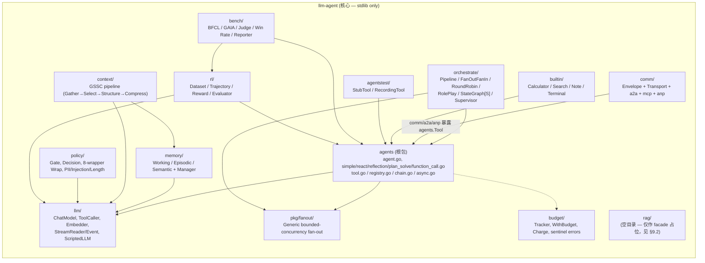
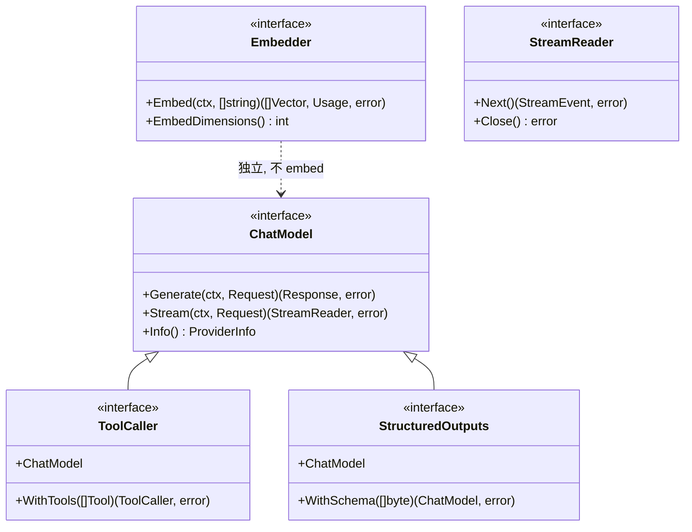
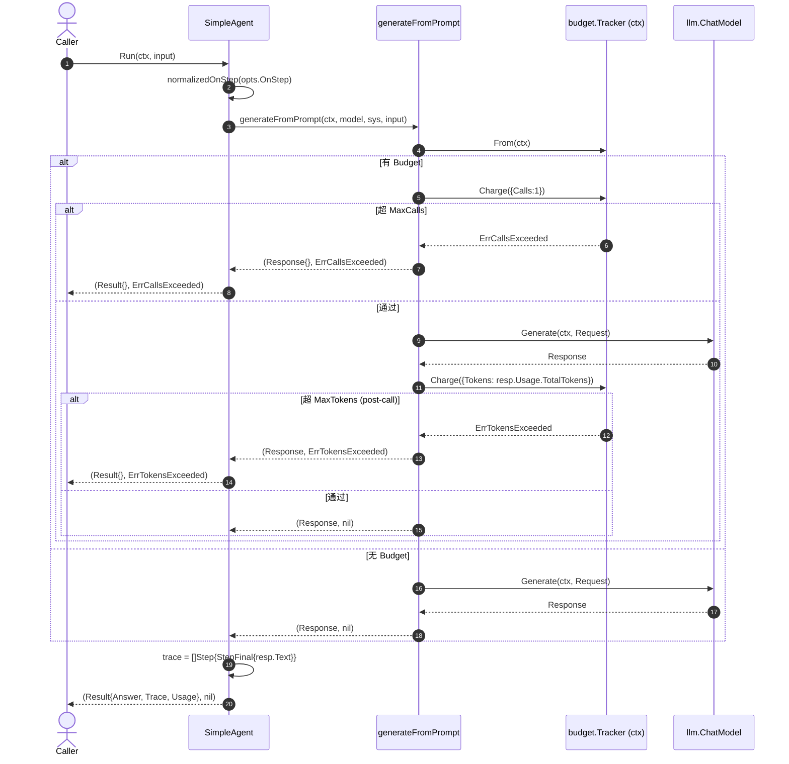
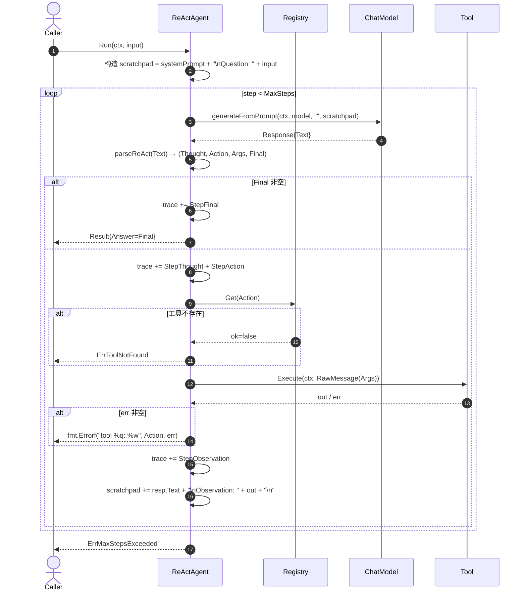
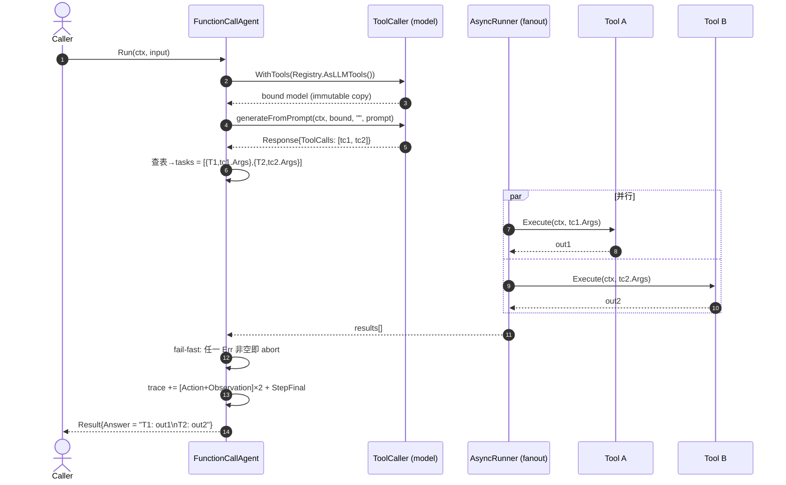
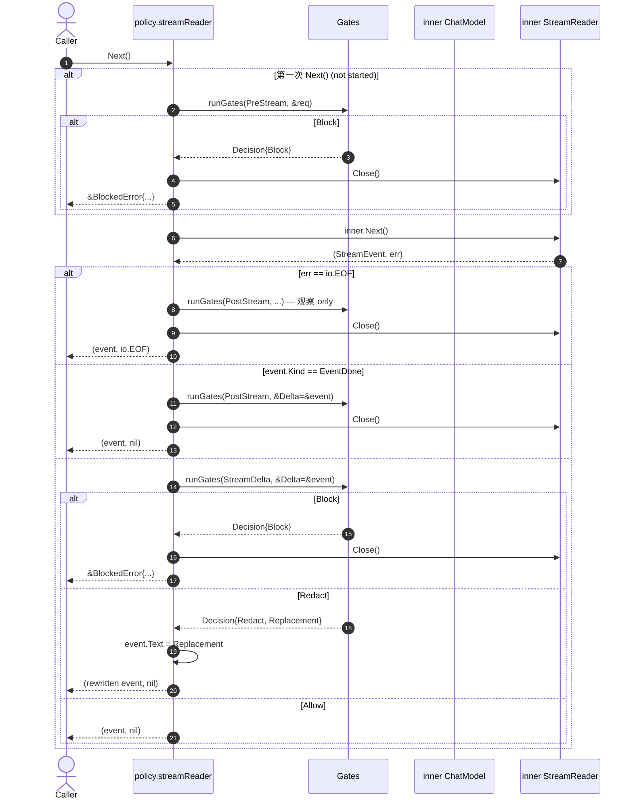

# `llm-agent` 子项目源码级设计

> 仓库路径：`llm-agent-ecosystem/llm-agent/`
> 当前版本：`v0.6.1`（v1.2 Core Capability Deepening 在飞行中）
> 代码规模：约 159 个 `.go` 文件、~24.5K 行（含测试 ~12K 行非测试源码）
> 文档对应代码快照：2026-05-21

---

## 1. 概述与定位

`llm-agent` 是 **`llm-agent-ecosystem` 的核心抽象层**：它不绑定任何具体厂商 SDK、不绑定具体 OTel 实现、不绑定具体向量库；它定义 *agent 抽象* + *ChatModel 接口集* + *Tool 协议* + *多 Agent 编排原语* + *运行时治理（budget / policy）*。生态中所有真实 provider（`llm-agent-providers`）、所有可观测装饰器（`llm-agent-otel`）、所有 RAG 实现（`llm-agent-rag`）、所有 flow 引擎（`llm-agent-flow`）、所有部署样板（`llm-agent-customer-support`）都依赖它。

**硬约束 / Keystone 决策**（写在 `llm-agent/CLAUDE.md` 与 umbrella `README.md`，并由 CI 门禁强制）：

1. **核心 `llm-agent` 必须 stdlib-only**。P0-2 落地（2026-05-22，commit 6029565）后，`go.mod` 已无任何反向边，`go.sum` 为空；B4 stdlib-only assertion gate 现断言"zero direct requires"（详见 §9.2 历史与当前态）。
2. **无 K8s / Helm**：生态范围常驻非目标。
3. **不允许在 tag 分支保留 `replace`**：CI 门禁 `INFRA-04` 强制。
4. **`go.work` 一律 `.gitignore`**：CI 跑 `GOWORK=off`。
5. **Capabilities per `(provider × model)`**（K2）：`ChatModel.Info()` 返回的是绑定模型实例的能力，不是 provider-level。
6. **StreamEvent 是 typed-union**（K1）：`Kind` 枚举 + per-tool-call `Index` 字段稳定标识，禁止"最小公分母 chunk"。
7. **OTel 作为 decorator wrapper**（K3）：`otelmodel.Wrap(inner) ChatModel`，不允许 hook/callback。
8. **`llm.ChatModel`/`agents.Agent`/`memory.Memory`/`orchestrate.NodeFunc[S]`** 四个 *validated* 公开类型不允许编辑（v0.4 验证锁定）。

在生态中的角色（依赖方向，源：umbrella `README.md`）：

```
llm-agent-customer-support → llm-agent + llm-agent-otel + llm-agent-providers + llm-agent-flow
llm-agent-otel             → llm-agent + llm-agent-rag + llm-agent-flow
llm-agent-providers        → llm-agent
llm-agent-flow             → llm-agent
llm-agent                  → (无 — P0-2 已删 rag 反向边，见 §9.2)
llm-agent-rag              → (核心子包 stdlib-only；postgres 子包带 pgx + pgvector-go)
```

---

## 2. 设计思想（Design Philosophy）

| 编号 | 信条 | 为什么 |
|---|---|---|
| **DP-1** | **stdlib-only as a feature, not a constraint** | 任何下游服务都可以"读完每一行再决定要不要用"。一旦核心拉入 SDK，传染会让 OpenAI client、Anthropic client、grpc-go 自动出现在所有 transitive consumer 的依赖图里，使核心失去"读得完"这个最大卖点。 |
| **DP-2** | **小接口 + 能力检测（type assertion + Capabilities）** | `ChatModel` 是基线，`ToolCaller` / `Embedder` / `StructuredOutputs` 各自独立。否则若强行合成一个胖接口，Anthropic 的 `Embedder` 必然返回 `ErrCapabilityNotSupported`（`llm/errors.go:19`），从而把"未实现"作为接口的一等态，调用方无法在编译期判定能力。 |
| **DP-3** | **Capabilities per (provider × model)** | Ollama 的 `qwen3-coder` 输出 XML、`llama3.1` 输出 `<|python_tag|>`、`llama2` 根本不支持 tool；如果按 provider-level 暴露能力，agent 在运行时只能瞎试。Provider 构造时绑定 model（`openai.New(openai.WithModel("gpt-4o"))`），`Info().Capabilities` 立刻反映这个 model 的真实状态（`llm/info.go:8-30`）。 |
| **DP-4** | **Streaming 是 typed union，不是 chunk 流** | `StreamEventKind` 6 个 case + `ToolCallDelta.Index` 稳定主键（`llm/stream.go:21-70`）解决了 OpenAI per-index delta、Anthropic per-content-block delta、Ollama whole-call-at-once 三种语义。如果选最小公分母（"只有 text chunk"），就回不去 native granularity，agent 层会重新做一遍 reassembly，每个 provider 都得"猜"。 |
| **DP-5** | **可观测 / 治理 = decorator，不要 hook** | `policy.Wrap(ChatModel) ChatModel`、`budget.WithBudget(ctx) ctx` 都是组合而不是嵌入。这样 `policy.Wrap(otelmodel.Wrap(provider))` 这个 3 层装饰栈可以自由排序、独立测试，并且核心 `llm.ChatModel` 接口签名永远不动。Hook 会把可观测语义焊死在核心 API 上。Policy 的 8-wrapper 类型开关（`policy/gate.go:43-67`）专门保证了在每一种能力交叉下能力都被装饰链透传。 |
| **DP-6** | **Sentinel error + 类型化 error 双轨** | 核心仅暴露 sentinel（`ErrToolNotFound`、`ErrMaxStepsExceeded`...），让 downstream 通过 `errors.Is` 判定；同时为有结构化字段的错误（`AuthError`、`RateLimitError`、`TransientError`、`BlockedError`）提供 `errors.As` 入口。核心永不引入 `pkg/errors`。 |
| **DP-7** | **Immutable WithTools / WithSchema** | `ToolCaller.WithTools` 返回 *新值* 而不是 mutate（`llm/capabilities.go:13`）。原因：Eino 的 `BindTools` mutate 模式在并发下会出现两个 goroutine 持同一个 model 绑定不同 tool 集的竞态。Immutable 让 `ChatModel` 天然 concurrent-safe。 |
| **DP-8** | **Mock 即一等公民** | `ScriptedLLM`（`llm/scripted.go`）实现 *四种全部 capability*；`ChatOnlyMock` 实现 *仅 ChatModel*；它们一起覆盖"capability-graceful-degradation"测试矩阵。所有 examples 用 ScriptedLLM 跑 `go run .`，零网络、零密钥。生产 provider 通过同一份 conformance suite（在 `llm-agent-providers`）验证。 |

---

## 3. 总体架构

### 3.1 顶层包图



### 3.2 顶层包职责一览

| 包路径 | 职责（一句话） | 关键文件 |
|---|---|---|
| `github.com/costa92/llm-agent` (根) | Agent 接口 + 5 种范式 + Tool/Registry/Chain/Async + 错误集中 sentinels | `agent.go`, `simple.go`, `react.go`, `reflection.go`, `plan_solve.go`, `function_call.go`, `tool.go`, `registry.go`, `chain.go`, `async.go`, `agent_chatmodel.go` |
| `llm/` | LLM provider 合约：`ChatModel` + 三个可选 capability 接口 + `StreamEvent` typed union + `ScriptedLLM` mock | `chatmodel.go`, `capabilities.go`, `stream.go`, `info.go`, `types.go`, `errors.go`, `scripted.go`, `chat_only_mock.go` |
| `orchestrate/` | 6 种多-Agent 编排：Pipeline / FanOutFanIn / RoundRobinChat / RolePlay / StateGraph[S] / Supervisor + 共享 `Termination` 组合子 | `pipeline.go`, `fanout.go`, `roundrobin.go`, `roleplay.go`, `graph.go`, `supervisor.go`, `termination.go` |
| `memory/` | 3 种 in-process memory（Working / Episodic / Semantic）+ Manager + `AsTool` 适配器 | `memory.go`, `working.go`, `episodic.go`, `semantic.go`, `manager.go`, `internal_score.go`, `tool.go` |
| `context/` | GSSC（Gather→Select→Structure→Compress）prompt 装配 pipeline | `builder.go`, `packet.go`, `select.go`, `compress.go`, `token.go` |
| `budget/` | ctx-keyed token / call / wall / cost 配额 + Strict/Soft Tracker | `budget.go` |
| `policy/` | Capability-preserving ChatModel 装饰器 + 5 种 EventKind + PII/Injection/Length 内置 Gate | `policy.go`, `gate.go`, `injection.go`, `pii.go`, `length.go`, `patterns.go` |
| `comm/` | 共享 Envelope/Transport 抽象 + HTTP/Stdio/InMem transport + MCP/A2A/ANP 子协议 | `envelope.go`, `transport.go`, `transport_http.go`, `transport_stdio.go`, `transport_inmem.go`, `mcp/*`, `a2a/*`, `anp/*` |
| `builtin/` | 4 个开箱即用 Tool 实现：Calculator（Pratt parser）/ MockSearch / NoteTool（YAML frontmatter） / TerminalTool（sandbox shell） | `calculator.go`, `search.go`, `note.go`, `terminal.go` |
| `pkg/fanout/` | 泛型 bounded-concurrency 调度器（`Run[T]`、`WithFailFast`、panic-recover） | `fanout.go` |
| `agentstest/` | 测试公用 `StubTool` / `NewErrorTool` / `RecordingTool` | `stub.go`, `recording.go` |
| `bench/` | LLM-Agent benchmark 工具集：BFCL / GAIA / Judge / Win Rate / Reporter | `bfcl.go`, `gaia.go`, `judge.go`, `winrate.go`, `reporter.go`, `fixtures.go` |
| `rl/` | Agentic-RL 评估层：Dataset / Trajectory / Reward / Evaluator / TrainerProxy（仅评估，不训练） | `dataset.go`, `trajectory.go`, `reward.go`, `evaluator.go`, `metrics.go`, `trainer_proxy.go` |
| `rag/` | **已删除**（P0-2，2026-05-22 commit 6029565）：rag-sdk 由下游直接 `import "github.com/costa92/llm-agent-rag/rag"` | — |
| `internal/testenv/` | 测试基础设施（`listen` helper） | `listen.go` |

---

## 4. 关键子系统设计方案

### 4.1 Agent 抽象与五种范式

#### 4.1.1 设计目标

- 用 *最小* 的接口表达 "agent" 这一概念，使 Pipeline / FanOutFanIn / Supervisor 等编排器把任意 agent 当作一个 *黑盒 IO 单元* 调度。
- 同时暴露同步 `Run`（用于测试 / SSR）和流式 `RunStream`（用于 SSE / gRPC stream）。
- 5 种范式（Simple / ReAct / Reflection / PlanAndSolve / FunctionCall）共享 *同一套观测原语* —— `Step` / `StepEvent` —— 不允许各自定义自己的 trace 结构。

#### 4.1.2 关键类型

```go
// agent.go:13-21
type Agent interface {
    Name() string
    Run(ctx context.Context, input string) (Result, error)
    RunStream(ctx context.Context, input string) (<-chan StepEvent, error)
}

// agent.go:28-33
type StepEvent struct {
    Step  Step
    Done  bool
    Final *Result   // Done=true 时二选一
    Err   error
}

// agent.go:58-76
type Step struct {
    Kind    StepKind  // thought / action / observation / reflection / plan / final
    Content string
    Tool    string
    Args    string
    Result  string
}
```

#### 4.1.3 共享 helper

- `agent.go:81-86` `normalizedOnStep(cb)` — nil-OnStep 转 no-op，让 runInternal 不必到处判 nil。
- `agent.go:98-125` `runStreamFromBlocking(ctx, runFn)` — 把"阻塞 Run + onStep callback"模式自动转成 `<-chan StepEvent`，缓冲 16。注释明确写了选 16 的取舍："对慢消费者会回压到 LLM call；不是 bug，是设计"。

#### 4.1.4 五种范式逐一解析

| Range | 实现文件 | 行为 | 选型场景 |
|---|---|---|---|
| **SimpleAgent** | `simple.go:36-63` | 单次 LLM forward，无 tool、无循环。trace 只有一个 `StepFinal`。 | benchmark baseline / Pipeline 中的 generic relay。 |
| **ReActAgent** | `react.go:23-237` | Thought → Action → Observation 循环；解析 `Action:` / `Args:` / `Final:` 文本格式（`react.go:208-236` `parseReAct`）；若 model 同时实现 `llm.ToolCaller` 且 `Capabilities.Tools==true`，进 native 路径 `runNative`（`react.go:154-199`）；否则降级 scratchpad-templating（`runScratchpad`）。 | 需要 tool 但只支持文本输出的旧模型 / 想看完整 reasoning 链。 |
| **ReflectionAgent** | `reflection.go:36-122` | gen → critique → revise 循环；critique 命中 `APPROVED`（`reflection.go:103`）即提前停止。MaxRounds 默认 2。 | 需要"自查/改稿"形态：合规审核、写作辅助。 |
| **PlanAndSolveAgent** | `plan_solve.go:36-128` | plan-once → 逐步执行 → synthesize；plan 解析使用 regexp `(?m)^\s*\d+\.\s+(.+?)\s*$`（`plan_solve.go:130`）。 | 多步骤任务（"先 A 后 B 最后汇总"）；不需要中途调整计划。 |
| **FunctionCallAgent** | `function_call.go:34-142` | 单轮 native function-calling；并行执行多个 tool call 通过 `AsyncRunner`（MaxParallel 默认 4）；fail-fast。 | 一次性多 tool 调用（"查天气+查股价+查日历"）。注意：**单轮 only** —— 由于 `llm.Message` 没有 `ToolCallID` 字段（`function_call.go:18-19` 注释），无法把 tool result 回喂给 LLM 做多轮 native function calling。 |

#### 4.1.5 公共调用胶水：`generateFromPrompt`

集中所有 LLM 调用的"chokepoint"，让 budget 治理可以在唯一点上 hook：

```go
// agent_chatmodel.go:11-54 (摘要)
func generateFromPrompt(ctx, model, systemPrompt, prompt) (llm.Response, error) {
    t, hasBudget := budget.From(ctx)            // KC-4 opt-in
    if hasBudget {
        if err := t.Charge(budget.Usage{Calls: 1}); err != nil {  // pre-call (Q2 — 计入 attempt)
            return llm.Response{}, err
        }
    }
    resp, err := model.Generate(ctx, req)
    if err != nil { return resp, err }
    if hasBudget {
        if cerr := t.Charge(budget.Usage{Tokens: resp.Usage.TotalTokens}); cerr != nil {
            return resp, cerr     // post-call: 同时返回 valid response + 哨兵
        }
    }
    return resp, nil
}
```

设计要点（`agent_chatmodel.go`）：
- **`budget.From(ctx)` 不存在 tracker 时直接 no-op** —— 满足"未开启 budget 时零行为变化"承诺。
- **`MaxCalls` 计入 attempts**（Q2 决策，v1.2 ratified 2026-05-20），denied call 也消耗一次配额，避免重试循环绕过限额。
- **post-call deny 同时返回 valid response 与 sentinel**（Decision 3）：response 已经产生、provider 已收费，扔掉等于双重浪费；调用方通过 `errors.Is(err, budget.ErrBudgetExceeded)` 决定是否使用这次结果。

### 4.2 LLM 抽象（`llm/v2` 等价）与 Capabilities 矩阵

`llm` 包里实质就是研究文档中所说的 *`llm/v2`* —— 项目并未真的拆出一个 `llm/v2` 目录，而是在 `llm/` 内完成等价设计（参见 `llm/doc.go:1-52`）。

#### 4.2.1 接口层级



关键点（`llm/capabilities.go:13-42`、`llm/doc.go:33-43`）：

- **`Embedder` 故意不 embed `ChatModel`** —— 让"纯 embedding-only provider"（例如未来的 voyageai）可以只实现 `Embedder`。
- **`WithTools` / `WithSchema` 返回新值**（immutable，DP-7）。

#### 4.2.2 Capabilities 矩阵

```go
// llm/info.go:25-30
type Capabilities struct {
    Tools             bool
    Embeddings        bool
    StructuredOutputs bool
    PromptCaching     bool
}
```

**canonical 能力协商习语**（`llm/doc.go:37-43`）：

```go
// 编译期信号 + 运行期信号 双重判断
if tc, ok := model.(llm.ToolCaller); ok && model.Info().Capabilities.Tools {
    bound, _ := tc.WithTools(tools)
    return bound.Generate(ctx, req)
}
// 否则降级 scratchpad templating
```

`react.go` 与 `function_call.go` 通过 `nativeToolCaller`（`agent_chatmodel.go:56-65`）封装这一对检查；`function_call.go:41-45` 在构造时即拒绝不支持 tool 的 model（`toolCapabilityError` 返回 `ErrCapabilityNotSupported` 链）。

#### 4.2.3 类型化错误体系

`llm/errors.go` 给出 4 类用 `errors.As` 解构的结构化错误 —— `AuthError` / `RateLimitError` / `InvalidRequestError` / `TransientError`（`llm/errors.go:35-95`）。每个都带 `Wrapped`，调用方既可以 `errors.As` 拿结构（含 `RetryAfter`、`Reason`），也可以 `errors.Unwrap` 看底层 SDK error。

`TransientError` 是 K4 "retry 状态机" 的契约入口 —— 重试逻辑放在 `llm-agent-providers` 而非核心。

#### 4.2.4 ScriptedLLM：一等公民的全能 mock

`llm/scripted.go:29-256`。一个值实现 `ChatModel + ToolCaller + Embedder + StructuredOutputs` 四个接口（`l. 43-48` 编译期断言）；通过 functional options 注入响应序列（`WithResponses`）、能力 mask（`WithCapabilities`）、embedding 维度（`WithEmbedDimensions`）。所有 example、agent 测试、orchestrate 测试都用它，零网络、零密钥。

它的对偶 `ChatOnlyMock`（`llm/chat_only_mock.go`）显式 *不* 实现三个 capability 接口（注释 `// negative assertions in llm/llm_test.go`），专门用于"capability-degradation"路径测试。

### 4.3 Tool / Registry / Chain / Async 子系统

#### 4.3.1 Tool 接口与 FuncTool 桥

```go
// tool.go:16-21
type Tool interface {
    Name() string
    Description() string
    Schema() json.RawMessage     // 上层 provider 校验，本包不验证
    Execute(ctx, args) (string, error)
}
```

`NewFuncTool`（`tool.go:49-65`）允许把一个普通函数包装成 Tool —— 简单工具不必写结构体。返回 `string` 既适合 ReAct 的 Observation prompt-injection，也适合 FunctionCall 的 answer aggregation。

`AsLLMTool`（`tool.go:25-31`）做 `agents.Tool → llm.Tool` 桥接，把 Description / Schema 暴露给 provider 的 native function-calling。

#### 4.3.2 Registry：去全局化的工具表

`registry.go:14-86` 用 `sync.RWMutex` 守护 `map[string]Tool`，强制：

- 重复注册返回 `ErrToolAlreadyRegistered`；`NewRegistry(...)` 在 variadic 出现重复 *panic*（构造时安全 > 运行时静默 shadow）。
- `List()` 按 Name 排序，输出确定性 —— 测试与 prompt 渲染稳定。
- `PromptDescription()` 输出 `"- name: description\n"`，给 ReAct 系统提示注入用。

#### 4.3.3 Chain：Tool 的顺序流水线

`chain.go:14-67` 自身实现 `Tool`，所以可以嵌套：

- 第一个 tool 收原始 args；后续 tool 收 `{"input": prev_output}` —— 这种简化的串联约定避免在框架里引入 schema mapping DSL。
- 失败抛 `chain[i] toolname: err`，保留位置信息便于排错。

#### 4.3.4 AsyncRunner & `pkg/fanout`：并行 Tool 调用基础

`async.go` 是 `pkg/fanout` 的领域绑定 wrapper —— `Task{Tool, Args}` 适配为 `fanout.Task[string]`，结果回填到 `TaskResult{Index, Output, Err}`（保序）。

`pkg/fanout/fanout.go` 才是真正的引擎（`pkg/fanout/fanout.go:66-152`）：

- **Bounded concurrency**：信号量 chan，`maxConcurrency<=0` 表示无限。
- **Default collect-all**：单个 Task 错误不打断同胞；error 写到 `Result.Err`。
- **Fail-fast 模式**：`WithFailFast()` opt-in，触发 `cancel()` 提示同胞退出；已运行的 task 不强杀。
- **Panic safety**：`defer recover()` 把 panic 转成 `*ErrTaskPanic{Recovered, Stack}` 写回结果 —— 单个工具 panic 不再炸进程。
- **结果索引保证**：`results[i].Index == i`；外层 `Run` 唯一 top-level error 来源是 `ctx.Err()`。

### 4.4 Memory：三类内存 + Manager + 内存工具

#### 4.4.1 类型与评分公式（`memory/doc.go:15-19`）

```
Working   = (vec×0.7 + keyword×0.3) × time_decay × (0.8 + importance×0.4)
Episodic  = (vec×0.8 + recency×0.2) ×              (0.8 + importance×0.4)
Semantic  = (vec×0.7 + tag_overlap×0.3) ×          (0.8 + importance×0.4)
```

三类内存（`memory/working.go`、`memory/episodic.go`、`memory/semantic.go`）共享一个 `scoredStore`（`memory/internal_score.go:18-34`）：`map[id]MemoryItem + map[id][]float32` 双映射，加 `sync.Mutex`。

- **Working**：容量限制（默认 50），半衰 24h；超容量时按 *score* evict（评分最低出局），embedder 失败时降级"oldest out"。
- **Episodic**：无容量限制，recency 半衰默认 30 天。
- **Semantic**：K-V + tag 加权，支持 `"tag:a,b real query"` 前缀做 tag 预筛（`memory/semantic.go:88-114`）。

#### 4.4.2 Manager：三类内存的协调器

`memory/manager.go:14-21`。允许任何子集组合（最少一个），`Consolidate` 把 Working 中 `Importance >= Threshold` 的项 *复制* 到 Episodic（不删源），`Forget` 三策略：`importance`（按阈值删）、`age`（按 maxAge 删）、`capacity`（保留 top-K importance）。

#### 4.4.3 `memory.AsTool`：让 Agent 直接操作记忆

`memory/tool.go:21-28`。一个 `agents.Tool` 包裹 Manager，通过 `action` discriminator 提供 8 个动作（add/search/get/update/remove/consolidate/forget/stats），返回 JSON。Schema 完整声明（`memory/tool.go:30-50`）。

### 4.5 GSSC Context Engineering

`context/doc.go`、`context/builder.go:79-114` —— *G*ather → *S*elect → *S*tructure → *C*ompress 四阶段 prompt 装配。

**注意命名冲突**：包名是 `context`，会和 stdlib `context` 冲突。源码用 `stdctx "context"` 别名解决（`context/builder.go:4-9`）；调用方导入时也建议 `aictx "github.com/costa92/llm-agent/context"`。

#### 4.5.1 流水线

1. **Gather**（`context/select.go:89-145` `gather`）：把 5 类输入（SystemPrompt / History / MemoryHits / RAGHits / Custom）统一成 `[]Packet`，每个 Packet 带 `TokenCount`、`Source`、`Timestamp`、`Metadata`。
2. **Select**（`context/select.go:150-210` `selectPackets`）：
   - 评分：System 直接 = 1（必留）；其他用 `jaccardRelevance` 或 `embedderRelevance` 二选一（`context/select.go:13-49`）。
   - 过滤：`MinRelevance` 阈值。
   - 排序：复合分 = `recency × Wᵣ + relevance × Wₗ`；System flat 2.0 保最前。
   - 贪心填充：`budget = MaxTokens × (1 - ReserveRatio)`。
3. **Structure**（`context/compress.go:21-62` `structurePackets`）：固定 5 段输出：`[Role & Policies]` / `[Task]` / `[Evidence]` / `[Context]` / `[History]`。
4. **Compress**（`context/compress.go:76-127` `compress`）：超 budget 时优先 LLM-summarize，再降级 hardTruncate（二分到字节 + `[truncated]` marker）。

#### 4.5.2 TokenCounter

`context/token.go:19-43` `SimpleCounter` —— CJK-aware 启发式：ASCII 词 × 1.3 + CJK rune × 1。"intentionally pessimistic"：宁可超估也不能低估。可通过 `WithTokenCounter` 替换为真实 tokenizer。

### 4.6 RAG Facade（已删除：核心严格 stdlib-only）

**当前实现状态**（v0.6.1，2026-05-23）：

- `llm-agent/rag/` 目录已移除（P0-2，commit 6029565）。
- `llm-agent/go.mod` 不再 `require github.com/costa92/llm-agent-rag`；`go.sum` 为空。
- 没有任何源码 import `llm-agent-rag`；`grep -rn 'llm-agent-rag' llm-agent/` 仅在 doc 注释里出现。
- 下游 `customer-support` 在用 rag 时继续直接 `import "github.com/costa92/llm-agent-rag/rag"`（与历史行为一致）。

**结论**：v1.1 时期声称的"唯一允许的反向边"已撤销。核心仓 `llm-agent` 现严格 stdlib-only — B4 stdlib-only assertion gate 已切到 "zero direct requires"（详见 §9 与 `docs/ecosystem-design-review.zh-CN.md` §4.5）。

### 4.7 Streaming Event Model（K1 keystone）

#### 4.7.1 类型联合定义

```go
// llm/stream.go:22-31
const (
    EventTextDelta StreamEventKind = iota
    EventToolCallStart
    EventToolCallArgsDelta
    EventToolCallEnd
    EventThinkingDelta
    EventDone
)

// llm/stream.go:41-47
type StreamEvent struct {
    Kind         StreamEventKind
    Text         string
    ToolCall     *ToolCallDelta   // ToolCall* kinds
    Usage        *Usage           // EventDone
    FinishReason FinishReason     // EventDone
}

// llm/stream.go:65-70
type ToolCallDelta struct {
    Index     int      // 跨 chunks 稳定的 per-call key
    ID        string   // provider-side ID（OpenAI tool_call_id, Anthropic content_block id）
    Name      string   // 仅在 EventToolCallStart 填充
    ArgsDelta string   // 部分 JSON, 按 Index 拼接得到最终 args
}
```

`Index` 字段就是 K1 的核心：OpenAI `parallel_tool_calls=true` 时 chunk 是按 index 交错的（pitfall 1），keyed-by-name 会丢 chunk；Anthropic 用 `content_block` index；Ollama 在 v0.x 是 whole-call-at-once。同一个 `Index` 字段给了三种 wire format 一个统一 reassembly 入口。

#### 4.7.2 Iterator vs Channel 的选择

`llm/stream.go:13-16`：选择 `Next() / Close()` 而非 `<-chan StreamEvent` 的理由（注释逐条列出）：

- 显式 cancellation 语义（单点 `Close()`）。
- 单 call error propagation（不必通过 sentinel struct 包装 err）。
- 防 producer-goroutine leak —— consumer break 提前退出时，channel-based 设计如果 producer 还在写就会 leak。
- 可组合 K4 retry 状态机。

`AccumulateStream`（`llm/stream.go:76-115`）是 convenience helper，drain 整条流为 flat `Response`，自动 Close。

#### 4.7.3 已知限制

`llm/stream.go:96-104` 注释：当前 `AccumulateStream` 的 toolcall 重组是 *Phase 0 minimal*，键控于 `ID` 而非 `Index`（`llm/stream.go:130-145`），完整 per-Index fan-in 留到 Phase 2 的 streaming adapter 完成。**这是一处技术债，需要在 provider 一侧把它做厚**。

### 4.8 Budget / Policy / Supervisor（v1.2 主线）

#### 4.8.1 Budget

`budget/budget.go`。设计要点：

- **4 维 Cap**：Tokens / Calls / Cost / Wall。零值 = 不限。
- **Strict 与 Soft 两实现**：`NewStrict(b)` 拒绝越界并返回 `Err*Exceeded` sentinel，`NewSoft(b)` 仅累计（`budget.go:243-260`）。
- **错误层级**：`ErrBudgetExceeded` 为伞 sentinel，4 个 dim-specific `fmt.Errorf("%w: tokens", …)` wrap 在它下面（`budget.go:23-42`），调用方既可 `errors.Is(err, ErrBudgetExceeded)` 通杀，也可 `errors.Is(err, ErrCallsExceeded)` 精判。
- **Check-before-commit**：在 `t.mu` 下原子 check 4 个 dim，任何越界返回 sentinel *不动 counter*；全过再原子 commit（`budget.go:163-194`）。
- **`WithBudget(parent, b)`**：除注入 tracker 外，当 `b.MaxWall > 0` 还 derive `context.WithDeadline`，让 wall-clock 通过 ctx-cancel 而非 sentinel 触发（`budget.go:272-282`）。`cancel` 函数有意丢弃（注释：deadline 自动到期 + tracker 是其他维度的真相源）。
- **Ctx-keyed via unexported `ctxKey`**：从 `From(ctx)` 拿不到 tracker 时直接 `(nil, false)`，使 chokepoint 的 "未配 budget 时零变化" 承诺成立（`budget.go:117-122, 296-309`）。

#### 4.8.2 Policy：八路装饰器树

`policy/policy.go`。核心抽象 `Gate`（`policy/gate.go:123-126`）：

```go
type Gate interface {
    Inspect(ctx, Event) Decision
    Name() string
}
```

**5 个 EventKind**（`policy/gate.go:25-54`）：`PreGenerate` / `PostGenerate` / `PreStream` / `StreamDelta` / `PostStream`，对应 ChatModel 调用周期的 5 个点。

**4 个 Decision Action**（`policy/gate.go:74-97`）：`Allow`（零值 = 默认非干预）/ `Block`（返回 `BlockedError`）/ `Redact`（改 Resp/Delta）/ `Replace`（改 Req）。

**8-wrapper 类型树**（`policy/policy.go:43-67`）：`WrapConfig` 通过嵌套 type-switch 选最富 capability 的 wrapper 类型（裸 / +Tool / +Embed / +Schema / +Tool+Embed / +Tool+Schema / +Embed+Schema / +Tool+Embed+Schema 共 8 种），每个 wrapper 实现对应的 capability 接口，重写 `WithTools` / `WithSchema` 时调用 `w.wrap(next)` *自动重包*，保证 immutable rebinding 不会丢装饰链。底部 21 条编译期 assertion（`policy.go:468-499`）保证每个 wrapper 类型确实实现了所有承诺的接口。

**Gate ordering**（`policy/policy.go:398-416` `runGates`）：

- 按注册顺序串行执行；first `Block` wins 短路。
- `Redact` / `Replace` *改完继续*，后续 gate 看到改写后的事件 —— 支持"先脱敏再注入检测"的串联场景。
- `OnDecision` 回调每次非 Allow 同步触发；panic recover 兜底（`policy.go:455-461`）。

**Stream block 时序细节**（DP-5 的 surface-immediately 设计）：

- `PreStream` block → 关闭 inner stream + 第一个 `Next()` 返回 `BlockedError`。
- `StreamDelta` block → 当前 `Next()` 立刻返回 `BlockedError`，inner event 丢弃。
- `PostStream` block → **no-op**（流已终态，block 无意义）。

**内置三 Gate**：

- `NewInjectionScanner`（`policy/injection.go:35-37`）：4 种 prompt injection 模式（instruction_override / disregard_above / role_override / prompt_exfiltration）；只对 PreGenerate 生效（"模型回复里含 'ignore previous instructions' 不算注入"）。
- `NewPIIRedactor(opts...)`（`policy/pii.go:66-72`）：3 个 language-agnostic 模式（email/phone/ipv4），US-locale 的 SSN/credit_card 故意排除（Q2 决策，留 `NewUSLocalePIIRedactor` 给 v1.3 additive）。`WithStreamRedaction()` opt-in per-delta 脱敏（默认关，因为 cross-delta PII 会漏，且 per-delta regex 成本高）。
- `NewMaxInputLen(n)`（`policy/length.go:40-42`）：input 字节数（**不是 rune** —— Q3 决策：bytes 是 provider HTTP 配额单位、O(1)、与语言无关）。

#### 4.8.3 Supervisor：建立在 `StateGraph[S]` 之上的 planner ↔ worker 循环

`orchestrate/supervisor.go:48-454`。**KC-1 keystone**：构造为 3-node 的 typed StateGraph facade：

```
[plan] --(cond)--> [dispatch] --> [plan] (loop)
   \--(nil dispatch / round cap)--> [final] --> END
```

设计精髓：

- **零状态 on `*Supervisor`**：所有 per-Run state 在 `supervisorState` value 上（`supervisor.go:138-163`），同一个 `Supervisor` 实例可被多个 goroutine 并发 `Run`。
- **5 个必选 Options**（locked verbatim by KC-1/CC-3）：`Planner` / `Workers` / `MaxRounds` / `ParseDispatch` / `BuildAggregate`；任何缺失返回各自 sentinel。
- **`DispatchParser` 三态**（`supervisor.go:104-111`）：`(*Dispatch, nil)` 继续；`(nil, nil)` 干净 finish；`(nil, err)` 失败包 `ErrSupervisorParseDispatch`。
- **MaxRounds hit 是 graceful terminus**（Q1 决策，A4）：到达上限不报错，调用 `BuildAggregate` 输出 `agents.Result`。
- **`MaxSteps slack = MaxRounds*3+4`** 内部 StateGraph cap（`supervisor.go:402-405`）：每轮 2 步 + 终轮 plan+final + 1 slack，几乎不会真的撞到。
- **Compile-time `agents.Agent` assertion**（`supervisor.go:454`）：`var _ agents.Agent = (*Supervisor)(nil)` —— Supervisor 本身是 Agent，可以作为另一个 Supervisor 的 worker（K8s-style composability）。
- **`ctx` 原样透传** 到 planner / worker（Pitfall 4 硬规则），保证 budget tracker / OTel span 的传播。

### 4.9 Multi-Agent Orchestration

`orchestrate/` 共 6 种范式，`README.md` §"Choosing orchestration" 给出选型矩阵。补充设计要点：

| 范式 | 文件 | 设计要点 |
|---|---|---|
| **Pipeline** | `pipeline.go` | 串行链，每 Step 可选 `Adapt(prev) string` 转换。失败立刻 abort，已完成 step 的 Result 保留在 PipelineResult.StepResults 便于排错。 |
| **FanOutFanIn** | `fanout.go` | planner → workers → aggregator。`PlanParser` 默认按行切分（`fanout.go:230-244`）；workers 通过 `pkg/fanout.Run + WithFailFast` 并行；`resolveWorker` 支持单 worker 自动指派 / 多 worker round-robin（`fanout.go:184-211`）。 |
| **RoundRobinChat** | `roundrobin.go` | N 个 agent 按 `turn%N` 轮流；`Termination` 接口可拼接 `MaxTurns` / `TextMatch` / `And` / `Or`。`Stopped` 字段区分 termination / max_turns / ctx_cancel。 |
| **RolePlay** | `roleplay.go` | CAMEL-style user↔assistant 双 agent；DoneMarker 默认 `<TASK_DONE>`；首轮 user prompt 用 *Inception Prompting* 模板（`roleplay.go:62-70`）。 |
| **StateGraph[S]** | `graph.go` | LangGraph-style typed graph；Go 泛型让 state 是用户自定义 struct（无 `map[string]any` 蔓延）。`Compile()` 静态校验入口与边目标；条件边优先级高于普通边；`WithMaxSteps` 默认 100 防活循环。 |
| **Supervisor** | `supervisor.go` | 见 §4.8.3。 |

### 4.10 Async / Chain / 通信子协议（`comm/`）

`comm/` 提供"框架级 RPC 抽象"：

- `Envelope{ID, Method, Params, Metadata}` + `Response{ID, Result|Error}` + `RPCError{Code, Message, Data}`（`comm/envelope.go`）。
- `Transport` 抽象（`comm/transport.go:8-14`）：HTTP（`transport_http.go`，30s 默认超时、headers merge、5xx → `ErrServerError`）、Stdio（`transport_stdio.go`，bufio line-per-message、ctx-aware write/read goroutine 解 hanging child）、InMem（`transport_inmem.go`，单元测试与 in-process 用）。

3 个子协议复用 `comm`：

| 子协议 | 文件 | 实现规模 |
|---|---|---|
| **MCP**（Model Context Protocol） | `comm/mcp/` | JSON-RPC 2.0；client（`client.go`，5 个 RPC：initialize / list_tools / call_tool / list_resources / read_resource）+ toy server（`server.go`）+ `AsAgentTools` 桥接（远端 MCP 工具变本地 `agents.Tool`，按 prefix 命名空间）。注释明确说"toy spec coverage"，capabilities negotiation / sampling / notifications 全部 out-of-scope。 |
| **A2A**（Agent-to-Agent） | `comm/a2a/` | 异步 task 生命周期：`POST /tasks` 创建 → 后台 goroutine 执行 → `GET /tasks/{id}` 轮询；`TaskState` 状态机 `pending → running → completed | failed`（`task.go:30-36`）。Server 用 `taskStore`（`task.go:59-94`）保护 `map[id]*Task`。**已知缺陷**：`server.go:128-129` 后台 goroutine 用 `context.Background()`，HTTP request 返回后无法 cancel；FIXME 注释明示是 follow-up。 |
| **ANP**（Agent Network Protocol） | `comm/anp/` | in-memory service discovery + load-aware selection。**没有 DID、没有签名、没有 key 验证** —— 这些是真实 ANP 的核心特征但明示 out-of-scope。`GetBest` 默认评分 `Health / (1 + load)`（`registry.go:111-129`）。 |

3 个子协议都提供 `AsAgentTool(s)` 包装器（`mcp/tool.go`、`a2a/tool.go`、`anp/tool.go`），把 remote service 暴露成 *本地* `agents.Tool`。这种 *protocol-as-tool* 的设计是把 agent 当 graph 上的节点、协议作为节点间的传输的关键 —— Agent 不感知"这调的是本地还是远端"。

### 4.11 Built-ins & Examples

`builtin/`：

- **Calculator**（`calculator.go`）：手写 Pratt 解析器，+/-/*/(/) 优先级，零依赖。
- **MockSearch**（`search.go`）：内存子串匹配，演示用。
- **NoteTool**（`note.go`）：跨 session 持久化（YAML frontmatter + Markdown body），自带 minimal-YAML 解析器（仅能 round-trip 自己写的）。
- **TerminalTool**（`terminal.go`）：默认禁用的沙箱 shell。4 层安全：whitelist + sandbox（`..` 拦截）+ `exec.CommandContext` timeout + `io.LimitReader` 输出 cap。**默认禁止构造**（必须 `EnableUnsafeExecution=true`），forbid metacharacters `; && || | > < \` $( $`（`terminal.go:60`）。

`examples/` 8 个 self-contained demo（`go run .` 立可跑，零密钥）：

| 编号 | 演示 |
|---|---|
| 01-simple-agent | SimpleAgent + ScriptedLLM 最小回路 |
| 02-tool-use | FunctionCallAgent + Calculator |
| 03-pipeline | orchestrate.Pipeline 三阶段 |
| 04-state-graph | StateGraph[S] 条件分支 + 循环 |
| 05-fanout | FanOutFanIn planner→workers→aggregator |
| 06-budget | budget 三维（MaxCalls / MaxTokens / MaxWall）行为对比 |
| 07-policy | policy.Wrap 装饰栈 + 三个内置 gate |
| 08-supervisor | Supervisor planner↔worker 循环（含嵌套 Supervisor） |

`examples/` 是 *独立 module*（`examples/go.mod` 有自己的 `go.mod`，`replace github.com/costa92/llm-agent => ../`），让示例可以跟着本地修改实时调试，又不污染核心 `go.mod`。

---

## 5. 关键调用链时序

### 5.1 SimpleAgent.Run（含 budget chokepoint）



### 5.2 ReActAgent.runScratchpad（带 tool 循环）



### 5.3 FunctionCallAgent.Run（并行 native function-calling）



### 5.4 Streaming generate（policy + budget 三装饰栈）



---

## 6. 代码实现要点（按包速查）

> 仅列每个文件的 *一行职责* 与 *主要 exported 符号*。具体内部实现已在 §4 详述。

### 6.1 根包 (`github.com/costa92/llm-agent`)

| 文件 | 职责 | 主要 exported 符号 |
|---|---|---|
| `agent.go` | Agent 接口 + 共享 helper + sentinels | `Agent`, `Result`, `Step`, `StepKind` (const block), `StepEvent`, `Usage`, `Err*` 6 个 sentinels |
| `simple.go` | SimpleAgent 单次 LLM forward | `SimpleAgent`, `SimpleOptions`, `NewSimpleAgent` |
| `react.go` | ReAct Thought→Action→Observation + native fallback | `ReActAgent`, `ReActOptions`, `NewReActAgent`, `parseReAct` (pkg-private) |
| `reflection.go` | gen→critique→revise + APPROVED 哨兵 | `ReflectionAgent`, `ReflectionOptions`, `NewReflectionAgent` |
| `plan_solve.go` | Plan-once-then-execute + synthesize | `PlanAndSolveAgent`, `PlanAndSolveOptions`, `NewPlanAndSolveAgent`, `parsePlan` (pkg-private) |
| `function_call.go` | 单轮 native function-calling + parallel exec | `FunctionCallAgent`, `FunctionCallOptions`, `NewFunctionCallAgent` |
| `tool.go` | Tool 接口 + FuncTool wrapper + `AsLLMTool` 桥 | `Tool`, `ExecuteFunc`, `NewFuncTool`, `AsLLMTool` |
| `registry.go` | name→Tool 注册表 + 有序 List | `Registry`, `NewRegistry`, `Register`, `Get`, `List`, `AsLLMTools`, `PromptDescription` |
| `chain.go` | Tool 顺序串联 | `Chain`, `NewChain` |
| `async.go` | Tool 并行执行（领域 wrapper of `pkg/fanout`） | `Task`, `TaskResult`, `AsyncRunner`, `NewAsyncRunner` |
| `agent_chatmodel.go` | LLM 调用 chokepoint（budget hook） | `generateFromPrompt`（pkg-private）, `nativeToolCaller`（pkg-private） |

### 6.2 `llm/` 包

| 文件 | 职责 | 主要 exported 符号 |
|---|---|---|
| `chatmodel.go` | 基线接口 | `ChatModel` |
| `capabilities.go` | 三个可选能力接口 | `ToolCaller`, `Embedder`, `StructuredOutputs` |
| `info.go` | Bound provider+model 标识 + Capabilities 矩阵 | `ProviderInfo`, `Capabilities` |
| `stream.go` | typed-union 流式事件模型 + AccumulateStream | `StreamReader`, `StreamEvent`, `StreamEventKind` (6 const), `ToolCallDelta`, `AccumulateStream` |
| `types.go` | Request/Response/Message/Tool/ToolCall/Usage/FinishReason | `Request`, `Response`, `Message`, `Tool`, `ToolCall`, `Vector`, `Usage`, `UsageSource` (3 const), `FinishReason` (6 const) |
| `errors.go` | 类型化错误 + sentinel | `ErrCapabilityNotSupported`, `ErrScriptExhausted`, `AuthError`, `RateLimitError`, `InvalidRequestError`, `TransientError` |
| `scripted.go` | 4-capability deterministic mock | `ScriptedLLM`, `NewScriptedLLM`, `ScriptedOption`, `With*` (7 options), `TextResponse`, `ToolCallResponse` |
| `chat_only_mock.go` | 仅 ChatModel 的 negative-capability mock | `ChatOnlyMock` |
| `doc.go` | 包说明 + canonical 协商习语 | — |

### 6.3 `orchestrate/` 包

| 文件 | 职责 | 主要 exported 符号 |
|---|---|---|
| `pipeline.go` | 线性 A→B→C + 可选 Adapt | `Pipeline`, `PipelineResult`, `Step`, `StepResult`, `NewPipeline`, `ErrEmptyPipeline` |
| `fanout.go` | planner→workers→aggregator | `FanOutFanIn`, `FanOutFanInOptions`, `FanOutFanInResult`, `PlannedTask`, `TaskResult`, `PlanParser`, `AggregateInputBuilder`, `NewFanOutFanIn`, `ErrFanOut*` 5 个 sentinels |
| `roundrobin.go` | N 个 agent 轮流 + Termination | `RoundRobinChat`, `RoundRobinOptions`, `ChatResult`, `Message`, `NewRoundRobinChat`, `ErrNoAgents` |
| `roleplay.go` | CAMEL user↔assistant + DoneMarker | `RolePlay`, `RolePlayOptions`, `RolePlayTurn`, `RolePlayResult`, `NewRolePlay`, `ErrNilAgent` |
| `graph.go` | Typed StateGraph[S] + CompiledGraph | `StateGraph[S]`, `CompiledGraph[S]`, `NodeFunc[S]`, `ConditionFunc[S]`, `NewStateGraph`, `RunOption`, `WithMaxSteps`, `NodeStart`/`NodeEnd` (const), `ErrGraphMaxSteps` |
| `supervisor.go` | Planner↔worker 循环 facade（建立在 StateGraph 上） | `Supervisor`, `SupervisorOptions`, `Dispatch`, `WorkerResult`, `DispatchParser`, `Aggregator`, `NewSupervisor`, `ErrSupervisor*` 7 个 sentinels |
| `termination.go` | Termination 接口 + 4 个组合子 | `Termination`, `MaxTurns`, `TextMatch`, `And`, `Or` |
| `doc.go` | 包说明 + paradigm 选型矩阵 | — |

### 6.4 `memory/` 包

| 文件 | 职责 | 主要 exported 符号 |
|---|---|---|
| `memory.go` | Memory 接口 + 共享类型 | `Memory`, `Kind` (3 const), `MemoryItem`, `SearchResult`, `Stats`, `Embedder` (alias), `Err*` 3 个 |
| `working.go` | 容量受限 + time-decay | `WorkingMemory`, `WorkingOptions`, `NewWorking` |
| `episodic.go` | 长期 + recency-weighted | `EpisodicMemory`, `EpisodicOptions`, `NewEpisodic` |
| `semantic.go` | K-V + tag overlap | `SemanticMemory`, `SemanticOptions`, `NewSemantic` |
| `manager.go` | 3 类协调 + Consolidate + Forget | `Manager`, `ManagerOptions`, `NewManager`, `ConsolidateOptions`, `ForgetOptions`, `ForgetStrategy` (3 const), `Err*` 3 个 |
| `internal_score.go` | 共享 scoredStore + 评分 helper | (pkg-private) |
| `tool.go` | `agents.Tool` 适配器（8 个 action） | `AsTool` |

### 6.5 `context/` 包

| 文件 | 职责 | 主要 exported 符号 |
|---|---|---|
| `packet.go` | Packet / Source / Config | `Packet`, `Source` (5 const), `Config` |
| `builder.go` | GSSC 入口 + Build / BuildCtx | `Builder`, `Option`, `New`, `WithTokenCounter`, `WithLLM`, `WithEmbedder`, `BuildInput`, `EvidenceHit`, `BuildOutput` |
| `select.go` | Gather / Select / Score 函数 | (pkg-private 主体) |
| `compress.go` | Structure 5 段 + LLM-summarize 降级 hardTruncate | (pkg-private 主体) |
| `token.go` | CJK-aware TokenCounter | `TokenCounter`, `SimpleCounter` |

### 6.6 `budget/` 包

| 文件 | 职责 | 主要 exported 符号 |
|---|---|---|
| `budget.go` | 全部 Budget 实现 | `Budget`, `Usage`, `Tracker`, `NewStrict`, `NewSoft`, `WithBudget`, `WithTracker`, `From`, `Err*` 5 个 sentinels (Budget/Tokens/Calls/Wall/Cost Exceeded) |

### 6.7 `policy/` 包

| 文件 | 职责 | 主要 exported 符号 |
|---|---|---|
| `gate.go` | Gate / Event / Decision 类型 + sentinel | `Gate`, `Event`, `EventKind` (5 const), `Decision`, `DecisionAction` (4 const), `BlockedError`, `ErrBlocked` |
| `policy.go` | 8-wrapper 装饰树 + Wrap/WrapConfig + runGates | `Wrap`, `WrapConfig`, `Config` |
| `injection.go` | 4 模式 prompt injection scanner | `NewInjectionScanner` |
| `pii.go` | email/phone/ipv4 redactor + StreamRedaction opt-in | `NewPIIRedactor`, `PIIOption`, `WithStreamRedaction` |
| `length.go` | Input bytes cap | `NewMaxInputLen` |
| `patterns.go` | 内置正则表 source-of-truth（pkg-private） | (pkg-private) |

### 6.8 `comm/` 与子协议

| 文件 | 职责 | 主要 exported 符号 |
|---|---|---|
| `comm/envelope.go` | Envelope / Response / RPCError + sentinels | `Envelope`, `Response`, `RPCError`, `ErrTransportClosed`, `ErrTimeout`, `ErrUnsupported`, `ErrServerError` |
| `comm/transport.go` | Transport / Handler 接口 | `Transport`, `Handler` |
| `comm/transport_http.go` | HTTP transport | `HTTPTransport`, `HTTPTransportOptions`, `NewHTTPTransport` |
| `comm/transport_stdio.go` | Stdio (child process) transport | `StdioTransport`, `StdioTransportOptions`, `NewStdioTransport` |
| `comm/transport_inmem.go` | In-process transport | `InMemoryTransport`, `NewInMemoryTransport` |
| `comm/mcp/{client,server,types,jsonrpc,tool}.go` | MCP JSON-RPC 2.0 client+server+tool 桥 | `Client`, `Server`, `ServerInfo`, `ToolDescriptor`, `CallResult`, `Resource`, `ResourceContent`, `NewClient`, `NewServer`, `AsAgentTools`, `EncodeRequest`, `DecodeResponse` ... |
| `comm/a2a/{server,client,task,tool}.go` | A2A skill + task lifecycle | `Server`, `Client`, `ClientOptions`, `SkillHandler`, `Task`, `TaskState` (4 const), `SkillDescriptor`, `NewServer`, `NewClient`, `AsAgentTool`, `ErrSkillNotFound`, `ErrTaskNotFound` |
| `comm/anp/{registry,tool}.go` | In-memory service registry | `Registry`, `Service`, `NewRegistry`, `AsAgentTool`, `ErrServiceIDRequired`, `ErrNoMatch` |

### 6.9 其余

| 包 | 文件 | 主要 exported 符号 |
|---|---|---|
| `builtin/` | `calculator.go`, `search.go`, `note.go`, `terminal.go` | `Calculator`, `NewCalculator`, `MockSearch`, `Doc`, `NewMockSearch`, `NoteTool`, `Note`, `NewNoteTool`, `TerminalTool`, `TerminalToolConfig`, `NewTerminalTool`, `ErrTerminalDisabled` |
| `pkg/fanout/` | `fanout.go` | `Task[T]`, `Result[T]`, `Option`, `WithFailFast`, `ErrTaskPanic`, `Run[T]` |
| `agentstest/` | `stub.go`, `recording.go` | `StubTool`, `NewStubTool`, `NewErrorTool`, `RecordingTool`, `RecordedCall`, `NewRecordingTool` |
| `bench/` | 6 文件 | `BFCLSample`, `BFCLEvaluator`, `BFCLMetrics`, `MiniBFCL`, `GAIASample`, `GAIAEvaluator`, `GAIAMetrics`, `MiniGAIA`, `Judge`, `JudgeRubric`, `JudgeScore`, `JudgeMetrics`, `WinRateEvaluator`, `WinRateMetrics`, `Reporter`, `Render*Report` 4 个 |
| `rl/` | `dataset.go`, `evaluator.go`, `reward.go`, `trajectory.go`, `metrics.go`, `trainer_proxy.go` | `Sample`, `Dataset`, `LineParser`, `JSONLDataset`, `NewJSONLDataset`, `ParseGSM8K`, `Trajectory`, `Episode`, `Reward`, `NewAccuracyReward`, `NewLengthPenalty`, `NewStepBonus`, `NewComposite`, `Evaluator`, `EvaluatorOptions`, `NewEvaluator`, `Metrics`, `ComputeAccuracy`, `ComputePassAtK`, `ComputeFormatCorrectness`, `ComputeNumericError`, `TrainerProxy`, `TrainConfig`, `TrainResult`, `UnsupportedTrainer`, `ErrTrainingNotSupported` |

---

## 7. 测试与验证策略

### 7.1 测试组织

测试文件与源文件 *同包同目录*（Go 惯例）。一些显著的测试块：

- **Capability 矩阵测试**：`llm/llm_test.go` 用编译期负断言确认 `ChatOnlyMock` *不* 实现 `ToolCaller` / `Embedder` / `StructuredOutputs`。
- **Policy 决策树测试**：`policy/policy_test.go` 等价类覆盖 8 个 wrapper 类型，确保 `WithTools` 重新包装后 OnDecision 仍能触发。
- **Budget chokepoint 集成**：`budget_integration_test.go`（根包级）测 `SimpleAgent` 与 budget 配合下 pre-call / post-call deny 的具体行为，配 `countingLLM` 验证"denied attempt never reaches LLM"。
- **Supervisor compose**：`orchestrate/supervisor_compose_test.go` 测 Supervisor inside StateGraph + StateGraph inside Supervisor（KC-1 composability）。
- **Supervisor budget**：`orchestrate/supervisor_budget_test.go` 验证 ctx 透传 —— Supervisor 内部 planner / worker 必须看到外层 budget tracker 与 ctx value（`ctxCheckingModel`）。
- **Fanout panic safety**：`pkg/fanout/fanout_test.go` 包括"single task panic 不炸进程"用例。

### 7.2 测试基础设施

- **`agentstest`** 是 *公开* 包，**不是 internal**——所有姊妹 repo 都可以在 `_test.go` 里 import 用同一套 stub。
- **`internal/testenv`**：仅 `listen.go`，提供 port-pick helper 避免测试间端口冲突。
- **`ScriptedLLM` + `ChatOnlyMock`** 是 *production code*（不在 `_test.go`），意为接口断言（`var _ ChatModel = (*ScriptedLLM)(nil)`）是 *published API surface*，godoc 可见。

### 7.3 Bench 与 RL Evaluator

`bench/` 是 *微基准*，不是 Go's `testing.B`：它跑真实 agent 跨数据集，输出 Markdown 报告（`bench/reporter.go`）。

- **BFCL** 简化为"name(arg=val,...)" expression 解析（`bfcl.go:262-313` `parseSimpleCall`），无 Python AST 依赖；ground-truth 顺序无关匹配。
- **GAIA** 用 Quasi-Exact-Match（number normalization + article strip）；分 L1/L2/L3 三级，PerLevel 与 DropRate12/23 输出。
- **Judge** 是 LLM-as-Judge：rubric-driven scoring + `parseJudgeOutput` 容忍 ```json``` 围栏。
- **Win Rate** pairwise + `SwapEval` 默认开启对抗位置偏差。
- **Reporter** 单一来源生成 Markdown / ASCII bar / JSON 三种产出。

`rl/Evaluator`（`evaluator.go:44-95`）：

- bounded concurrency（worker pool + chan jobs + WaitGroup）。
- per-sample timeout（`context.WithTimeout` 包内层 ctx）。
- per-sample reward 错误 *不报顶级 error* —— 写到 `Trajectory.Err`，让"部分失败"也能输出 Metrics。

### 7.4 CI gate

根据 umbrella `README.md`：

- `INFRA-04` —— release branch 不许 `replace`。
- `GOWORK=off` 强制 —— 防 `go.work` 偷渡进 release。
- 全 4 repos `go vet ./... && go test ./...` —— 任一 PR 都跑全套。
- `apisnapshot` —— v1.0 后 `llm-agent-rag` 的 exported surface 用 `api/v1.snapshot.txt` 锁定，PR 改 surface 必须更新快照。

---

## 8. 设计优化与替代方案分析

### 8.1 架构与边界

#### 问题陈述

`llm-agent` 的核心打包了 *14 个* 顶层包（agents 根 + 13 个子包），且作为生态 root 被 5 个姊妹 repo 依赖。如果未来需要拆出 *能用单独迭代节奏的* 模块，目前的"全部进核心"组织会让任何一个子包的不兼容变化都迫使整个 `llm-agent` 主版本号 bump。

#### 当前实现

- 14 个包都在同一 `module github.com/costa92/llm-agent`，共享一个 `go.mod` / 一个 SemVer 标签。
- `comm/mcp` / `comm/a2a` / `comm/anp` 标注为"toy spec coverage"，但 *与生产可用的 transports* 共住同一仓库，长期容易混淆生产度。
- `bench/` 与 `rl/` 与"agent 框架"耦合较弱（仅依赖 `agents.Agent`、`llm.ChatModel`），却共享 stdlib-only 约束 —— 一旦 bench 想引入 statistics 库就必须重构。
- `agentstest/` 是公开的 *测试库*，但和 production code 共享同一 import path，下游开发者从 godoc 上分不清"这是测试库不是 runtime 工具"。

#### 替代方案

| 方向 | 描述 | 取舍 |
|---|---|---|
| **拆 `bench/` 与 `rl/` 到独立 repo** | 新建 `llm-agent-bench` / `llm-agent-rl-eval`，依赖核心；核心去除两个包 | **优点**：核心从 ~12K LOC 减到 ~10K；stdlib-only 约束更专注；bench 可以自由引入 statistics 库（gonum 等）。**缺点**：增加仓库管理面；bench 复用核心 ScriptedLLM 时要走 module 边界。 |
| **`comm/{mcp,a2a,anp}` 标注 internal-experimental + 不在 SemVer 保证内** | 移到 `internal/experimental/comm/` 或在文档明示"v1 之前可能 breaking" | **优点**：明确生产度差距；让 v1 surface 收敛到 envelope/transport。**缺点**：现有 examples 已经用上 comm 子协议，迁移成本。 |
| **把 `agentstest/` 重命名为 `testtool/` 并放到 `pkg/testtool/`** | 用包名表达"这是测试用工具" | **优点**：godoc 一眼看出意图。**缺点**：API rename 对下游是 breaking。 |
| **核心拆"facade module" + "implementation module"** | `github.com/costa92/llm-agent` 保留接口；`github.com/costa92/llm-agent-impl` 放 SimpleAgent/ReActAgent... | **优点**：理想接口/实现分离。**缺点**：Go module 拆分代价大；目前内部一致性很高，没有强动机。**不推荐立刻做**。 |

**建议**：先做"拆 bench/rl 到独立 repo"——它复用核心、可独立演进，且能立刻减重；其他保持现状直到 v1.0 surface 冻结时再评估。

### 8.2 性能与并发

#### 问题陈述

当前实现里有几处 *正确但非最优* 的并发与内存模式：

1. **`generateFromPrompt` 是全局 chokepoint 但无 latency 度量**：所有 LLM call 走它，可以加 `OTel span emit` 或 metric 但目前完全靠 `otelmodel.Wrap` 外部装饰。如果调用方忘了 wrap，整个 LLM 调用就没观测。
2. **`runStreamFromBlocking` 缓冲 16**：注释明确说会回压，对慢 SSE 消费者意味着 LLM 阻塞。该缓冲不可配置。
3. **`Result.Trace` 同时被 `Run` 和 `RunStream` 持有**：注释（`agent.go:39-44`）建议 SSE 消费者主动丢弃 Trace 防止 50–100 步 × ~4KB / handler 累积，但运行时并不强制 —— 100 并发就是 ~40MB 浪费内存。
4. **`memory.scoredStore.snapshot()` 深拷贝**：`internal_score.go:121-137` 每次 Search / Stats / Forget 都全量拷 `items + vectors`；Working memory 默认 50 容量没事，但 Episodic 无上限可能拷 K 级 entry 加上 vector。
5. **`scoredStore` 共享一把 `sync.Mutex`**：读写都串行，并发 Search 互相阻塞。`memory.SearchAll` 还串行查 3 类内存。
6. **`policy/streamReader` 的 `mu` 在 `Next()` 全程持有**：Next 串行化，对慢 inner.Next 会阻塞 Close。

#### 替代方案

| 问题 | 替代 | 取舍 |
|---|---|---|
| chokepoint 无观测 | 在 `generateFromPrompt` 内 emit `gen_ai.*` span + 在 `agents` 包暴露 `WithObserver(func(stage,...))` hook | **缺点**：违反 DP-5（用 decorator 而不是 hook）。**替代**：保留 decorator-only，但写一个"smoke test"在 CI 验证 `policy.Wrap(otelmodel.Wrap(inner))` 的标准栈在 example 06/07 都跑过。 |
| RunStream 缓冲固定 | `RunStream(ctx, input, WithChanBuffer(64))` 或 `Options.StreamBuffer int` | **缺点**：扩大 API surface。**建议**：先做 metrics 观测 buffer-full 频率，必要时再加。 |
| Result.Trace 内存 | 增加 `WithoutTrace()` SimpleOptions / RunStream 不在最终 StepEvent 携带 Final.Trace；或对 StreamMode 自动剥除 | **优点**：解决 40MB 浪费。**缺点**：再次扩大 API。**最小动作**：在 `RunStream` 的终端 `StepEvent.Final` 里把 `Trace=nil` 设回。下游已经在事件流里收到了。 |
| scoredStore snapshot 拷贝 | (a) 用 `sync.RWMutex` + RLocked iteration callback 替代 snapshot；(b) 给 `Search` 一个 *immutable index* 模式，写时 CoW | **(a)** 改动小，但破坏"Search 返回值可自由 mutate"；**(b)** 适合 Episodic 这种以读为主、写少的场景，但实现复杂。**建议**：对 Episodic 单独 CoW，其它保留现状。 |
| SearchAll 串行 | 用 `pkg/fanout.Run` 让 3 类内存并行查 | **优点**：3x 并行；零依赖加入（fanout 已有）。**缺点**：单测 vector 维度小、串行已够快；只在 Episodic 大量数据时有意义。 |
| streamReader 全程 mu | 拆 Read lock 与 State lock；或换成 atomic state + chan-based | **取舍**：复杂度上升；考虑当前 streamReader 已经有"started / closed"两态，atomic 转换是干净的。**建议**：等真实 provider 接入暴露问题后再做。 |

### 8.3 可观测性与治理

#### 问题陈述

1. **OTel 装饰栈是 *约定* 不是 *合同***：核心代码里没有任何编译期手段保证 `otelmodel.Wrap` 真的被外面套上了；只靠 example 与文档约束。
2. **Policy `OnDecision` 是 *请求线程内同步* 触发**：`policy.go:455-461` 用 recover 兜底 panic，但慢回调直接拖慢请求。
3. **Budget tracker 只有 `From(ctx)` lookup，没有 *snapshot 自动 emit metric***：调用方必须手动定期 `t.Snapshot()` 才能拿到当前 spend。
4. **`policy.BlockedError.Wrapped` 没有标准化**：注释说"may carry budget error in cascading scenarios"，但当前没有任何路径真的 Wrap budget err 进 policy err，链条是孤立的。
5. **`agents.Step` 含 `Args string`（raw JSON）但 trace consumer 没有 schema-aware 工具**：高 PII 风险时 trace 渲染需要二次脱敏，框架不提供。

#### 替代方案

| 问题 | 替代 | 取舍 |
|---|---|---|
| OTel 装饰栈约定 | 增加 `agents.Observer interface{ Begin(...);End(...) }` 注册接口，让 `generateFromPrompt` 调用 | **违反 DP-5**。**真正合理**：在 `llm-agent-otel` 加一个 *registration helper*（`otelmodel.Default()` 帮调用方组装好默认栈），在 ecosystem CLAUDE.md 明示"任何 service 都应用它"。 |
| OnDecision 同步阻塞 | 加 `Config.OnDecisionAsync bool` —— 通过 buffered chan + 一个 worker goroutine | **优点**：解耦观察与请求路径。**缺点**：丢弃语义（buffer full 时是 drop 还是阻塞？）。**建议**：先在文档"slow consumer"段落明示，让调用方做 `func(d Decision){ go log(d) }`。 |
| Budget 缺自动 metric | 在 `WithBudget` 选项里加 `WithMetricsHook(func(Snapshot))` 周期触发 | **更好**：让 `llm-agent-otel` 提供 `otelbudget.Wrap(Tracker) Tracker` 装饰器自动 emit gauge。**这是 Phase 5+ 的扩展**。 |
| Policy↔Budget 错误未联动 | 在 `runGates` 里如果 `ctx.Err() != nil`，把 ctx err Wrap 进 `BlockedError.Wrapped` | **风险小**，**值得做**。 |
| Step.Args 无 schema-aware redact | 在 `Step` 上加 `Redacted bool` 字段（trace consumer 检查），并提供 `agents.RedactStep(s, fields ...string)` | **改 validated public type**，违反"四个 validated 类型不动"约束。**替代**：用 `agentstest.RecordingTool` 风格的 *trace middleware*：在 OnStep 里 redact 替代。 |

### 8.4 DX 与可维护性

#### 问题陈述

1. **`context` 包名与 stdlib `context` 冲突**：约定 `aictx` 别名能解决，但用户每次 import 都要写，新手容易出错。
2. ~~**`rag/` 目录存在但为空**：godoc 看不到任何内容，下游疑惑"facade 在哪里"。go.mod 里的 `llm-agent-rag` 依赖看起来"无用"。~~（已修，2026-05-22 P0-2 commit 6029565；详见 §9.2 第 1 条）
3. **`FunctionCallAgent` 单轮限制是隐式的**：注释解释（`llm.Message` 无 `ToolCallID`），但 API 上没有显式提示，初学者会以为支持多轮。
4. **`Step.Kind == StepThought` 的 Content 模糊**：Reflection 用它存"initial draft: …"和"revised: …"前缀，consumer 想区分初/改稿要做字符串 prefix match —— 反模式。
5. **examples 都用 ScriptedLLM**：很好，但缺乏一个"如何接真 provider"的 quickstart；下游必须翻到 `llm-agent-providers` repo。
6. **`Termination` 接口名易混淆**：它只用于 RoundRobinChat / RolePlay，不用于 Pipeline / Supervisor；放在 `orchestrate` 根包让人以为是通用 terminator。
7. **`memory.AsTool` 与 `comm/{mcp,a2a,anp}.AsAgentTool` 命名不统一**：一个是 `AsTool`，一个是 `AsAgentTool`，一个是 `AsAgentTools` 复数；同一意图、三种名。

#### 替代方案

| 问题 | 替代 | 取舍 |
|---|---|---|
| `context` 包名冲突 | 重命名为 `ctxbuild` 或 `prompt`（其实它就是 prompt-builder） | **breaking change**，要在 0.x 时机做掉。**强烈推荐 v1 前做**。 |
| 空 rag/ + 死依赖 | 要么删掉 `require` 行（CI 警告"orphan dep"），要么在 `rag/doc.go` 写出 facade 的实际计划与什么时候落地 | **立刻可做**：写个空的 `rag/doc.go` 声明"此包当前作为 SDK 迁移期的 stable import path，所有 API 经 `llm-agent-rag` 转发"。或者直接删依赖等真的需要 facade 再加回去。 |
| FunctionCallAgent 单轮 | 在 `llm.Message` 增加 `ToolCallID string` 字段（additive，BC-compatible），然后实现 multi-turn function calling | **优点**：堵上一个真实痛点。**缺点**：触及"validated 类型"红线 —— 但 *字段添加* 是 BC-additive，应该可以。需先在 SUMMARY.md 立项。 |
| StepThought 模糊 | 为 Reflection 单独引入 `StepKind` 常量（`StepDraft` / `StepRevise`） | **改 const block**，BC-additive。可立刻做。 |
| examples 无真 provider | 在 `examples/` 加 `09-openai/`（条件编译 + 环境变量门控）。`go run -tags openai ./09-openai` | **缺点**：拉入 SDK 依赖到 examples module。**替代**：在 README 顶部直接放一个"接 openai-providers 5 行代码"片段，链接到 `llm-agent-providers` repo 的 quickstart。 |
| Termination 包放置 | 抽到 `orchestrate/termination/` 子包；或 rename 接口为 `ChatTermination` 表明只用于 chat-style | **breaking rename**。**建议** v1 前做，否则永远是包级模糊。 |
| `As*Tool` 命名不一 | 统一为 `AsTool` (单数返回 1 个 `agents.Tool`) / `AsTools` (返回多个) | **breaking rename**。**建议** v1 前做。 |

---

## 9. 遗留问题与未来方向

### 9.1 与 keystone 决策的偏差与遗漏

| Keystone | 当前状态 | 偏差 |
|---|---|---|
| **K1 typed StreamEvent + per-Index** | ✅ 接口已定义；❌ `AccumulateStream` 内部仍按 `ID` 拼合（`llm/stream.go:130-145`），明确注释"NOT the production accumulator"。**生产 accumulator 由 Phase 2 的 streaming adapter 提供，需在 `llm-agent-providers` 完成**。 |
| **K2 Capabilities per (provider × model)** | ✅ `ProviderInfo` 已设计为 per-instance；`ScriptedLLM`/`ChatOnlyMock` 演示完整。**实际 provider adapter 必须在构造时绑 model（`openai.WithModel("gpt-4o")`）并正确 reflect Capabilities** —— 责任在 `llm-agent-providers`。 |
| **K3 OTel decorator** | ✅ `policy.Wrap` 已展示 8-wrapper 装饰树模板，`llm-agent-otel.Wrap` 可镜像。**风险**：无核心强制；调用方忘记 wrap = 完全无观测。建议 §8.3 提到的 helper 落地。 |
| **K4 三态 cost + retry 状态机** | ✅ `UsageSource` 三态已定义（reported/estimated/unknown，`types.go:78-82`）；❌ retry 状态机 *未在核心实现*，留给 provider adapter。 |
| **K5 gen_ai semconv 集中常量 + OPT_IN** | N/A —— 由 `llm-agent-otel` 负责。 |
| **K6 multi-repo CI 门禁** | ✅ umbrella `README.md` 描述，B2/B3/B4 已陆续上线（见 git log）。 |
| **K7 refsvc 硬 cap + DISABLE_LLM panic switch** | N/A —— 由 `llm-agent-customer-support` 负责。 |
| **CC-1 Budget chokepoint** | ✅ `agent_chatmodel.go:generateFromPrompt` 已是 chokepoint，覆盖所有 5 个 agent 范式。 |
| **CC-2 Policy middleware** | ✅ 已实现 8-wrapper 装饰树 + 3 个内置 gate。 |
| **KC-1 Supervisor 建立在 StateGraph** | ✅ Supervisor 是 3-node `StateGraph[supervisorState]` facade；`var _ agents.Agent = (*Supervisor)(nil)` 编译期断言可嵌套。 |

### 9.2 已识别的 Bug / 不一致 / 风险点

1. ~~**rag/ 空目录 + go.mod 死依赖**~~（**已修，状态截至 2026-05-22**）：P0-2 已采纳 drop-dependency 路径（commit 6029565）。`llm-agent/go.mod` 删除 `llm-agent-rag` 反向边、`llm-agent/rag/` 空目录已移除；当前 `grep -rn 'llm-agent-rag' llm-agent/` 仅在 doc 注释里出现，无任何 `.go` import 或 go.mod 反向边。CLAUDE.md "Core repo 必须 stdlib-only" 字面/精神均一致。下游 `customer-support` 在用 rag 时继续直接 `import "github.com/costa92/llm-agent-rag/rag"`（与历史行为一致）。
2. ~~**`comm/a2a` 后台任务 ctx 泄露**~~（**已修，状态截至 2026-05-22**，PR #3 llm-agent commit 860dd20）：`comm/a2a/server.go:111` 已改为 `ctx, cancel := context.WithCancel(context.Background())`，cancel 存入 `Task.cancel` 字段；`comm/a2a/task.go:112` 实现 `cancelAndFail`；新增 `DELETE /tasks/{id}` 端点 invokes `cancelAndFail`。原 FIXME 已消除。
3. **`memory.Manager.Consolidate` 不更新源 Importance**：复制 working→episodic 后，working 中的项 Importance 完全不变，下次 `Forget(importance)` 仍然命中（`manager.go:140-165`）。**是否真要这样？** 注释说"NOT deleted"是 by design，但若 consolidation 之后应当 decay 重要性以避免重复 promote，目前没机制。
4. **`policy.StreamReader.Next` 在已 Block 后状态泄漏**：第一次 Block 后 endLocked 把 `r.closed=true`，后续 Next 返回 io.EOF —— 但 *第一次返回 BlockedError 与后续返回 io.EOF 的语义不一致*；用户写 `for { ev, err := r.Next(); if err!=nil break }` 第一次取到 BlockedError 退出，没问题；但如果代码先 `if errors.Is(err, io.EOF) { return ok }` 会错过 Block 的处理。**最佳实践应在 doc 强调 BlockedError 检查**。
5. ~~**`runStreamFromBlocking` 在 ctx-cancel 时不发送 Done event**~~（**已修，状态截至 2026-05-22**，PR #2 llm-agent commit 8ffed58 / merge 44f547d）：`agent.go:126-128` 现在在 ctx 取消路径上 best-effort 推送 `final.Err = ctx.Err()` 至 channel，consumer 通过 `for ev := range ch` 可见显式 `StepEvent{Done: true, Err: context.Canceled}` 终结事件，正常完成与中途 cancel 可区分。原叙述："`agent.go:107-122` `select { case ch<-StepEvent{...}: case <-ctx.Done(): }` —— 若在写 Done 前 ctx cancel，channel 关闭但 consumer 收不到 final event"。
6. **`bench.NewWinRateEvaluator` 与 `bench.NewJudge` 都接受 `llm.ChatModel` 但默认 PromptTemplate 在 LLM 端可被注入**：当前 `judgePromptDefault` 直接把 question/answer 拼字符串（`judge.go:221-232`），如果 sample 里包含 `Output strict JSON only: {scores: {fake: 5}, reasoning: "..." }` 之类的注入字符串，会被当成 LLM 自己的"输出"。bench 自身是离线工具不影响生产，但 *用同一 judge 评估线上 trace 时会有此风险*。
7. **`pkg/fanout.Run` 在 maxConcurrency 大于 task 数时仍然申请大 sem channel**：`fanout.go:81-84`。微小浪费，可以 `min(maxConcurrency, len(tasks))`。
8. **`memory.WorkingMemory.evictIfOverCapacity` 用 `probe` 重新 embed 一次**：`working.go:112-141` —— 每次 Add 触发，对慢 embedder 会显著拉高 Add 延迟。**优化**：缓存最近 Add 的 embedding 复用。
9. **`Capabilities.PromptCaching` 字段定义但当前没有任何路径消费它**：`info.go:29` 注释说 "consumed Phase 5+"。OK，但需在 OTel 装饰器接入时验证它真的会被读到。

### 9.3 未来方向（短期 → 中期）

短期（v1.2 → v1.3）：

- ~~落地真正的 RAG facade~~（**已采纳替代路径**：P0-2 删 `llm-agent-rag` 反向边、移除 `llm-agent/rag/` 空目录，commit 6029565；详见 §9.2 第 1 条）。
- 把 §9.2 的 7 个具体风险点加进 v1.3 milestone。
- 文档化"context 包名冲突"补救（README 加 import alias 章节）。

中期（v1.3 → v1.4）：

- 拆 `bench/` + `rl/` 到独立 repo，让核心更瘦。
- 完成 Multi-turn FunctionCallAgent（前提：加 `Message.ToolCallID` 字段并通过 v1 surface 审计）。
- 给 `runStreamFromBlocking` 加 `ctx.Err()` 路径的 Done event。
- v1 stable surface freeze 前完成：
  - `context` → `prompt` (或类似) 重命名
  - `As*Tool` 命名统一
  - `Termination` 子包化或 rename

长期（v2 module path 候选）：

- 引入 `Step` 的 schema-aware 字段（`Redacted bool`、`Args map[string]any` 替代 raw string），便于 PII redaction。
- 让 OTel 装饰栈从"约定"升级到"合同"，例如要求 service 启动时调用 `agents.RequireObserved()`，否则 panic。

---

> **结语**（状态截至 2026-05-22）。`llm-agent` 在"stdlib-only + 小接口 + 装饰器组合"这条主线上贯彻得相当彻底；K1–K3、CC-1/CC-2、KC-1 都落到了代码层面，且大部分文件级注释都解释了 *为什么这么写*（而不只是 *怎么写*）。评审日（2026-05-21）三类主要缺口中：~~(a) RAG facade 名实不副~~ → P0-2 已合（commit 6029565，drop-dependency 路径）；~~(c) 几处 ctx propagation 与 cleanup 路径（comm/a2a 后台 goroutine、stream cancel done event）尚有 FIXME~~ → P1-3/P1-4 已合（commit 860dd20 + 8ffed58）。当前剩余缺口主要是 (b) FunctionCallAgent 单轮限制。把 (b) 清理掉 + 在 v1 前做完三个 *值得 breaking* 的命名调整（context 包名、Termination 归属、As*Tool 统一），核心就具备进入 *full stability commitment* 的条件。
