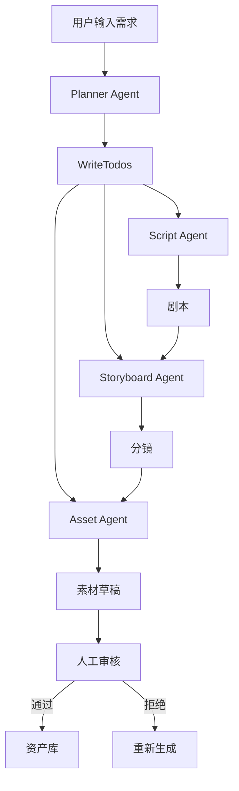

> **状态头（归档元信息，非 PRD 原文的一部分）**
>
> - 日期：2026-06-10
> - 状态：**权威产品需求（已确认产品转向）**
> - 类型：llm-agent-studio 案例项目的产品需求文档（PRD V1.0）
> - 关系：**取代** [[2026-06-09-llm-agent-studio-design]]（原「多 Agent 工作流可视化编排器」设计）。llm-agent-studio 由「通用工作流编排器」转向「基于 Multi-Agent 的内容生产平台」。旧设计降级为底层引擎/技术参考，不再是产品定义。
> - 相关：[[project_case-study-projects]]；共享鉴权基座 `llm-agent-authz`（与 llm-agent-kb 同库）；底层可复用 `llm-agent-flow`（v1/v2 引擎 + HITL）作为工作流/Agent 编排实现。
> - 后续：本 PRD 经评审后，进 brainstorming→spec→writing-plans 流程拆里程碑落地（MVP 范围见 §8）。
>
> ---

# AI Studio 产品需求文档（PRD）V1.0

## 1. 产品概述

### 产品名称
AI Studio

### 产品定位
一个基于 Multi-Agent 的内容生产平台，通过 AI 自动完成：

```text
创意
 ↓
剧本
 ↓
分镜
 ↓
图片素材
 ↓
视频素材
 ↓
人工审核
 ↓
资产入库
```

帮助内容创作者、短视频团队、动漫团队、营销团队快速生产高质量内容。

---

# 2. 产品目标

## 当前问题

传统内容生产：

```text
策划
↓
编剧
↓
分镜师
↓
设计师
↓
审核
↓
发布
```

耗时：3小时 ~ 3天，成本高、协作复杂。

## 产品目标

```text
一句需求
↓
AI自动规划
↓
AI执行
↓
人工验收
↓
完成内容生产
```

将生产效率提升 10~100 倍。

---

# 3. 用户角色

## 创作者
- 自媒体
- 小说作者
- 动漫创作者

## 内容运营
- 批量生成
- 批量审核
- 资产管理

## 管理员
- 配置模型
- 配置Agent
- 查看成本
- 查看日志

---

# 4. 核心流程



---

# 5. 功能模块

## 模块1：项目管理

### 创建项目
字段：
- 项目名称
- 项目描述
- 内容类型
- 目标平台

示例：
- 森林洞穴冒险故事
- 面向6~12岁儿童
- 日漫风格

### 数据结构

```go
type Project struct {
    ID          string
    Name        string
    Description string
    Status      string
    CreatedAt   time.Time
}
```

---

## 模块2：Planner Agent

### 功能
根据用户需求自动规划任务。

输入：
```text
生成一个儿童冒险故事
```

输出：

```json
[
  {"type":"script"},
  {"type":"storyboard"},
  {"type":"asset"}
]
```

状态：
- pending
- running
- completed
- failed

---

## 模块3：WriteTodos

```text
script.done
storyboard.done
asset.done
```

```go
type Todo struct {
    ID        string
    ProjectID string
    Type      string
    Status    string
    Agent     string
    Skill     string
}
```

---

## 模块4：Script Agent

生成：
- 故事
- 对白
- 人物
- 场景

```go
type Script struct {
    ID        string
    ProjectID string
    Content   string
    Version   int
}
```

---

## 模块5：Storyboard Agent

剧本转分镜。

```json
{
  "shot_id":"shot_1",
  "camera":"closeup",
  "scene":"森林洞穴",
  "action":"男孩观察水晶"
}
```

```go
type Shot struct {
    ID       string
    ScriptID string
    Prompt   string
    Duration int
    Order    int
}
```

---

## 模块6：Prompt Builder

支持风格：
- 日漫
- 吉卜力
- 皮克斯
- 迪士尼
- 写实
- 赛博朋克
- 国风

输出示例：

```text
Anime style,
young boy,
mysterious cave,
blue crystal,
cinematic lighting
```

---

## 模块7：Asset Agent

### 图片模型
- Flux
- SDXL
- GPT Image
- Midjourney

### 视频模型
- Runway
- Kling
- Veo
- PixVerse

### 音频模型
- TTS
- 背景音乐
- 音效

```go
type Asset struct {
    ID        string
    ProjectID string
    ShotID    string
    Type      string
    URL       string
    Prompt    string
    Status    string
}
```

---

## 模块8：人工审核（HITL）

状态：
- pending_acceptance
- accepted
- rejected

操作：
- 采纳
- 退回
- 编辑Prompt后重生成

---

## 模块9：资产库

统一管理：
- 图片
- 视频
- 音频
- 剧本
- 分镜

支持：
- 标签搜索
- 风格搜索
- 项目搜索
- 版本管理

---

## 模块10：Agent编排中心

Agent列表：
- Planner Agent
- Script Agent
- Storyboard Agent
- Asset Agent
- Review Agent

Review Agent能力：
- 敏感内容检测
- 版权检测
- 违规检测

---

## 模块11：工作流引擎

支持：
- 串行
- 并行
- 条件分支
- 循环重试

---

## 模块12：模型管理

LLM：
- OpenAI
- Claude
- Gemini
- DeepSeek
- Qwen

图像：
- Flux
- SDXL
- GPT Image

视频：
- Kling
- Veo
- Runway

---

## 模块13：成本中心

统计：
- Token消耗
- 图片生成次数
- 视频生成次数
- 执行耗时
- 费用统计

---

## 模块14：观测与日志

记录：
- Prompt
- Response
- Tool Call
- Agent链路

支持：
- OpenTelemetry
- Jaeger
- Grafana
- Langfuse

---

# 6. 非功能需求

## 性能
- 单任务 < 30秒

## 并发
- 100+ 项目同时运行

## 可用性
- 99.9%

---

# 7. 技术架构

```text
Frontend(Vue/React)
        ↓
API Gateway
        ↓
Workflow Engine
        ↓
Planner Agent
        ↓
Agent Runtime
 ├─ Script Agent
 ├─ Storyboard Agent
 ├─ Asset Agent
 └─ Review Agent
        ↓
LLM Provider
        ↓
Asset Storage
```

---

# 8. MVP范围

一期：
- 项目管理
- Planner Agent
- Script Agent
- Storyboard Agent
- 图片生成
- 人工审核
- 资产库
- Prompt Builder

二期：
- 视频生成
- LoRA
- 数字人
- 配音
- 自动剪辑

三期：
- 全自动短视频生产
- 多Agent协作创作
- 企业知识库接入
- 团队协作
